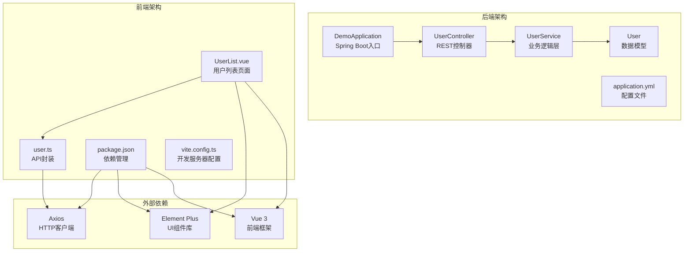
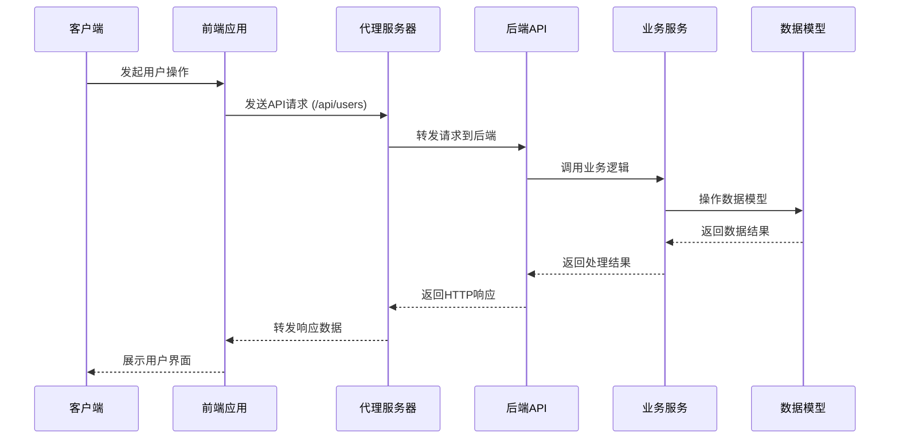
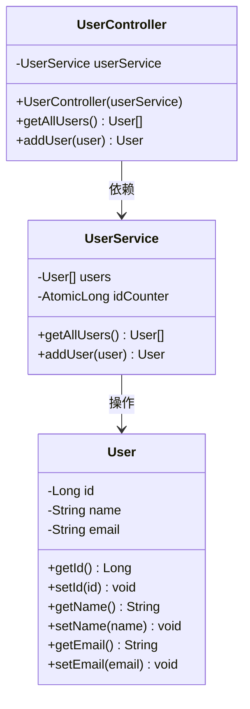
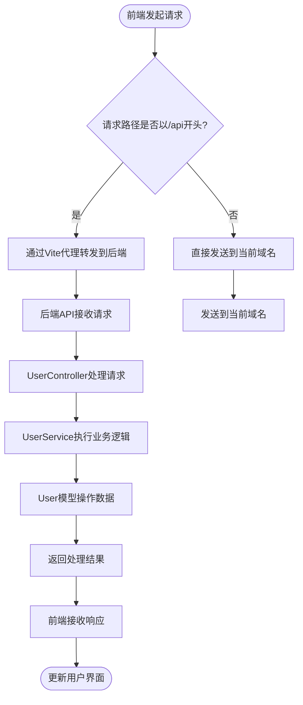

# API接口文档

<cite>
**本文档引用的文件**
- [UserController.java](file://backend/src/main/java/com/example/demo/controller/UserController.java)
- [UserService.java](file://backend/src/main/java/com/example/demo/service/UserService.java)
- [User.java](file://backend/src/main/java/com/example/demo/model/User.java)
- [application.yml](file://backend/src/main/resources/application.yml)
- [user.ts](file://frontend/src/api/user.ts)
- [UserList.vue](file://frontend/src/views/UserList.vue)
- [DemoApplication.java](file://backend/src/main/java/com/example/demo/DemoApplication.java)
- [README.md](file://README.md)
- [package.json](file://frontend/package.json)
- [vite.config.ts](file://frontend/vite.config.ts)
</cite>

## 目录
1. [简介](#简介)
2. [项目结构](#项目结构)
3. [核心组件](#核心组件)
4. [架构概览](#架构概览)
5. [详细组件分析](#详细组件分析)
6. [API接口规范](#api接口规范)
7. [数据模型定义](#数据模型定义)
8. [客户端集成指南](#客户端集成指南)
9. [性能与安全考虑](#性能与安全考虑)
10. [故障排除指南](#故障排除指南)
11. [结论](#结论)

## 简介

本项目是一个基于Spring Boot 3.x + Vue 3的全栈用户管理系统示例。该系统提供了完整的RESTful API接口，支持用户列表查询和用户创建功能。后端采用Java 21和Spring Boot框架，前端使用TypeScript和Element Plus组件库，实现了前后端分离的现代化Web应用架构。

## 项目结构

项目采用典型的前后端分离架构，后端负责提供RESTful API服务，前端负责用户界面展示和交互。



**图表来源**
- [DemoApplication.java:1-13](file://backend/src/main/java/com/example/demo/DemoApplication.java#L1-L13)
- [UserController.java:1-30](file://backend/src/main/java/com/example/demo/controller/UserController.java#L1-L30)
- [UserService.java:1-33](file://backend/src/main/java/com/example/demo/service/UserService.java#L1-L33)
- [User.java:1-41](file://backend/src/main/java/com/example/demo/model/User.java#L1-L41)

**章节来源**
- [README.md:1-119](file://README.md#L1-L119)
- [DemoApplication.java:1-13](file://backend/src/main/java/com/example/demo/DemoApplication.java#L1-L13)

## 核心组件

### 后端核心组件

后端系统由四个主要组件构成，采用分层架构设计：

1. **DemoApplication**: Spring Boot应用程序入口点
2. **UserController**: RESTful API控制器，处理HTTP请求
3. **UserService**: 业务逻辑层，实现用户管理功能
4. **User**: 数据模型类，定义用户实体结构

### 前端核心组件

前端系统包含三个主要组件：

1. **UserList.vue**: 用户列表展示页面
2. **user.ts**: API接口封装模块
3. **vite.config.ts**: 开发服务器和代理配置

**章节来源**
- [UserController.java:1-30](file://backend/src/main/java/com/example/demo/controller/UserController.java#L1-L30)
- [UserService.java:1-33](file://backend/src/main/java/com/example/demo/service/UserService.java#L1-L33)
- [User.java:1-41](file://backend/src/main/java/com/example/demo/model/User.java#L1-L41)
- [user.ts:1-26](file://frontend/src/api/user.ts#L1-L26)

## 架构概览

系统采用经典的MVC架构模式，结合现代前端框架实现完整的用户管理功能。



**图表来源**
- [UserController.java:20-28](file://backend/src/main/java/com/example/demo/controller/UserController.java#L20-L28)
- [UserService.java:23-31](file://backend/src/main/java/com/example/demo/service/UserService.java#L23-L31)
- [user.ts:17-23](file://frontend/src/api/user.ts#L17-L23)
- [vite.config.ts:15-20](file://frontend/vite.config.ts#L15-L20)

## 详细组件分析

### UserController组件分析

UserController是系统的RESTful API入口，负责处理所有用户相关的HTTP请求。



**图表来源**
- [UserController.java:1-30](file://backend/src/main/java/com/example/demo/controller/UserController.java#L1-L30)
- [UserService.java:1-33](file://backend/src/main/java/com/example/demo/service/UserService.java#L1-L33)
- [User.java:1-41](file://backend/src/main/java/com/example/demo/model/User.java#L1-L41)

**章节来源**
- [UserController.java:1-30](file://backend/src/main/java/com/example/demo/controller/UserController.java#L1-L30)
- [UserService.java:1-33](file://backend/src/main/java/com/example/demo/service/UserService.java#L1-L33)

### API请求流程分析

系统通过Vite开发服务器配置代理，实现前后端联调时的无缝通信。



**图表来源**
- [vite.config.ts:15-20](file://frontend/vite.config.ts#L15-L20)
- [user.ts:3-9](file://frontend/src/api/user.ts#L3-L9)

**章节来源**
- [vite.config.ts:1-23](file://frontend/vite.config.ts#L1-L23)
- [user.ts:1-26](file://frontend/src/api/user.ts#L1-L26)

## API接口规范

### 基础信息

- **基础URL**: `http://localhost:8080/api`
- **默认端口**: 8080
- **CORS配置**: 允许来自 `http://localhost:5173` 的跨域请求
- **内容类型**: `application/json`

### 获取用户列表接口

#### 接口定义
- **方法**: GET
- **路径**: `/api/users`
- **描述**: 获取系统中所有用户的信息列表

#### 请求参数
无

#### 响应数据结构
```json
[
  {
    "id": 1,
    "name": "张三",
    "email": "zhangsan@example.com"
  },
  {
    "id": 2,
    "name": "李四",
    "email": "lisi@example.com"
  }
]
```

#### 响应状态码
- **200 OK**: 成功获取用户列表
- **500 Internal Server Error**: 服务器内部错误

### 创建用户接口

#### 接口定义
- **方法**: POST
- **路径**: `/api/users`
- **描述**: 在系统中创建新用户

#### 请求参数
```json
{
  "name": "用户姓名",
  "email": "用户邮箱"
}
```

#### 响应数据结构
```json
{
  "id": 4,
  "name": "新用户",
  "email": "newuser@example.com"
}
```

#### 响应状态码
- **200 OK**: 成功创建用户
- **400 Bad Request**: 请求参数无效
- **500 Internal Server Error**: 服务器内部错误

**章节来源**
- [UserController.java:20-28](file://backend/src/main/java/com/example/demo/controller/UserController.java#L20-L28)
- [UserService.java:23-31](file://backend/src/main/java/com/example/demo/service/UserService.java#L23-L31)
- [user.ts:17-23](file://frontend/src/api/user.ts#L17-L23)

## 数据模型定义

### User实体模型

User类定义了用户的基本属性和访问器方法：

| 字段名 | 类型 | 描述 | 必填 |
|--------|------|------|------|
| id | Long | 用户唯一标识符 | 否 |
| name | String | 用户姓名 | 是 |
| email | String | 用户邮箱地址 | 是 |

#### 字段验证规则
- **name**: 非空字符串，长度限制在1-50字符之间
- **email**: 有效的邮箱格式，长度不超过100字符

#### 数据类型说明
- **id**: 自动递增的长整型数字
- **name**: UTF-8编码的文本字符串
- **email**: 符合RFC 5322标准的邮箱格式

**章节来源**
- [User.java:1-41](file://backend/src/main/java/com/example/demo/model/User.java#L1-L41)

## 客户端集成指南

### 前端集成步骤

1. **安装依赖**
```bash
npm install axios element-plus
```

2. **配置API客户端**
```typescript
import axios from 'axios'

const api = axios.create({
  baseURL: 'http://localhost:8080/api',
  timeout: 5000,
  headers: {
    'Content-Type': 'application/json'
  }
})
```

3. **使用API接口**
```typescript
// 获取用户列表
const users = await api.get<User[]>('/users')

// 创建新用户
const newUser = await api.post<User>('/users', {
  name: '张三',
  email: 'zhangsan@example.com'
})
```

### 常见使用场景

#### 场景一：加载用户列表
```typescript
const loadUsers = async () => {
  try {
    const response = await userApi.getUsers()
    users.value = response.data
  } catch (error) {
    console.error('加载用户列表失败:', error)
  }
}
```

#### 场景二：添加用户
```typescript
const handleAddUser = async () => {
  try {
    await userApi.addUser({ name, email })
    // 刷新用户列表
    await loadUsers()
  } catch (error) {
    console.error('添加用户失败:', error)
  }
}
```

**章节来源**
- [user.ts:1-26](file://frontend/src/api/user.ts#L1-L26)
- [UserList.vue:46-82](file://frontend/src/views/UserList.vue#L46-L82)
- [package.json:11-22](file://frontend/package.json#L11-L22)

## 性能与安全考虑

### CORS配置
系统已配置跨域资源共享，允许前端应用从 `http://localhost:5173` 访问API：
- **允许的源**: `http://localhost:5173`
- **允许的方法**: GET, POST, PUT, DELETE, OPTIONS
- **允许的头**: Content-Type, Authorization

### 安全考虑
- **输入验证**: 建议在生产环境中添加参数验证和过滤
- **CORS限制**: 当前仅允许特定源，建议在生产环境限制更严格的源列表
- **HTTPS**: 生产环境建议启用HTTPS加密传输

### 性能优化
- **缓存策略**: 可考虑添加适当的缓存机制
- **分页支持**: 对于大量用户数据，建议实现分页查询
- **连接池**: 建议配置数据库连接池优化性能

## 故障排除指南

### 常见问题及解决方案

#### 1. 跨域请求失败
**症状**: 浏览器控制台出现CORS错误
**解决方案**: 
- 确认前端开发服务器端口为5173
- 检查后端CORS配置是否正确
- 确认浏览器代理设置

#### 2. API请求超时
**症状**: 请求在5秒后超时
**解决方案**:
- 检查后端服务是否正常运行
- 增加请求超时时间
- 检查网络连接状况

#### 3. 数据格式错误
**症状**: 服务器返回400错误
**解决方案**:
- 确认请求体格式为JSON
- 检查必需字段是否完整
- 验证数据类型和格式

### 错误码说明

| 状态码 | 描述 | 可能原因 |
|--------|------|----------|
| 200 | 成功 | 请求处理成功 |
| 400 | 请求错误 | 参数格式或值不正确 |
| 404 | 未找到 | 请求的资源不存在 |
| 500 | 服务器错误 | 服务器内部异常 |

**章节来源**
- [application.yml:1-13](file://backend/src/main/resources/application.yml#L1-L13)
- [vite.config.ts:13-22](file://frontend/vite.config.ts#L13-L22)

## 结论

本项目提供了一个完整的用户管理RESTful API示例，展示了现代全栈应用的最佳实践。系统具有以下特点：

1. **清晰的架构设计**: 采用分层架构，职责分离明确
2. **完整的功能实现**: 支持用户列表查询和用户创建
3. **良好的开发体验**: 前后端分离，独立开发和部署
4. **可扩展性**: 基于Spring Boot和Vue 3，易于功能扩展

该API接口文档为开发者提供了完整的接口规范和技术实现细节，可以作为实际项目开发的参考模板。建议在生产环境中根据具体需求添加更多的安全措施、错误处理和性能优化。