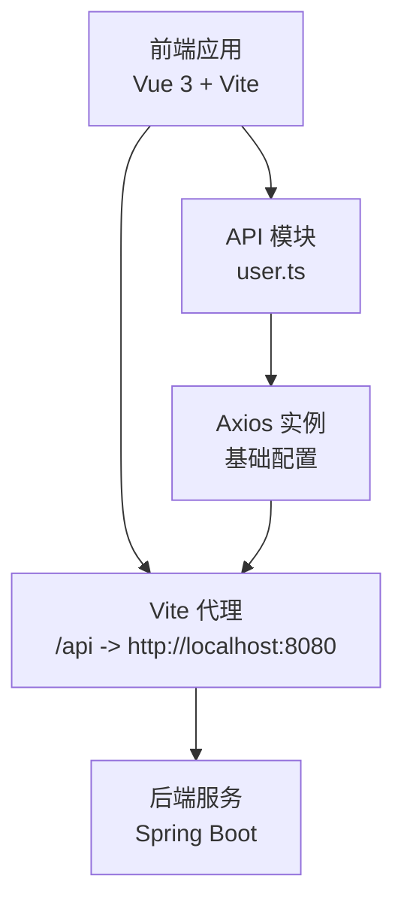
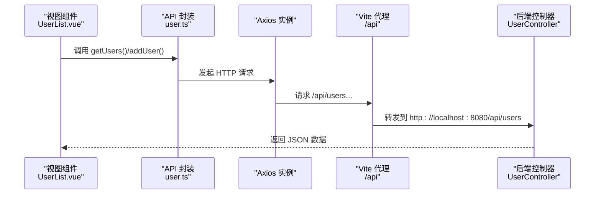
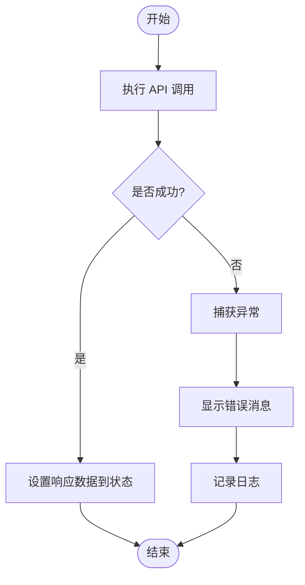
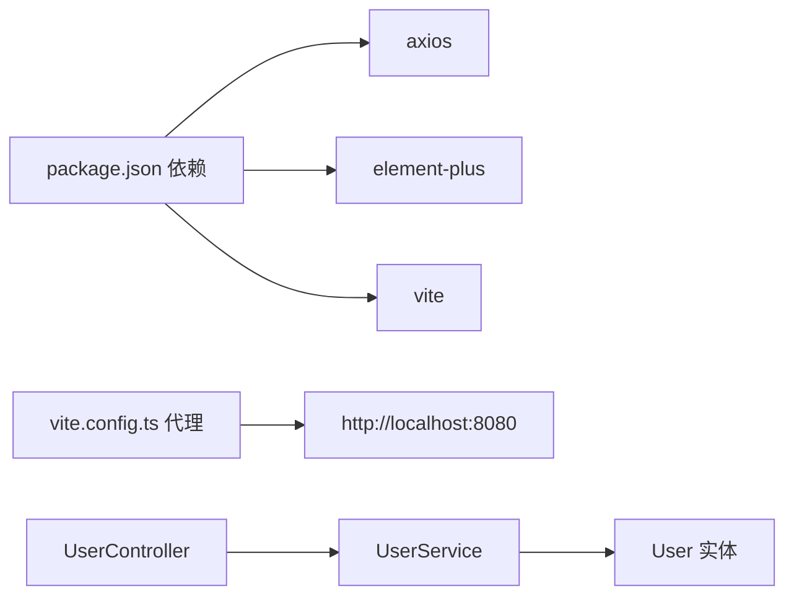

# API 集成层

<cite>
**本文引用的文件**
- [frontend/src/api/user.ts](file://frontend/src/api/user.ts)
- [frontend/src/views/UserList.vue](file://frontend/src/views/UserList.vue)
- [frontend/vite.config.ts](file://frontend/vite.config.ts)
- [frontend/package.json](file://frontend/package.json)
- [frontend/tsconfig.json](file://frontend/tsconfig.json)
- [backend/src/main/java/com/example/demo/controller/UserController.java](file://backend/src/main/java/com/example/demo/controller/UserController.java)
- [backend/src/main/java/com/example/demo/service/UserService.java](file://backend/src/main/java/com/example/demo/service/UserService.java)
- [backend/src/main/java/com/example/demo/model/User.java](file://backend/src/main/java/com/example/demo/model/User.java)
- [backend/src/main/resources/application.yml](file://backend/src/main/resources/application.yml)
- [backend/pom.xml](file://backend/pom.xml)
</cite>

## 目录
1. [引言](#引言)
2. [项目结构](#项目结构)
3. [核心组件](#核心组件)
4. [架构总览](#架构总览)
5. [详细组件分析](#详细组件分析)
6. [依赖分析](#依赖分析)
7. [性能考虑](#性能考虑)
8. [故障排查指南](#故障排查指南)
9. [结论](#结论)
10. [附录](#附录)

## 引言
本文件聚焦于前端API集成层的设计与实现，围绕 user.ts 中的 Axios 封装与调用模式展开，系统性说明请求/响应的统一处理机制（当前未启用拦截器）、错误处理策略、数据模型与类型约束、以及与后端接口的对接方式。同时给出最佳实践、错误恢复建议、API 版本管理与兼容性处理思路，并提供新增接口的扩展指南。

## 项目结构
前端采用 Vite + Vue 3 + TypeScript 构建，API 层位于 frontend/src/api 下，通过 Vite 的代理将 /api 前缀转发到后端服务。后端为 Spring Boot 应用，提供 /api/users 路由集合，跨域允许前端开发服务器地址。

图表来源
- [frontend/vite.config.ts:13-21](file://frontend/vite.config.ts#L13-L21)
- [frontend/src/api/user.ts:3-9](file://frontend/src/api/user.ts#L3-L9)
- [backend/src/main/java/com/example/demo/controller/UserController.java:10](file://backend/src/main/java/com/example/demo/controller/UserController.java#L10)

章节来源
- [frontend/vite.config.ts:1-23](file://frontend/vite.config.ts#L1-L23)
- [frontend/package.json:1-24](file://frontend/package.json#L1-L24)
- [frontend/tsconfig.json:1-32](file://frontend/tsconfig.json#L1-L32)

## 核心组件
- Axios 实例与基础配置：定义基础 URL、超时、默认请求头等，作为所有 API 请求的统一入口。
- 类型定义：User 接口用于约束用户数据结构，确保前后端一致的字段与可选性。
- API 方法封装：getUsers、addUser 等方法直接基于 axios 实例发起请求，返回 Promise，便于在组件中使用 async/await。

章节来源
- [frontend/src/api/user.ts:11-25](file://frontend/src/api/user.ts#L11-L25)

## 架构总览
下图展示了从前端组件到后端控制器的调用链路，以及代理层如何将 /api 请求转发至后端。

图表来源
- [frontend/src/views/UserList.vue:47-82](file://frontend/src/views/UserList.vue#L47-L82)
- [frontend/src/api/user.ts:17-23](file://frontend/src/api/user.ts#L17-L23)
- [frontend/vite.config.ts:15-20](file://frontend/vite.config.ts#L15-L20)
- [backend/src/main/java/com/example/demo/controller/UserController.java:20-28](file://backend/src/main/java/com/example/demo/controller/UserController.java#L20-L28)

## 详细组件分析

### Axios 实例与配置
- 基础路径：通过 baseURL 统一前缀，避免在每个请求中重复拼接。
- 超时控制：timeout 限制请求最大耗时，有助于快速失败与用户体验优化。
- 默认请求头：Content-Type 设为 application/json，确保后端能正确解析请求体。
- 导出策略：同时导出命名模块 userApi 与默认导出的 axios 实例，便于按需使用或扩展。

章节来源
- [frontend/src/api/user.ts:3-9](file://frontend/src/api/user.ts#L3-L9)

### 类型定义与数据模型
- User 接口：定义 id（可选）、name、email 字段，用于组件与 API 的数据契约。
- 后端模型：User.java 提供对应的 Java 实体，字段名与类型保持一致，保证序列化/反序列化稳定。

章节来源
- [frontend/src/api/user.ts:11-15](file://frontend/src/api/user.ts#L11-L15)
- [backend/src/main/java/com/example/demo/model/User.java:3-40](file://backend/src/main/java/com/example/demo/model/User.java#L3-L40)

### API 方法封装
- getUsers：GET /users，返回用户数组。
- addUser：POST /users，传入 User 对象，返回新增用户对象。
- 使用方式：在组件中直接 await 调用，解构 response.data 获得数据。

章节来源
- [frontend/src/api/user.ts:17-23](file://frontend/src/api/user.ts#L17-L23)
- [frontend/src/views/UserList.vue:47-82](file://frontend/src/views/UserList.vue#L47-L82)

### 错误处理与统一处理机制
- 当前实现：在组件中对 API 调用进行 try/catch 包裹，捕获异常并提示用户消息，同时打印日志。
- 统一处理建议（当前未启用）：可在 Axios 实例上注册请求/响应拦截器，集中处理鉴权头注入、统一错误提示、重试逻辑、Loading 状态管理等。

图表来源
- [frontend/src/views/UserList.vue:47-82](file://frontend/src/views/UserList.vue#L47-L82)

章节来源
- [frontend/src/views/UserList.vue:47-82](file://frontend/src/views/UserList.vue#L47-L82)

### 参数传递与调用模式
- GET 请求：无需请求体，直接调用 getUsers() 即可。
- POST 请求：将 User 对象作为请求体传入 addUser()，由 axios 自动序列化为 JSON。
- 组件交互：在表单提交时校验必填项，成功后刷新列表。

章节来源
- [frontend/src/api/user.ts:19-22](file://frontend/src/api/user.ts#L19-L22)
- [frontend/src/views/UserList.vue:67-82](file://frontend/src/views/UserList.vue#L67-L82)

### 数据转换与类型验证
- 前端类型：通过 TypeScript 接口约束请求/响应数据结构，减少运行时错误。
- 后端类型：Java 实体类与数据库映射一致，配合 Spring MVC 自动序列化/反序列化。
- 建议：在复杂场景引入轻量 Schema 校验库（如 Zod/Yup），在请求发送前与响应到达后进行二次校验。

章节来源
- [frontend/src/api/user.ts:11-15](file://frontend/src/api/user.ts#L11-L15)
- [backend/src/main/java/com/example/demo/model/User.java:3-40](file://backend/src/main/java/com/example/demo/model/User.java#L3-L40)

### API 版本管理与兼容性
- 版本策略：在 baseURL 或路由前缀中加入版本号（如 /api/v1/users），便于平滑演进。
- 兼容性：旧接口保留过渡期，新接口提供新路径；客户端按版本选择对应封装模块。
- 迁移：通过网关或中间件做协议转换与向后兼容适配。

章节来源
- [frontend/src/api/user.ts:4](file://frontend/src/api/user.ts#L4)

### 新增 API 接口扩展指南
- 步骤
  1) 在 user.ts 中新增方法：定义函数签名与泛型返回类型，内部调用 api.get/post/put/delete。
  2) 在组件中引入该方法并调用，遵循现有 try/catch 与消息提示模式。
  3) 如需全局拦截器，可在 axios 实例上注册请求/响应拦截器，统一处理认证、错误与 Loading。
  4) 如需版本隔离，新建版本目录（如 api/v2/user.ts），保持对外接口稳定。
- 注意
  - 保持请求/响应类型与后端一致。
  - 对外暴露的 API 方法应尽量幂等与可测试。
  - 对复杂业务场景，拆分多个小方法，避免单点过长链路。

章节来源
- [frontend/src/api/user.ts:17-23](file://frontend/src/api/user.ts#L17-L23)
- [frontend/src/views/UserList.vue:39-82](file://frontend/src/views/UserList.vue#L39-L82)

## 依赖分析
- 前端依赖
  - axios：HTTP 客户端，提供请求/响应拦截能力。
  - element-plus：UI 组件库，提供消息提示与表单组件。
  - vite：开发服务器与代理，将 /api 转发到后端。
- 后端依赖
  - spring-boot-starter-web：提供 Web MVC 与嵌入式服务器。
  - 跨域配置：允许前端开发服务器地址访问。

图表来源
- [frontend/package.json:11-14](file://frontend/package.json#L11-L14)
- [frontend/vite.config.ts:15-20](file://frontend/vite.config.ts#L15-L20)
- [backend/src/main/java/com/example/demo/controller/UserController.java:14-18](file://backend/src/main/java/com/example/demo/controller/UserController.java#L14-L18)
- [backend/src/main/java/com/example/demo/service/UserService.java:11-11](file://backend/src/main/java/com/example/demo/service/UserService.java#L11-L11)
- [backend/src/main/java/com/example/demo/model/User.java:3-40](file://backend/src/main/java/com/example/demo/model/User.java#L3-L40)

章节来源
- [frontend/package.json:1-24](file://frontend/package.json#L1-L24)
- [backend/pom.xml:24-36](file://backend/pom.xml#L24-L36)
- [backend/src/main/resources/application.yml:1-13](file://backend/src/main/resources/application.yml#L1-L13)

## 性能考虑
- 超时与并发：合理设置 timeout，避免阻塞 UI；对高频请求合并或节流。
- 缓存策略：对只读列表数据增加内存缓存与失效时间，减少重复请求。
- 代理与网络：利用 Vite 代理避免跨域问题，生产环境建议由 Nginx 或网关统一处理。
- 错误快速失败：在拦截器中识别常见错误（如 401/403/5xx）并快速提示，避免长时间等待。

## 故障排查指南
- 常见问题
  - 跨域错误：确认后端已允许前端开发服务器地址，或调整代理配置。
  - 404/路径错误：检查 baseURL 与路由前缀是否匹配，组件调用路径是否正确。
  - 类型不匹配：核对 User 接口与后端实体字段一致性，必要时在拦截器中做字段映射。
- 排查步骤
  - 打开浏览器开发者工具 Network 面板，观察请求与响应。
  - 在组件中打印 error 对象，定位具体异常来源。
  - 在 axios 实例上注册拦截器，输出请求/响应详情，辅助定位。

章节来源
- [frontend/src/views/UserList.vue:52-81](file://frontend/src/views/UserList.vue#L52-L81)
- [frontend/vite.config.ts:15-20](file://frontend/vite.config.ts#L15-L20)
- [backend/src/main/java/com/example/demo/controller/UserController.java:11](file://backend/src/main/java/com/example/demo/controller/UserController.java#L11)

## 结论
当前 API 集成层以简洁的 Axios 实例为核心，结合 TypeScript 类型约束与组件内的错误处理，实现了清晰的调用模式。建议后续引入拦截器实现统一处理、增强错误恢复与 Loading 管理，并通过版本化路由保障长期演进的稳定性与兼容性。

## 附录
- 关键实现位置参考
  - Axios 实例与方法封装：[frontend/src/api/user.ts:3-25](file://frontend/src/api/user.ts#L3-L25)
  - 组件调用示例：[frontend/src/views/UserList.vue:47-82](file://frontend/src/views/UserList.vue#L47-L82)
  - 代理配置：[frontend/vite.config.ts:13-21](file://frontend/vite.config.ts#L13-L21)
  - 后端控制器：[backend/src/main/java/com/example/demo/controller/UserController.java:10-28](file://backend/src/main/java/com/example/demo/controller/UserController.java#L10-L28)
  - 后端服务与模型：[backend/src/main/java/com/example/demo/service/UserService.java:11-32](file://backend/src/main/java/com/example/demo/service/UserService.java#L11-L32), [backend/src/main/java/com/example/demo/model/User.java:3-40](file://backend/src/main/java/com/example/demo/model/User.java#L3-L40)