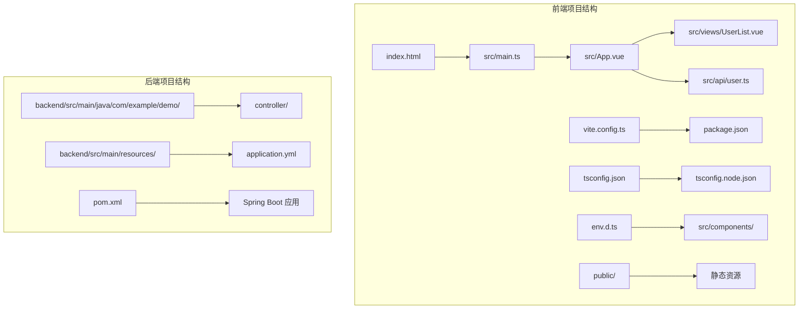
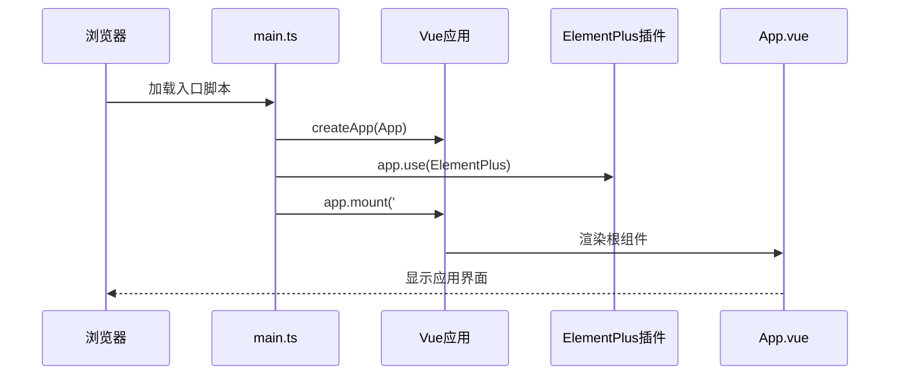
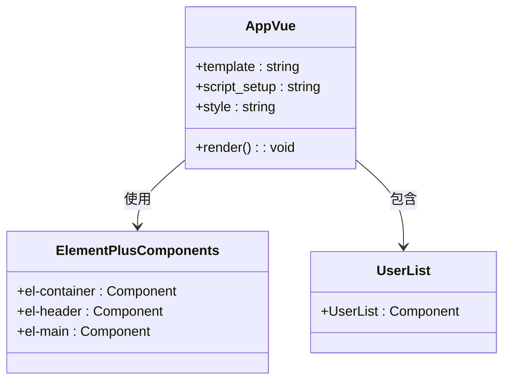
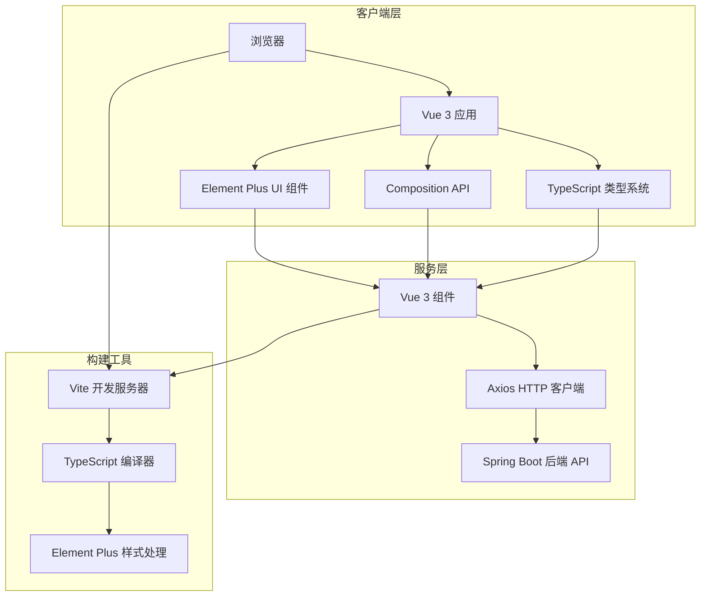
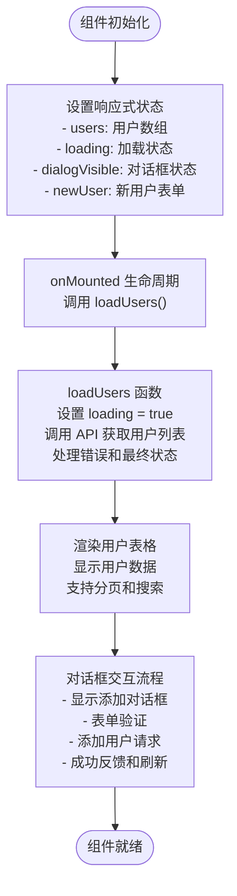
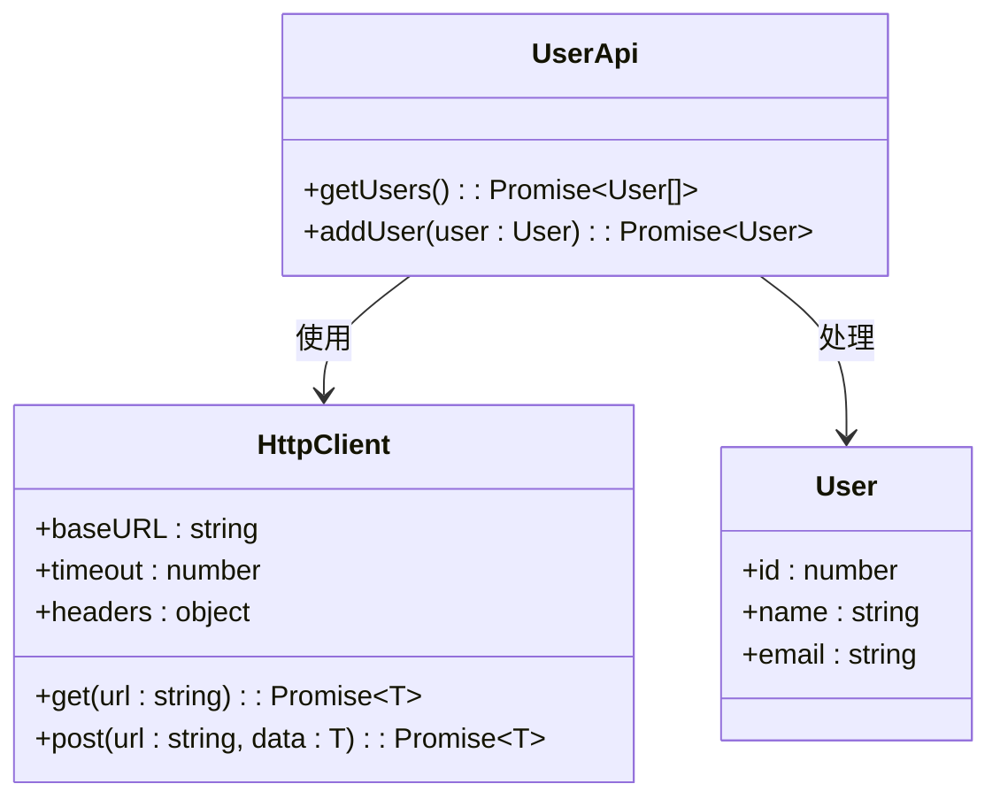

# Vue 3 应用配置

<cite>
**本文档引用的文件**
- [frontend/src/main.ts](file://frontend/src/main.ts)
- [frontend/src/App.vue](file://frontend/src/App.vue)
- [frontend/src/views/UserList.vue](file://frontend/src/views/UserList.vue)
- [frontend/src/api/user.ts](file://frontend/src/api/user.ts)
- [frontend/tsconfig.json](file://frontend/tsconfig.json)
- [frontend/tsconfig.node.json](file://frontend/tsconfig.node.json)
- [frontend/vite.config.ts](file://frontend/vite.config.ts)
- [frontend/package.json](file://frontend/package.json)
- [frontend/src/env.d.ts](file://frontend/src/env.d.ts)
- [frontend/index.html](file://frontend/index.html)
- [README.md](file://README.md)
</cite>

## 目录
1. [简介](#简介)
2. [项目结构](#项目结构)
3. [核心组件](#核心组件)
4. [架构概览](#架构概览)
5. [详细组件分析](#详细组件分析)
6. [依赖分析](#依赖分析)
7. [性能考虑](#性能考虑)
8. [故障排除指南](#故障排除指南)
9. [结论](#结论)
10. [附录](#附录)

## 简介

本项目是一个基于 Vue 3 + TypeScript + Element Plus 的全栈应用示例，采用前后端分离架构。前端使用 Vite 作为构建工具，后端使用 Spring Boot 3.x 提供 RESTful API。该应用展示了现代前端开发的最佳实践，包括 Composition API 的使用、TypeScript 类型安全、组件化开发以及现代化的构建配置。

## 项目结构

项目采用标准的前后端分离架构，前端部分主要包含以下关键目录和文件：



**图表来源**
- [frontend/index.html:1-14](file://frontend/index.html#L1-L14)
- [frontend/src/main.ts:1-10](file://frontend/src/main.ts#L1-L10)
- [frontend/vite.config.ts:1-23](file://frontend/vite.config.ts#L1-L23)

**章节来源**
- [README.md:1-119](file://README.md#L1-L119)
- [frontend/package.json:1-24](file://frontend/package.json#L1-L24)

## 核心组件

### 应用入口配置

应用入口文件负责初始化 Vue 应用实例并配置必要的插件。入口文件采用了简洁而高效的初始化模式：



**图表来源**
- [frontend/src/main.ts:1-10](file://frontend/src/main.ts#L1-L10)

应用入口的关键配置包括：
- **应用创建**：使用 `createApp` 函数创建 Vue 应用实例
- **插件集成**：通过 `app.use(ElementPlus)` 注册 Element Plus 插件
- **样式导入**：直接导入 Element Plus 的 CSS 文件
- **应用挂载**：将应用挂载到 DOM 中的 `#app` 元素

**章节来源**
- [frontend/src/main.ts:1-10](file://frontend/src/main.ts#L1-L10)

### 根组件设计

根组件 `App.vue` 采用单文件组件格式，集成了 Element Plus 的布局组件，提供了完整的页面结构：



**图表来源**
- [frontend/src/App.vue:1-45](file://frontend/src/App.vue#L1-L45)

根组件的主要特点：
- **布局系统**：使用 Element Plus 的容器布局组件
- **响应式设计**：包含头部导航和主要内容区域
- **TypeScript 支持**：使用 `<script setup lang="ts">` 语法
- **模块化结构**：通过导入子组件实现功能模块化

**章节来源**
- [frontend/src/App.vue:1-45](file://frontend/src/App.vue#L1-L45)

## 架构概览

应用采用典型的单页应用架构，结合 Element Plus UI 组件库和 TypeScript 类型系统：



**图表来源**
- [frontend/vite.config.ts:1-23](file://frontend/vite.config.ts#L1-L23)
- [frontend/src/api/user.ts:1-26](file://frontend/src/api/user.ts#L1-L26)

## 详细组件分析

### 用户列表组件

用户列表组件展示了 Vue 3 Composition API 的最佳实践：



**图表来源**
- [frontend/src/views/UserList.vue:36-87](file://frontend/src/views/UserList.vue#L36-L87)

组件的核心功能实现：

**状态管理**：
- 使用 `ref` 创建响应式状态
- 通过 `onMounted` 生命周期钩子自动加载数据
- 实现加载状态管理和错误处理

**API 集成**：
- 封装 Axios 客户端配置
- 定义用户接口类型
- 提供用户 CRUD 操作方法

**用户交互**：
- Element Plus 表格组件展示数据
- 对话框表单收集用户输入
- 消息提示系统提供反馈

**章节来源**
- [frontend/src/views/UserList.vue:1-101](file://frontend/src/views/UserList.vue#L1-L101)
- [frontend/src/api/user.ts:1-26](file://frontend/src/api/user.ts#L1-L26)

### API 服务层

API 服务层提供了统一的 HTTP 客户端配置和类型定义：



**图表来源**
- [frontend/src/api/user.ts:11-26](file://frontend/src/api/user.ts#L11-L26)

API 服务的设计原则：
- **类型安全**：使用 TypeScript 接口定义数据结构
- **配置集中**：在单一位置管理 API 基础配置
- **错误处理**：提供统一的错误处理机制
- **可扩展性**：支持添加新的 API 方法

**章节来源**
- [frontend/src/api/user.ts:1-26](file://frontend/src/api/user.ts#L1-L26)

## 依赖分析

### 依赖关系图

```mermaid
graph TB
subgraph "运行时依赖"
A[vue@^3.4.0] --> B[Vue 3 核心框架]
C[element-plus@^2.4.0] --> D[Element Plus UI 组件库]
E[axios@^1.6.0] --> F[HTTP 客户端]
end
subgraph "开发时依赖"
G[@vitejs/plugin-vue@^5.0.0] --> H[Vite Vue 插件]
I[typescript@^5.3.0] --> J[TypeScript 编译器]
K[vite@^5.0.0] --> L[Vite 构建工具]
M[vue-tsc@^1.8.0] --> N[TypeScript 类型检查]
O[@types/node@^20.10.0] --> P[Node.js 类型定义]
end
subgraph "项目配置"
Q[tsconfig.json] --> I
R[vite.config.ts] --> G
S[package.json] --> A
S --> C
S --> E
end
```

**图表来源**
- [frontend/package.json:11-22](file://frontend/package.json#L11-L22)
- [frontend/tsconfig.json:1-32](file://frontend/tsconfig.json#L1-L32)
- [frontend/vite.config.ts:1-23](file://frontend/vite.config.ts#L1-L23)

### 版本兼容性

项目采用的版本组合确保了最佳的兼容性和性能：

| 组件 | 版本 | 用途 | 兼容性 |
|------|------|------|--------|
| Vue 3 | ^3.4.0 | 核心框架 | ES2020+ |
| Element Plus | ^2.4.0 | UI 组件库 | Vue 3 |
| TypeScript | ^5.3.0 | 类型系统 | ES2020 |
| Vite | ^5.0.0 | 构建工具 | 现代浏览器 |
| Axios | ^1.6.0 | HTTP 客户端 | 所有平台 |

**章节来源**
- [frontend/package.json:1-24](file://frontend/package.json#L1-L24)

## 性能考虑

### 构建优化

项目配置了多种性能优化策略：

**Tree Shaking**：
- 使用 ES 模块格式减少打包体积
- 仅导入实际使用的组件和功能
- 利用 Vite 的原生 ES 模块支持

**代码分割**：
- 按需加载路由组件
- 动态导入重型依赖
- 实现懒加载策略

**缓存策略**：
- 静态资源指纹命名
- 浏览器缓存优化
- CDN 配置支持

### 运行时优化

**响应式系统优化**：
- 合理使用 `ref` 和 `reactive`
- 避免不必要的响应式转换
- 使用 `computed` 缓存计算结果

**组件优化**：
- 使用 `defineComponent` 提升性能
- 合理的组件拆分和复用
- 避免深层嵌套的组件树

## 故障排除指南

### 常见问题诊断

**开发服务器启动失败**：
1. 检查 Node.js 版本是否满足要求（推荐 v18+）
2. 确认端口 5173 未被其他进程占用
3. 运行 `npm install` 安装依赖

**API 请求失败**：
1. 确认后端服务已在 http://localhost:8080 启动
2. 检查 Vite 代理配置是否正确
3. 验证 CORS 设置

**TypeScript 类型错误**：
1. 检查 tsconfig.json 配置
2. 确认类型定义文件存在
3. 运行 `npm run build` 查看编译错误

**Element Plus 样式问题**：
1. 确认 CSS 导入语句正确
2. 检查样式作用域冲突
3. 验证主题配置

**章节来源**
- [README.md:107-119](file://README.md#L107-L119)

## 结论

本项目展示了现代 Vue 3 应用开发的最佳实践，包括：

**技术选型优势**：
- Vue 3 + TypeScript 提供了强大的类型安全和开发体验
- Element Plus 简化了 UI 组件开发
- Vite 提供了快速的开发和构建体验
- 组合式 API 展示了现代化的组件开发模式

**架构设计亮点**：
- 清晰的分层架构便于维护和扩展
- 类型安全的 API 设计提高了代码质量
- 组件化的开发模式提升了代码复用性
- 现代化的构建配置优化了开发效率

**开发体验**：
- 即时热更新提升开发效率
- 强类型的开发环境减少运行时错误
- 完善的错误处理和调试工具
- 良好的项目结构便于团队协作

## 附录

### 开发环境配置

**开发服务器配置**：
- 端口：5173
- 代理：/api -> http://localhost:8080
- 热重载：启用
- 类型检查：实时进行

**构建配置**：
- 目标：ES2020
- 模块：ESNext
- 输出：生产优化版本
- 资源：自动指纹命名

### 生产环境部署

**部署准备**：
1. 运行 `npm run build` 生成生产包
2. 配置静态服务器
3. 设置 CDN 和缓存策略
4. 配置 HTTPS 和安全头

**性能优化**：
- 启用代码压缩和混淆
- 图片和静态资源优化
- 预加载关键资源
- 实现渐进式 Web 应用