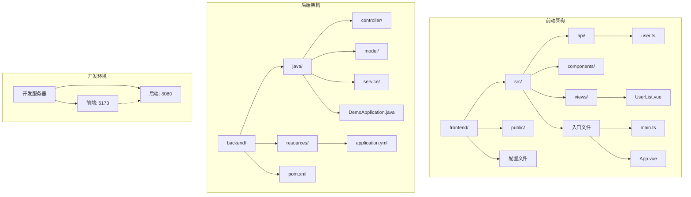
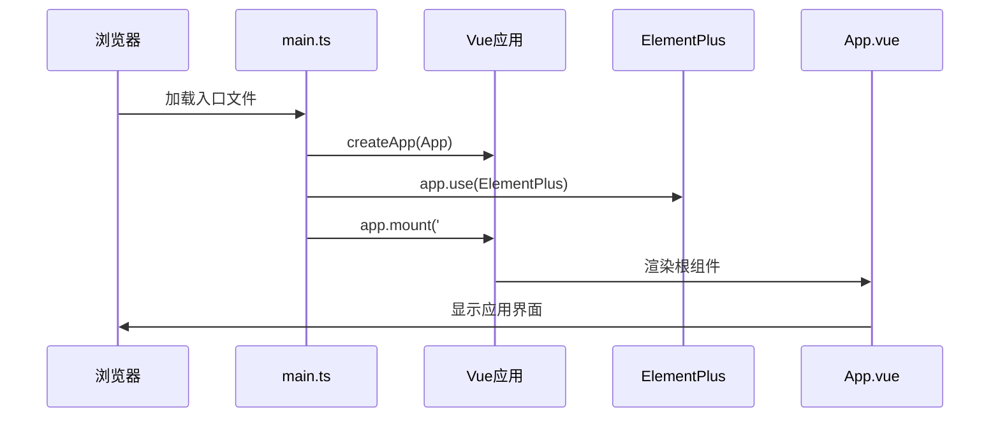
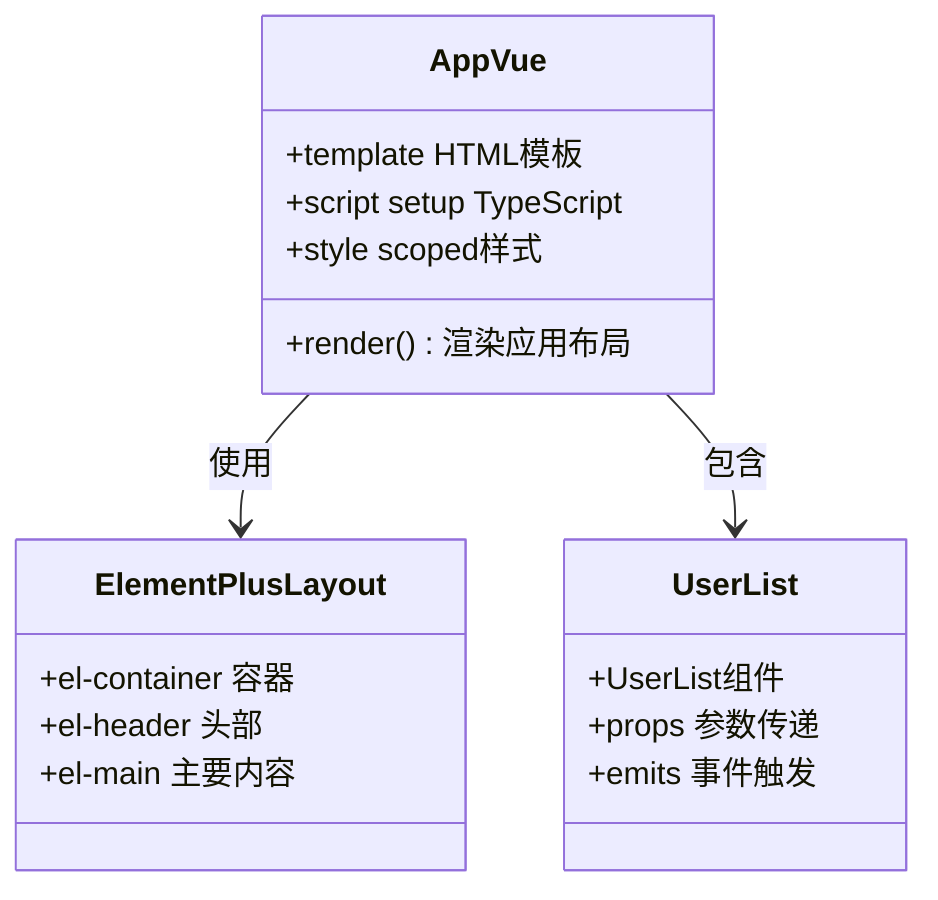
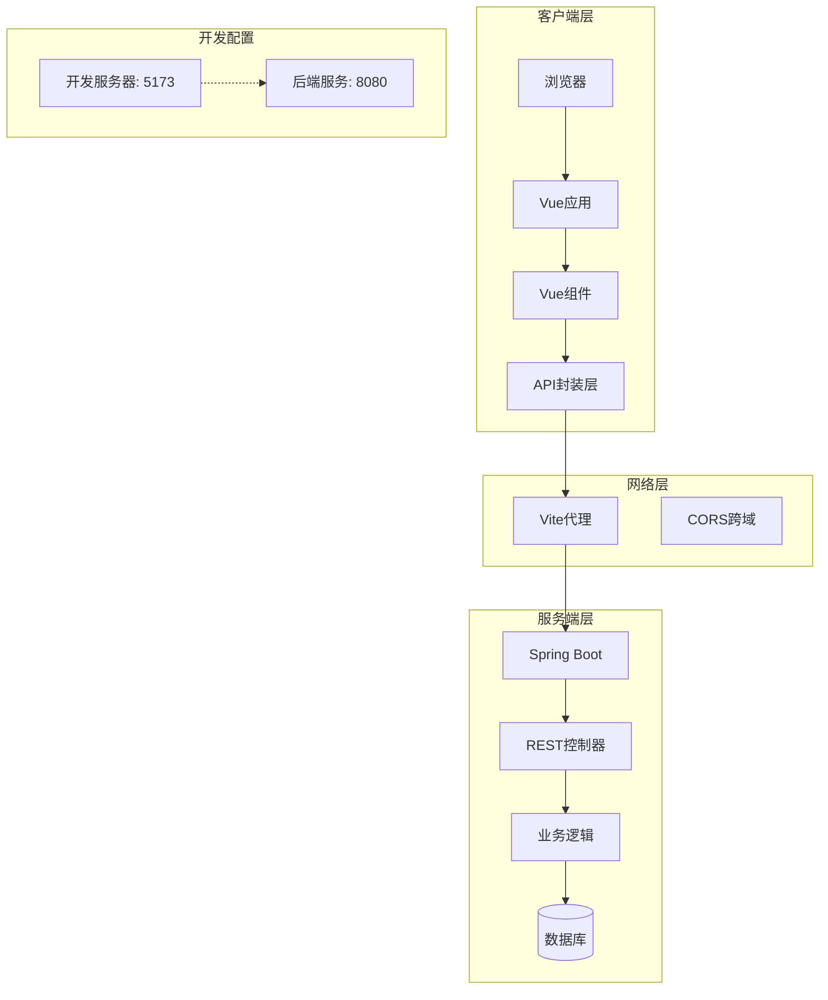
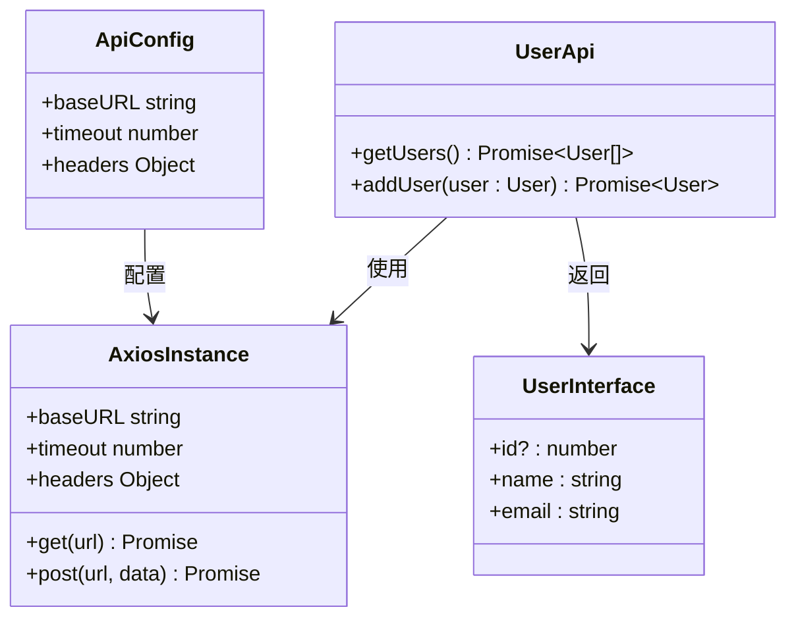
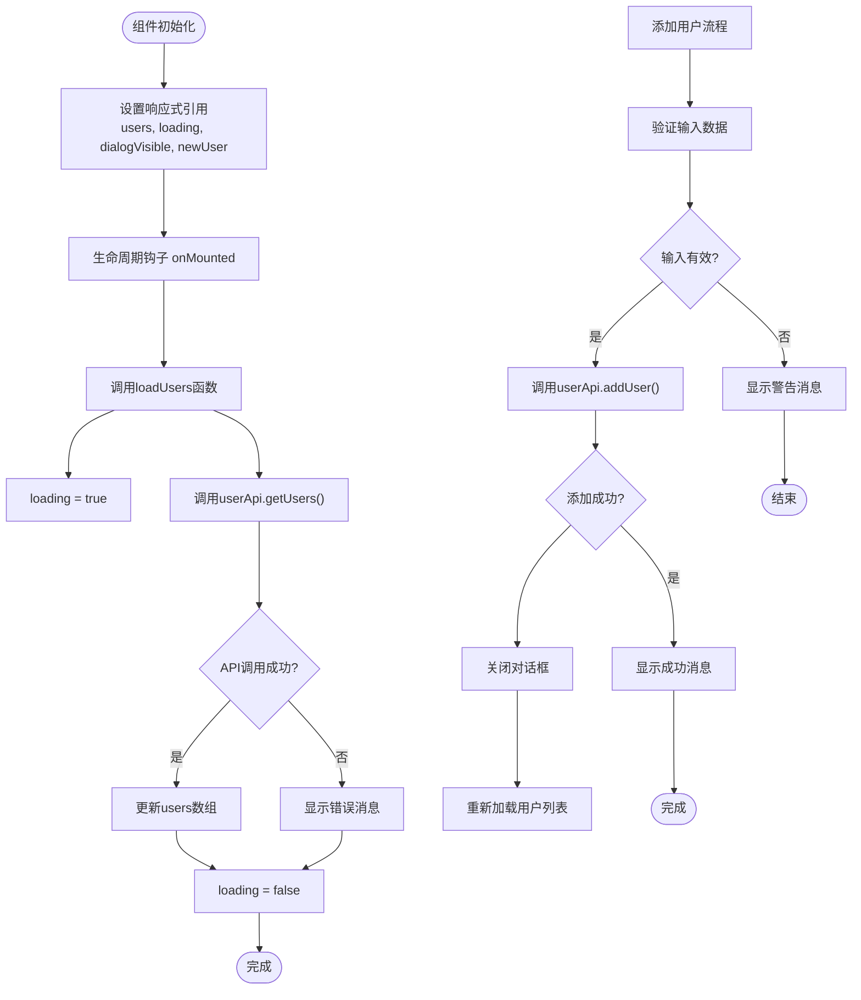
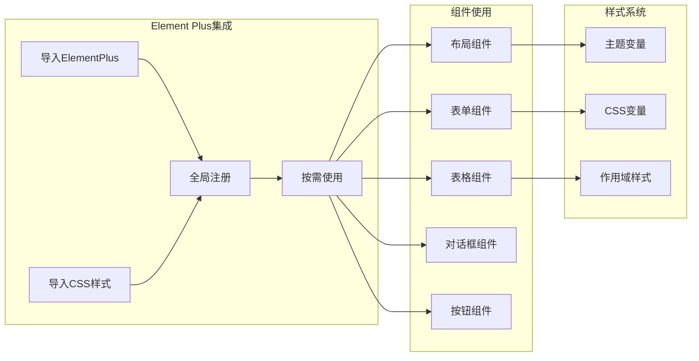
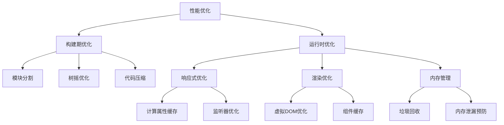

# 前端架构详解

<cite>
**本文档引用的文件**
- [frontend/src/main.ts](file://frontend/src/main.ts)
- [frontend/vite.config.ts](file://frontend/vite.config.ts)
- [frontend/package.json](file://frontend/package.json)
- [frontend/tsconfig.json](file://frontend/tsconfig.json)
- [frontend/src/App.vue](file://frontend/src/App.vue)
- [frontend/src/views/UserList.vue](file://frontend/src/views/UserList.vue)
- [frontend/src/api/user.ts](file://frontend/src/api/user.ts)
- [frontend/src/env.d.ts](file://frontend/src/env.d.ts)
- [frontend/tsconfig.node.json](file://frontend/tsconfig.node.json)
- [backend/src/main/java/com/example/demo/DemoApplication.java](file://backend/src/main/java/com/example/demo/DemoApplication.java)
- [backend/src/main/resources/application.yml](file://backend/src/main/resources/application.yml)
- [backend/pom.xml](file://backend/pom.xml)
- [README.md](file://README.md)
</cite>

## 目录
1. [简介](#简介)
2. [项目结构](#项目结构)
3. [核心组件](#核心组件)
4. [架构概览](#架构概览)
5. [详细组件分析](#详细组件分析)
6. [依赖分析](#依赖分析)
7. [性能考虑](#性能考虑)
8. [故障排除指南](#故障排除指南)
9. [结论](#结论)
10. [附录](#附录)

## 简介

本项目是一个基于Vue 3 + Spring Boot的全栈应用示例，展示了现代前端架构的最佳实践。项目采用前后端分离架构，前端使用Vue 3 Composition API、TypeScript、Element Plus组件库和Vite开发工具链，后端使用Spring Boot 3.x提供RESTful API服务。

该架构体现了以下核心设计理念：
- **响应式数据绑定**：通过Vue 3的Composition API实现组件状态管理
- **类型安全**：利用TypeScript确保编译时类型检查
- **组件化设计**：模块化的组件结构便于维护和复用
- **现代化构建**：基于Vite的快速开发体验
- **企业级UI**：Element Plus提供丰富的UI组件库

## 项目结构

项目采用清晰的分层架构，前后端分离部署：



**图表来源**
- [frontend/src/main.ts:1-10](file://frontend/src/main.ts#L1-L10)
- [backend/src/main/java/com/example/demo/DemoApplication.java:1-13](file://backend/src/main/java/com/example/demo/DemoApplication.java#L1-L13)

**章节来源**
- [README.md:5-30](file://README.md#L5-L30)
- [frontend/package.json:1-24](file://frontend/package.json#L1-L24)

## 核心组件

### 应用入口与初始化

应用入口文件负责初始化Vue应用并集成Element Plus UI库：



**图表来源**
- [frontend/src/main.ts:1-10](file://frontend/src/main.ts#L1-L10)

应用初始化的关键要素包括：
- **Vue 3应用创建**：使用`createApp`函数创建应用实例
- **Element Plus集成**：全局注册UI组件库
- **样式导入**：引入Element Plus的CSS样式文件
- **挂载点配置**：将应用挂载到DOM元素上

**章节来源**
- [frontend/src/main.ts:1-10](file://frontend/src/main.ts#L1-L10)

### 根组件设计

根组件App.vue采用Composition API模式，集成了Element Plus的布局组件：



**图表来源**
- [frontend/src/App.vue:1-45](file://frontend/src/App.vue#L1-L45)

**章节来源**
- [frontend/src/App.vue:1-45](file://frontend/src/App.vue#L1-L45)

## 架构概览

整个系统采用客户端-服务器架构，通过HTTP协议进行通信：



**图表来源**
- [frontend/vite.config.ts:13-21](file://frontend/vite.config.ts#L13-L21)
- [frontend/src/api/user.ts:3-9](file://frontend/src/api/user.ts#L3-L9)

## 详细组件分析

### API封装层设计

API封装层是前端架构的核心，提供了类型安全的HTTP请求抽象：



**图表来源**
- [frontend/src/api/user.ts:1-26](file://frontend/src/api/user.ts#L1-L26)

API封装层的设计特点：
- **统一配置**：集中管理基础URL、超时时间和请求头
- **类型安全**：通过TypeScript接口确保数据结构正确性
- **错误处理**：在组件层面处理API调用异常
- **模块化设计**：每个API模块独立管理，便于维护

**章节来源**
- [frontend/src/api/user.ts:1-26](file://frontend/src/api/user.ts#L1-L26)

### 用户列表组件分析

用户列表组件展示了Composition API的最佳实践：



**图表来源**
- [frontend/src/views/UserList.vue:36-87](file://frontend/src/views/UserList.vue#L36-L87)

组件实现的关键模式：
- **响应式状态管理**：使用`ref`管理组件状态
- **生命周期管理**：在`onMounted`钩子中初始化数据
- **异步操作处理**：使用async/await处理Promise
- **表单验证**：在提交前验证用户输入
- **错误处理**：统一的错误提示机制

**章节来源**
- [frontend/src/views/UserList.vue:1-101](file://frontend/src/views/UserList.vue#L1-L101)

### Element Plus集成配置

Element Plus作为UI组件库的集成方案：



**图表来源**
- [frontend/src/main.ts:2-3](file://frontend/src/main.ts#L2-L3)
- [frontend/src/views/UserList.vue:3-33](file://frontend/src/views/UserList.vue#L3-L33)

**章节来源**
- [frontend/src/main.ts:1-10](file://frontend/src/main.ts#L1-L10)
- [frontend/src/views/UserList.vue:1-101](file://frontend/src/views/UserList.vue#L1-L101)

## 依赖分析

### 依赖关系图

```mermaid
graph TB
subgraph "运行时依赖"
Vue[vue ^3.4.0]
ElementPlus[element-plus ^2.4.0]
Axios[axios ^1.6.0]
end
subgraph "开发时依赖"
Vite[vite ^5.0.0]
TS[typescript ^5.3.0]
VueTS[vue-tsc ^1.8.0]
PluginVue[@vitejs/plugin-vue ^5.0.0]
NodeType[@types/node ^20.10.0]
end
subgraph "项目配置"
PackageJSON[package.json]
ViteConfig[vite.config.ts]
TSConfig[tsconfig.json]
TSNode[tsconfig.node.json]
end
PackageJSON --> Vue
PackageJSON --> ElementPlus
PackageJSON --> Axios
PackageJSON --> Vite
PackageJSON --> TS
PackageJSON --> VueTS
PackageJSON --> PluginVue
PackageJSON --> NodeType
ViteConfig --> PluginVue
ViteConfig --> Vite
TSConfig --> TS
TSNode --> NodeType
```

**图表来源**
- [frontend/package.json:11-22](file://frontend/package.json#L11-L22)
- [frontend/vite.config.ts:1-23](file://frontend/vite.config.ts#L1-L23)
- [frontend/tsconfig.json:1-32](file://frontend/tsconfig.json#L1-L32)

### 版本兼容性分析

项目依赖的版本选择体现了向后兼容性和稳定性考虑：

| 依赖项 | 当前版本 | 最新版本 | 兼容性 | 选择理由 |
|--------|----------|----------|--------|----------|
| Vue 3 | ^3.4.0 | 3.4.x | ✅ 高 | 稳定的Composition API支持 |
| Element Plus | ^2.4.0 | 2.4.x | ✅ 高 | 与Vue 3完全兼容 |
| Axios | ^1.6.0 | 1.6.x | ✅ 高 | 类型定义完善 |
| Vite | ^5.0.0 | 5.0.x | ✅ 高 | 现代构建工具 |
| TypeScript | ^5.3.0 | 5.3.x | ✅ 高 | 编译时类型检查 |

**章节来源**
- [frontend/package.json:1-24](file://frontend/package.json#L1-L24)

## 性能考虑

### 构建优化策略

项目采用了多项性能优化措施：

1. **Tree Shaking**：通过ES模块导入实现无用代码消除
2. **按需加载**：Element Plus支持按需导入减少包体积
3. **代码分割**：Vite自动进行代码分割优化
4. **缓存策略**：浏览器缓存静态资源提高加载速度

### 运行时性能优化



**章节来源**
- [frontend/vite.config.ts:1-23](file://frontend/vite.config.ts#L1-L23)
- [frontend/tsconfig.json:1-32](file://frontend/tsconfig.json#L1-L32)

## 故障排除指南

### 常见问题诊断

#### 1. 开发服务器启动问题

**症状**：`npm run dev`命令执行失败或端口占用

**解决方案**：
- 检查端口5173是否被其他进程占用
- 确认Node.js版本符合要求（推荐v18+）
- 清理npm缓存并重新安装依赖

#### 2. API请求失败

**症状**：用户列表无法加载或添加用户失败

**诊断步骤**：
1. 检查后端服务是否正常运行
2. 验证Vite代理配置是否正确
3. 确认CORS跨域配置
4. 查看浏览器开发者工具Network面板

#### 3. TypeScript类型错误

**症状**：编译时报类型相关错误

**解决方法**：
- 检查TypeScript配置文件
- 确认类型定义文件存在
- 验证接口定义与实际数据结构匹配

**章节来源**
- [frontend/vite.config.ts:13-21](file://frontend/vite.config.ts#L13-L21)
- [frontend/src/api/user.ts:1-26](file://frontend/src/api/user.ts#L1-L26)

### 调试技巧

1. **浏览器开发者工具**：使用Vue DevTools检查组件状态
2. **网络监控**：观察API请求和响应
3. **控制台日志**：添加适当的调试输出
4. **断点调试**：在TypeScript文件中设置断点

## 结论

本Vue 3前端架构项目展示了现代前端开发的最佳实践，通过以下关键要素实现了高质量的用户体验：

### 核心优势

1. **类型安全**：完整的TypeScript集成确保编译时类型检查
2. **组件化设计**：清晰的组件层次结构便于维护和扩展
3. **现代化工具链**：Vite提供快速的开发体验
4. **企业级UI**：Element Plus提供丰富的组件库
5. **API抽象**：统一的API封装简化了数据访问

### 技术亮点

- **Composition API**：充分利用Vue 3的响应式系统
- **模块化架构**：清晰的文件组织和职责分离
- **类型安全保证**：从接口定义到运行时检查的完整保障
- **开发效率**：热重载和快速构建提升开发体验

### 扩展建议

1. **状态管理**：对于复杂应用可考虑Pinia或Vuex
2. **路由管理**：集成Vue Router实现页面导航
3. **测试框架**：添加单元测试和集成测试
4. **国际化**：支持多语言切换功能
5. **主题定制**：基于CSS变量实现主题切换

## 附录

### 开发环境配置

#### 本地开发环境要求

| 工具 | 版本要求 | 安装方式 |
|------|----------|----------|
| Node.js | v18+ | 官方下载 |
| Java | 21+ | OpenJDK |
| Maven | 最新稳定版 | 官方下载 |
| IDE | VS Code推荐 | 官方下载 |

#### 项目启动顺序

1. **启动后端服务**：
   ```bash
   cd backend
   mvn spring-boot:run
   ```

2. **启动前端开发服务器**：
   ```bash
   cd frontend
   npm install
   npm run dev
   ```

#### 关键配置说明

**Vite开发服务器配置**：
- 端口：5173
- 代理：将/api前缀转发到后端
- 别名：@指向src目录

**TypeScript配置**：
- 模块解析：bundler模式
- 路径别名：@/*
- 严格模式：启用类型检查

**章节来源**
- [README.md:32-62](file://README.md#L32-L62)
- [frontend/vite.config.ts:1-23](file://frontend/vite.config.ts#L1-L23)
- [frontend/tsconfig.json:23-27](file://frontend/tsconfig.json#L23-L27)