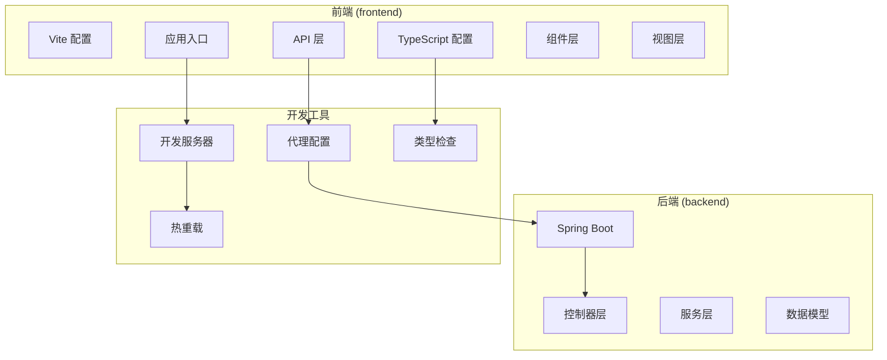
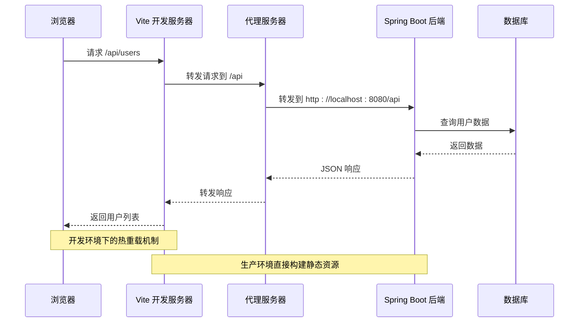
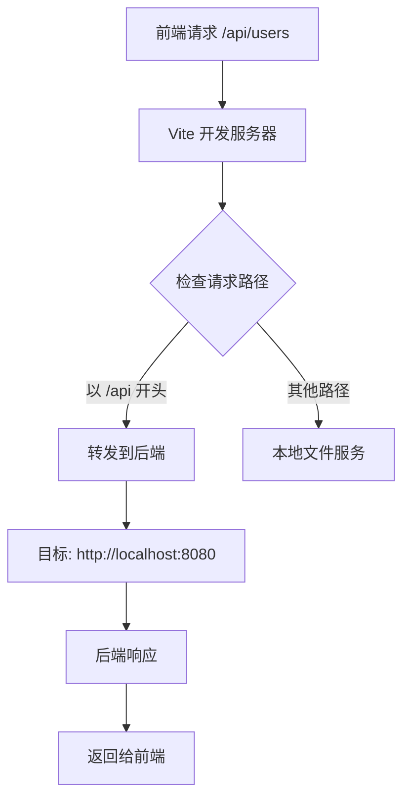
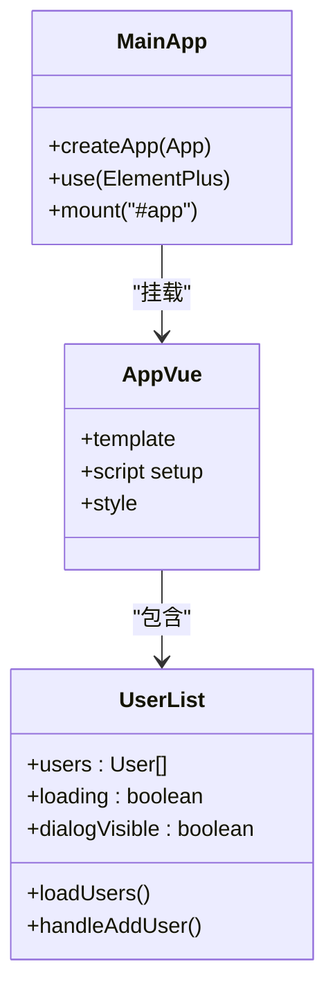

# 开发工具配置

<cite>
**本文档引用的文件**
- [vite.config.ts](file://frontend/vite.config.ts)
- [package.json](file://frontend/package.json)
- [tsconfig.json](file://frontend/tsconfig.json)
- [tsconfig.node.json](file://frontend/tsconfig.node.json)
- [env.d.ts](file://frontend/src/env.d.ts)
- [main.ts](file://frontend/src/main.ts)
- [App.vue](file://frontend/src/App.vue)
- [UserList.vue](file://frontend/src/views/UserList.vue)
- [user.ts](file://frontend/src/api/user.ts)
- [README.md](file://README.md)
- [pom.xml](file://backend/pom.xml)
- [application.yml](file://backend/src/main/resources/application.yml)
</cite>

## 目录
1. [简介](#简介)
2. [项目结构](#项目结构)
3. [核心组件](#核心组件)
4. [架构概览](#架构概览)
5. [详细组件分析](#详细组件分析)
6. [依赖关系分析](#依赖关系分析)
7. [性能考虑](#性能考虑)
8. [故障排除指南](#故障排除指南)
9. [结论](#结论)
10. [附录](#附录)

## 简介

本项目是一个基于 Vue 3 + TypeScript + Vite 的全栈开发示例，采用前后端分离架构。前端使用 Vite 作为开发服务器和构建工具，TypeScript 提供类型安全保障，Element Plus 提供 UI 组件库，Axios 处理 HTTP 请求。后端使用 Spring Boot 3.x 提供 RESTful API 服务。

该项目展示了现代前端开发工具链的最佳实践，包括开发服务器配置、代理设置、热重载机制、路径别名配置、类型检查规则等核心配置。

## 项目结构

项目采用清晰的分层结构，前后端分离部署：



**图表来源**
- [vite.config.ts:1-23](file://frontend/vite.config.ts#L1-L23)
- [package.json:1-24](file://frontend/package.json#L1-L24)
- [tsconfig.json:1-32](file://frontend/tsconfig.json#L1-L32)

**章节来源**
- [README.md:5-30](file://README.md#L5-L30)
- [vite.config.ts:1-23](file://frontend/vite.config.ts#L1-L23)
- [package.json:1-24](file://frontend/package.json#L1-L24)

## 核心组件

### Vite 开发服务器配置

Vite 作为现代化的前端构建工具，提供了快速的开发体验和高效的构建性能。项目中的 Vite 配置包含了基础的开发服务器设置、代理配置和路径别名支持。

### TypeScript 编译配置

TypeScript 配置采用了严格模式，确保代码质量和类型安全性。配置中包含了模块解析策略、路径映射、以及与 Vite 的集成设置。

### 依赖管理

项目使用 npm 作为包管理器，通过 package.json 管理所有依赖和脚本命令。配置了开发依赖和生产依赖的明确区分。

**章节来源**
- [vite.config.ts:6-22](file://frontend/vite.config.ts#L6-L22)
- [tsconfig.json:2-28](file://frontend/tsconfig.json#L2-L28)
- [package.json:11-22](file://frontend/package.json#L11-L22)

## 架构概览

项目的整体架构采用前后端分离的设计模式，通过代理实现跨域通信：



**图表来源**
- [vite.config.ts:13-21](file://frontend/vite.config.ts#L13-L21)
- [user.ts:3-9](file://frontend/src/api/user.ts#L3-L9)
- [application.yml:1-13](file://backend/src/main/resources/application.yml#L1-L13)

## 详细组件分析

### Vite 配置组件分析

#### 开发服务器设置

Vite 开发服务器配置简洁而高效，主要包含以下关键设置：

- **端口配置**: 默认监听 5173 端口，避免与常见服务冲突
- **插件系统**: 集成 Vue 3 插件，提供单文件组件支持
- **路径别名**: 设置 `@` 指向 `src` 目录，简化导入路径

#### 代理配置机制

代理配置实现了前端开发环境与后端 API 的无缝连接：



**图表来源**
- [vite.config.ts:15-20](file://frontend/vite.config.ts#L15-L20)

#### 热重载机制

Vite 的热重载机制提供了即时反馈的开发体验：

- **文件变更检测**: 自动监控源文件变化
- **模块热替换**: 仅更新变更的模块，保持应用状态
- **CSS 热更新**: 支持样式文件的无刷新更新
- **错误边界处理**: 在开发时提供友好的错误信息

**章节来源**
- [vite.config.ts:13-21](file://frontend/vite.config.ts#L13-L21)

### TypeScript 配置组件分析

#### 编译选项详解

TypeScript 配置采用了现代化的编译策略：

**严格模式配置**:
- `strict`: 启用所有严格类型检查选项
- `noUnusedLocals`: 检测未使用的局部变量
- `noUnusedParameters`: 检测未使用的函数参数
- `noFallthroughCasesInSwitch`: 检测 switch 语句中的遗漏 case

**模块解析策略**:
- `moduleResolution`: 使用 bundler 模式，与 Vite 集成最佳
- `allowImportingTsExtensions`: 允许导入 .ts 扩展名
- `isolatedModules`: 支持单文件编译

**路径别名配置**:
- `baseUrl`: 基础路径设置为项目根目录
- `paths`: `@/*` 映射到 `src/*`

#### 节点环境配置

tsconfig.node.json 专门用于配置 Vite 配置文件的 TypeScript 支持：
- `composite`: 支持复合项目
- `skipLibCheck`: 跳过库文件检查
- `moduleResolution`: ESNext 模块解析

**章节来源**
- [tsconfig.json:2-28](file://frontend/tsconfig.json#L2-L28)
- [tsconfig.node.json:2-8](file://frontend/tsconfig.node.json#L2-L8)

### 依赖管理分析

#### 生产依赖

项目的核心依赖包括：

**Vue 3 生态系统**:
- `vue`: 核心框架，版本 ^3.4.0
- `element-plus`: UI 组件库，版本 ^2.4.0

**HTTP 客户端**:
- `axios`: HTTP 请求库，版本 ^1.6.0

#### 开发依赖

开发工具链配置：

**构建工具**:
- `vite`: 开发服务器和构建工具，版本 ^5.0.0
- `@vitejs/plugin-vue`: Vue 3 插件
- `typescript`: TypeScript 编译器，版本 ^5.3.0

**类型定义**:
- `@types/node`: Node.js 类型定义

**类型检查**:
- `vue-tsc`: Vue 类型检查器

#### 脚本命令

**开发命令**:
- `dev`: 启动 Vite 开发服务器
- `build`: 先进行类型检查，然后构建项目
- `preview`: 预览生产构建结果

**章节来源**
- [package.json:11-22](file://frontend/package.json#L11-L22)
- [package.json:6-10](file://frontend/package.json#L6-L10)

### 应用架构组件分析

#### 应用入口配置

主应用入口文件负责初始化 Vue 应用和全局配置：



**图表来源**
- [main.ts:1-10](file://frontend/src/main.ts#L1-L10)
- [App.vue:14-16](file://frontend/src/App.vue#L14-L16)
- [UserList.vue:36-86](file://frontend/src/views/UserList.vue#L36-L86)

#### API 层设计

API 层采用集中式配置，提供统一的 HTTP 客户端：

**配置特点**:
- `baseURL`: 设置为后端 API 根路径
- `timeout`: 5 秒超时设置
- `headers`: 默认 JSON 内容类型

**接口定义**:
- `User` 接口定义用户数据结构
- `userApi` 对象提供用户操作方法

**章节来源**
- [main.ts:1-10](file://frontend/src/main.ts#L1-L10)
- [user.ts:11-23](file://frontend/src/api/user.ts#L11-L23)

## 依赖关系分析

项目各组件之间的依赖关系体现了清晰的分层架构：

```mermaid
graph TB
subgraph "前端依赖关系"
ViteConfig[vite.config.ts]
PackageJSON[package.json]
TSConfig[tsconfig.json]
ViteConfig --> VuePlugin[@vitejs/plugin-vue]
ViteConfig --> PathAlias[路径别名配置]
PackageJSON --> Vue[Vue 3]
PackageJSON --> ElementPlus[Element Plus]
PackageJSON --> Axios[Axios]
PackageJSON --> Vite[Vite]
PackageJSON --> TypeScript[TypeScript]
PackageJSON --> VueTSC[vue-tsc]
TSConfig --> VueTS[Vue TypeScript]
TSConfig --> NodeTS[Node TypeScript]
end
subgraph "后端依赖关系"
POM[pom.xml]
ApplicationYML[application.yml]
POM --> SpringBootWeb[spring-boot-starter-web]
POM --> SpringBootTest[spring-boot-starter-test]
ApplicationYML --> ServerPort[8080 端口]
end
subgraph "开发工具"
DevServer[开发服务器]
Proxy[代理]
HotReload[热重载]
TypeCheck[类型检查]
end
ViteConfig --> DevServer
DevServer --> Proxy
DevServer --> HotReload
PackageJSON --> TypeCheck
```

**图表来源**
- [vite.config.ts:1-3](file://frontend/vite.config.ts#L1-L3)
- [package.json:16-22](file://frontend/package.json#L16-L22)
- [tsconfig.json:1-32](file://frontend/tsconfig.json#L1-L32)
- [pom.xml:24-37](file://backend/pom.xml#L24-L37)

**章节来源**
- [vite.config.ts:1-23](file://frontend/vite.config.ts#L1-L23)
- [package.json:1-24](file://frontend/package.json#L1-L24)
- [tsconfig.json:1-32](file://frontend/tsconfig.json#L1-L32)

## 性能考虑

### 开发环境优化

**热重载性能**:
- Vite 的模块热替换技术提供了毫秒级的更新速度
- 仅更新变更的模块，避免整页刷新
- 支持 CSS 热更新，无需重新加载整个页面

**构建性能**:
- 基于 ES 模块的原生支持，减少打包时间
- 按需编译，只编译当前使用的模块
- 并行处理多个文件，提高编译效率

**内存使用优化**:
- 开发服务器使用内存缓存，减少磁盘 I/O
- 智能缓存策略，避免重复计算
- 及时清理未使用的模块缓存

### 生产环境优化

**代码分割**:
- 自动进行代码分割，按需加载路由组件
- 动态导入大型依赖库
- 生成优化的 chunk 文件

**资源优化**:
- 自动压缩 JavaScript 和 CSS 文件
- 图片资源优化和格式转换
- HTML 文件压缩和清理

**缓存策略**:
- 生成带内容哈希的文件名
- 配置长期缓存策略
- CDN 友好的资源路径

## 故障排除指南

### 常见问题及解决方案

**开发服务器无法启动**:
1. 检查端口 5173 是否被占用
2. 确认 Node.js 版本满足要求 (推荐 v18+)
3. 运行 `npm install` 安装所有依赖

**代理请求失败**:
1. 确认后端服务已在 http://localhost:8080 启动
2. 检查代理配置中的目标地址是否正确
3. 验证 CORS 配置是否允许前端访问

**类型检查错误**:
1. 运行 `npm run build` 查看完整的类型检查结果
2. 检查 TypeScript 配置文件中的严格模式设置
3. 确认所有导入的模块都有正确的类型定义

**热重载不工作**:
1. 检查浏览器控制台是否有错误信息
2. 确认文件保存是否正常触发
3. 尝试重启开发服务器

**章节来源**
- [README.md:114-119](file://README.md#L114-L119)
- [vite.config.ts:13-21](file://frontend/vite.config.ts#L13-L21)

## 结论

本项目展示了现代前端开发工具链的最佳实践，通过精心配置的 Vite、TypeScript 和 Vue 3 技术栈，为团队开发提供了高效、可靠的开发环境。

**主要优势**:
- **开发体验**: 快速的热重载和即时反馈
- **类型安全**: 严格的 TypeScript 配置确保代码质量
- **模块化**: 清晰的项目结构和依赖管理
- **可维护性**: 良好的代码组织和配置分离

**建议改进方向**:
- 添加更多的开发工具配置，如 ESLint 和 Prettier
- 考虑添加测试框架配置
- 优化生产环境的构建配置
- 添加 CI/CD 集成配置

## 附录

### IDE 配置建议

**VS Code 推荐扩展**:
- Vue Language Features (Volar)
- TypeScript Importer
- Auto Rename Tag
- Bracket Pair Colorizer

**开发环境设置**:
- 启用 TypeScript 严格模式
- 配置 ESLint 规则
- 设置代码格式化工具
- 配置 Git 钩子进行代码检查

### 代码规范建议

**命名约定**:
- 组件文件使用 PascalCase (UserCard.vue)
- 接口名称使用 PascalCase (UserData)
- 变量使用 camelCase (userList)
- 常量使用 UPPER_SNAKE_CASE (API_BASE_URL)

**文件组织**:
- 按功能模块组织组件
- API 请求集中管理
- 类型定义单独存放
- 样式文件与组件关联

**版本控制**:
- 使用语义化版本号
- 编写清晰的提交信息
- 分支管理策略
- 代码审查流程