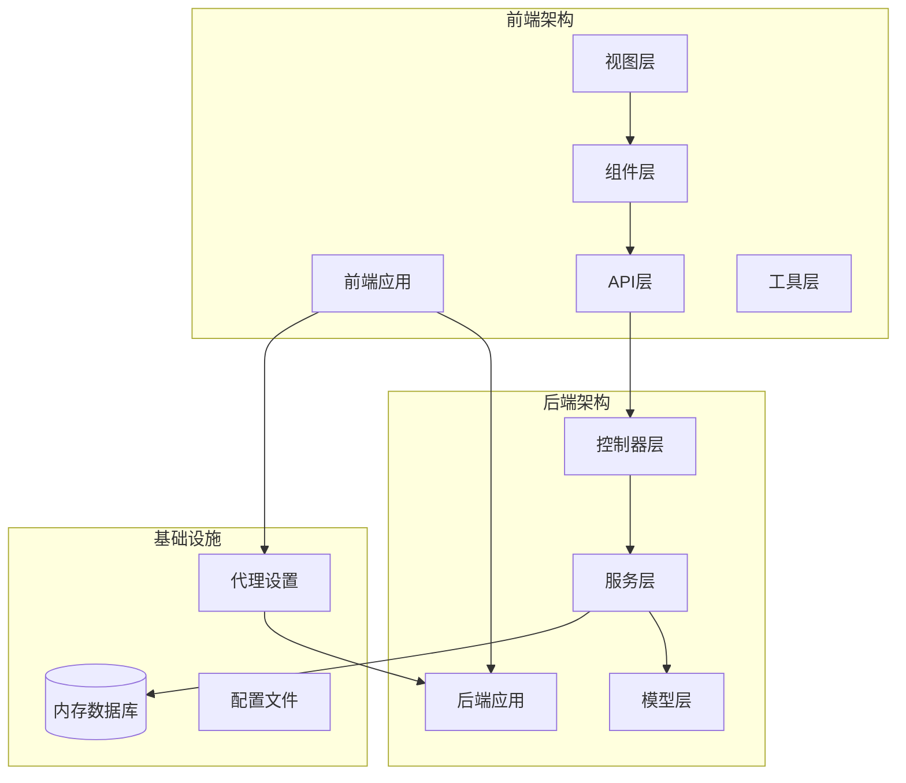
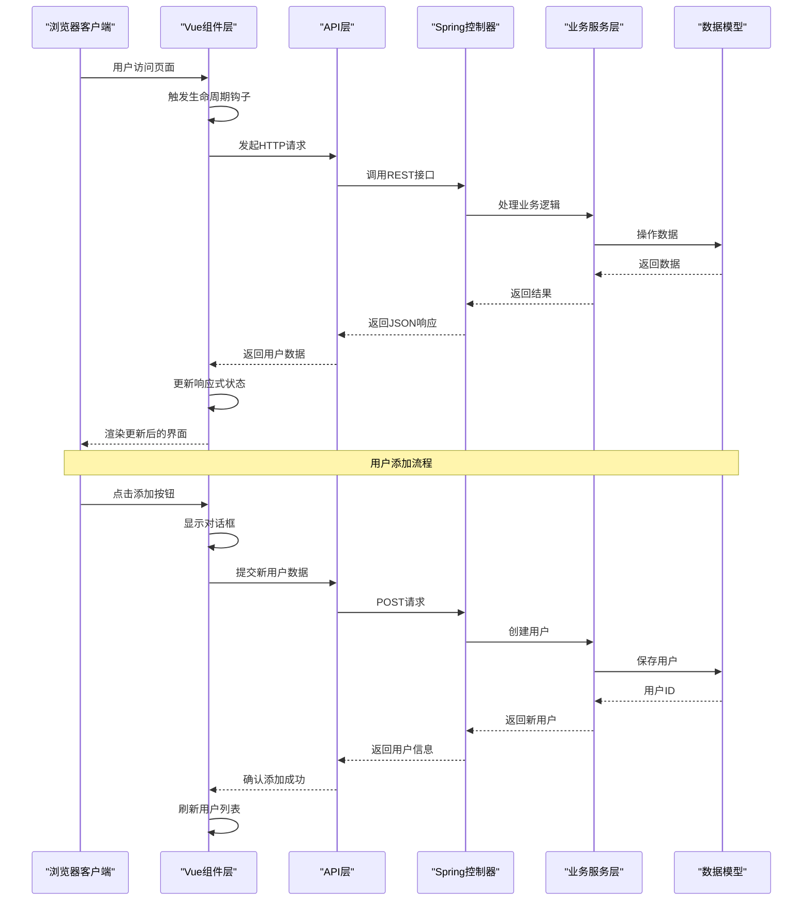
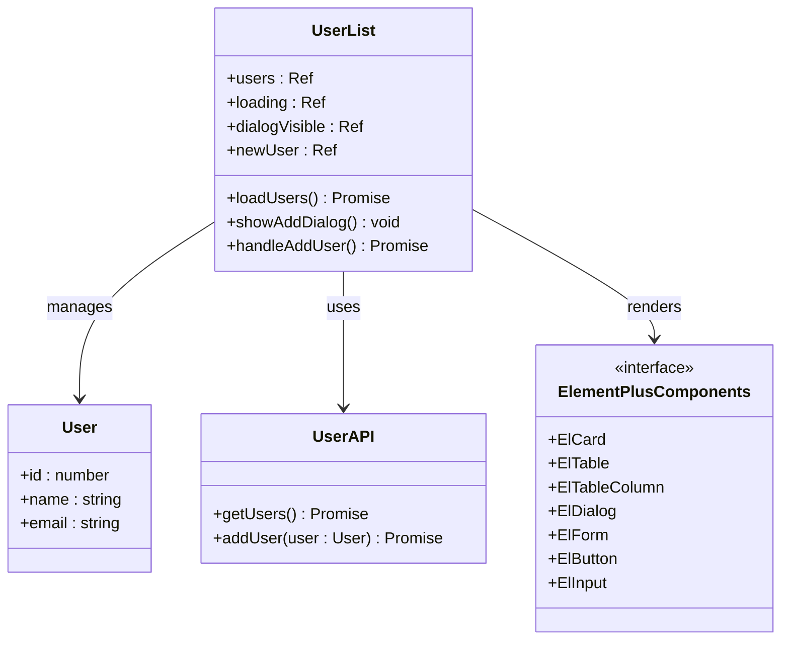
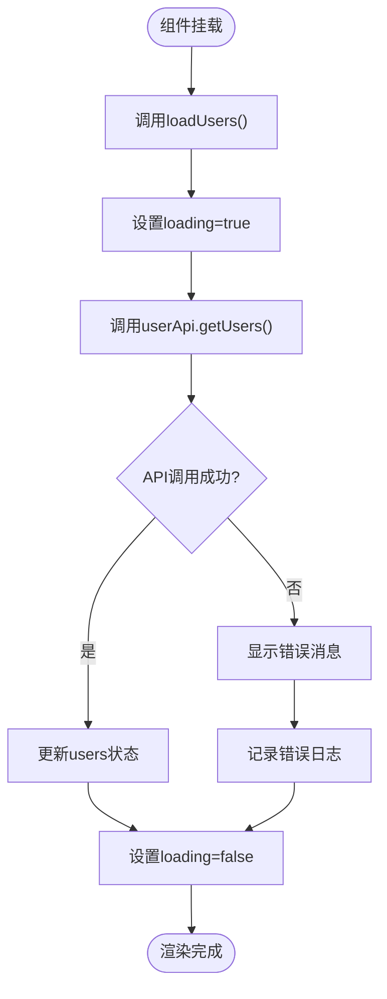
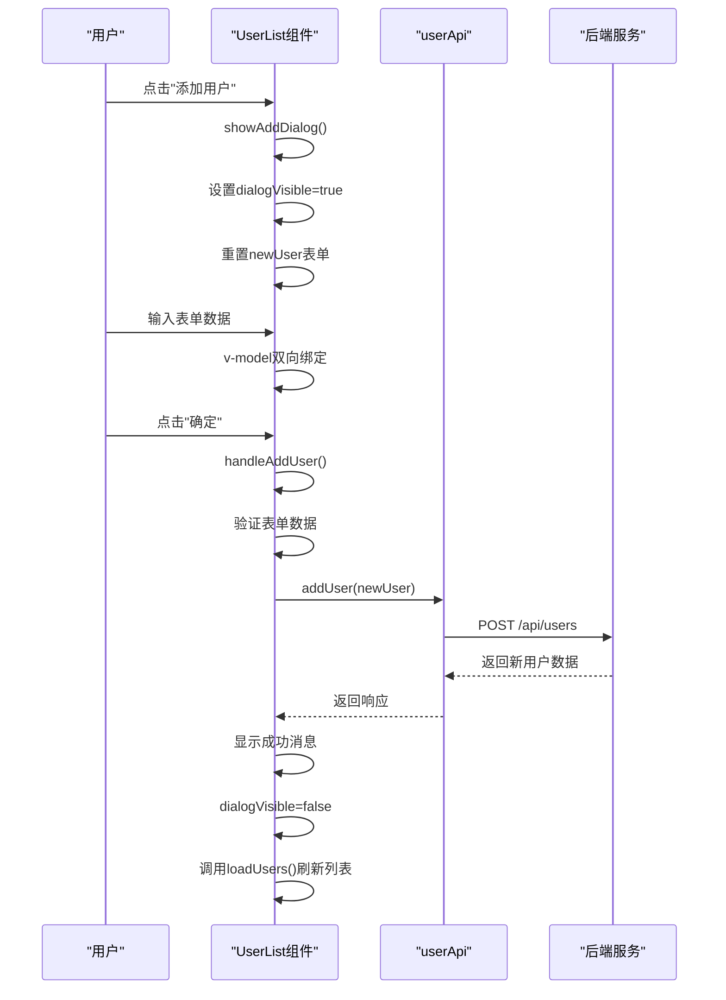
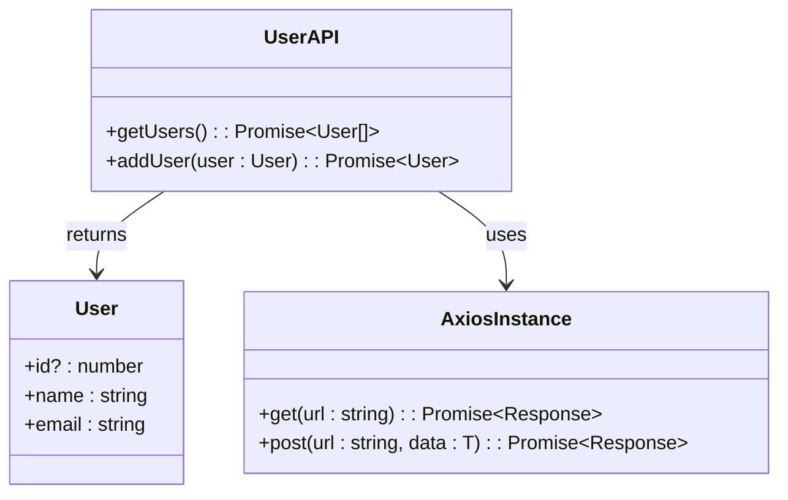
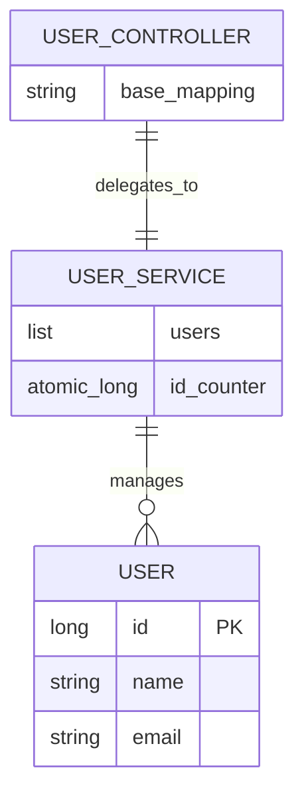
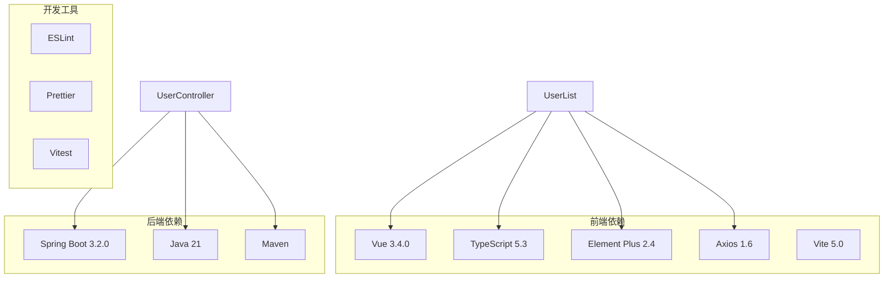

# 组件架构设计

<cite>
**本文档引用的文件**
- [UserList.vue](file://frontend/src/views/UserList.vue)
- [user.ts](file://frontend/src/api/user.ts)
- [main.ts](file://frontend/src/main.ts)
- [App.vue](file://frontend/src/App.vue)
- [vite.config.ts](file://frontend/vite.config.ts)
- [UserController.java](file://backend/src/main/java/com/example/demo/controller/UserController.java)
- [UserService.java](file://backend/src/main/java/com/example/demo/service/UserService.java)
- [User.java](file://backend/src/main/java/com/example/demo/model/User.java)
- [package.json](file://frontend/package.json)
- [README.md](file://README.md)
</cite>

## 目录
1. [简介](#简介)
2. [项目结构](#项目结构)
3. [核心组件](#核心组件)
4. [架构概览](#架构概览)
5. [详细组件分析](#详细组件分析)
6. [依赖关系分析](#依赖关系分析)
7. [性能考虑](#性能考虑)
8. [故障排除指南](#故障排除指南)
9. [结论](#结论)
10. [附录](#附录)

## 简介

本项目是一个基于Vue 3 + Spring Boot的全栈应用示例，专注于展示现代前端组件架构设计的最佳实践。本文档深入分析用户列表组件(UserList.vue)的设计模式、实现细节和架构原则，涵盖响应式数据管理、事件处理机制、生命周期钩子使用、组件间通信模式以及性能优化策略。

该系统采用前后端分离架构，前端使用Vue 3 Composition API和TypeScript，后端使用Spring Boot提供RESTful API服务。通过Element Plus组件库实现现代化UI界面，Vite作为构建工具提供快速开发体验。

## 项目结构

项目采用清晰的分层架构，前后端分离设计确保了良好的模块化和可维护性。

**图表来源**
- [UserList.vue:1-101](file://frontend/src/views/UserList.vue#L1-L101)
- [main.ts:1-10](file://frontend/src/main.ts#L1-L10)
- [vite.config.ts:1-23](file://frontend/vite.config.ts#L1-L23)

**章节来源**
- [README.md:1-119](file://README.md#L1-L119)
- [package.json:1-24](file://frontend/package.json#L1-L24)

## 核心组件

用户列表组件是整个应用的核心交互组件，实现了完整的CRUD操作流程。该组件展现了现代Vue 3组件设计的多个重要方面：

### 组件职责与单一职责原则
- **数据展示**: 使用Element Plus表格组件展示用户列表
- **数据获取**: 通过API层获取用户数据并管理加载状态
- **用户交互**: 提供添加用户的表单界面和验证逻辑
- **状态管理**: 使用Vue响应式系统管理本地状态

### 响应式数据结构
组件定义了以下核心响应式状态：
- `users`: 用户数据数组，用于表格展示
- `loading`: 加载状态指示器
- `dialogVisible`: 对话框显示控制
- `newUser`: 新用户表单数据

**章节来源**
- [UserList.vue:41-44](file://frontend/src/views/UserList.vue#L41-L44)
- [UserList.vue:36-87](file://frontend/src/views/UserList.vue#L36-L87)

## 架构概览

系统采用经典的MVC架构模式，结合现代前端组件设计理念：

**图表来源**
- [UserList.vue:47-86](file://frontend/src/views/UserList.vue#L47-L86)
- [user.ts:17-23](file://frontend/src/api/user.ts#L17-L23)
- [UserController.java:20-28](file://backend/src/main/java/com/example/demo/controller/UserController.java#L20-L28)

**章节来源**
- [UserList.vue:1-101](file://frontend/src/views/UserList.vue#L1-L101)
- [user.ts:1-26](file://frontend/src/api/user.ts#L1-L26)
- [UserController.java:1-30](file://backend/src/main/java/com/example/demo/controller/UserController.java#L1-L30)

## 详细组件分析

### 用户列表组件架构

**图表来源**
- [UserList.vue:36-87](file://frontend/src/views/UserList.vue#L36-L87)
- [user.ts:11-23](file://frontend/src/api/user.ts#L11-L23)

#### 组件状态管理分析

组件采用了Vue 3的Composition API模式，通过`ref`函数创建响应式状态：

**数据状态定义**:
- `users`: 存储从API获取的用户数据数组
- `loading`: 控制表格加载状态指示器
- `dialogVisible`: 管理添加用户对话框的显示/隐藏
- `newUser`: 表单绑定的数据对象

**状态管理模式**:
- 使用`reactive`替代传统对象包装，提供更好的TypeScript支持
- 通过`try-catch-finally`块确保状态正确恢复
- 实现了完整的错误处理和用户反馈机制

#### 生命周期钩子使用

组件在`onMounted`钩子中执行初始化逻辑：

**图表来源**
- [UserList.vue:84-86](file://frontend/src/views/UserList.vue#L84-L86)
- [UserList.vue:47-58](file://frontend/src/views/UserList.vue#L47-L58)

**章节来源**
- [UserList.vue:36-87](file://frontend/src/views/UserList.vue#L36-L87)

#### 事件处理机制

组件实现了多种事件处理模式：

**用户交互事件**:
- `@click="showAddDialog"`: 打开添加用户对话框
- `@click="handleAddUser"`: 处理用户添加逻辑
- `@click="dialogVisible = false"`: 关闭对话框

**表单绑定事件**:
- `v-model="newUser.name"`: 双向绑定姓名输入
- `v-model="newUser.email"`: 双向绑定邮箱输入

**事件处理流程**:

**图表来源**
- [UserList.vue:61-82](file://frontend/src/views/UserList.vue#L61-L82)
- [user.ts:21-22](file://frontend/src/api/user.ts#L21-L22)

**章节来源**
- [UserList.vue:19-32](file://frontend/src/views/UserList.vue#L19-L32)
- [UserList.vue:61-82](file://frontend/src/views/UserList.vue#L61-L82)

#### 组件间通信模式

**父子组件通信**:
- 父组件(App.vue)通过标签形式引入子组件
- 子组件通过模板直接渲染，无需额外props传递

**组件内部通信**:
- 使用Vue 3的组合式API在同一个组件内共享状态
- 通过方法调用实现组件内部逻辑解耦

**外部通信**:
- 通过Axios实例进行HTTP通信
- 使用Element Plus的消息提示系统进行用户反馈

**章节来源**
- [App.vue:8](file://frontend/src/App.vue#L8)
- [UserList.vue:39](file://frontend/src/views/UserList.vue#L39)

### API层设计

API层提供了类型安全的HTTP客户端封装：

**图表来源**
- [user.ts:17-23](file://frontend/src/api/user.ts#L17-L23)
- [user.ts:11-15](file://frontend/src/api/user.ts#L11-L15)

**API设计特点**:
- 使用TypeScript接口确保类型安全
- 封装Axios实例提供统一的HTTP客户端
- 定义明确的API方法签名和返回类型

**章节来源**
- [user.ts:1-26](file://frontend/src/api/user.ts#L1-L26)

### 后端服务架构

后端采用Spring Boot提供RESTful API服务：

**图表来源**
- [UserService.java:13-31](file://backend/src/main/java/com/example/demo/service/UserService.java#L13-L31)
- [User.java:3-40](file://backend/src/main/java/com/example/demo/model/User.java#L3-L40)

**后端设计特点**:
- 内存存储模拟数据库，便于演示和测试
- 原子计数器确保用户ID唯一性
- CORS配置允许前端跨域访问

**章节来源**
- [UserService.java:1-33](file://backend/src/main/java/com/example/demo/service/UserService.java#L1-L33)
- [UserController.java:1-30](file://backend/src/main/java/com/example/demo/controller/UserController.java#L1-L30)

## 依赖关系分析

系统依赖关系清晰，遵循单一职责原则和依赖倒置原则：

**图表来源**
- [package.json:11-22](file://frontend/package.json#L11-L22)

**依赖管理策略**:
- 使用package.json统一管理依赖版本
- 采用语义化版本控制确保兼容性
- 开发和生产环境依赖分离

**章节来源**
- [package.json:1-24](file://frontend/package.json#L1-L24)

## 性能考虑

### 响应式数据优化

组件在响应式数据管理方面采用了多项优化策略：

**状态最小化**:
- 仅存储必要的状态数据
- 避免不必要的响应式包装
- 使用合适的初始值避免空值检查

**异步操作优化**:
- 使用loading状态防止重复请求
- 错误处理确保状态正确恢复
- finally块确保资源清理

### 组件渲染优化

**模板优化**:
- 使用v-if条件渲染减少DOM节点
- v-loading指令提供加载状态反馈
- scoped样式避免样式冲突

**事件处理优化**:
- 使用防抖和节流避免频繁触发
- 合理的事件委托减少监听器数量

### 网络请求优化

**请求缓存**:
- 合理的缓存策略避免重复请求
- 请求去重防止并发重复调用

**错误处理**:
- 完善的错误边界处理
- 用户友好的错误提示

## 故障排除指南

### 常见问题诊断

**网络连接问题**:
- 检查Vite代理配置是否正确
- 验证CORS设置是否允许前端访问
- 确认后端服务端口和地址配置

**类型错误**:
- 确保TypeScript类型定义正确
- 检查接口字段匹配
- 验证API响应格式

**组件渲染问题**:
- 检查Element Plus组件导入
- 验证CSS类名和样式
- 确认响应式数据绑定

### 调试技巧

**开发工具使用**:
- 使用Vue DevTools监控组件状态
- 利用浏览器开发者工具调试网络请求
- 通过console.log跟踪异步操作

**错误处理策略**:
- 实现全局错误处理器
- 提供详细的错误日志
- 用户友好的错误提示

**章节来源**
- [vite.config.ts:13-21](file://frontend/vite.config.ts#L13-L21)
- [UserList.vue:52-54](file://frontend/src/views/UserList.vue#L52-L54)

## 结论

本项目展示了现代Vue 3组件架构设计的最佳实践。用户列表组件通过合理的状态管理、清晰的事件处理和完善的生命周期管理，体现了单一职责原则和关注点分离的设计理念。

**主要成就**:
- 成功实现了完整的CRUD功能
- 采用TypeScript确保类型安全
- 使用Element Plus提供现代化UI
- 实现了前后端分离架构
- 遵循了组件设计的单一职责原则

**技术亮点**:
- Vue 3 Composition API的正确使用
- 响应式数据管理的最佳实践
- 异步操作的完整错误处理
- 组件间通信的清晰设计

该架构为类似的应用程序提供了可复用的参考模式，开发者可以在此基础上扩展更多功能和优化性能。

## 附录

### 测试策略建议

**单元测试**:
- 组件状态测试：验证响应式状态的正确初始化和更新
- 方法测试：测试loadUsers、handleAddUser等核心方法
- 边界情况：测试空数据、错误响应等情况

**集成测试**:
- API集成测试：验证与后端服务的正确通信
- 端到端测试：模拟完整的用户操作流程

**性能测试**:
- 加载性能测试：测量大数据集的渲染性能
- 内存泄漏检测：确保组件正确清理资源

### 组件扩展建议

**功能扩展**:
- 添加用户编辑功能
- 实现用户删除确认机制
- 增加搜索和过滤功能
- 添加分页支持

**架构改进**:
- 引入状态管理模式（如Pinia）
- 实现组件库化
- 添加国际化支持
- 增强主题定制能力