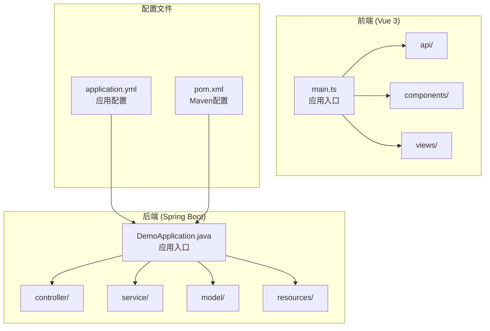
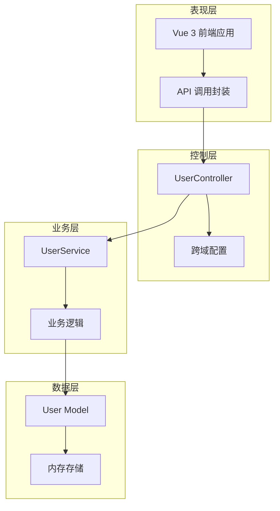
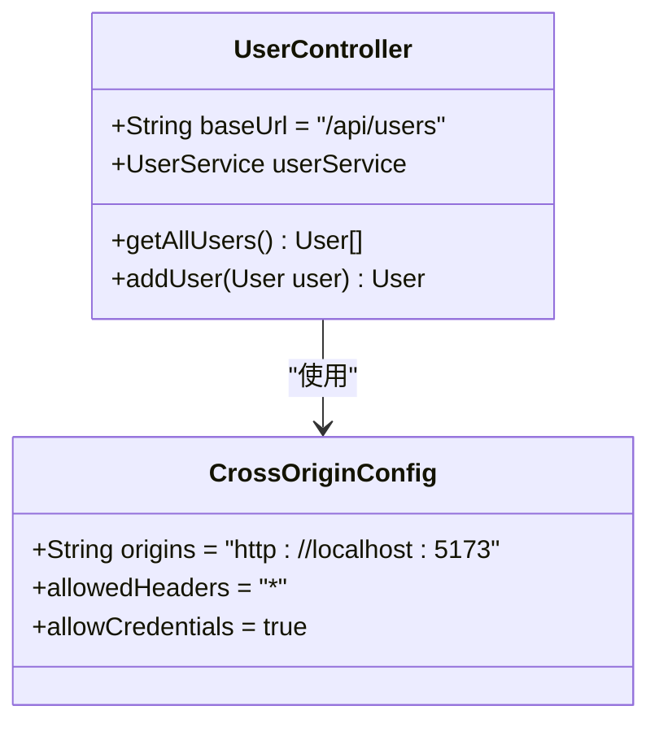
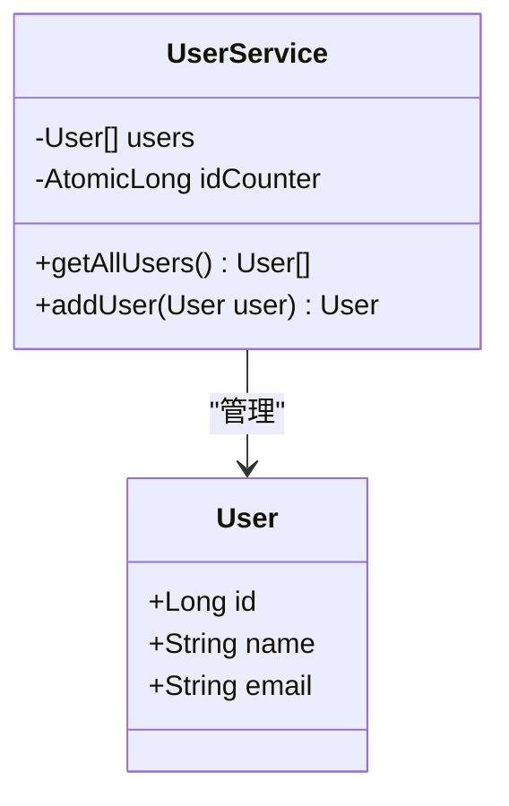
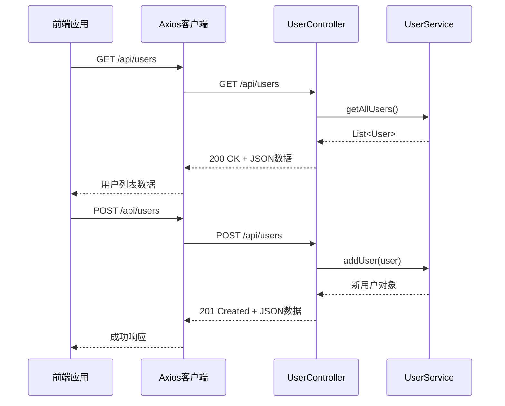
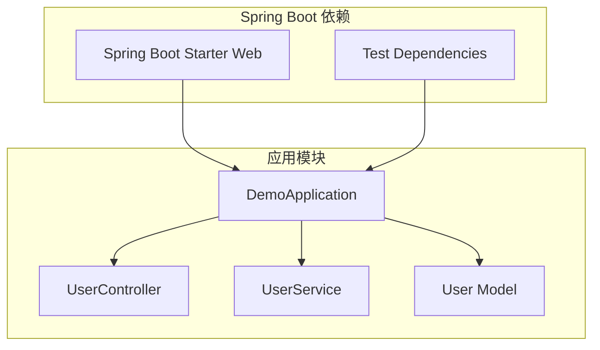

# RESTful API 设计

<cite>
**本文档引用的文件**
- [UserController.java](file://backend/src/main/java/com/example/demo/controller/UserController.java)
- [User.java](file://backend/src/main/java/com/example/demo/model/User.java)
- [UserService.java](file://backend/src/main/java/com/example/demo/service/UserService.java)
- [DemoApplication.java](file://backend/src/main/java/com/example/demo/DemoApplication.java)
- [application.yml](file://backend/src/main/resources/application.yml)
- [user.ts](file://frontend/src/api/user.ts)
- [UserList.vue](file://frontend/src/views/UserList.vue)
- [pom.xml](file://backend/pom.xml)
- [README.md](file://README.md)
</cite>

## 目录
1. [简介](#简介)
2. [项目结构](#项目结构)
3. [核心组件](#核心组件)
4. [架构概览](#架构概览)
5. [详细组件分析](#详细组件分析)
6. [依赖分析](#依赖分析)
7. [性能考虑](#性能考虑)
8. [故障排除指南](#故障排除指南)
9. [结论](#结论)
10. [附录](#附录)

## 简介

本项目是一个基于Spring Boot 3.x + Vue 3的全栈RESTful API示例应用，展示了现代Web应用的标准架构模式。该系统实现了用户管理的基本CRUD操作，采用分层架构设计，包含清晰的RESTful API接口设计和跨域配置。

项目的核心目标是演示：
- RESTful API设计原则和最佳实践
- Spring Boot后端服务的构建和配置
- Vue 3前端应用的数据交互模式
- CORS跨域配置和安全考虑
- 类型安全的API调用封装

## 项目结构

该项目采用标准的Maven多模块结构，分为前后端两个独立的应用程序：



**图表来源**
- [DemoApplication.java:1-13](file://backend/src/main/java/com/example/demo/DemoApplication.java#L1-L13)
- [application.yml:1-13](file://backend/src/main/resources/application.yml#L1-L13)
- [pom.xml:1-48](file://backend/pom.xml#L1-L48)

**章节来源**
- [README.md:5-30](file://README.md#L5-L30)
- [DemoApplication.java:1-13](file://backend/src/main/java/com/example/demo/DemoApplication.java#L1-L13)
- [pom.xml:1-48](file://backend/pom.xml#L1-L48)

## 核心组件

### REST控制器层

UserController类是整个系统的API入口点，负责处理HTTP请求并返回相应的响应数据。

**章节来源**
- [UserController.java:9-29](file://backend/src/main/java/com/example/demo/controller/UserController.java#L9-L29)

### 业务服务层

UserService类封装了核心业务逻辑，包括用户数据的管理和操作。

**章节来源**
- [UserService.java:10-32](file://backend/src/main/java/com/example/demo/service/UserService.java#L10-L32)

### 数据模型层

User类定义了用户实体的数据结构，包含基本的属性和访问器方法。

**章节来源**
- [User.java:3-40](file://backend/src/main/java/com/example/demo/model/User.java#L3-L40)

## 架构概览

系统采用经典的三层架构模式，实现了清晰的关注点分离：



**图表来源**
- [UserController.java:10-11](file://backend/src/main/java/com/example/demo/controller/UserController.java#L10-L11)
- [UserService.java:13-14](file://backend/src/main/java/com/example/demo/service/UserService.java#L13-L14)
- [User.java:4-6](file://backend/src/main/java/com/example/demo/model/User.java#L4-L6)

## 详细组件分析

### UserController 组件分析

UserController是系统的核心控制器，实现了标准的RESTful API接口：

#### HTTP方法映射

| HTTP方法 | 端点 | 描述 | 返回类型 |
|---------|------|------|----------|
| GET | `/api/users` | 获取所有用户 | `List<User>` |
| POST | `/api/users` | 创建新用户 | `User` |

#### 跨域配置分析



**图表来源**
- [UserController.java:11](file://backend/src/main/java/com/example/demo/controller/UserController.java#L11)
- [application.yml:10-12](file://backend/src/main/resources/application.yml#L10-L12)

#### 安全考虑

跨域配置中需要注意的安全要点：
- 仅允许特定的源地址
- 配置适当的CORS头信息
- 考虑生产环境下的安全策略

**章节来源**
- [UserController.java:10-28](file://backend/src/main/java/com/example/demo/controller/UserController.java#L10-L28)

### UserService 组件分析

UserService实现了用户数据的业务逻辑处理：



**图表来源**
- [UserService.java:13-31](file://backend/src/main/java/com/example/demo/service/UserService.java#L13-L31)
- [User.java:4-6](file://backend/src/main/java/com/example/demo/model/User.java#L4-L6)

#### 数据持久化策略

当前实现使用内存存储而非数据库，这适合开发和测试场景，但在生产环境中需要替换为持久化存储方案。

**章节来源**
- [UserService.java:13-21](file://backend/src/main/java/com/example/demo/service/UserService.java#L13-L21)

### 前端集成分析

前端通过Axios库与后端API进行通信：



**图表来源**
- [user.ts:19-22](file://frontend/src/api/user.ts#L19-L22)
- [UserController.java:20-28](file://backend/src/main/java/com/example/demo/controller/UserController.java#L20-L28)

**章节来源**
- [user.ts:17-23](file://frontend/src/api/user.ts#L17-L23)
- [UserList.vue:47-82](file://frontend/src/views/UserList.vue#L47-L82)

## 依赖分析

### 后端依赖关系



**图表来源**
- [pom.xml:24-36](file://backend/pom.xml#L24-L36)
- [DemoApplication.java:6](file://backend/src/main/java/com/example/demo/DemoApplication.java#L6)

### 前端依赖关系

前端应用依赖于现代化的JavaScript生态系统：

| 依赖项 | 版本 | 用途 |
|--------|------|------|
| Vue 3.4 | 最新 | 前端框架 |
| TypeScript 5.3 | 最新 | 类型安全 |
| Element Plus 2.4 | 最新 | UI组件库 |
| Axios 1.6 | 最新 | HTTP客户端 |

**章节来源**
- [pom.xml:24-36](file://backend/pom.xml#L24-L36)
- [README.md:100-105](file://README.md#L100-L105)

## 性能考虑

### 内存存储优化

当前的内存存储方案在小规模数据集下表现良好，但存在以下限制：
- 数据量增长时内存使用增加
- 应用重启后数据丢失
- 缺乏并发访问控制

### 建议的优化方案

1. **缓存策略**：实现LRU缓存机制
2. **分页支持**：为大量数据提供分页查询
3. **连接池**：配置数据库连接池
4. **异步处理**：对耗时操作使用异步处理

## 故障排除指南

### 常见问题及解决方案

#### CORS跨域问题
- **症状**：浏览器控制台出现跨域错误
- **原因**：前端和后端端口不匹配或CORS配置不正确
- **解决**：检查`@CrossOrigin`注解和`application.yml`配置

#### 端口冲突
- **症状**：应用启动失败，提示端口已被占用
- **解决**：修改`application.yml`中的server.port配置

#### 类型不匹配错误
- **症状**：API调用返回类型错误
- **解决**：确保前端和后端的数据模型保持一致

**章节来源**
- [application.yml:1-13](file://backend/src/main/resources/application.yml#L1-L13)
- [UserController.java:11](file://backend/src/main/java/com/example/demo/controller/UserController.java#L11)

## 结论

本项目成功展示了RESTful API设计的核心原则和最佳实践。通过清晰的分层架构、标准的HTTP方法使用和合理的跨域配置，为开发者提供了一个可扩展的API基础。

主要成就包括：
- 实现了符合RESTful原则的API设计
- 提供了完整的前后端集成示例
- 展示了类型安全的开发模式
- 包含了基本的安全配置

建议的后续改进方向：
- 添加完整的CRUD操作支持
- 实现数据库持久化
- 增加输入验证和错误处理
- 添加认证和授权机制

## 附录

### API调用示例

#### 获取用户列表
```http
GET http://localhost:8080/api/users
Content-Type: application/json
```

#### 添加用户
```http
POST http://localhost:8080/api/users
Content-Type: application/json

{
  "name": "用户姓名",
  "email": "用户邮箱"
}
```

### 错误处理策略

| 状态码 | 描述 | 处理方式 |
|--------|------|----------|
| 200 | 成功 | 返回正常数据 |
| 201 | 创建成功 | 返回新创建的资源 |
| 400 | 请求错误 | 返回错误详情 |
| 404 | 资源不存在 | 返回NotFound错误 |
| 500 | 服务器错误 | 返回内部错误 |

### 安全最佳实践

1. **输入验证**：始终验证和清理用户输入
2. **CORS配置**：限制允许的源地址
3. **错误处理**：避免泄露敏感信息
4. **日志记录**：记录重要操作但不记录敏感数据