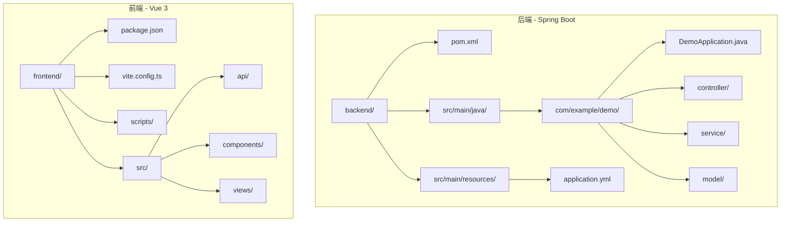
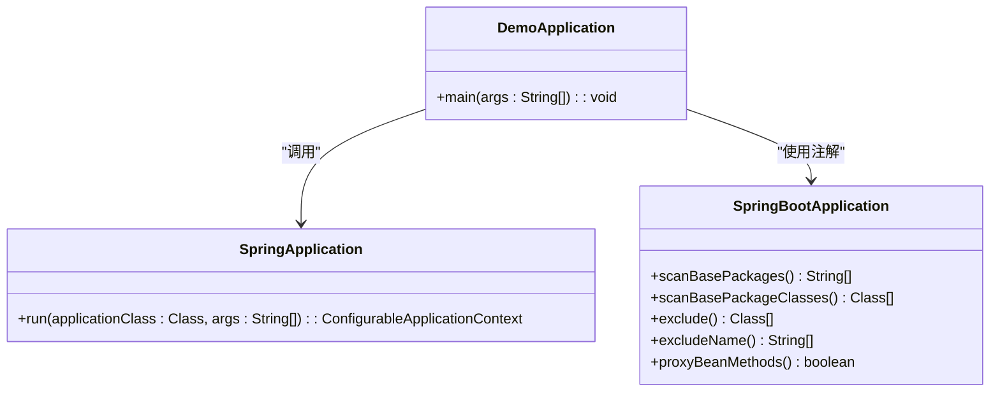
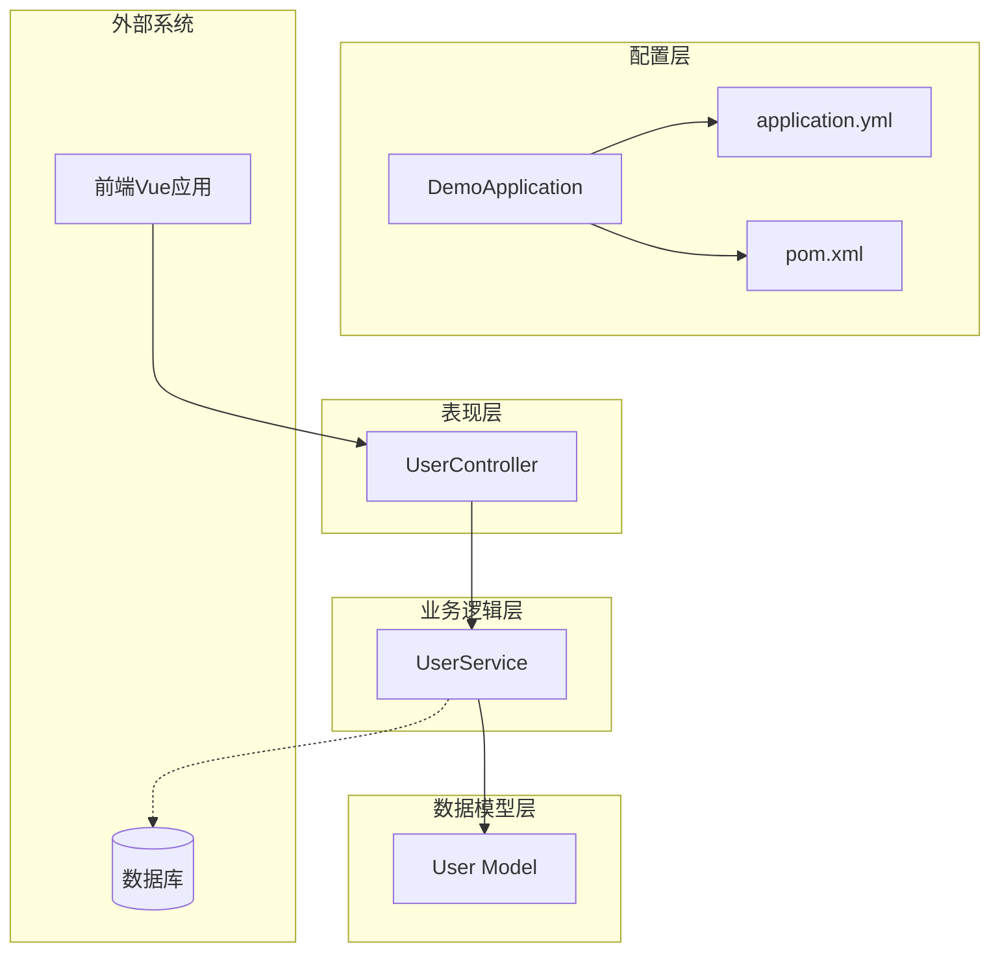
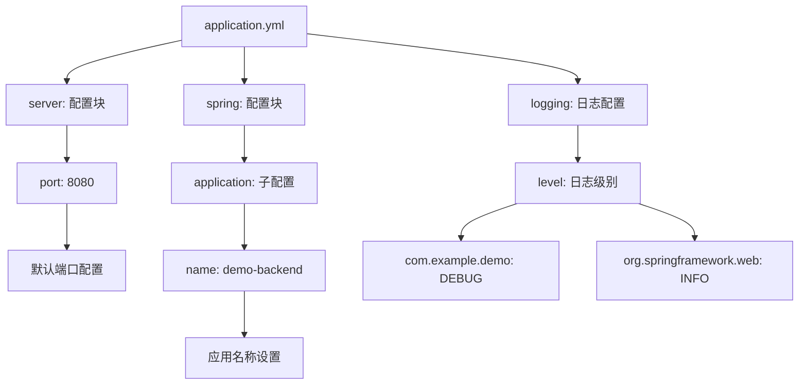
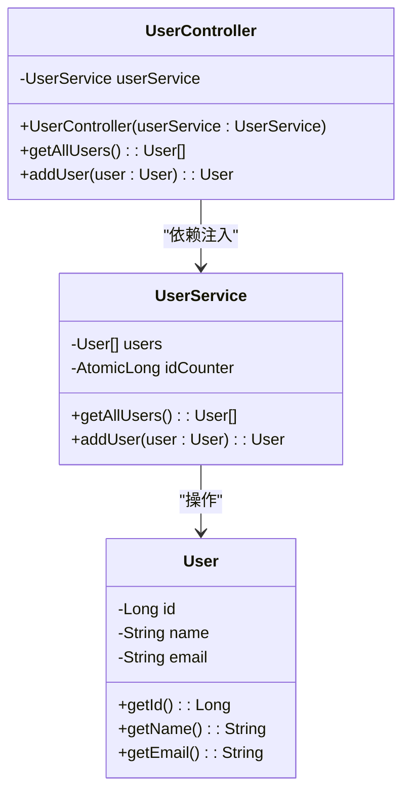
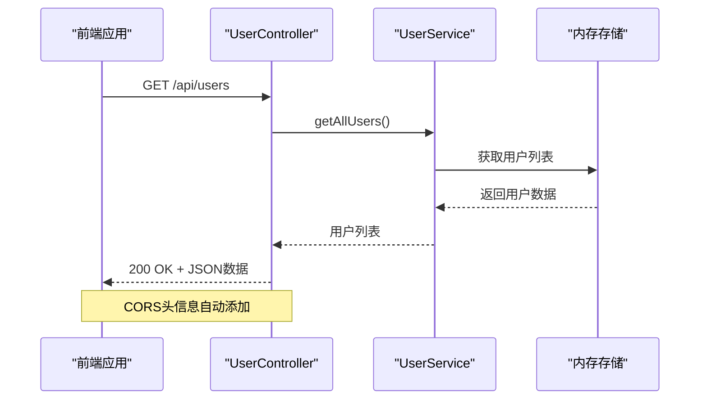
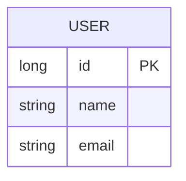
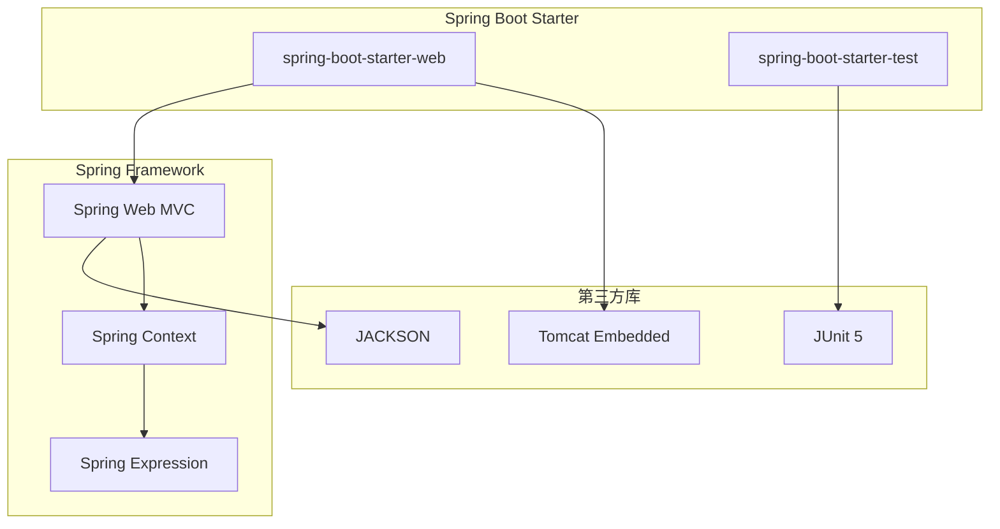
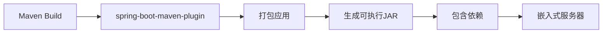

# Spring Boot 应用配置

<cite>
**本文档引用的文件**
- [DemoApplication.java](file://backend/src/main/java/com/example/demo/DemoApplication.java)
- [application.yml](file://backend/src/main/resources/application.yml)
- [pom.xml](file://backend/pom.xml)
- [UserController.java](file://backend/src/main/java/com/example/demo/controller/UserController.java)
- [UserService.java](file://backend/src/main/java/com/example/demo/service/UserService.java)
- [User.java](file://backend/src/main/java/com/example/demo/model/User.java)
- [README.md](file://README.md)
- [package.json](file://frontend/package.json)
</cite>

## 目录
1. [简介](#简介)
2. [项目结构](#项目结构)
3. [核心组件](#核心组件)
4. [架构概览](#架构概览)
5. [详细组件分析](#详细组件分析)
6. [依赖分析](#依赖分析)
7. [性能考虑](#性能考虑)
8. [故障排除指南](#故障排除指南)
9. [结论](#结论)

## 简介

本项目是一个基于Spring Boot 3.2.0和Java 21的全栈演示应用，采用前后端分离架构。后端使用Spring Boot提供RESTful API服务，前端使用Vue 3 + TypeScript构建用户界面。本文档专注于后端Spring Boot应用的配置和初始化过程，详细解释启动类配置、组件扫描机制、配置文件设置以及Maven依赖管理。

## 项目结构

该项目采用标准的Spring Boot项目结构，包含后端和前端两个独立的应用程序：

**图表来源**
- [DemoApplication.java:1-13](file://backend/src/main/java/com/example/demo/DemoApplication.java#L1-L13)
- [application.yml:1-13](file://backend/src/main/resources/application.yml#L1-L13)
- [pom.xml:1-48](file://backend/pom.xml#L1-L48)

**章节来源**
- [README.md:1-119](file://README.md#L1-L119)

## 核心组件

### 启动类配置

Spring Boot应用的核心是启动类，它负责应用的初始化和配置。在本项目中，启动类位于`DemoApplication.java`文件中。

**图表来源**
- [DemoApplication.java:1-13](file://backend/src/main/java/com/example/demo/DemoApplication.java#L1-L13)

启动类的关键特性：
- 使用`@SpringBootApplication`注解标记
- 包含静态`main`方法作为应用入口点
- 调用`SpringApplication.run()`启动应用

**章节来源**
- [DemoApplication.java:1-13](file://backend/src/main/java/com/example/demo/DemoApplication.java#L1-L13)

### 组件扫描机制

`@SpringBootApplication`注解是一个组合注解，包含了以下核心功能：

1. **@SpringBootConfiguration**：标记配置类
2. **@EnableAutoConfiguration**：启用Spring Boot的自动配置机制
3. **@ComponentScan**：启用组件扫描，默认扫描启动类所在包及其子包

这种设计使得Spring Boot能够自动发现和注册应用程序中的各种组件，包括控制器、服务类、配置类等。

**章节来源**
- [DemoApplication.java:6-6](file://backend/src/main/java/com/example/demo/DemoApplication.java#L6-L6)

## 架构概览

该Spring Boot应用采用了经典的三层架构模式：

**图表来源**
- [DemoApplication.java:1-13](file://backend/src/main/java/com/example/demo/DemoApplication.java#L1-L13)
- [UserController.java:1-30](file://backend/src/main/java/com/example/demo/controller/UserController.java#L1-L30)
- [UserService.java:1-33](file://backend/src/main/java/com/example/demo/service/UserService.java#L1-L33)
- [User.java:1-41](file://backend/src/main/java/com/example/demo/model/User.java#L1-L41)

## 详细组件分析

### 配置文件分析

application.yml是Spring Boot的主要配置文件，支持多种配置选项：

#### 服务器配置

服务器配置部分定义了应用的基本网络设置：

**图表来源**
- [application.yml:1-13](file://backend/src/main/resources/application.yml#L1-L13)

#### 日志配置详解

日志配置提供了灵活的日志级别控制机制：

| 配置项 | 作用 | 默认值 | 说明 |
|--------|------|--------|------|
| server.port | 应用监听端口 | 8080 | HTTP服务器端口配置 |
| spring.application.name | 应用名称 | demo-backend | 应用标识符 |
| logging.level.com.example.demo | 包级日志级别 | DEBUG | 自定义包的日志输出级别 |
| logging.level.org.springframework.web | 框架级日志级别 | INFO | Spring Web框架的日志级别 |

**章节来源**
- [application.yml:1-13](file://backend/src/main/resources/application.yml#L1-L13)

### 控制器组件

UserController实现了RESTful API接口，处理用户相关的HTTP请求：

**图表来源**
- [UserController.java:1-30](file://backend/src/main/java/com/example/demo/controller/UserController.java#L1-L30)
- [UserService.java:1-33](file://backend/src/main/java/com/example/demo/service/UserService.java#L1-L33)
- [User.java:1-41](file://backend/src/main/java/com/example/demo/model/User.java#L1-L41)

#### CORS跨域配置

项目中使用了`@CrossOrigin`注解来配置跨域访问：

**图表来源**
- [UserController.java:11-11](file://backend/src/main/java/com/example/demo/controller/UserController.java#L11-L11)

**章节来源**
- [UserController.java:1-30](file://backend/src/main/java/com/example/demo/controller/UserController.java#L1-L30)

### 服务层实现

UserService提供了用户数据的业务逻辑处理：

| 方法 | 参数 | 返回值 | 功能描述 |
|------|------|--------|----------|
| getAllUsers() | 无 | List<User> | 获取所有用户信息 |
| addUser(user) | User | User | 添加新用户并分配ID |
| 构造函数 | 无 | 无 | 初始化示例数据 |

**章节来源**
- [UserService.java:1-33](file://backend/src/main/java/com/example/demo/service/UserService.java#L1-L33)

### 数据模型

User类定义了用户实体的数据结构：

**图表来源**
- [User.java:1-41](file://backend/src/main/java/com/example/demo/model/User.java#L1-L41)

**章节来源**
- [User.java:1-41](file://backend/src/main/java/com/example/demo/model/User.java#L1-L41)

## 依赖分析

### Maven依赖管理

项目使用Maven进行依赖管理，核心依赖包括：

**图表来源**
- [pom.xml:24-37](file://backend/pom.xml#L24-L37)

### 依赖配置详解

| 依赖项 | 版本 | 作用 | 说明 |
|--------|------|------|------|
| spring-boot-starter-web | 3.2.0 | Web应用支持 | 提供Spring MVC、Tomcat嵌入式服务器等 |
| spring-boot-starter-test | 3.2.0 | 测试支持 | 提供JUnit、Mockito等测试工具 |
| spring-boot-starter-parent | 3.2.0 | 父POM | 提供统一的版本管理和插件配置 |
| Java | 21 | 编译环境 | 支持最新的Java语言特性 |

**章节来源**
- [pom.xml:1-48](file://backend/pom.xml#L1-L48)

### 构建配置

项目使用Spring Boot Maven插件进行构建：

**图表来源**
- [pom.xml:39-46](file://backend/pom.xml#L39-L46)

**章节来源**
- [pom.xml:39-46](file://backend/pom.xml#L39-L46)

## 性能考虑

### 启动优化

1. **组件扫描范围**：通过合理组织包结构，限制组件扫描范围
2. **自动配置选择**：仅引入必要的starter依赖
3. **配置文件优化**：避免不必要的配置项

### 运行时性能

1. **日志级别控制**：生产环境中建议使用INFO级别
2. **内存管理**：合理配置JVM参数
3. **连接池配置**：如需数据库，配置合适的连接池参数

## 故障排除指南

### 常见问题及解决方案

#### 端口冲突问题

**症状**：应用启动时报端口占用错误
**解决方案**：
- 修改application.yml中的server.port配置
- 检查是否有其他进程占用了8080端口

#### CORS跨域问题

**症状**：前端请求被浏览器阻止
**解决方案**：
- 确认@CrossOrigin注解的origins配置正确
- 检查前后端端口是否匹配（前端5173，后端8080）

#### 依赖冲突问题

**症状**：编译或运行时出现类版本不兼容错误
**解决方案**：
- 检查Java版本与Spring Boot版本的兼容性
- 更新Maven依赖到最新稳定版本

**章节来源**
- [README.md:114-119](file://README.md#L114-L119)

## 结论

本Spring Boot应用配置展示了现代Java Web应用的最佳实践：

1. **简洁的启动配置**：通过单一启动类实现完整的应用初始化
2. **清晰的分层架构**：遵循MVC模式的良好代码组织
3. **合理的依赖管理**：使用Spring Boot Starter简化依赖配置
4. **完善的配置体系**：支持灵活的环境配置和日志管理

这些配置为开发者提供了一个良好的起点，可以根据具体需求进行扩展和定制。建议在生产环境中进一步完善配置，包括数据库连接、缓存配置、安全设置等。