# 业务逻辑层设计

<cite>
**本文档引用的文件**
- [DemoApplication.java](file://backend/src/main/java/com/example/demo/DemoApplication.java)
- [UserService.java](file://backend/src/main/java/com/example/demo/service/UserService.java)
- [UserController.java](file://backend/src/main/java/com/example/demo/controller/UserController.java)
- [User.java](file://backend/src/main/java/com/example/demo/model/User.java)
- [application.yml](file://backend/src/main/resources/application.yml)
- [pom.xml](file://backend/pom.xml)
- [README.md](file://README.md)
</cite>

## 目录
1. [引言](#引言)
2. [项目结构](#项目结构)
3. [核心组件](#核心组件)
4. [架构概览](#架构概览)
5. [详细组件分析](#详细组件分析)
6. [依赖分析](#依赖分析)
7. [性能考虑](#性能考虑)
8. [故障排除指南](#故障排除指南)
9. [结论](#结论)

## 引言

本项目是一个基于Spring Boot 3.x + Vue 3的全栈演示应用，采用经典的三层架构设计。本文档专注于业务逻辑层（Service Layer）的设计与实现，深入分析UserService的实现细节、内存数据存储策略、业务规则处理以及依赖注入机制。通过本指南，开发者可以理解Service层在整体架构中的作用和职责，并掌握在Service层添加新业务功能的最佳实践。

## 项目结构

该项目采用标准的Maven项目结构，遵循Spring Boot约定优于配置的原则：

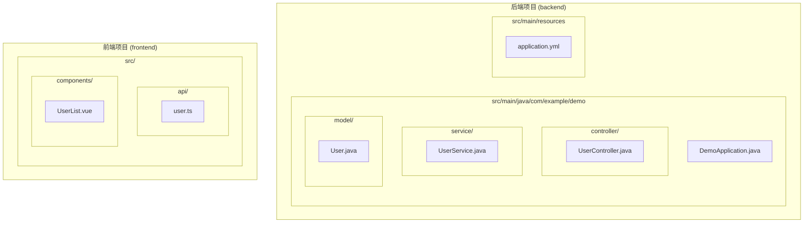

**图表来源**
- [DemoApplication.java:1-13](file://backend/src/main/java/com/example/demo/DemoApplication.java#L1-L13)
- [UserService.java:1-33](file://backend/src/main/java/com/example/demo/service/UserService.java#L1-L33)
- [UserController.java:1-30](file://backend/src/main/java/com/example/demo/controller/UserController.java#L1-L30)
- [User.java:1-41](file://backend/src/main/java/com/example/demo/model/User.java#L1-L41)

**章节来源**
- [README.md:5-30](file://README.md#L5-L30)
- [pom.xml:1-48](file://backend/pom.xml#L1-L48)

## 核心组件

### 应用程序入口点

DemoApplication是Spring Boot应用程序的主入口，负责启动整个应用程序上下文：

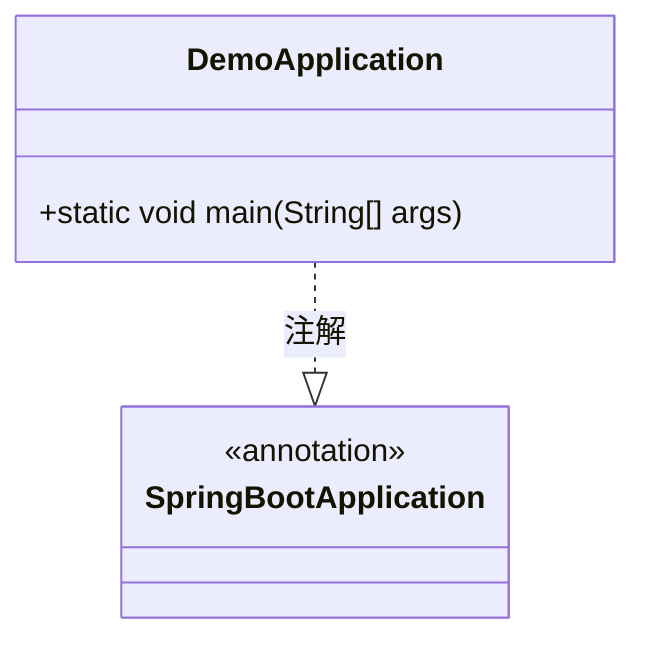

**图表来源**
- [DemoApplication.java:6-12](file://backend/src/main/java/com/example/demo/DemoApplication.java#L6-L12)

### 用户服务层

UserService是业务逻辑层的核心组件，负责用户相关的业务规则和数据处理：

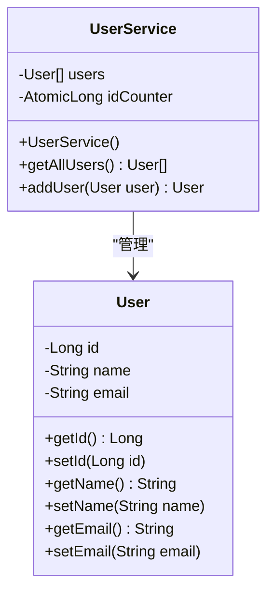

**图表来源**
- [UserService.java:10-32](file://backend/src/main/java/com/example/demo/service/UserService.java#L10-L32)
- [User.java:3-40](file://backend/src/main/java/com/example/demo/model/User.java#L3-L40)

**章节来源**
- [UserService.java:1-33](file://backend/src/main/java/com/example/demo/service/UserService.java#L1-L33)
- [User.java:1-41](file://backend/src/main/java/com/example/demo/model/User.java#L1-L41)

## 架构概览

该系统采用经典的三层架构模式，清晰地分离了关注点：

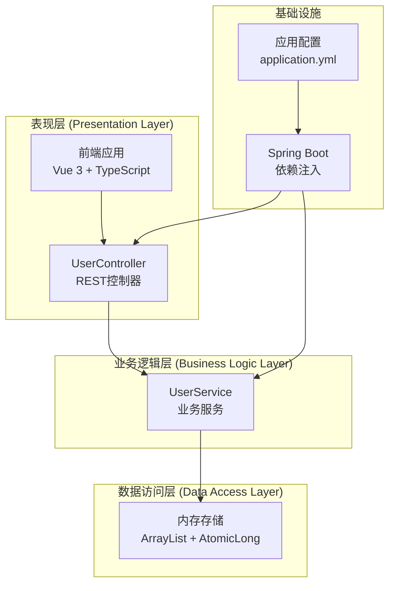

**图表来源**
- [UserController.java:9-18](file://backend/src/main/java/com/example/demo/controller/UserController.java#L9-L18)
- [UserService.java:10-14](file://backend/src/main/java/com/example/demo/service/UserService.java#L10-L14)
- [application.yml:1-13](file://backend/src/main/resources/application.yml#L1-L13)

### 控制器到服务层的交互流程

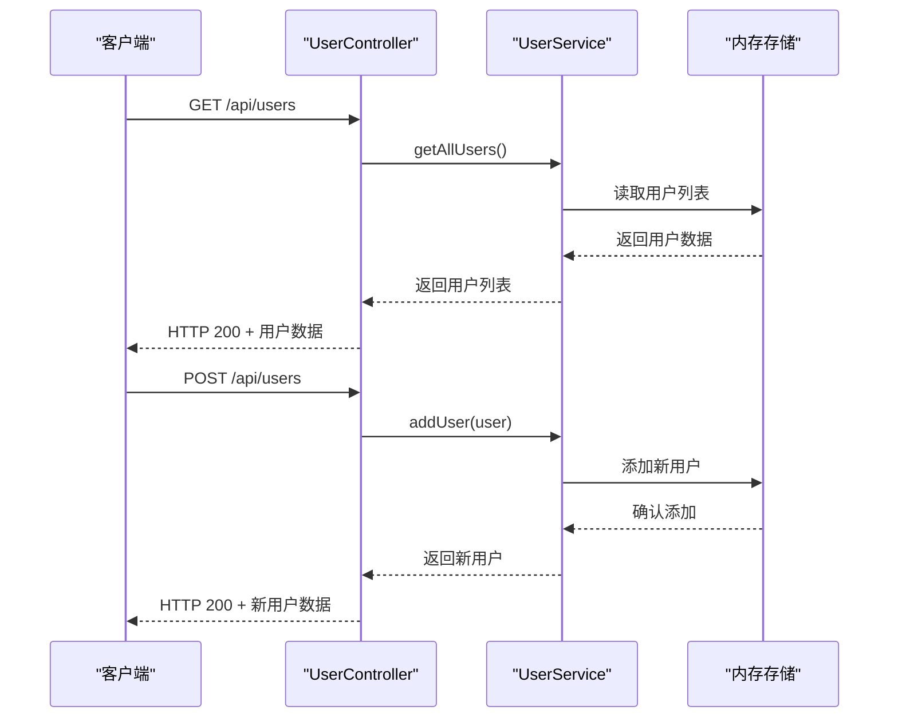

**图表来源**
- [UserController.java:20-28](file://backend/src/main/java/com/example/demo/controller/UserController.java#L20-L28)
- [UserService.java:23-31](file://backend/src/main/java/com/example/demo/service/UserService.java#L23-L31)

## 详细组件分析

### 用户服务实现详解

UserService采用了简单而有效的内存数据存储策略，适合演示和小型应用场景：

#### 内存数据存储设计

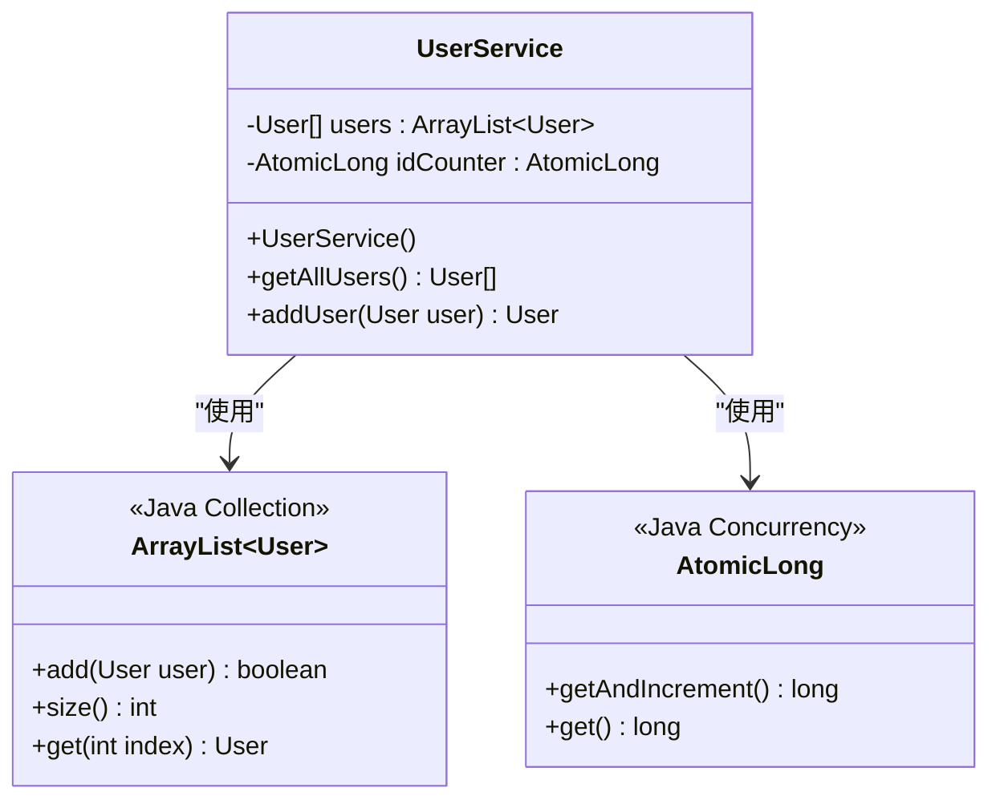

**图表来源**
- [UserService.java:13-14](file://backend/src/main/java/com/example/demo/service/UserService.java#L13-L14)

#### 初始化过程分析

UserService在构造函数中初始化了示例数据，体现了良好的开发实践：

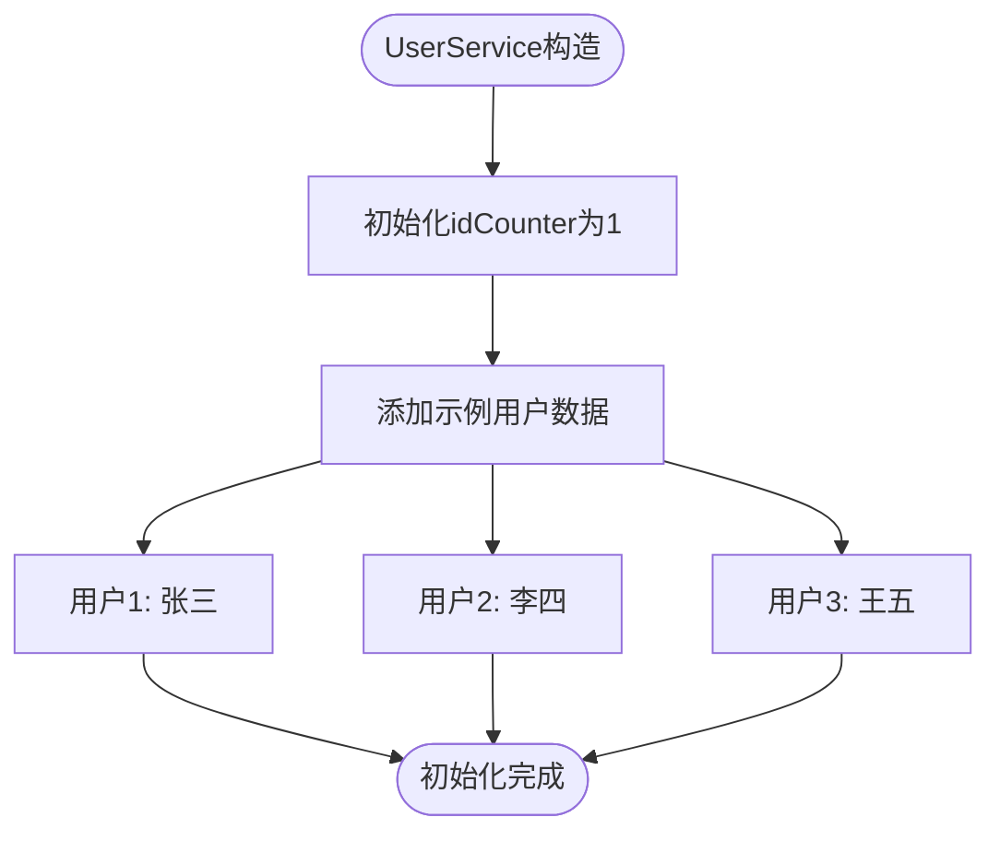

**图表来源**
- [UserService.java:16-21](file://backend/src/main/java/com/example/demo/service/UserService.java#L16-L21)

#### 业务方法实现分析

##### 获取所有用户方法

`getAllUsers()`方法实现了数据的安全返回，避免外部修改内部状态：

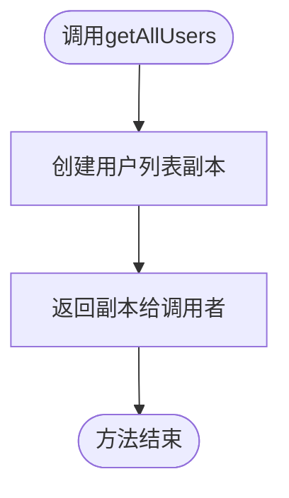

**图表来源**
- [UserService.java:23-25](file://backend/src/main/java/com/example/demo/service/UserService.java#L23-L25)

##### 添加用户方法

`addUser()`方法展示了完整的业务逻辑处理流程：

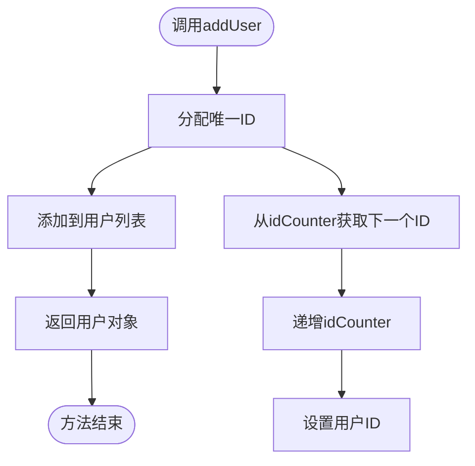

**图表来源**
- [UserService.java:27-31](file://backend/src/main/java/com/example/demo/service/UserService.java#L27-L31)

**章节来源**
- [UserService.java:10-33](file://backend/src/main/java/com/example/demo/service/UserService.java#L10-L33)

### 控制器层集成

UserController作为表现层的入口，展示了依赖注入和REST API设计的最佳实践：

#### 依赖注入机制

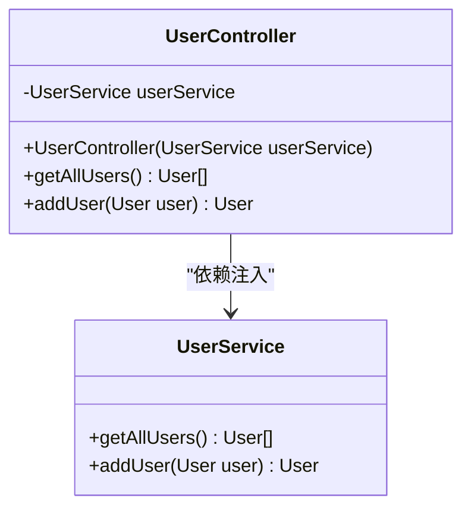

**图表来源**
- [UserController.java:14-18](file://backend/src/main/java/com/example/demo/controller/UserController.java#L14-L18)

#### REST API接口设计

控制器提供了简洁明了的REST接口：

| 方法 | URL | 功能 | 请求体 | 响应 |
|------|-----|------|--------|------|
| GET | `/api/users` | 获取所有用户 | 无 | 用户列表 |
| POST | `/api/users` | 添加新用户 | User对象 | 新用户 |

**章节来源**
- [UserController.java:9-29](file://backend/src/main/java/com/example/demo/controller/UserController.java#L9-L29)

### 数据模型设计

User类采用了简单的POJO设计，符合Java Bean规范：

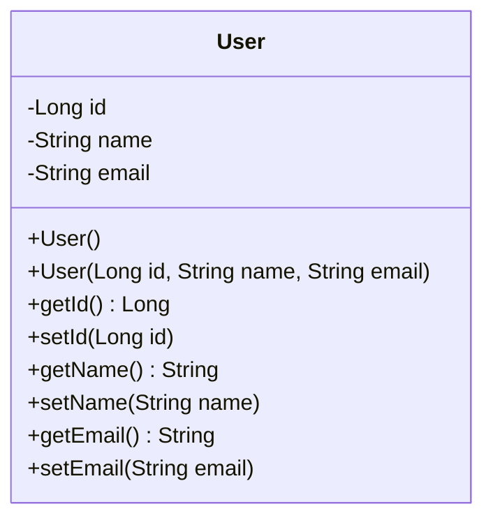

**图表来源**
- [User.java:3-40](file://backend/src/main/java/com/example/demo/model/User.java#L3-L40)

**章节来源**
- [User.java:1-41](file://backend/src/main/java/com/example/demo/model/User.java#L1-L41)

## 依赖分析

### Maven依赖配置

项目使用Maven管理依赖，主要包含Spring Boot Web和测试框架：

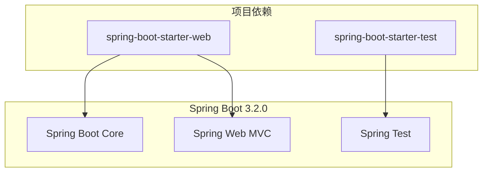

**图表来源**
- [pom.xml:24-36](file://backend/pom.xml#L24-L36)

### 应用配置分析

application.yml提供了基础的应用配置：

| 配置项 | 值 | 说明 |
|--------|----|------|
| server.port | 8080 | 应用监听端口 |
| spring.application.name | demo-backend | 应用名称 |
| logging.level.com.example.demo | DEBUG | 自定义包日志级别 |
| logging.level.org.springframework.web | INFO | Web层日志级别 |

**章节来源**
- [application.yml:1-13](file://backend/src/main/resources/application.yml#L1-L13)
- [pom.xml:1-48](file://backend/pom.xml#L1-L48)

## 性能考虑

### 内存存储的性能特征

当前实现使用ArrayList进行内存存储，具有以下性能特点：

- **时间复杂度**：
  - 获取所有用户：O(n) - 需要复制整个列表
  - 添加用户：O(1) - 列表尾部插入
  - 查找用户：O(n) - 线性搜索

- **空间复杂度**：O(n) - 存储n个用户对象

### 并发安全性

使用AtomicLong确保ID生成的线程安全，但ArrayList本身不是线程安全的。对于高并发场景，建议：

1. 使用线程安全的集合类（如CopyOnWriteArrayList）
2. 添加适当的同步机制
3. 考虑引入数据库持久化层

### 扩展性建议

针对生产环境，建议考虑以下改进：

1. **缓存策略**：实现LRU缓存减少重复查询
2. **分页支持**：实现大数据量的分页查询
3. **索引优化**：为常用查询字段建立索引
4. **连接池**：如果引入数据库，配置连接池参数

## 故障排除指南

### 常见问题及解决方案

#### 1. 跨域问题
- **症状**：前端请求被浏览器阻止
- **原因**：CORS配置不正确
- **解决方案**：检查application.yml中的CORS配置

#### 2. 依赖注入失败
- **症状**：启动时出现Bean创建异常
- **原因**：Service类缺少@Component注解
- **解决方案**：确保UserService类上有@Service注解

#### 3. 数据一致性问题
- **症状**：并发环境下数据异常
- **原因**：ArrayList非线程安全
- **解决方案**：使用线程安全的数据结构或添加同步机制

#### 4. 内存泄漏风险
- **症状**：长时间运行后内存占用持续增长
- **原因**：用户数据无限增长
- **解决方案**：实现数据清理机制或限制最大容量

**章节来源**
- [application.yml:1-13](file://backend/src/main/resources/application.yml#L1-L13)
- [UserService.java:10-32](file://backend/src/main/java/com/example/demo/service/UserService.java#L10-L32)

## 结论

本项目的业务逻辑层设计体现了简洁性和可维护性的平衡。UserService通过内存存储实现了基本的CRUD操作，配合Spring Boot的依赖注入机制，形成了清晰的三层架构。虽然当前实现适合演示目的，但在生产环境中需要考虑并发安全性、性能优化和持久化等关键因素。

### 设计优势

1. **职责清晰**：Service层专注于业务逻辑，Controller层处理HTTP请求
2. **易于测试**：简单的依赖关系便于单元测试
3. **扩展性强**：基于接口的依赖注入支持灵活的替换和扩展
4. **学习友好**：简洁的实现便于理解和学习

### 改进建议

1. **引入数据库**：使用Spring Data JPA实现持久化
2. **增强错误处理**：添加完整的异常处理和验证机制
3. **性能优化**：实现缓存和分页功能
4. **监控集成**：添加应用监控和日志记录
5. **安全加固**：实现身份认证和授权机制

通过遵循这些最佳实践，可以将当前的演示项目升级为生产级别的企业级应用。