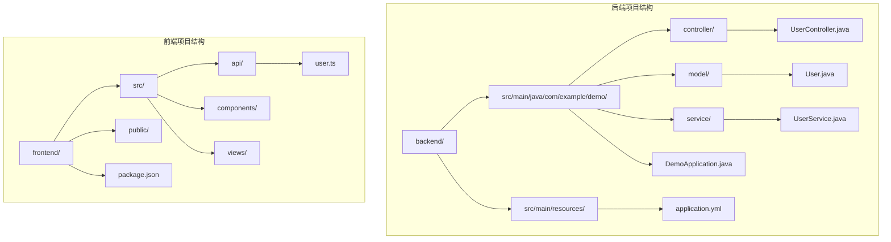
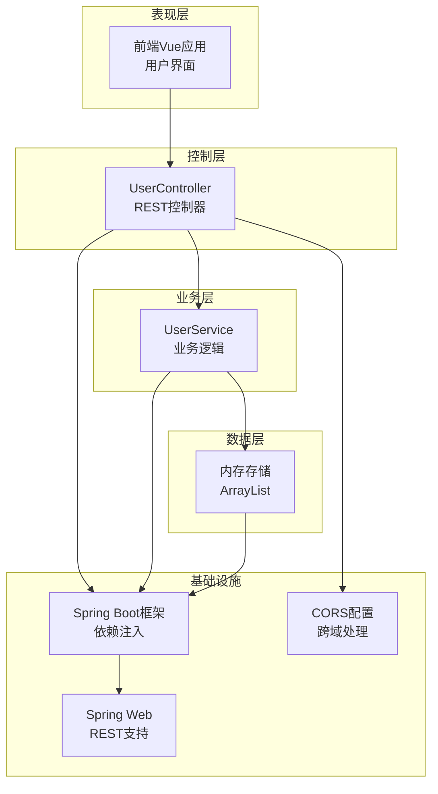
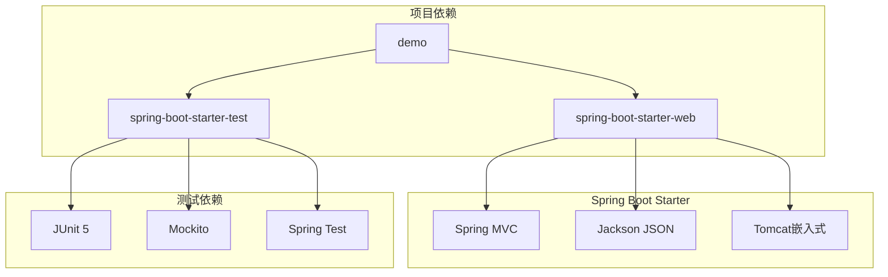

# 后端架构详解

<cite>
**本文档引用的文件**
- [DemoApplication.java](file://backend/src/main/java/com/example/demo/DemoApplication.java)
- [UserController.java](file://backend/src/main/java/com/example/demo/controller/UserController.java)
- [UserService.java](file://backend/src/main/java/com/example/demo/service/UserService.java)
- [User.java](file://backend/src/main/java/com/example/demo/model/User.java)
- [application.yml](file://backend/src/main/resources/application.yml)
- [pom.xml](file://backend/pom.xml)
- [user.ts](file://frontend/src/api/user.ts)
- [README.md](file://README.md)
</cite>

## 目录
1. [简介](#简介)
2. [项目结构](#项目结构)
3. [核心组件](#核心组件)
4. [架构概览](#架构概览)
5. [详细组件分析](#详细组件分析)
6. [依赖分析](#依赖分析)
7. [性能考虑](#性能考虑)
8. [故障排除指南](#故障排除指南)
9. [结论](#结论)
10. [附录](#附录)

## 简介

本项目是一个基于Spring Boot 3.x + Java 21的全栈应用示例，采用前后端分离架构。后端实现了标准的三层架构设计，包括控制器层、服务层和数据模型层，提供了RESTful API接口用于用户管理功能。项目展示了现代Java Web开发的最佳实践，包括依赖注入、自动配置、CORS跨域处理等核心概念。

## 项目结构

项目采用标准的Maven多模块结构，后端主要包含以下核心目录：

**图表来源**
- [DemoApplication.java:1-13](file://backend/src/main/java/com/example/demo/DemoApplication.java#L1-L13)
- [UserController.java:1-30](file://backend/src/main/java/com/example/demo/controller/UserController.java#L1-L30)
- [UserService.java:1-33](file://backend/src/main/java/com/example/demo/service/UserService.java#L1-L33)
- [User.java:1-41](file://backend/src/main/java/com/example/demo/model/User.java#L1-L41)

**章节来源**
- [README.md:5-30](file://README.md#L5-L30)
- [pom.xml:1-48](file://backend/pom.xml#L1-L48)

## 核心组件

### 应用入口类

应用的启动入口通过`@SpringBootApplication`注解实现，该注解组合了多个重要注解，提供了自动配置、组件扫描等功能。

### 数据模型层

用户实体类实现了标准的Java Bean规范，包含完整的getter和setter方法，支持JSON序列化和反序列化。

### 服务层

业务逻辑层负责数据处理和业务规则验证，当前实现包含用户列表管理和添加功能。

### 控制器层

REST控制器提供HTTP接口，处理客户端请求并返回标准化的响应格式。

**章节来源**
- [DemoApplication.java:1-13](file://backend/src/main/java/com/example/demo/DemoApplication.java#L1-L13)
- [User.java:1-41](file://backend/src/main/java/com/example/demo/model/User.java#L1-L41)
- [UserService.java:1-33](file://backend/src/main/java/com/example/demo/service/UserService.java#L1-L33)
- [UserController.java:1-30](file://backend/src/main/java/com/example/demo/controller/UserController.java#L1-L30)

## 架构概览

系统采用经典的三层架构设计，各层职责清晰分离：

**图表来源**
- [DemoApplication.java:1-13](file://backend/src/main/java/com/example/demo/DemoApplication.java#L1-L13)
- [UserController.java:1-30](file://backend/src/main/java/com/example/demo/controller/UserController.java#L1-L30)
- [UserService.java:1-33](file://backend/src/main/java/com/example/demo/service/UserService.java#L1-L33)
- [User.java:1-41](file://backend/src/main/java/com/example/demo/model/User.java#L1-L41)

## 详细组件分析

### 应用启动配置

应用入口类通过`@SpringBootApplication`注解启用自动配置功能，简化了Spring应用的初始化过程。

**章节来源**
- [DemoApplication.java:1-13](file://backend/src/main/java/com/example/demo/DemoApplication.java#L1-L13)

### REST控制器实现

控制器层实现了标准的RESTful API设计：

#### HTTP方法映射
- `GET /api/users` - 获取用户列表
- `POST /api/users` - 创建新用户

#### 跨域配置
控制器使用`@CrossOrigin`注解允许来自前端开发服务器的跨域请求。

#### 依赖注入
通过构造函数注入UserService实例，体现了Spring的依赖注入最佳实践。

**章节来源**
- [UserController.java:1-30](file://backend/src/main/java/com/example/demo/controller/UserController.java#L1-L30)

### 服务层实现

服务层包含完整的业务逻辑：

#### 数据管理
- 内存中的用户列表存储
- 自增ID生成机制
- 示例数据初始化

#### 业务操作
- 用户列表查询
- 新用户添加和ID分配

**章节来源**
- [UserService.java:1-33](file://backend/src/main/java/com/example/demo/service/UserService.java#L1-L33)

### 数据模型设计

用户实体类遵循Java Bean规范：

#### 属性定义
- `id`: 用户唯一标识符
- `name`: 用户姓名
- `email`: 用户邮箱地址

#### 构造函数
- 无参构造函数用于框架序列化
- 参数化构造函数用于数据初始化

#### 访问器方法
- 完整的getter和setter方法
- 支持对象属性的读写操作

**章节来源**
- [User.java:1-41](file://backend/src/main/java/com/example/demo/model/User.java#L1-L41)

### 配置管理

应用配置文件定义了核心设置：

#### 服务器配置
- 端口设置为8080
- 应用名称配置

#### 日志配置
- 后端包的日志级别设置为DEBUG
- Spring Web框架的日志级别设置为INFO

**章节来源**
- [application.yml:1-13](file://backend/src/main/resources/application.yml#L1-L13)

## 依赖分析

项目使用Maven进行依赖管理，核心依赖包括：

**图表来源**
- [pom.xml:24-37](file://backend/pom.xml#L24-L37)

### 依赖关系分析

项目采用Spring Boot的约定优于配置原则，通过starter依赖简化了配置复杂度：

- **spring-boot-starter-web**: 提供Web开发所需的所有依赖
- **spring-boot-starter-test**: 包含测试框架和工具
- **Java 21**: 使用最新的Java版本特性

**章节来源**
- [pom.xml:1-48](file://backend/pom.xml#L1-L48)

## 性能考虑

### 内存存储优化
- 使用ArrayList提供高效的随机访问
- AtomicLong确保线程安全的ID生成
- 建议在生产环境中替换为持久化存储

### 并发处理
- 当前实现未使用同步机制
- 多线程环境下可能需要额外的并发控制

### 缓存策略
- 可考虑添加内存缓存减少重复计算
- 对于大数据集建议实现分页查询

## 故障排除指南

### 常见问题及解决方案

#### 端口冲突
**问题**: 端口8080已被占用
**解决方案**: 修改application.yml中的server.port配置

#### 跨域问题
**问题**: 前端无法访问后端API
**解决方案**: 检查@CrossOrigin注解的origin配置

#### 依赖缺失
**问题**: 应用启动失败
**解决方案**: 确保所有Maven依赖正确下载

#### 类型转换错误
**问题**: JSON序列化/反序列化失败
**解决方案**: 检查实体类的getter/setter方法完整性

**章节来源**
- [application.yml:1-13](file://backend/src/main/resources/application.yml#L1-L13)
- [UserController.java:11-11](file://backend/src/main/java/com/example/demo/controller/UserController.java#L11-L11)

## 结论

本项目成功展示了Spring Boot在实际开发中的应用，通过标准的三层架构实现了清晰的职责分离。项目结构简洁明了，代码质量良好，为后续的功能扩展奠定了坚实基础。

### 主要优势
- 清晰的架构层次和职责分工
- 标准化的RESTful API设计
- 完善的依赖注入和自动配置
- 良好的可维护性和扩展性

### 改进建议
- 实现持久化存储替代内存存储
- 添加输入验证和错误处理机制
- 集成数据库连接池和事务管理
- 实现完整的CRUD操作
- 添加单元测试和集成测试

## 附录

### API接口规范

#### 用户管理API

| 方法 | 路径 | 描述 | 请求体 | 响应 |
|------|------|------|--------|------|
| GET | `/api/users` | 获取用户列表 | 无 | 用户数组 |
| POST | `/api/users` | 创建新用户 | User对象 | User对象 |

#### 响应格式
所有API响应采用JSON格式，遵循RESTful设计原则。

### 开发环境配置

#### 后端启动步骤
1. 确保Java 21和Maven已安装
2. 在backend目录执行`mvn spring-boot:run`
3. 应用将在http://localhost:8080启动

#### 前端交互
前端通过Axios库与后端API通信，配置了正确的baseURL和超时设置。

**章节来源**
- [README.md:34-90](file://README.md#L34-L90)
- [user.ts:1-26](file://frontend/src/api/user.ts#L1-L26)