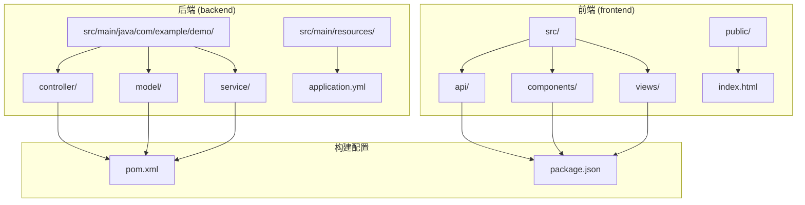
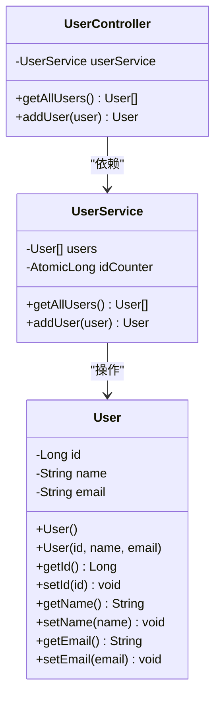
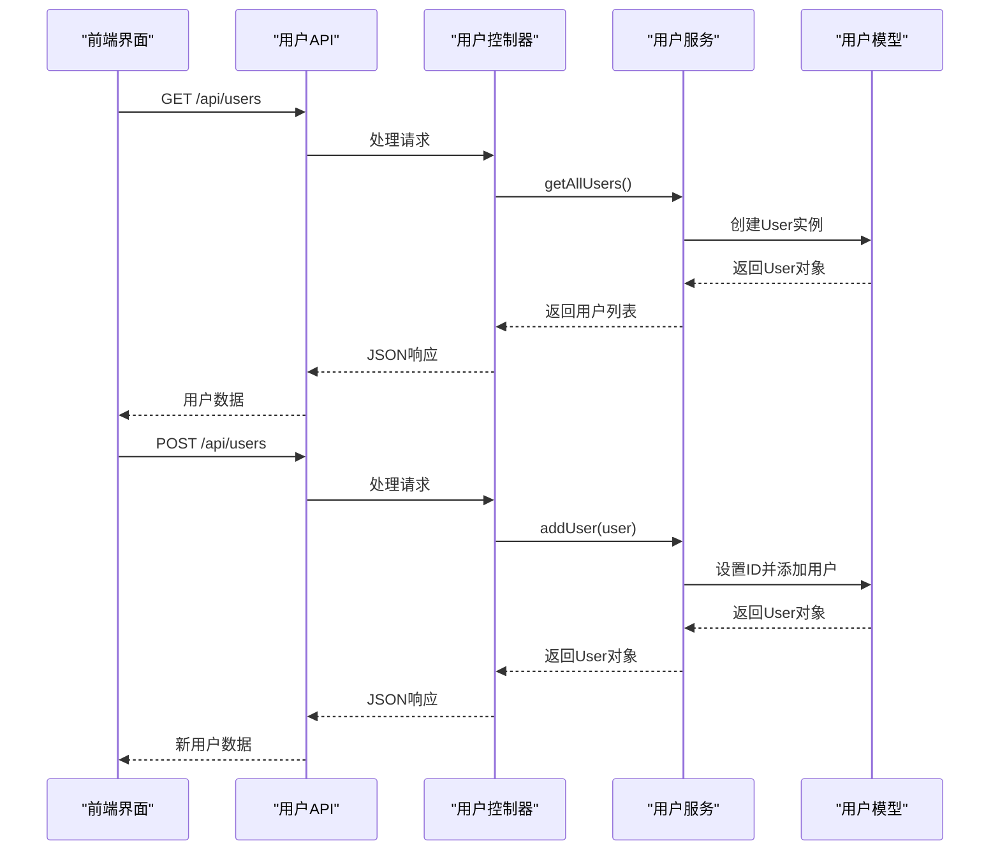
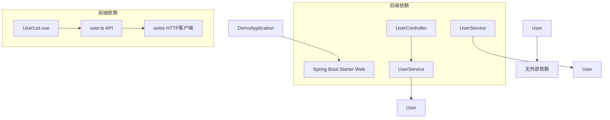

# 数据模型设计

<cite>
**本文档引用的文件**
- [User.java](file://backend/src/main/java/com/example/demo/model/User.java)
- [UserController.java](file://backend/src/main/java/com/example/demo/controller/UserController.java)
- [UserService.java](file://backend/src/main/java/com/example/demo/service/UserService.java)
- [DemoApplication.java](file://backend/src/main/java/com/example/demo/DemoApplication.java)
- [user.ts](file://frontend/src/api/user.ts)
- [UserList.vue](file://frontend/src/views/UserList.vue)
- [pom.xml](file://backend/pom.xml)
- [application.yml](file://backend/src/main/resources/application.yml)
- [README.md](file://README.md)
</cite>

## 目录
1. [简介](#简介)
2. [项目结构](#项目结构)
3. [核心组件](#核心组件)
4. [架构概览](#架构概览)
5. [详细组件分析](#详细组件分析)
6. [依赖分析](#依赖分析)
7. [性能考虑](#性能考虑)
8. [故障排除指南](#故障排除指南)
9. [结论](#结论)

## 简介

本项目是一个基于Spring Boot 3.x + Vue 3的全栈应用程序示例，专注于演示数据模型设计的最佳实践。本文档深入分析User实体类的设计和实现，包括字段定义、Getter/Setter方法和数据类型选择，同时探讨模型类在Spring MVC框架中的作用和序列化支持。

该项目采用前后端分离架构，后端使用Spring Boot提供RESTful API服务，前端使用Vue 3配合TypeScript实现用户界面。通过User实体类的设计，我们可以学习到现代Java应用程序中数据模型的标准实现方式。

## 项目结构

整个项目采用标准的Maven多模块结构，主要包含以下关键目录：

**图表来源**
- [pom.xml:1-48](file://backend/pom.xml#L1-L48)
- [README.md:5-30](file://README.md#L5-L30)

项目的核心架构遵循分层设计原则：
- **Model层**：负责数据表示和业务实体定义
- **Service层**：实现业务逻辑和数据处理
- **Controller层**：处理HTTP请求和响应
- **API层**：前端与后端的数据交互接口

**章节来源**
- [README.md:5-30](file://README.md#L5-L30)
- [pom.xml:1-48](file://backend/pom.xml#L1-L48)

## 核心组件

### User实体类设计

User实体类是整个应用程序的核心数据模型，采用标准的Java Bean模式设计：

**图表来源**
- [User.java:1-41](file://backend/src/main/java/com/example/demo/model/User.java#L1-L41)
- [UserController.java:1-30](file://backend/src/main/java/com/example/demo/controller/UserController.java#L1-L30)
- [UserService.java:1-33](file://backend/src/main/java/com/example/demo/service/UserService.java#L1-L33)

### 字段定义分析

User实体类包含三个核心字段，每个字段都经过精心设计以满足不同的业务需求：

| 字段名 | 数据类型 | 可空性 | 描述 | 设计考虑 |
|--------|----------|--------|------|----------|
| id | Long | 可空 | 用户唯一标识符 | 使用Long类型支持大数据量，初始值可为空用于新记录创建 |
| name | String | 必填 | 用户姓名 | 简单字符串类型，支持中文字符 |
| email | String | 必填 | 用户邮箱地址 | 支持标准邮箱格式验证 |

**章节来源**
- [User.java:4-6](file://backend/src/main/java/com/example/demo/model/User.java#L4-L6)

### Getter/Setter方法设计

每个字段都提供了标准的Getter和Setter方法，遵循Java Bean规范：

- **构造函数**：提供无参构造函数和带参数构造函数，支持对象初始化
- **访问器方法**：提供完整的属性访问接口
- **方法命名**：严格遵循getter/setter命名约定

**章节来源**
- [User.java:8-39](file://backend/src/main/java/com/example/demo/model/User.java#L8-L39)

## 架构概览

整个应用程序采用经典的三层架构模式，数据流从用户界面流向后端服务：

**图表来源**
- [UserController.java:20-28](file://backend/src/main/java/com/example/demo/controller/UserController.java#L20-L28)
- [UserService.java:23-31](file://backend/src/main/java/com/example/demo/service/UserService.java#L23-L31)
- [User.java:11-15](file://backend/src/main/java/com/example/demo/model/User.java#L11-L15)

**章节来源**
- [UserController.java:1-30](file://backend/src/main/java/com/example/demo/controller/UserController.java#L1-L30)
- [UserService.java:1-33](file://backend/src/main/java/com/example/demo/service/UserService.java#L1-L33)

## 详细组件分析

### 模型类在Spring MVC中的作用

User实体类在Spring MVC框架中扮演着重要的数据传输对象角色：

#### 序列化支持

Spring Boot默认集成了Jackson JSON处理器，能够自动处理对象的序列化和反序列化：

- **JSON序列化**：User对象可以自动转换为JSON格式
- **JSON反序列化**：接收的JSON数据可以自动映射到User对象
- **类型安全**：保持数据类型的完整性

#### 数据绑定机制

Spring MVC通过以下机制实现数据绑定：

1. **路径变量绑定**：从URL路径提取参数
2. **查询参数绑定**：从查询字符串提取参数
3. **请求体绑定**：从HTTP请求体解析JSON数据

**章节来源**
- [UserController.java:25-28](file://backend/src/main/java/com/example/demo/controller/UserController.java#L25-L28)

### 数据验证规则和约束条件

当前实现采用了简单的数据验证策略：

#### 前端验证

前端使用Element Plus组件进行基础验证：

- **必填字段检查**：确保姓名和邮箱字段不为空
- **实时反馈**：提供即时的用户输入验证反馈
- **视觉提示**：使用警告消息和表单样式

#### 后端验证

后端服务层提供了基本的业务逻辑验证：

- **ID生成**：自动生成唯一的用户ID
- **数据持久化**：将用户数据存储在内存列表中
- **线程安全**：使用AtomicLong确保ID生成的原子性

**章节来源**
- [UserList.vue:67-82](file://frontend/src/views/UserList.vue#L67-L82)
- [UserService.java:27-31](file://backend/src/main/java/com/example/demo/service/UserService.java#L27-L31)

### 模型扩展指导

#### 添加新字段

要向User实体类添加新字段，需要遵循以下步骤：

1. **添加字段声明**：在User类中添加新的私有字段
2. **生成Getter/Setter**：为新字段生成访问器方法
3. **更新构造函数**：修改构造函数以支持新字段
4. **更新序列化配置**：如需特殊处理，配置Jackson注解

#### 实现接口

User实体类可以实现各种接口以增强功能：

- **Comparable接口**：实现用户排序功能
- **Serializable接口**：支持对象序列化
- **Validation接口**：集成Bean Validation框架

#### 处理复杂数据类型

对于复杂的数据类型，建议采用以下策略：

- **嵌套对象**：使用组合模式处理关联数据
- **集合类型**：使用泛型集合支持多值数据
- **枚举类型**：使用枚举定义有限状态集合

**章节来源**
- [User.java:1-41](file://backend/src/main/java/com/example/demo/model/User.java#L1-L41)

### 应用架构中的位置和作用

User实体类在整个应用架构中发挥着关键作用：

#### 数据层职责

- **数据表示**：提供标准化的数据结构
- **业务实体**：封装用户相关的业务数据
- **类型安全**：确保数据类型的正确性

#### 服务层集成

- **数据传输**：作为服务层间的数据载体
- **业务逻辑**：承载业务规则和约束
- **持久化支持**：为数据库操作提供数据模型

#### 表现层映射

- **API响应**：作为REST API的响应数据
- **前端绑定**：为Vue组件提供数据源
- **类型安全**：确保前后端数据格式一致

**章节来源**
- [DemoApplication.java:1-13](file://backend/src/main/java/com/example/demo/DemoApplication.java#L1-L13)
- [user.ts:11-15](file://frontend/src/api/user.ts#L11-L15)

## 依赖分析

项目依赖关系清晰明确，遵循单一职责原则：

**图表来源**
- [pom.xml:24-36](file://backend/pom.xml#L24-L36)
- [UserController.java:3-4](file://backend/src/main/java/com/example/demo/controller/UserController.java#L3-L4)
- [UserService.java:3-4](file://backend/src/main/java/com/example/demo/service/UserService.java#L3-L4)

**章节来源**
- [pom.xml:24-36](file://backend/pom.xml#L24-L36)

## 性能考虑

### 内存管理

当前实现使用内存存储用户数据，具有以下特点：

- **快速访问**：内存存储提供最快的读写性能
- **简单实现**：无需数据库连接和配置
- **数据丢失风险**：进程重启后数据会丢失

### 扩展性建议

为了提高系统的可扩展性，建议考虑以下改进：

- **数据库集成**：使用Spring Data JPA或MyBatis进行持久化
- **缓存层**：集成Redis等缓存系统
- **分页支持**：实现大数据量的分页查询
- **索引优化**：为常用查询字段建立索引

## 故障排除指南

### 常见问题及解决方案

#### CORS跨域问题

**问题描述**：前端无法访问后端API，出现跨域错误

**解决方案**：
1. 检查application.yml中的CORS配置
2. 确认前端请求的域名和端口
3. 验证@CrossOrigin注解的配置

#### 数据类型不匹配

**问题描述**：JSON数据无法正确映射到User对象

**解决方案**：
1. 检查字段名称是否与JSON键名匹配
2. 确认数据类型是否兼容
3. 添加必要的Jackson注解

#### 端口冲突

**问题描述**：应用启动时端口被占用

**解决方案**：
1. 修改application.yml中的server.port
2. 检查是否有其他进程占用端口
3. 使用netstat命令排查端口使用情况

**章节来源**
- [application.yml:1-13](file://backend/src/main/resources/application.yml#L1-L13)
- [README.md:114-119](file://README.md#L114-L119)

## 结论

本项目展示了现代Java应用程序中数据模型设计的最佳实践。User实体类采用简洁而有效的设计，体现了以下关键原则：

### 设计优势

1. **简洁性**：字段数量适中，满足基本业务需求
2. **类型安全**：使用强类型语言确保数据完整性
3. **可扩展性**：设计灵活，易于添加新功能
4. **前后端一致性**：前后端数据模型保持同步

### 改进建议

1. **添加数据验证**：集成Bean Validation框架
2. **实现持久化**：添加数据库支持
3. **增强安全性**：添加密码加密和权限控制
4. **完善日志**：添加详细的操作日志

### 学习价值

通过分析这个User实体类的设计，开发者可以学习到：
- 标准的Java Bean设计模式
- Spring MVC框架中的数据绑定机制
- 前后端数据交互的最佳实践
- 现代Web应用的架构设计原则

这个项目为理解企业级应用程序的数据模型设计提供了良好的参考案例，展示了从简单到复杂的演进路径。