# Maven构建配置

<cite>
**本文档引用的文件**
- [backend/pom.xml](file://backend/pom.xml)
- [backend/src/main/resources/application.yml](file://backend/src/main/resources/application.yml)
- [frontend/package.json](file://frontend/package.json)
- [frontend/vite.config.ts](file://frontend/vite.config.ts)
- [frontend/tsconfig.json](file://frontend/tsconfig.json)
- [frontend/tsconfig.node.json](file://frontend/tsconfig.node.json)
- [README.md](file://README.md)
</cite>

## 目录
1. [简介](#简介)
2. [项目结构](#项目结构)
3. [核心组件](#核心组件)
4. [架构概览](#架构概览)
5. [详细组件分析](#详细组件分析)
6. [依赖关系分析](#依赖关系分析)
7. [性能考虑](#性能考虑)
8. [故障排除指南](#故障排除指南)
9. [结论](#结论)
10. [附录](#附录)

## 简介

本项目是一个基于Spring Boot 3.2.0和Java 21的全栈应用示例，采用前后端分离架构。后端使用Spring Boot构建，前端使用Vue 3 + TypeScript + Vite技术栈。本文档专注于后端的Maven构建配置，深入解析pom.xml文件的结构和各个配置元素的作用，包括项目元数据、依赖管理、插件配置等，并提供Spring Boot依赖的引入方式和版本管理策略的详细说明。

## 项目结构

该项目采用模块化组织结构，主要包含以下关键目录：

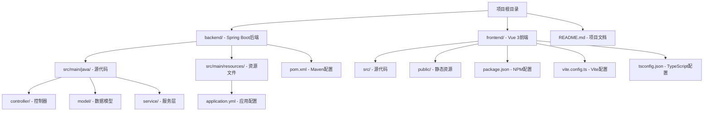

**图表来源**
- [backend/pom.xml:1-48](file://backend/pom.xml#L1-L48)
- [frontend/package.json:1-24](file://frontend/package.json#L1-L24)

**章节来源**
- [README.md:1-30](file://README.md#L1-L30)
- [backend/pom.xml:1-48](file://backend/pom.xml#L1-L48)
- [frontend/package.json:1-24](file://frontend/package.json#L1-L24)

## 核心组件

### Maven项目配置核心要素

基于分析的pom.xml文件，该项目的核心配置要素如下：

#### 项目元数据配置
- **父POM继承**: 通过继承`spring-boot-starter-parent`获得Spring Boot的默认配置
- **坐标信息**: groupId、artifactId、version定义了项目的唯一标识
- **项目属性**: 设置Java版本为21，确保与Spring Boot 3.2.0兼容

#### 依赖管理策略
- **Web框架依赖**: 引入`spring-boot-starter-web`作为核心Web框架
- **测试框架依赖**: 包含`spring-boot-starter-test`用于单元测试和集成测试
- **作用域管理**: 测试依赖正确标记为test范围，避免打包到生产环境中

#### 构建插件配置
- **Spring Boot Maven插件**: 自动配置Spring Boot应用的打包和运行能力
- **插件继承**: 通过父POM获得Spring Boot的默认插件配置

**章节来源**
- [backend/pom.xml:5-48](file://backend/pom.xml#L5-L48)

## 架构概览

项目采用分层架构设计，Maven配置支持完整的构建生命周期：

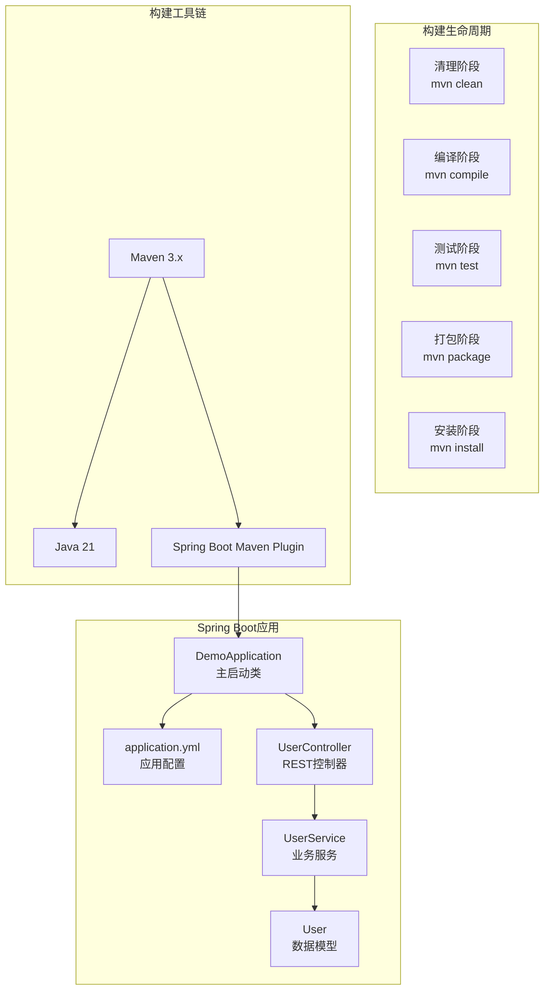

**图表来源**
- [backend/pom.xml:39-46](file://backend/pom.xml#L39-L46)
- [backend/src/main/resources/application.yml:1-13](file://backend/src/main/resources/application.yml#L1-L13)

## 详细组件分析

### Maven POM文件结构深度解析

#### 1. 项目基础配置

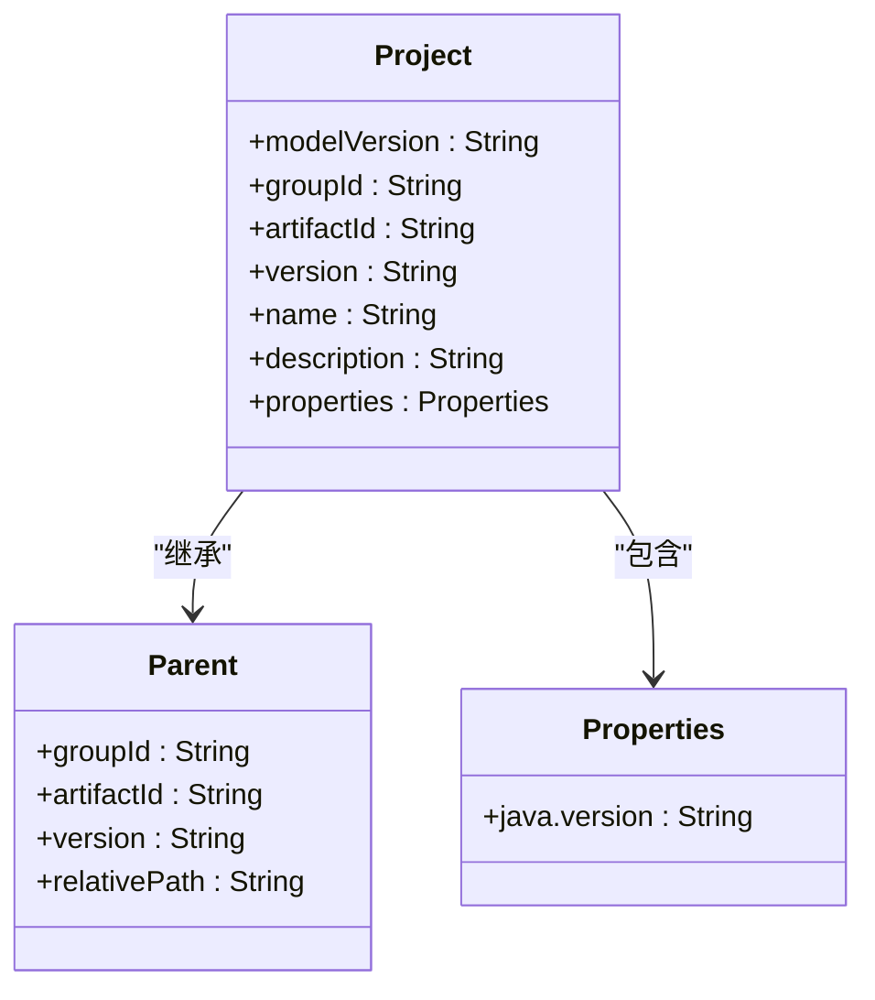

**图表来源**
- [backend/pom.xml:2-22](file://backend/pom.xml#L2-L22)

#### 2. 依赖管理系统

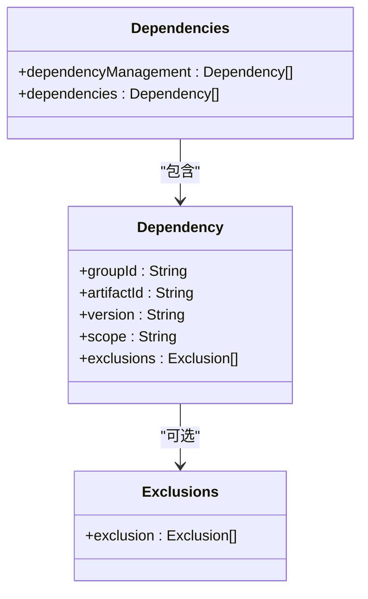

**图表来源**
- [backend/pom.xml:24-37](file://backend/pom.xml#L24-L37)

#### 3. 构建插件配置

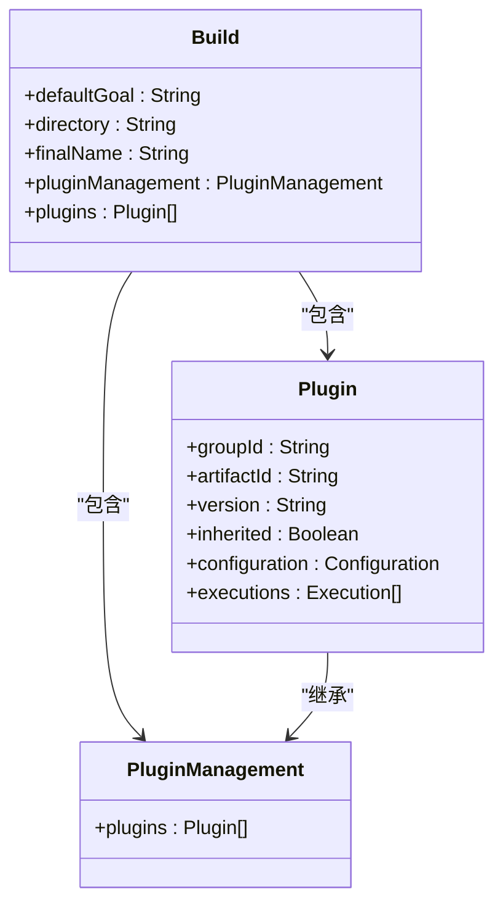

**图表来源**
- [backend/pom.xml:39-46](file://backend/pom.xml#L39-L46)

### Spring Boot依赖管理策略

#### 版本管理机制

Spring Boot通过其starter parent提供统一的版本管理策略：

1. **BOM（Bill of Materials）机制**: 通过`spring-boot-dependencies`管理所有Spring生态系统的版本
2. **传递性依赖**: starter依赖自动引入相关组件，如web starter包含tomcat、Jackson等
3. **版本锁定**: 避免版本冲突，确保组件间的兼容性

#### 依赖引入最佳实践

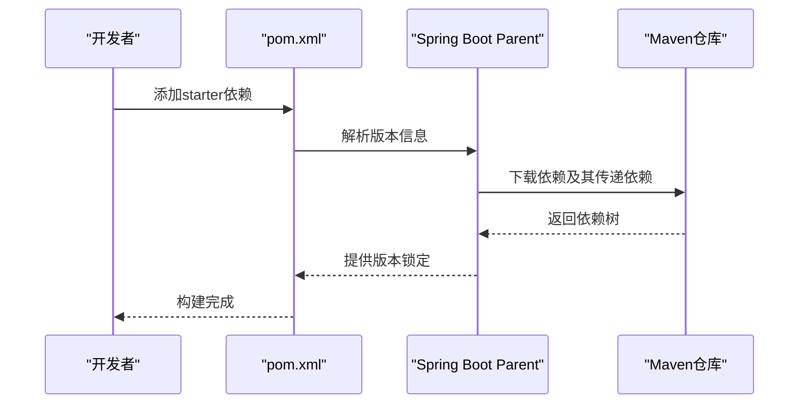

**图表来源**
- [backend/pom.xml:24-37](file://backend/pom.xml#L24-L37)

**章节来源**
- [backend/pom.xml:7-12](file://backend/pom.xml#L7-L12)
- [backend/pom.xml:24-37](file://backend/pom.xml#L24-L37)

### 构建生命周期详解

#### Maven标准生命周期阶段

| 阶段 | 目标 | 描述 |
|------|------|------|
| **clean** | pre-clean, clean, post-clean | 清理构建产物 |
| **compile** | validate, compile, process-classes | 编译源代码 |
| **test** | test-compile, test | 执行单元测试 |
| **package** | package | 打包项目 |
| **install** | install | 安装到本地仓库 |
| **deploy** | deploy | 部署到远程仓库 |

#### Spring Boot特定生命周期

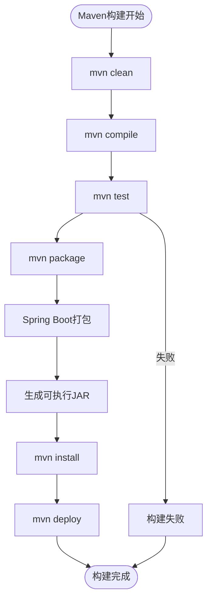

**图表来源**
- [backend/pom.xml:39-46](file://backend/pom.xml#L39-L46)

**章节来源**
- [backend/pom.xml:39-46](file://backend/pom.xml#L39-L46)

### 打包配置与部署设置

#### 可执行JAR配置

Spring Boot Maven插件提供了完整的打包配置：

1. **自动配置**: 无需额外配置即可生成可执行JAR
2. **依赖收集**: 自动包含所有必需的依赖
3. **入口点**: 设置正确的Main-Class和Class-Path

#### 部署策略

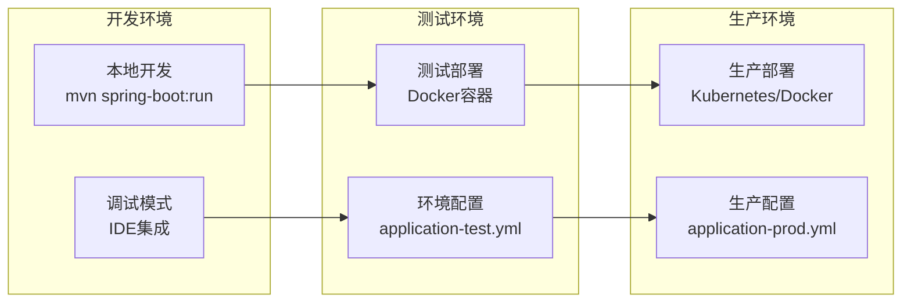

**图表来源**
- [backend/src/main/resources/application.yml:1-13](file://backend/src/main/resources/application.yml#L1-L13)
- [backend/pom.xml:40-44](file://backend/pom.xml#L40-L44)

**章节来源**
- [backend/pom.xml:40-44](file://backend/pom.xml#L40-L44)
- [backend/src/main/resources/application.yml:1-13](file://backend/src/main/resources/application.yml#L1-L13)

## 依赖关系分析

### 依赖传递与冲突解决

#### 依赖树分析

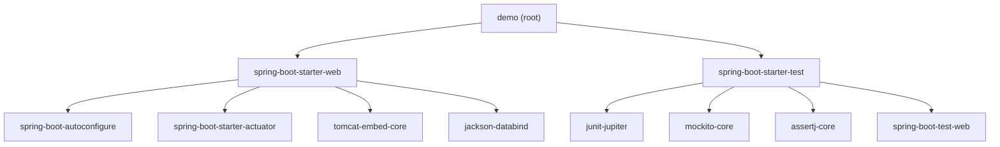

**图表来源**
- [backend/pom.xml:24-37](file://backend/pom.xml#L24-L37)

#### 冲突解决策略

1. **版本优先级**: 显式声明的版本优先于传递性依赖
2. **范围隔离**: 测试范围的依赖不会影响生产环境
3. **排除传递依赖**: 使用exclusions排除不需要的传递依赖

### 多环境配置管理

#### 环境配置文件

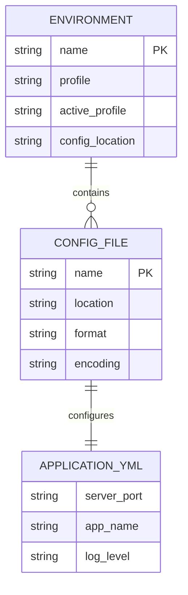

**图表来源**
- [backend/src/main/resources/application.yml:1-13](file://backend/src/main/resources/application.yml#L1-L13)

**章节来源**
- [backend/src/main/resources/application.yml:1-13](file://backend/src/main/resources/application.yml#L1-L13)

## 性能考虑

### 构建优化技巧

#### 并行构建
- 使用`-T`参数启用并行编译
- 利用多核CPU提升构建速度

#### 依赖优化
- 合理使用依赖范围，避免不必要的依赖
- 定期更新依赖版本，利用性能改进

#### 缓存策略
- Maven本地仓库缓存
- CI/CD流水线中的构建缓存

### 前端构建集成

虽然前端使用Vite进行构建，但与Maven的集成提供了完整的全栈开发体验：

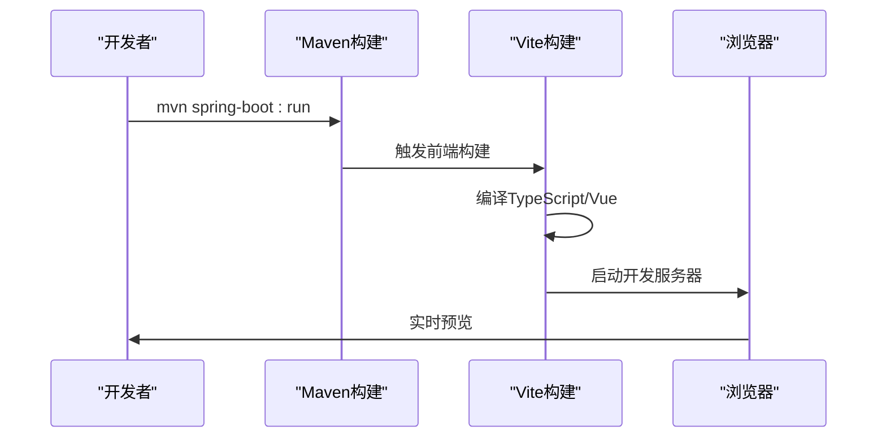

**图表来源**
- [frontend/vite.config.ts:13-21](file://frontend/vite.config.ts#L13-L21)

**章节来源**
- [frontend/vite.config.ts:13-21](file://frontend/vite.config.ts#L13-L21)

## 故障排除指南

### 常见问题及解决方案

#### Java版本不兼容
- **问题**: Java版本过低导致构建失败
- **解决方案**: 确保使用Java 21或更高版本

#### 依赖冲突
- **问题**: 不同依赖引入相同库的不同版本
- **解决方案**: 使用`mvn dependency:tree`分析依赖树，必要时使用exclusions排除冲突

#### 端口占用
- **问题**: 8080端口被其他进程占用
- **解决方案**: 修改application.yml中的server.port配置

#### 构建超时
- **问题**: 依赖下载缓慢
- **解决方案**: 配置Maven镜像源，使用本地代理

### 调试技巧

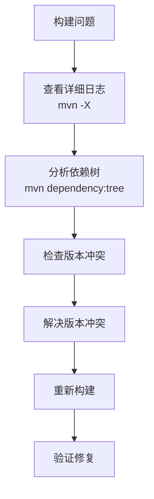

**图表来源**
- [backend/pom.xml:20-22](file://backend/pom.xml#L20-L22)

**章节来源**
- [backend/pom.xml:20-22](file://backend/pom.xml#L20-L22)

## 结论

本项目的Maven配置展现了现代Spring Boot应用的最佳实践：

1. **简洁高效的配置**: 通过继承spring-boot-starter-parent简化了大量配置工作
2. **明确的依赖管理**: 清晰的依赖声明和作用域划分
3. **自动化的构建流程**: Spring Boot Maven插件提供了完整的构建和打包能力
4. **良好的扩展性**: 为后续的功能扩展预留了充足的空间

该配置为类似的企业级应用提供了可靠的构建基础，既保证了开发效率，又确保了生产环境的稳定性。

## 附录

### 最佳实践建议

#### 依赖管理最佳实践
- 优先使用Spring Boot Starter依赖
- 定期审查和更新依赖版本
- 明确依赖的作用域划分
- 使用exclusions处理不必要的传递依赖

#### 构建优化建议
- 配置合适的内存参数
- 启用增量编译
- 使用并行构建
- 优化依赖下载策略

#### CI/CD集成建议
- 在CI中缓存Maven本地仓库
- 使用多阶段构建减少镜像大小
- 配置自动化测试流程
- 建立版本发布策略