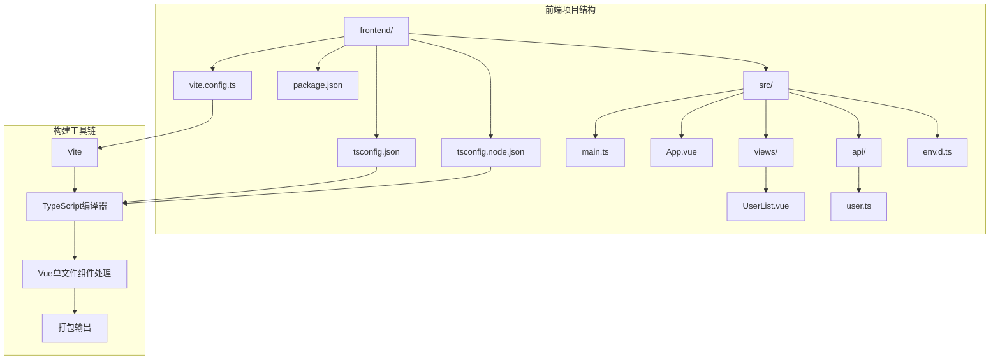
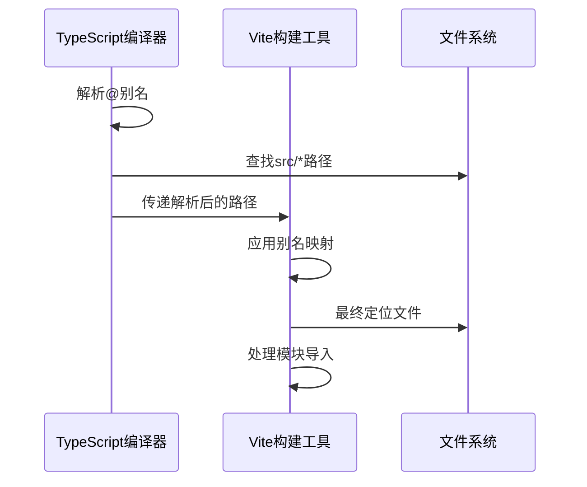
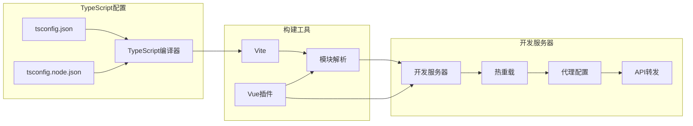

# TypeScript编译配置

<cite>
**本文档引用的文件**
- [frontend/tsconfig.json](file://frontend/tsconfig.json)
- [frontend/tsconfig.node.json](file://frontend/tsconfig.node.json)
- [frontend/package.json](file://frontend/package.json)
- [frontend/vite.config.ts](file://frontend/vite.config.ts)
- [frontend/src/main.ts](file://frontend/src/main.ts)
- [frontend/src/env.d.ts](file://frontend/src/env.d.ts)
- [frontend/src/App.vue](file://frontend/src/App.vue)
- [frontend/src/views/UserList.vue](file://frontend/src/views/UserList.vue)
- [frontend/src/api/user.ts](file://frontend/src/api/user.ts)
- [README.md](file://README.md)
</cite>

## 目录
1. [简介](#简介)
2. [项目结构](#项目结构)
3. [核心组件](#核心组件)
4. [架构概览](#架构概览)
5. [详细组件分析](#详细组件分析)
6. [依赖关系分析](#依赖关系分析)
7. [性能考虑](#性能考虑)
8. [故障排除指南](#故障排除指南)
9. [结论](#结论)

## 简介

本项目是一个基于Vue 3 + TypeScript + Vite的现代化前端应用，采用TypeScript进行类型安全编程。本文档深入解析项目的TypeScript编译配置，包括`tsconfig.json`和`tsconfig.node.json`的配置选项、编译设置、严格模式、ESLint集成以及代码质量检查配置。同时提供类型声明文件管理、第三方库类型定义和自定义类型扩展的实践指导，并对比开发环境和生产环境的不同编译配置策略。

## 项目结构

该项目采用前后端分离架构，前端使用Vite作为构建工具，TypeScript作为主要编程语言。项目的核心配置文件位于前端目录中，通过TypeScript配置文件实现完整的类型检查和编译控制。



**图表来源**
- [frontend/tsconfig.json:1-32](file://frontend/tsconfig.json#L1-L32)
- [frontend/tsconfig.node.json:1-11](file://frontend/tsconfig.node.json#L1-L11)
- [frontend/vite.config.ts:1-23](file://frontend/vite.config.ts#L1-L23)

**章节来源**
- [README.md:1-119](file://README.md#L1-L119)
- [frontend/package.json:1-24](file://frontend/package.json#L1-L24)

## 核心组件

### TypeScript编译配置文件

项目包含两个主要的TypeScript配置文件，分别针对不同的编译场景：

1. **主配置文件** (`tsconfig.json`): 面向应用程序的完整编译配置
2. **节点配置文件** (`tsconfig.node.json`): 面向构建工具和配置文件的编译配置

### 编译目标和模块系统

项目采用现代JavaScript标准和模块系统：
- **目标版本**: ES2020，支持最新的JavaScript特性
- **模块系统**: ESNext，与Vite的原生模块支持相匹配
- **库支持**: 包含ES2020、DOM和DOM.Iterable接口

### 路径映射和别名配置

项目实现了灵活的路径映射机制：
- **基础路径**: `.` (当前目录)
- **路径别名**: `@/*` 指向 `src/*`
- **构建工具集成**: Vite配置与TypeScript配置保持一致

**章节来源**
- [frontend/tsconfig.json:1-32](file://frontend/tsconfig.json#L1-L32)
- [frontend/tsconfig.node.json:1-11](file://frontend/tsconfig.node.json#L1-L11)
- [frontend/vite.config.ts:1-23](file://frontend/vite.config.ts#L1-L23)

## 架构概览

项目的TypeScript编译架构采用分层设计，通过配置文件实现不同层面的编译控制：

```mermaid
flowchart TD
A[TypeScript配置文件] --> B[编译器选项]
A --> C[包含文件模式]
A --> D[引用配置]
B --> E[目标设置]
B --> F[模块系统]
B --> G[严格模式]
B --> H[路径映射]
E --> I[ES2020目标]
F --> J[ESNext模块]
G --> K[全面类型检查]
H --> L[@别名映射]
C --> M[src/**/*文件]
D --> N[tsconfig.node.json引用]
subgraph "编译流程"
O[源代码] --> P[TypeScript编译器]
P --> Q[Vue组件处理]
Q --> R[模块解析]
R --> S[打包输出]
end
```

**图表来源**
- [frontend/tsconfig.json:2-31](file://frontend/tsconfig.json#L2-L31)
- [frontend/tsconfig.node.json:2-9](file://frontend/tsconfig.node.json#L2-L9)

## 详细组件分析

### 主配置文件 (tsconfig.json) 分析

#### 编译器选项详解

**目标和模块设置**
- `target`: ES2020 - 支持现代JavaScript特性
- `module`: ESNext - 与Vite原生模块支持兼容
- `lib`: ES2020, DOM, DOM.Iterable - 提供完整的Web API类型

**Bundler模式优化**
- `moduleResolution`: bundler - 与Vite的模块解析策略一致
- `allowImportingTsExtensions`: true - 允许TypeScript文件直接导入
- `resolveJsonModule`: true - 支持JSON模块导入
- `isolatedModules`: true - 确保每个文件可独立编译
- `noEmit`: true - 由Vite负责打包和输出

**严格模式配置**
- `strict`: true - 启用所有严格类型检查选项
- `noUnusedLocals`: true - 检测未使用的局部变量
- `noUnusedParameters`: true - 检测未使用的函数参数
- `noFallthroughCasesInSwitch`: true - 检测switch语句中的遗漏case

**路径映射配置**
- `baseUrl`: "." - 设置基础路径为当前目录
- `paths`: "@/*": ["src/*"] - 实现根路径别名映射

#### 文件包含和引用策略

**文件包含模式**
- 包含所有TypeScript、TypeScript JSX和Vue文件
- 自动包含类型声明文件

**配置引用**
- 引用tsconfig.node.json实现复合项目结构

**章节来源**
- [frontend/tsconfig.json:1-32](file://frontend/tsconfig.json#L1-L32)

### 节点配置文件 (tsconfig.node.json) 分析

#### 复合项目配置

**复合编译设置**
- `composite`: true - 启用复合项目编译
- `skipLibCheck`: true - 跳过库文件的类型检查
- `module`: ESNext - 与主配置保持一致
- `moduleResolution`: bundler - 与主配置保持一致

**默认导入支持**
- `allowSyntheticDefaultImports`: true - 支持合成默认导入

**配置范围**
- 仅包含Vite配置文件，确保构建工具的类型安全

**章节来源**
- [frontend/tsconfig.node.json:1-11](file://frontend/tsconfig.node.json#L1-L11)

### 路径映射和别名系统

#### 双重路径映射机制

项目实现了TypeScript和Vite的双重路径映射系统：



**图表来源**
- [frontend/tsconfig.json:24-27](file://frontend/tsconfig.json#L24-L27)
- [frontend/vite.config.ts:8-12](file://frontend/vite.config.ts#L8-L12)

#### 路径映射最佳实践

**配置一致性**
- TypeScript和Vite使用相同的别名配置
- 确保开发体验的一致性

**路径解析策略**
- 使用相对路径避免循环依赖
- 保持路径映射的简洁性和可维护性

**章节来源**
- [frontend/tsconfig.json:24-27](file://frontend/tsconfig.json#L24-L27)
- [frontend/vite.config.ts:8-12](file://frontend/vite.config.ts#L8-L12)

### 类型声明文件管理

#### 环境类型声明

**Vite环境声明**
- 通过`env.d.ts`声明Vite特有的类型
- 支持环境变量和模块声明

**Vue单文件组件类型**
- 为`.vue`文件提供类型定义
- 支持Composition API和模板类型检查

#### 第三方库类型定义

**内置类型支持**
- `@types/node`: 提供Node.js环境类型
- Vue和Element Plus的类型定义

**自定义类型扩展**
- 项目特定的类型声明
- API接口和数据模型定义

**章节来源**
- [frontend/src/env.d.ts:1-8](file://frontend/src/env.d.ts#L1-L8)
- [frontend/src/api/user.ts:11-15](file://frontend/src/api/user.ts#L11-L15)

### 严格模式和代码质量检查

#### 严格模式配置

**全面类型检查**
- 启用所有严格类型检查选项
- 确保类型安全和代码质量

**未使用代码检测**
- 检测未使用的局部变量
- 检测未使用的函数参数
- 提高代码整洁度

**switch语句完整性**
- 检测switch语句中的遗漏case
- 防止逻辑错误和意外行为

#### 代码质量保证

**编译时检查**
- 在构建阶段发现潜在问题
- 提供即时反馈和错误提示

**开发体验优化**
- 准确的IDE智能提示
- 实时的类型错误检测

**章节来源**
- [frontend/tsconfig.json:17-22](file://frontend/tsconfig.json#L17-L22)

## 依赖关系分析

### 构建工具链依赖

项目采用现代化的构建工具链，TypeScript配置与构建工具紧密集成：



**图表来源**
- [frontend/package.json:6-10](file://frontend/package.json#L6-L10)
- [frontend/vite.config.ts:1-23](file://frontend/vite.config.ts#L1-L23)

### 依赖关系可视化

**核心依赖**
- TypeScript 5.3: 提供类型检查和编译能力
- Vite 5.0: 现代化的构建工具和开发服务器
- Vue 3.4: 响应式框架和TypeScript支持

**开发依赖**
- Vue单文件组件处理
- TypeScript类型检查
- 开发服务器和热重载

**章节来源**
- [frontend/package.json:11-22](file://frontend/package.json#L11-L22)

## 性能考虑

### 编译性能优化

**增量编译**
- 利用TypeScript的增量编译功能
- 减少重复编译时间

**模块解析优化**
- 使用bundler模块解析策略
- 提高模块查找效率

**跳过库检查**
- 对于大型库跳过类型检查
- 加快编译速度

### 开发体验优化

**快速启动**
- 开发服务器的热重载机制
- 即时的错误反馈

**内存使用**
- 合理的缓存策略
- 控制内存占用

## 故障排除指南

### 常见配置问题

**路径解析问题**
- 确保TypeScript和Vite的路径映射一致
- 检查baseUrl和paths配置

**模块导入错误**
- 验证模块解析策略设置
- 检查文件扩展名配置

**类型检查冲突**
- 调整严格模式设置
- 检查第三方库的类型定义

### 调试技巧

**编译器选项调试**
- 使用`--noEmit`选项进行类型检查
- 启用详细的编译日志

**IDE集成问题**
- 确保VS Code或其他编辑器使用正确的tsconfig
- 检查TypeScript版本兼容性

**构建工具集成**
- 验证Vite配置与TypeScript配置的同步
- 检查插件的正确安装和配置

**章节来源**
- [frontend/tsconfig.json:10-14](file://frontend/tsconfig.json#L10-L14)
- [frontend/tsconfig.node.json:3-7](file://frontend/tsconfig.node.json#L3-L7)

## 结论

本项目的TypeScript编译配置展现了现代前端开发的最佳实践。通过精心设计的配置文件，实现了：

1. **完整的类型安全保障**: 严格的类型检查和全面的编译选项
2. **高效的开发体验**: 与Vite的无缝集成和快速的热重载机制
3. **灵活的路径管理**: 统一的路径映射系统支持复杂的项目结构
4. **现代化的技术栈**: ES2020目标和ESNext模块系统的使用

这些配置为Vue 3 + TypeScript + Vite项目提供了坚实的基础，既保证了开发效率，又确保了代码质量和可维护性。对于类似的技术栈项目，这套配置方案可以作为参考模板进行调整和优化。