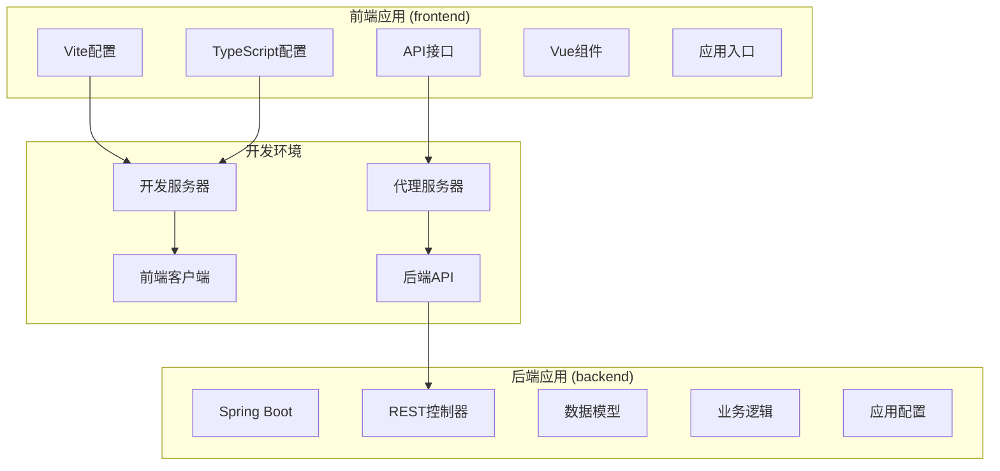
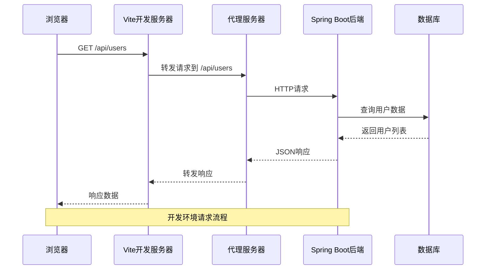
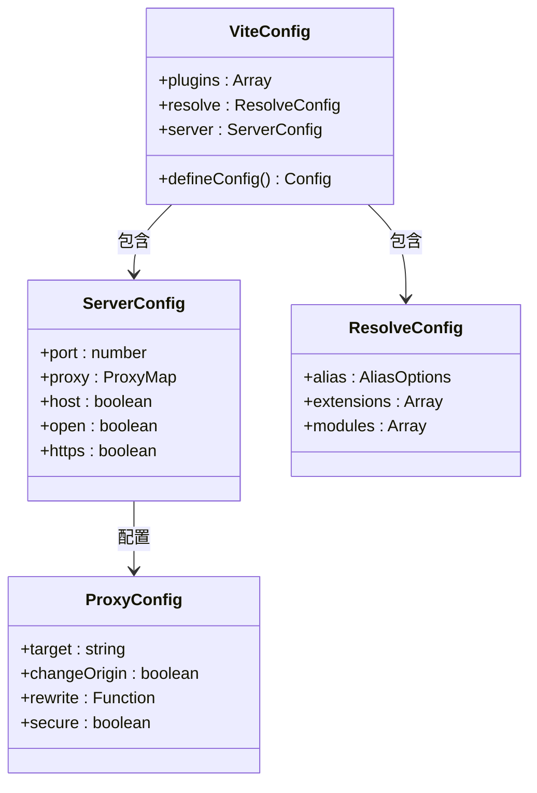
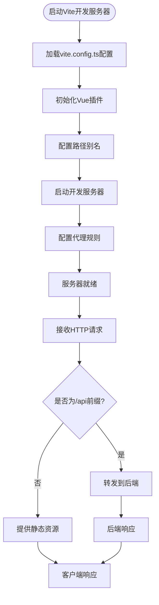
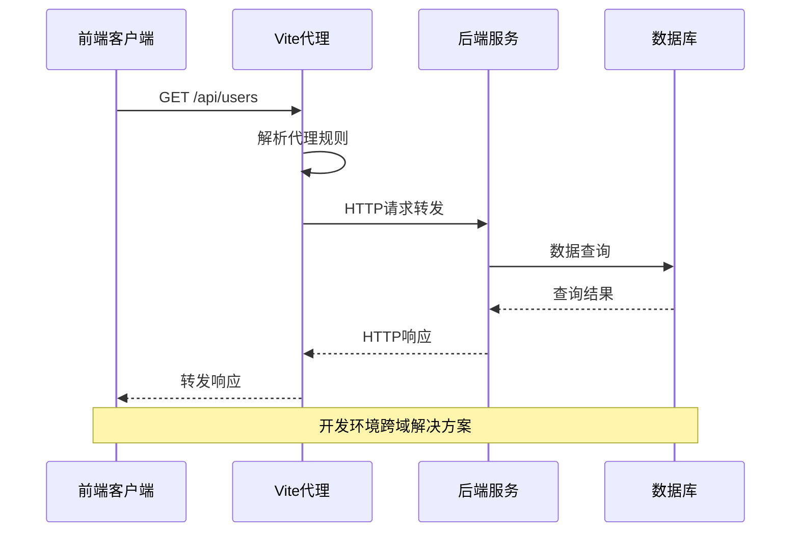
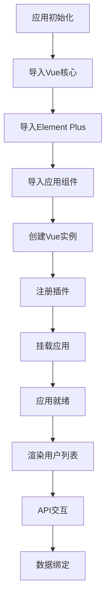

# Vite开发服务器配置

<cite>
**本文档引用的文件**
- [vite.config.ts](file://frontend/vite.config.ts)
- [package.json](file://frontend/package.json)
- [user.ts](file://frontend/src/api/user.ts)
- [UserList.vue](file://frontend/src/views/UserList.vue)
- [main.ts](file://frontend/src/main.ts)
- [tsconfig.json](file://frontend/tsconfig.json)
- [tsconfig.node.json](file://frontend/tsconfig.node.json)
- [application.yml](file://backend/src/main/resources/application.yml)
- [DemoApplication.java](file://backend/src/main/java/com/example/demo/DemoApplication.java)
- [pom.xml](file://backend/pom.xml)
- [README.md](file://README.md)
</cite>

## 目录
1. [简介](#简介)
2. [项目结构](#项目结构)
3. [核心配置组件](#核心配置组件)
4. [架构概览](#架构概览)
5. [详细组件分析](#详细组件分析)
6. [依赖关系分析](#依赖关系分析)
7. [性能考虑](#性能考虑)
8. [故障排除指南](#故障排除指南)
9. [结论](#结论)
10. [附录](#附录)

## 简介

本指南专注于Vite开发服务器配置的综合分析，涵盖Vue 3 + Spring Boot全栈项目的开发环境配置。该项目展示了现代前端开发的最佳实践，包括开发服务器设置、代理配置、路径别名和插件系统等关键配置要素。

项目采用前后端分离架构，前端使用Vue 3 + TypeScript + Vite开发，后端使用Spring Boot 3.x + Java 21构建RESTful API服务。开发环境中通过Vite代理实现跨域请求转发，确保前后端联调的顺畅进行。

## 项目结构

该项目采用清晰的分层架构设计，前后端代码完全分离，便于独立开发和部署：



**图表来源**
- [vite.config.ts:1-23](file://frontend/vite.config.ts#L1-L23)
- [package.json:1-24](file://frontend/package.json#L1-L24)
- [application.yml:1-13](file://backend/src/main/resources/application.yml#L1-L13)

**章节来源**
- [README.md:1-119](file://README.md#L1-L119)
- [vite.config.ts:1-23](file://frontend/vite.config.ts#L1-L23)
- [package.json:1-24](file://frontend/package.json#L1-L24)

## 核心配置组件

### Vite开发服务器配置

Vite开发服务器的核心配置集中在`vite.config.ts`文件中，该配置定义了开发环境的所有关键设置：

#### 插件系统配置
项目使用Vue 3插件作为主要开发工具：
- **@vitejs/plugin-vue**: 提供Vue单文件组件支持
- **TypeScript编译**: 与Vue组件的无缝集成

#### 路径别名配置
通过`resolve.alias`配置实现了便捷的模块导入：
- `@`: 指向`src`目录根路径
- 支持TypeScript路径映射同步配置

#### 开发服务器设置
- **端口配置**: 默认监听5173端口
- **代理配置**: `/api`前缀请求转发到后端
- **跨域处理**: 自动处理CORS相关问题

**章节来源**
- [vite.config.ts:6-22](file://frontend/vite.config.ts#L6-L22)
- [tsconfig.json:23-27](file://frontend/tsconfig.json#L23-L27)

### TypeScript配置集成

TypeScript配置与Vite配置保持一致，确保开发体验的一致性：

#### 路径别名同步
- **baseUrl**: 设置为项目根目录
- **paths**: `@/*`映射到`src/*`
- **模块解析**: 使用bundler模式

#### 编译选项优化
- **严格模式**: 启用类型检查
- **模块解析**: ESNext模块系统
- **JSON模块**: 支持JSON导入

**章节来源**
- [tsconfig.json:1-32](file://frontend/tsconfig.json#L1-L32)
- [tsconfig.node.json:1-11](file://frontend/tsconfig.node.json#L1-L11)

## 架构概览

项目采用标准的前后端分离架构，通过Vite代理实现开发环境的无缝连接：



**图表来源**
- [vite.config.ts:13-21](file://frontend/vite.config.ts#L13-L21)
- [user.ts:3-9](file://frontend/src/api/user.ts#L3-L9)

### 代理配置详解

代理配置是开发环境的关键组件，实现了前端开发服务器与后端API的解耦：

#### 代理规则
- **目标地址**: `http://localhost:8080`
- **路径匹配**: `/api`前缀
- **源变更**: `changeOrigin: true`启用

#### 转发机制
- 所有以`/api`开头的请求都会被转发
- 保持原始请求头和方法不变
- 自动处理CORS相关头部

**章节来源**
- [vite.config.ts:15-20](file://frontend/vite.config.ts#L15-L20)
- [user.ts:4](file://frontend/src/api/user.ts#L4)

## 详细组件分析

### 开发服务器组件分析

#### 服务器配置类图



**图表来源**
- [vite.config.ts:6-22](file://frontend/vite.config.ts#L6-L22)

#### 开发服务器启动流程



**图表来源**
- [vite.config.ts:6-22](file://frontend/vite.config.ts#L6-L22)
- [package.json:7](file://frontend/package.json#L7)

**章节来源**
- [vite.config.ts:6-22](file://frontend/vite.config.ts#L6-L22)
- [package.json:1-24](file://frontend/package.json#L1-L24)

### API代理组件分析

#### 代理转发序列图



**图表来源**
- [vite.config.ts:15-20](file://frontend/vite.config.ts#L15-L20)
- [user.ts:19](file://frontend/src/api/user.ts#L19)

#### API客户端配置

前端API客户端通过Axios配置实现了统一的请求处理：

##### 基础配置
- **基础URL**: `http://localhost:8080/api`
- **超时时间**: 5秒
- **内容类型**: JSON格式
- **类型安全**: TypeScript接口定义

##### 用户管理API
- **获取用户列表**: `GET /users`
- **添加用户**: `POST /users`
- **错误处理**: 统一的错误响应处理

**章节来源**
- [user.ts:1-26](file://frontend/src/api/user.ts#L1-L26)
- [UserList.vue:36-86](file://frontend/src/views/UserList.vue#L36-L86)

### Vue应用集成分析

#### 应用启动流程



**图表来源**
- [main.ts:1-10](file://frontend/src/main.ts#L1-L10)
- [UserList.vue:1-101](file://frontend/src/views/UserList.vue#L1-L101)

**章节来源**
- [main.ts:1-10](file://frontend/src/main.ts#L1-L10)
- [UserList.vue:36-86](file://frontend/src/views/UserList.vue#L36-L86)

## 依赖关系分析

### 项目依赖关系图

```mermaid
graph TB
subgraph "前端依赖"
Vite[Vite 5.0]
Vue[Vue 3.4]
TS[TypeScript 5.3]
Axios[Axios 1.6]
EP[Element Plus 2.4]
end
subgraph "后端依赖"
SpringBoot[Spring Boot 3.2.0]
Java[Java 21]
Maven[Maven]
end
subgraph "开发工具"
PluginVue[@vitejs/plugin-vue]
VueTSC[vue-tsc]
Node[Node.js]
end
Vite --> PluginVue
Vue --> EP
TS --> Vite
Axios --> Vue
SpringBoot --> Java
Maven --> SpringBoot
VueTSC --> TS
```

**图表来源**
- [package.json:11-22](file://frontend/package.json#L11-L22)
- [pom.xml:24-37](file://backend/pom.xml#L24-L37)

### 开发脚本配置

项目提供了完整的开发脚本配置，支持多种开发场景：

#### 核心开发脚本
- **dev**: 启动Vite开发服务器
- **build**: TypeScript类型检查 + Vite构建
- **preview**: 预览生产构建

#### 依赖版本管理
- **Vue生态**: Vue 3.4 + Element Plus 2.4
- **开发工具**: Vite 5.0 + TypeScript 5.3
- **后端技术栈**: Spring Boot 3.2.0 + Java 21

**章节来源**
- [package.json:6-10](file://frontend/package.json#L6-L10)
- [pom.xml:20-22](file://backend/pom.xml#L20-L22)

## 性能考虑

### 开发服务器性能优化

#### 缓存策略
- **模块缓存**: Vite内置模块缓存机制
- **依赖预构建**: 第三方依赖的预构建优化
- **HMR缓存**: 热模块替换的增量更新

#### 并行处理
- **多核支持**: 利用多核CPU进行并行编译
- **异步加载**: 模块的异步动态导入
- **懒加载**: 组件和路由的按需加载

### 生产构建优化

#### 代码分割
- **路由级分割**: 基于路由的代码分割
- **组件级分割**: 大型组件的独立打包
- **第三方库分割**: 常用库的独立打包

#### 资源优化
- **压缩算法**: Gzip/Brotli压缩
- **图片优化**: 自动压缩和格式转换
- **字体优化**: 字体子集化和延迟加载

## 故障排除指南

### 常见开发问题及解决方案

#### 代理配置问题
**问题**: 请求被正确转发但返回404
**解决方案**: 
1. 检查后端API端点是否正确
2. 验证代理路径配置
3. 确认后端服务已启动

#### CORS跨域问题
**问题**: 开发环境中出现CORS错误
**解决方案**:
1. 检查Vite代理配置
2. 验证后端CORS配置
3. 确认请求头设置

#### 端口冲突问题
**问题**: 开发服务器无法启动
**解决方案**:
1. 检查5173端口占用情况
2. 修改Vite端口配置
3. 关闭占用端口的进程

### 调试配置

#### 开发环境调试
- **浏览器开发者工具**: 断点调试和网络监控
- **Vue DevTools**: 组件状态和生命周期调试
- **TypeScript检查**: 编译时类型错误检查

#### 错误处理策略
- **API错误捕获**: 统一的错误响应处理
- **网络异常处理**: 网络请求失败的重试机制
- **用户友好提示**: 错误消息的本地化显示

**章节来源**
- [UserList.vue:52-81](file://frontend/src/views/UserList.vue#L52-L81)
- [application.yml:8-13](file://backend/src/main/resources/application.yml#L8-L13)

## 结论

本指南全面分析了Vite开发服务器在Vue 3 + Spring Boot项目中的配置和使用。通过合理的配置策略，项目实现了高效的开发体验和可靠的跨域解决方案。

关键配置要点包括：
- **代理配置**: 实现前后端分离开发的无缝连接
- **路径别名**: 提升代码可读性和维护性
- **TypeScript集成**: 确保类型安全和开发效率
- **插件系统**: 支持现代化前端开发工作流

建议在实际项目中根据具体需求调整配置参数，如代理规则、端口设置和构建优化选项，以获得最佳的开发和部署体验。

## 附录

### 配置文件参考

#### Vite配置选项参考
- **plugins**: 插件数组配置
- **resolve.alias**: 路径别名映射
- **server.port**: 开发服务器端口
- **server.proxy**: 代理规则配置

#### TypeScript配置选项参考
- **baseUrl**: 基础路径配置
- **paths**: 路径映射规则
- **moduleResolution**: 模块解析策略
- **strict**: 严格类型检查

### 最佳实践建议

1. **配置一致性**: 保持Vite和TypeScript配置的一致性
2. **代理规则**: 使用明确的API前缀避免冲突
3. **错误处理**: 实现统一的错误处理机制
4. **性能监控**: 定期检查构建性能和bundle大小
5. **安全配置**: 在生产环境中启用HTTPS和安全头