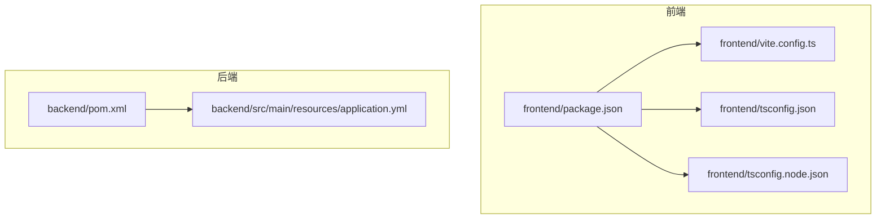
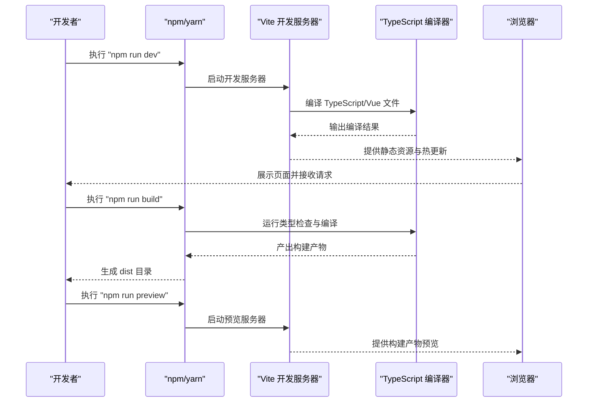
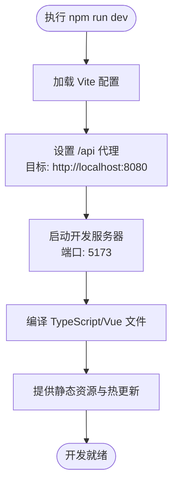
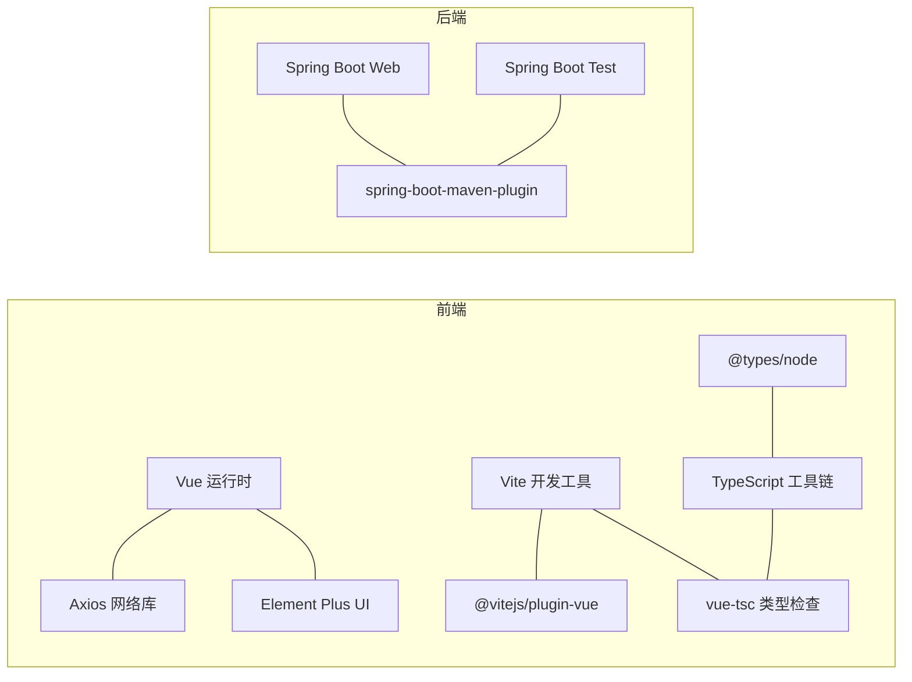

# 包管理与依赖配置

<cite>
**本文档引用的文件**
- [frontend/package.json](file://frontend/package.json)
- [frontend/vite.config.ts](file://frontend/vite.config.ts)
- [frontend/tsconfig.json](file://frontend/tsconfig.json)
- [frontend/tsconfig.node.json](file://frontend/tsconfig.node.json)
- [backend/pom.xml](file://backend/pom.xml)
- [backend/src/main/resources/application.yml](file://backend/src/main/resources/application.yml)
- [README.md](file://README.md)
</cite>

## 目录
1. [简介](#简介)
2. [项目结构](#项目结构)
3. [核心组件](#核心组件)
4. [架构总览](#架构总览)
5. [详细组件分析](#详细组件分析)
6. [依赖关系分析](#依赖关系分析)
7. [性能考虑](#性能考虑)
8. [故障排除指南](#故障排除指南)
9. [结论](#结论)
10. [附录](#附录)

## 简介
本指南围绕全栈项目（Vue 3 + Spring Boot）的包管理与依赖配置展开，重点覆盖：
- package.json 中的脚本命令、依赖管理与版本控制策略
- 开发依赖、生产依赖与可选依赖的区别与使用场景
- npm/yarn 脚本命令的组织与执行流程
- 依赖更新策略、安全审计与版本兼容性管理最佳实践
- 项目初始化、依赖安装与版本锁定的完整工作流程

该指南既面向初学者，也提供给有经验的开发者作为参考与检查清单。

## 项目结构
该项目采用前后端分离架构，前端使用 Vue 3 + TypeScript + Vite，后端使用 Spring Boot 3.x + Java 21。前端通过 package.json 管理依赖与脚本；后端通过 Maven 的 pom.xml 管理依赖与构建插件；Vite 与 TypeScript 配置文件分别定义开发服务器、代理与编译选项。

图表来源
- [frontend/package.json:1-24](file://frontend/package.json#L1-L24)
- [frontend/vite.config.ts:1-23](file://frontend/vite.config.ts#L1-L23)
- [frontend/tsconfig.json:1-32](file://frontend/tsconfig.json#L1-L32)
- [frontend/tsconfig.node.json:1-11](file://frontend/tsconfig.node.json#L1-L11)
- [backend/pom.xml:1-48](file://backend/pom.xml#L1-L48)
- [backend/src/main/resources/application.yml:1-13](file://backend/src/main/resources/application.yml#L1-L13)

章节来源
- [README.md:1-119](file://README.md#L1-L119)

## 核心组件
- 前端包管理与脚本
  - package.json 定义了应用名称、版本、私有属性、模块类型以及 scripts、dependencies、devDependencies 字段。
  - scripts 包含 dev、build、preview 三个常用命令，分别用于开发、构建与预览。
  - dependencies 列出运行时所需的核心库，如 Vue、Axios、Element Plus。
  - devDependencies 列出开发期工具链，如 Vite、TypeScript、Vue 编译器与类型声明等。
- 构建与开发配置
  - vite.config.ts 配置了开发服务器端口、路径别名与 /api 代理，便于前后端联调。
  - tsconfig.json 与 tsconfig.node.json 分别定义主应用与 Vite 配置的 TypeScript 编译选项与模块解析策略。
- 后端依赖与构建
  - pom.xml 使用 Spring Boot 父 POM 管理版本与插件，声明 Web 与测试依赖，并启用 spring-boot-maven-plugin 插件以支持打包与运行。

章节来源
- [frontend/package.json:1-24](file://frontend/package.json#L1-L24)
- [frontend/vite.config.ts:1-23](file://frontend/vite.config.ts#L1-L23)
- [frontend/tsconfig.json:1-32](file://frontend/tsconfig.json#L1-L32)
- [frontend/tsconfig.node.json:1-11](file://frontend/tsconfig.node.json#L1-L11)
- [backend/pom.xml:1-48](file://backend/pom.xml#L1-L48)

## 架构总览
下图展示了前端脚本命令在本地开发环境中的典型执行流程，包括开发服务器启动、构建产物生成与预览服务启动。

图表来源
- [frontend/package.json:6-10](file://frontend/package.json#L6-L10)
- [frontend/vite.config.ts:13-22](file://frontend/vite.config.ts#L13-L22)
- [frontend/tsconfig.json:18-27](file://frontend/tsconfig.json#L18-L27)

## 详细组件分析

### 前端包管理与脚本命令
- 脚本命令组织
  - dev：启动 Vite 开发服务器，结合代理配置将 /api 请求转发至后端。
  - build：先进行类型检查与编译，再执行打包，确保构建前的类型安全。
  - preview：启动预览服务器，用于验证构建产物在生产环境的行为。
- 版本控制策略
  - 依赖版本采用插入号（^）语义化版本约束，允许在不破坏主版本的前提下自动升级补丁与次版本。
  - 该策略在保证兼容性的同时，能及时获得安全修复与小改进。
- 依赖分类
  - 生产依赖：Vue、Axios、Element Plus 等运行时必需的库。
  - 开发依赖：Vite、TypeScript、@vitejs/plugin-vue、vue-tsc、@types/node 等开发与构建工具。
- 路径别名与开发体验
  - 通过 Vite 路径别名与 TypeScript 路径映射，统一使用 @ 指向 src 目录，提升导入便捷性与一致性。

图表来源
- [frontend/package.json:6-10](file://frontend/package.json#L6-L10)
- [frontend/vite.config.ts:13-22](file://frontend/vite.config.ts#L13-L22)

章节来源
- [frontend/package.json:1-24](file://frontend/package.json#L1-L24)
- [frontend/vite.config.ts:1-23](file://frontend/vite.config.ts#L1-L23)
- [frontend/tsconfig.json:1-32](file://frontend/tsconfig.json#L1-L32)
- [frontend/tsconfig.node.json:1-11](file://frontend/tsconfig.node.json#L1-L11)

### TypeScript 编译配置
- 主配置（tsconfig.json）
  - 模块解析策略为 bundler，适配现代打包器（如 Vite），避免 Node 解析差异导致的问题。
  - 启用严格模式与未使用变量/参数检测，提升代码质量与可维护性。
  - 配置路径别名与引用关系，确保多文件共享配置的一致性。
- Node 配置（tsconfig.node.json）
  - 为 Vite 配置文件单独设置模块解析策略，避免与主应用配置冲突。
- 与构建脚本的关系
  - build 脚本中先执行类型检查与编译，再进行打包，确保构建产物的类型正确性。

章节来源
- [frontend/tsconfig.json:1-32](file://frontend/tsconfig.json#L1-L32)
- [frontend/tsconfig.node.json:1-11](file://frontend/tsconfig.node.json#L1-L11)
- [frontend/package.json:8](file://frontend/package.json#L8)

### 后端依赖与构建
- 依赖管理
  - 使用 Spring Boot 父 POM 管理版本，统一依赖版本与插件版本，减少版本冲突。
  - 声明 Web 与测试依赖，满足 REST API 与单元测试需求。
- 构建插件
  - spring-boot-maven-plugin 提供打包与运行能力，简化部署与启动流程。
- 应用配置
  - application.yml 设置服务器端口、应用名称与日志级别，便于开发调试与问题定位。

章节来源
- [backend/pom.xml:1-48](file://backend/pom.xml#L1-L48)
- [backend/src/main/resources/application.yml:1-13](file://backend/src/main/resources/application.yml#L1-L13)

## 依赖关系分析
- 前端依赖关系
  - 运行时依赖（生产）：Vue、Axios、Element Plus。
  - 开发依赖（开发/构建）：Vite、TypeScript、@vitejs/plugin-vue、vue-tsc、@types/node。
  - 配置依赖：Vite 与 TypeScript 配置文件共同决定编译与开发体验。
- 后端依赖关系
  - Spring Boot Web Starter：提供 Web MVC 与嵌入式服务器。
  - Spring Boot Test Starter：提供测试框架与断言工具。
  - Maven 插件：spring-boot-maven-plugin 用于打包与运行。

图表来源
- [frontend/package.json:11-22](file://frontend/package.json#L11-L22)
- [backend/pom.xml:24-46](file://backend/pom.xml#L24-L46)

章节来源
- [frontend/package.json:1-24](file://frontend/package.json#L1-L24)
- [backend/pom.xml:1-48](file://backend/pom.xml#L1-L48)

## 性能考虑
- 版本锁定与缓存
  - 在 CI/CD 环境中建议使用 lock 文件或固定版本，确保构建一致性与可重复性。
  - 本地开发可保留 ^ 语义化版本，平衡安全性与便利性。
- 依赖精简
  - 定期清理未使用的开发依赖，减少安装时间与包体积。
- 构建优化
  - 使用 Vite 的按需编译与热更新机制，缩短开发等待时间。
  - 启用 TypeScript 的严格模式与未使用项检测，降低运行时错误风险。
- 代理与网络
  - 通过 Vite 代理将 /api 请求转发至后端，避免跨域问题，提升联调效率。

## 故障排除指南
- 常见问题与排查
  - 端口占用：确认 8080（后端）与 5173（前端）未被其他进程占用。
  - 依赖安装失败：优先尝试清理缓存与重新安装，必要时检查网络与镜像源。
  - 类型错误：在执行 build 前先修复 TypeScript 错误，确保类型检查通过。
  - 跨域问题：确认 Vite 代理配置与后端 CORS 配置一致。
- 安全与合规
  - 定期执行安全扫描与依赖审计，关注高危漏洞与过时依赖。
  - 对关键依赖采用固定版本或范围限制，避免引入破坏性变更。
- 版本兼容性
  - 前端：保持 Vue、TypeScript、Vite 版本与生态工具链的兼容性。
  - 后端：遵循 Spring Boot 与 Java 版本要求，避免插件与依赖版本不匹配。

章节来源
- [README.md:114-119](file://README.md#L114-L119)
- [frontend/vite.config.ts:13-22](file://frontend/vite.config.ts#L13-L22)
- [backend/src/main/resources/application.yml:1-13](file://backend/src/main/resources/application.yml#L1-L13)

## 结论
本指南系统梳理了 Vue 3 + Spring Boot 项目的包管理与依赖配置要点，涵盖脚本命令、依赖分类、版本控制策略、构建流程与安全合规等方面。通过合理组织依赖、规范版本约束与持续审计，可在保证开发效率的同时提升系统的稳定性与安全性。

## 附录

### 项目初始化与依赖安装工作流程
- 前端初始化
  - 进入 frontend 目录，执行依赖安装命令，随后运行开发服务器。
  - 首次运行需完成依赖安装，确保开发环境可用。
- 后端初始化
  - 进入 backend 目录，使用 Maven 启动 Spring Boot 应用。
  - 确认后端服务在指定端口启动，以便前端代理访问。
- 联调与预览
  - 启动后端后再启动前端，利用 Vite 代理将 /api 请求转发至后端。
  - 使用预览命令验证构建产物在生产环境的行为。

章节来源
- [README.md:32-62](file://README.md#L32-L62)

### 依赖更新策略与版本兼容性管理
- 更新策略
  - 采用分阶段更新：先在开发分支进行小范围更新与回归测试，再合并到主分支。
  - 对关键依赖（如 Vue、TypeScript、Spring Boot）采用固定版本或严格范围限制。
- 安全审计
  - 定期执行安全扫描，关注 CVE 与许可证合规问题。
  - 对高危漏洞及时修复或替换依赖。
- 兼容性管理
  - 前端：保持工具链与运行时版本的兼容性，避免破坏性更新。
  - 后端：遵循父 POM 的版本管理与插件版本同步。

### 可选依赖与使用场景
- 可选依赖（optionalDependencies）
  - 适用于可选功能模块或平台特定扩展，若安装失败不影响整体安装。
  - 在本项目中未发现明确使用场景，但可作为未来扩展的参考。
- 开发依赖与生产依赖
  - 开发依赖仅在开发与构建阶段使用，不随应用发布。
  - 生产依赖在运行时必须存在，影响最终产物体积与启动时间。