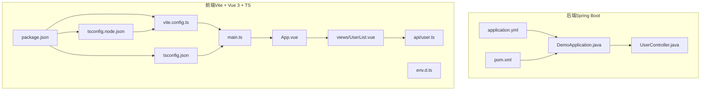
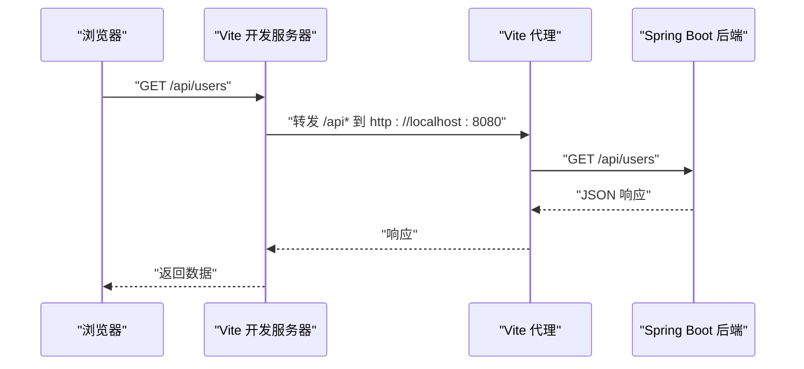
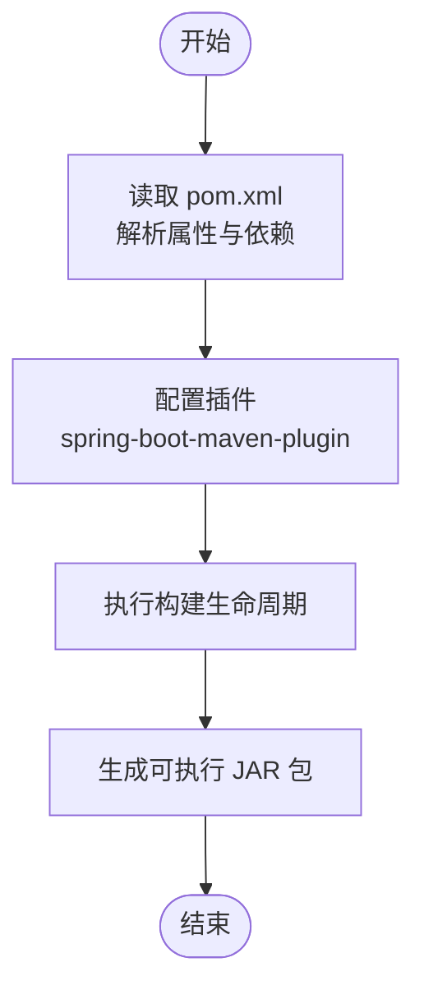
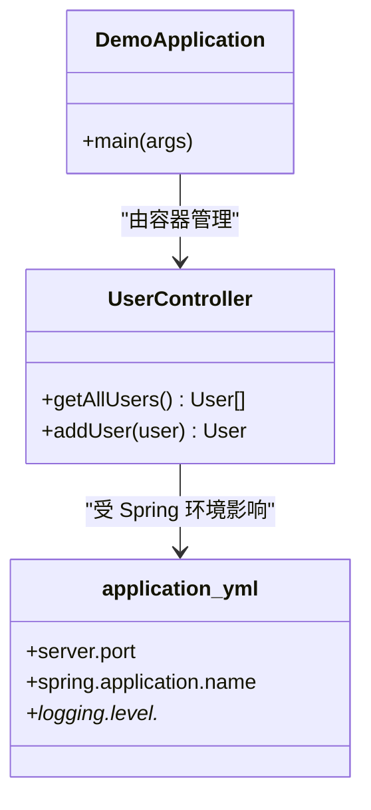
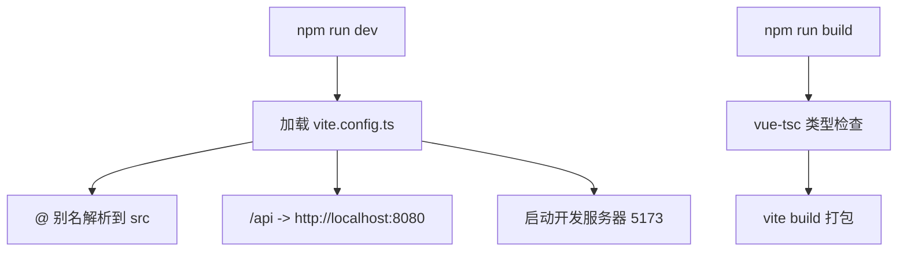
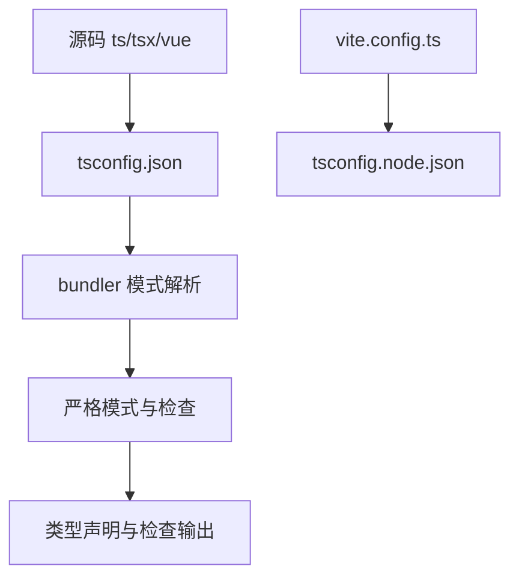
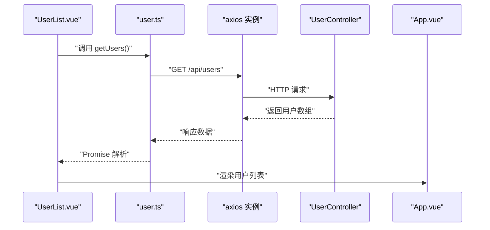
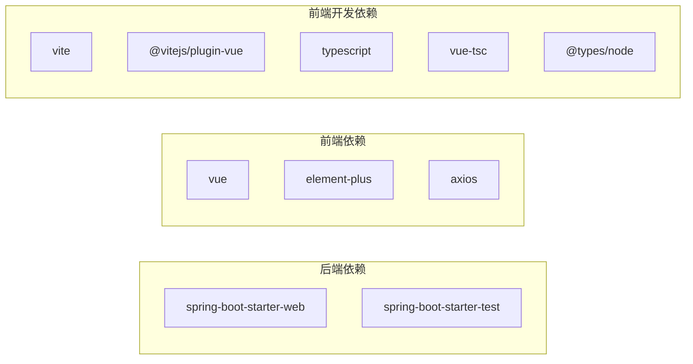

# 开发工具与配置

<cite>
**本文引用的文件**
- [pom.xml](file://backend/pom.xml)
- [application.yml](file://backend/src/main/resources/application.yml)
- [DemoApplication.java](file://backend/src/main/java/com/example/demo/DemoApplication.java)
- [UserController.java](file://backend/src/main/java/com/example/demo/controller/UserController.java)
- [package.json](file://frontend/package.json)
- [vite.config.ts](file://frontend/vite.config.ts)
- [tsconfig.json](file://frontend/tsconfig.json)
- [tsconfig.node.json](file://frontend/tsconfig.node.json)
- [main.ts](file://frontend/src/main.ts)
- [App.vue](file://frontend/src/App.vue)
- [user.ts](file://frontend/src/api/user.ts)
- [UserList.vue](file://frontend/src/views/UserList.vue)
- [env.d.ts](file://frontend/src/env.d.ts)
- [README.md](file://README.md)
</cite>

## 目录
1. [简介](#简介)
2. [项目结构](#项目结构)
3. [核心组件](#核心组件)
4. [架构总览](#架构总览)
5. [详细组件分析](#详细组件分析)
6. [依赖分析](#依赖分析)
7. [性能考虑](#性能考虑)
8. [故障排查指南](#故障排查指南)
9. [结论](#结论)
10. [附录](#附录)

## 简介
本指南面向使用 Maven + Spring Boot 后端与 Vite + Vue 3 + TypeScript 前端的全栈团队，系统梳理构建配置、依赖管理、打包流程、开发服务器配置（含代理与热重载）、TypeScript 编译与路径别名、类型检查、IDE 配置与调试、开发工作流优化、性能优化与构建产物分析、部署前检查清单以及团队协作与持续集成实践。内容基于仓库中的实际配置文件与源码进行提炼，确保可操作性与一致性。

## 项目结构
项目采用前后端分离架构，后端为 Spring Boot 应用，前端为 Vite + Vue 3 + TypeScript 工程。根目录包含 backend 与 frontend 两个子工程；后端通过 Maven 管理依赖与构建；前端通过 NPM 管理依赖与脚本命令。

图表来源
- [DemoApplication.java:1-13](file://backend/src/main/java/com/example/demo/DemoApplication.java#L1-L13)
- [UserController.java:1-30](file://backend/src/main/java/com/example/demo/controller/UserController.java#L1-L30)
- [application.yml:1-13](file://backend/src/main/resources/application.yml#L1-L13)
- [pom.xml:1-48](file://backend/pom.xml#L1-L48)
- [package.json:1-24](file://frontend/package.json#L1-L24)
- [vite.config.ts:1-23](file://frontend/vite.config.ts#L1-L23)
- [tsconfig.json:1-32](file://frontend/tsconfig.json#L1-L32)
- [tsconfig.node.json:1-11](file://frontend/tsconfig.node.json#L1-L11)
- [main.ts:1-10](file://frontend/src/main.ts#L1-L10)
- [App.vue:1-45](file://frontend/src/App.vue#L1-L45)
- [user.ts:1-26](file://frontend/src/api/user.ts#L1-L26)
- [UserList.vue:1-101](file://frontend/src/views/UserList.vue#L1-L101)
- [env.d.ts:1-8](file://frontend/src/env.d.ts#L1-L8)

章节来源
- [README.md:1-119](file://README.md#L1-L119)

## 核心组件
- 后端应用入口与启动类负责引导 Spring Boot 应用上下文。
- 控制器层提供 REST 接口，使用跨域注解允许前端访问。
- 配置文件定义服务端口与日志级别。
- 前端应用入口注册 UI 组件库并挂载根组件。
- API 层封装 HTTP 客户端与数据模型接口。
- 视图组件负责用户交互与数据展示。

章节来源
- [DemoApplication.java:1-13](file://backend/src/main/java/com/example/demo/DemoApplication.java#L1-L13)
- [UserController.java:1-30](file://backend/src/main/java/com/example/demo/controller/UserController.java#L1-L30)
- [application.yml:1-13](file://backend/src/main/resources/application.yml#L1-L13)
- [main.ts:1-10](file://frontend/src/main.ts#L1-L10)
- [user.ts:1-26](file://frontend/src/api/user.ts#L1-L26)
- [UserList.vue:1-101](file://frontend/src/views/UserList.vue#L1-L101)

## 架构总览
前后端通过 HTTP 协议通信，前端在本地开发时通过 Vite 代理将以 /api 开头的请求转发至后端。后端启用跨域支持，前端通过 TypeScript 与 Element Plus 提供类型安全与良好交互体验。

图表来源
- [vite.config.ts:13-21](file://frontend/vite.config.ts#L13-L21)
- [UserController.java:10-29](file://backend/src/main/java/com/example/demo/controller/UserController.java#L10-L29)
- [application.yml:1-2](file://backend/src/main/resources/application.yml#L1-L2)

## 详细组件分析

### Maven 构建与依赖管理
- 项目继承 Spring Boot 父 POM，统一版本与插件配置。
- 依赖包括 Web 启动器与测试启动器。
- 构建阶段包含 Spring Boot Maven 插件，用于打包可执行 JAR。

图表来源
- [pom.xml:20-46](file://backend/pom.xml#L20-L46)

章节来源
- [pom.xml:1-48](file://backend/pom.xml#L1-L48)

### Spring Boot 应用配置
- 应用主类负责启动 Spring Boot。
- YAML 配置文件设置服务端口、应用名称与日志级别。
- 控制器层暴露 /api/users 接口，并开启跨域支持。

图表来源
- [DemoApplication.java:1-13](file://backend/src/main/java/com/example/demo/DemoApplication.java#L1-L13)
- [UserController.java:1-30](file://backend/src/main/java/com/example/demo/controller/UserController.java#L1-L30)
- [application.yml:1-13](file://backend/src/main/resources/application.yml#L1-L13)

章节来源
- [DemoApplication.java:1-13](file://backend/src/main/java/com/example/demo/DemoApplication.java#L1-L13)
- [UserController.java:1-30](file://backend/src/main/java/com/example/demo/controller/UserController.java#L1-L30)
- [application.yml:1-13](file://backend/src/main/resources/application.yml#L1-L13)

### Vite 开发服务器配置
- 插件：启用 Vue 3 插件。
- 路径别名：将 @ 指向 src 目录，便于导入。
- 服务器：端口 5173，配置 /api 代理到后端 8080。
- 脚本：dev/build/preview 命令分别对应开发、类型检查与构建预览。

图表来源
- [vite.config.ts:6-22](file://frontend/vite.config.ts#L6-L22)
- [package.json:6-10](file://frontend/package.json#L6-L10)

章节来源
- [vite.config.ts:1-23](file://frontend/vite.config.ts#L1-L23)
- [package.json:1-24](file://frontend/package.json#L1-L24)

### TypeScript 编译与类型检查
- 编译目标与模块：ES2020 与 ESNext，配合打包器模式。
- 严格模式与无用项检查：提升代码质量。
- 路径别名：baseUrl 与 paths 配合 Vite 别名，保证导入一致性。
- 双 tsconfig：tsconfig.json 用于源码，tsconfig.node.json 用于 Vite 配置文件类型支持。

图表来源
- [tsconfig.json:2-28](file://frontend/tsconfig.json#L2-L28)
- [tsconfig.node.json:1-11](file://frontend/tsconfig.node.json#L1-L11)

章节来源
- [tsconfig.json:1-32](file://frontend/tsconfig.json#L1-L32)
- [tsconfig.node.json:1-11](file://frontend/tsconfig.node.json#L1-L11)

### 前端应用与 API 集成
- 应用入口注册 UI 组件库并挂载根组件。
- API 封装使用 axios，统一基础地址与超时设置。
- 视图组件通过 Composition API 获取与提交数据，结合 Element Plus 提供交互反馈。

图表来源
- [UserList.vue:47-58](file://frontend/src/views/UserList.vue#L47-L58)
- [user.ts:18-23](file://frontend/src/api/user.ts#L18-L23)
- [UserController.java:20-28](file://backend/src/main/java/com/example/demo/controller/UserController.java#L20-L28)
- [App.vue:1-45](file://frontend/src/App.vue#L1-L45)

章节来源
- [main.ts:1-10](file://frontend/src/main.ts#L1-L10)
- [user.ts:1-26](file://frontend/src/api/user.ts#L1-L26)
- [UserList.vue:1-101](file://frontend/src/views/UserList.vue#L1-L101)
- [App.vue:1-45](file://frontend/src/App.vue#L1-L45)

## 依赖分析
- 后端依赖：Spring Web 用于 Web 层能力，Spring Boot Test 用于单元测试。
- 前端依赖：Vue 3、Element Plus、Axios；开发依赖包含 Vite、Vue 插件、TypeScript、类型声明与类型检查工具。
- 版本策略：后端使用 Java 21 与 Spring Boot 3.2.0；前端使用 Vue 3.4、TypeScript 5.3、Vite 5.0。

图表来源
- [pom.xml:24-36](file://backend/pom.xml#L24-L36)
- [package.json:11-22](file://frontend/package.json#L11-L22)

章节来源
- [pom.xml:1-48](file://backend/pom.xml#L1-L48)
- [package.json:1-24](file://frontend/package.json#L1-L24)

## 性能考虑
- 构建优化
  - 使用打包器模式与严格模块解析，减少冗余模块与重复类型检查。
  - 在开发阶段启用热重载与按需编译，缩短等待时间。
- 运行时优化
  - 合理拆分路由与组件，避免单文件过大。
  - 对第三方组件按需引入，减少初始包体。
- 网络与代理
  - 代理仅转发 /api 前缀，避免不必要的请求拦截。
  - 设置合理的超时与错误处理，提升用户体验。

## 故障排查指南
- 端口冲突
  - 后端默认端口 8080，前端默认端口 5173；若端口被占用，请调整配置或释放端口。
- 跨域问题
  - 确认控制器已启用跨域并允许前端地址访问。
- 代理不通
  - 检查 Vite 代理配置是否正确指向后端地址。
- 类型检查失败
  - 确保 tsconfig 的 bundler 模式与路径别名一致，必要时清理缓存后重新安装依赖。
- 构建失败
  - 先执行类型检查，再进行构建；检查脚本命令与依赖版本兼容性。

章节来源
- [application.yml:1-13](file://backend/src/main/resources/application.yml#L1-L13)
- [UserController.java:11-11](file://backend/src/main/java/com/example/demo/controller/UserController.java#L11-L11)
- [vite.config.ts:15-20](file://frontend/vite.config.ts#L15-L20)
- [tsconfig.json:23-27](file://frontend/tsconfig.json#L23-L27)
- [package.json:6-10](file://frontend/package.json#L6-L10)

## 结论
本项目提供了清晰的前后端分离架构与完善的开发工具链配置。通过合理利用 Maven 与 Vite 的生态能力、严格的 TypeScript 类型检查与路径别名体系、以及明确的代理与跨域策略，能够高效支撑日常开发与团队协作。建议在持续集成中加入构建产物分析与静态检查步骤，进一步提升交付质量。

## 附录

### 开发工作流与 IDE 配置建议
- 后端
  - 使用支持 Spring Boot 的 IDE 插件，便于直接运行与调试。
  - 在 application.yml 中根据环境切换日志级别与数据库连接。
- 前端
  - 配置 TypeScript 与 Vue 文件的智能感知，确保路径别名生效。
  - 在 Vite 开发服务器中启用 HTTPS（如需）与合适的主机绑定，便于移动端联调。

### 调试设置
- 后端：通过 IDE 启动类或命令行参数进行断点调试。
- 前端：在浏览器开发者工具中设置断点，结合 Vite 的 Source Map 进行定位。

### 部署前检查清单
- 后端
  - 确认 pom.xml 中插件配置正确，构建产物可执行。
  - 检查 application.yml 的环境变量注入与敏感信息脱敏。
- 前端
  - 确认构建脚本与类型检查通过。
  - 分析构建产物体积与关键依赖，必要时进行代码分割与懒加载优化。

### 团队协作与持续集成
- 版本管理：前后端依赖版本保持兼容，使用 lock 文件锁定版本。
- CI 步骤建议：安装依赖 → 类型检查 → 单元测试 → 构建 → 产物上传。
- 文档同步：更新 README 中的变更记录与部署指引。