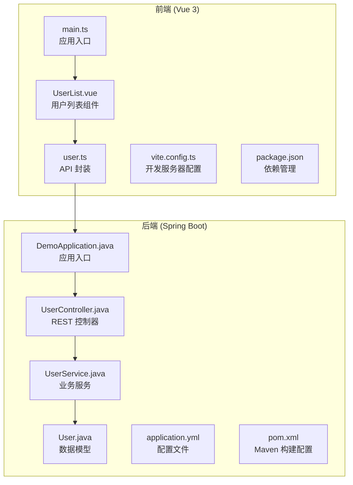
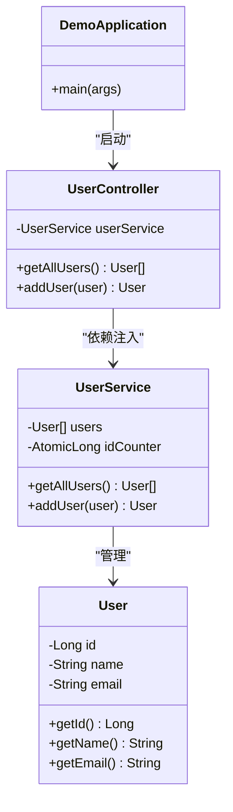
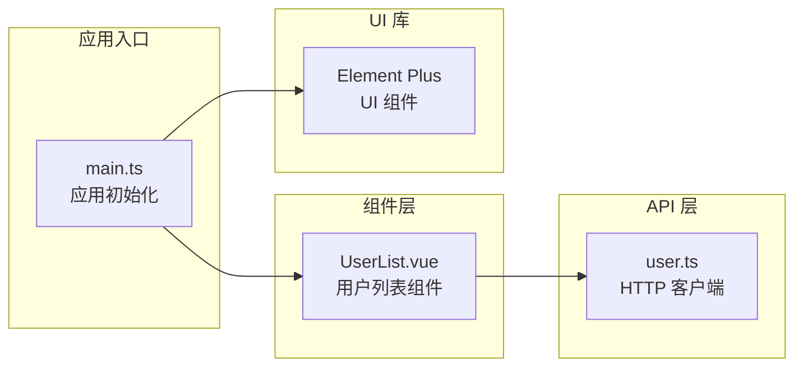
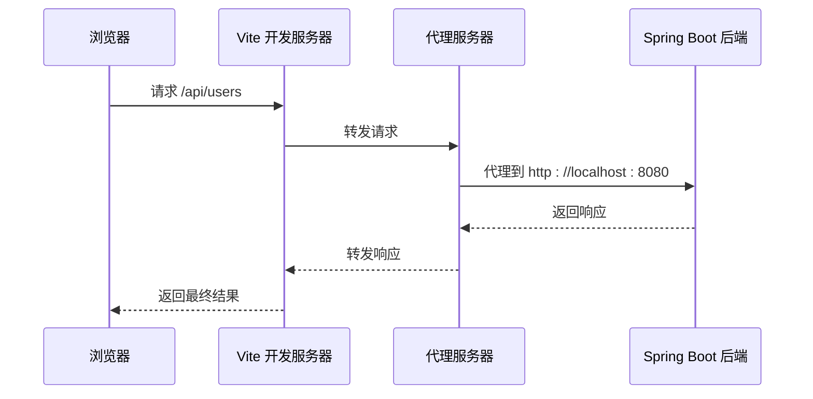

# 快速开始

<cite>
**本文引用的文件**
- [README.md](file://README.md)
- [pom.xml](file://backend/pom.xml)
- [application.yml](file://backend/src/main/resources/application.yml)
- [DemoApplication.java](file://backend/src/main/java/com/example/demo/DemoApplication.java)
- [UserController.java](file://backend/src/main/java/com/example/demo/controller/UserController.java)
- [UserService.java](file://backend/src/main/java/com/example/demo/service/UserService.java)
- [User.java](file://backend/src/main/java/com/example/demo/model/User.java)
- [package.json](file://frontend/package.json)
- [vite.config.ts](file://frontend/vite.config.ts)
- [user.ts](file://frontend/src/api/user.ts)
- [main.ts](file://frontend/src/main.ts)
- [UserList.vue](file://frontend/src/views/UserList.vue)
</cite>

## 目录
1. [简介](#简介)
2. [项目结构](#项目结构)
3. [环境要求](#环境要求)
4. [克隆与安装](#克隆与安装)
5. [启动顺序](#启动顺序)
6. [后端 Spring Boot 应用详解](#后端-spring-boot-应用详解)
7. [前端 Vue 3 应用详解](#前端-vue-3-应用详解)
8. [开发服务器与代理配置](#开发服务器与代理配置)
9. [常见问题与故障排除](#常见问题与故障排除)
10. [总结](#总结)

## 简介

Quder 是一个基于 Vue 3 + Spring Boot 的前后端分离全栈项目示例，采用现代化技术栈构建。该项目展示了完整的用户管理系统，包括用户列表展示和新增用户功能，为开发者提供了清晰的架构参考和实践范例。

## 项目结构

项目采用标准的前后端分离架构，后端使用 Spring Boot 3.x + Java 21，前端使用 Vue 3 + TypeScript + Element Plus。



**图表来源**
- [DemoApplication.java:1-13](file://backend/src/main/java/com/example/demo/DemoApplication.java#L1-L13)
- [UserController.java:1-30](file://backend/src/main/java/com/example/demo/controller/UserController.java#L1-L30)
- [UserService.java:1-33](file://backend/src/main/java/com/example/demo/service/UserService.java#L1-L33)
- [User.java:1-41](file://backend/src/main/java/com/example/demo/model/User.java#L1-L41)
- [application.yml:1-13](file://backend/src/main/resources/application.yml#L1-L13)
- [pom.xml:1-48](file://backend/pom.xml#L1-L48)
- [user.ts:1-26](file://frontend/src/api/user.ts#L1-L26)
- [UserList.vue:1-101](file://frontend/src/views/UserList.vue#L1-L101)
- [main.ts:1-10](file://frontend/src/main.ts#L1-L10)
- [vite.config.ts:1-23](file://frontend/vite.config.ts#L1-L23)
- [package.json:1-24](file://frontend/package.json#L1-L24)

**章节来源**
- [README.md:5-30](file://README.md#L5-L30)

## 环境要求

### 后端环境
- **Java**: 版本 21 (项目明确要求)
- **Maven**: 用于依赖管理和构建
- **Spring Boot**: 版本 3.2.0
- **端口**: 默认使用 8080

### 前端环境
- **Node.js**: 推荐版本 18+
- **npm**: 包管理器
- **TypeScript**: 版本 5.3
- **Vite**: 构建工具 5.0
- **Vue 3**: 版本 3.4
- **Element Plus**: UI 组件库 2.4
- **Axios**: HTTP 客户端 1.6

**章节来源**
- [README.md:92-106](file://README.md#L92-L106)
- [pom.xml:20-22](file://backend/pom.xml#L20-L22)
- [package.json:16-22](file://frontend/package.json#L16-L22)

## 克隆与安装

### 1. 克隆项目
```bash
git clone <repository-url>
cd quder
```

### 2. 安装后端依赖
```bash
cd backend
mvn clean install
```

### 3. 安装前端依赖
```bash
cd ../frontend
npm install
```

**章节来源**
- [README.md:32-62](file://README.md#L32-L62)

## 启动顺序

### 正确的启动顺序
1. **先启动后端服务**
2. **再启动前端开发服务器**

### 启动命令
```bash
# 后端启动
cd backend
mvn spring-boot:run

# 前端启动
cd ../frontend
npm run dev
```

### 预期端口
- **后端**: http://localhost:8080
- **前端**: http://localhost:5173

**章节来源**
- [README.md:34-62](file://README.md#L34-L62)
- [application.yml:1-2](file://backend/src/main/resources/application.yml#L1-L2)
- [vite.config.ts:13-14](file://frontend/vite.config.ts#L13-L14)

## 后端 Spring Boot 应用详解

### 应用入口
应用通过 `DemoApplication` 类启动，这是 Spring Boot 的标准入口点。

### 核心组件架构



**图表来源**
- [DemoApplication.java:1-13](file://backend/src/main/java/com/example/demo/DemoApplication.java#L1-L13)
- [UserController.java:1-30](file://backend/src/main/java/com/example/demo/controller/UserController.java#L1-L30)
- [UserService.java:1-33](file://backend/src/main/java/com/example/demo/service/UserService.java#L1-L33)
- [User.java:1-41](file://backend/src/main/java/com/example/demo/model/User.java#L1-L41)

### REST API 设计

| 方法 | 路径 | 功能 | 请求体 | 响应 |
|------|------|------|--------|------|
| GET | `/api/users` | 获取所有用户 | 无 | 用户数组 |
| POST | `/api/users` | 添加新用户 | User 对象 | 新用户对象 |

### 跨域配置
后端通过 `@CrossOrigin` 注解允许前端 `http://localhost:5173` 访问。

**章节来源**
- [UserController.java:9-29](file://backend/src/main/java/com/example/demo/controller/UserController.java#L9-L29)
- [UserService.java:10-33](file://backend/src/main/java/com/example/demo/service/UserService.java#L10-L33)

## 前端 Vue 3 应用详解

### 应用架构



**图表来源**
- [main.ts:1-10](file://frontend/src/main.ts#L1-L10)
- [user.ts:1-26](file://frontend/src/api/user.ts#L1-L26)
- [UserList.vue:1-101](file://frontend/src/views/UserList.vue#L1-L101)

### 核心功能实现

#### 用户列表组件
- 使用 Element Plus 表格组件展示用户数据
- 支持动态加载和实时更新
- 包含添加用户的模态对话框

#### API 通信
- 基于 Axios 的 HTTP 客户端
- 自动处理 JSON 数据格式
- 错误处理和状态管理

**章节来源**
- [UserList.vue:36-87](file://frontend/src/views/UserList.vue#L36-L87)
- [user.ts:17-23](file://frontend/src/api/user.ts#L17-L23)

## 开发服务器与代理配置

### Vite 开发服务器配置



**图表来源**
- [vite.config.ts:15-20](file://frontend/vite.config.ts#L15-L20)

### 关键配置说明

| 配置项 | 值 | 用途 |
|--------|-----|------|
| 服务器端口 | 5173 | 前端开发服务器端口 |
| API 代理 | `/api` | 将所有以 `/api` 开头的请求转发到后端 |
| 代理目标 | `http://localhost:8080` | 后端服务器地址 |
| 跨域支持 | `changeOrigin: true` | 解决跨域问题 |

### CORS 配置
后端通过 `application.yml` 配置日志级别，前端通过代理自动处理跨域问题。

**章节来源**
- [vite.config.ts:13-22](file://frontend/vite.config.ts#L13-L22)
- [application.yml:8-13](file://backend/src/main/resources/application.yml#L8-L13)

## 常见问题与故障排除

### 启动问题

#### 1. 端口冲突
**问题**: 端口 8080 或 5173 已被占用
**解决**: 修改配置文件中的端口号或释放占用端口

#### 2. Java 版本不兼容
**问题**: 编译错误提示 Java 版本过低
**解决**: 升级到 Java 21 或在 `pom.xml` 中修改 Java 版本属性

#### 3. Node.js 版本问题
**问题**: npm install 失败或运行时报错
**解决**: 升级到 Node.js 18+ 或重新安装依赖

### API 通信问题

#### 1. 跨域错误
**问题**: 浏览器控制台显示 CORS 错误
**解决**: 确保后端 `@CrossOrigin` 注解正确配置，前端代理正常工作

#### 2. API 请求失败
**问题**: 用户列表无法加载或添加用户失败
**解决**: 检查后端服务是否正常运行，确认 API 地址配置正确

### 性能优化建议

#### 1. 开发环境优化
- 使用 Vite 的热重载功能提升开发体验
- 合理配置代理避免不必要的网络请求
- 启用浏览器缓存减少重复加载

#### 2. 生产环境准备
- 配置生产环境的 API 基础路径
- 优化静态资源加载
- 设置适当的缓存策略

**章节来源**
- [README.md:114-119](file://README.md#L114-L119)

## 总结

Quder 项目为开发者提供了一个完整的全栈应用模板，涵盖了现代 Web 开发的最佳实践。通过遵循本文档的快速开始指南，您可以在几分钟内搭建起完整的开发环境并运行项目。

### 关键要点回顾

1. **正确的启动顺序**: 先启动后端，再启动前端
2. **端口配置**: 后端 8080，前端 5173
3. **跨域处理**: 后端 CORS + 前端代理双重保障
4. **依赖管理**: Maven 和 npm 分别管理后端和前端依赖
5. **开发体验**: Vite 热重载 + Element Plus 组件库

### 下一步建议

- 探索项目中的用户管理功能
- 查看 API 文档了解完整的接口规范
- 学习如何扩展新的功能模块
- 配置生产环境部署方案

通过这个项目，您可以快速掌握 Vue 3 + Spring Boot 的开发模式，并将其应用到实际的项目开发中。