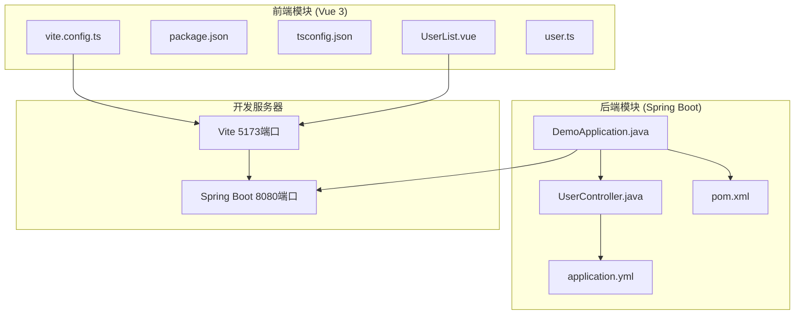
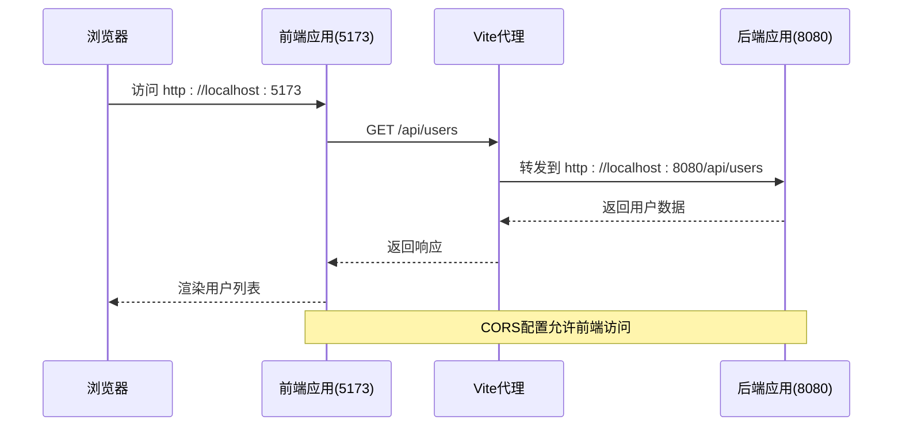
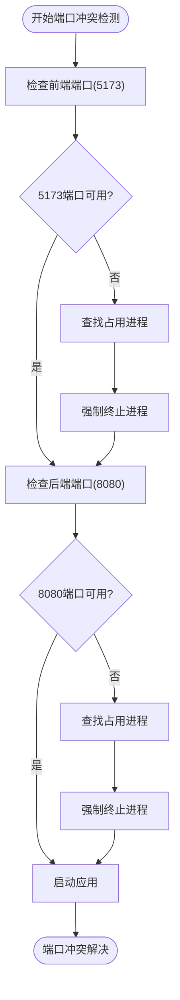
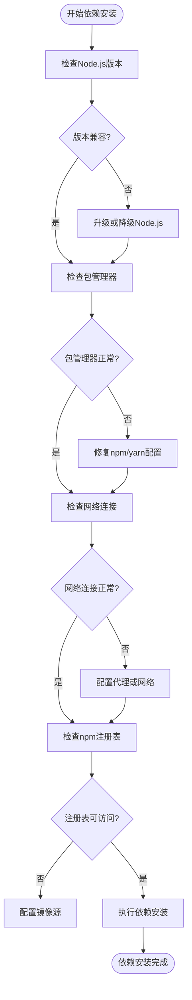
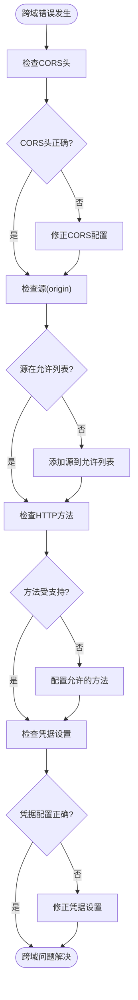
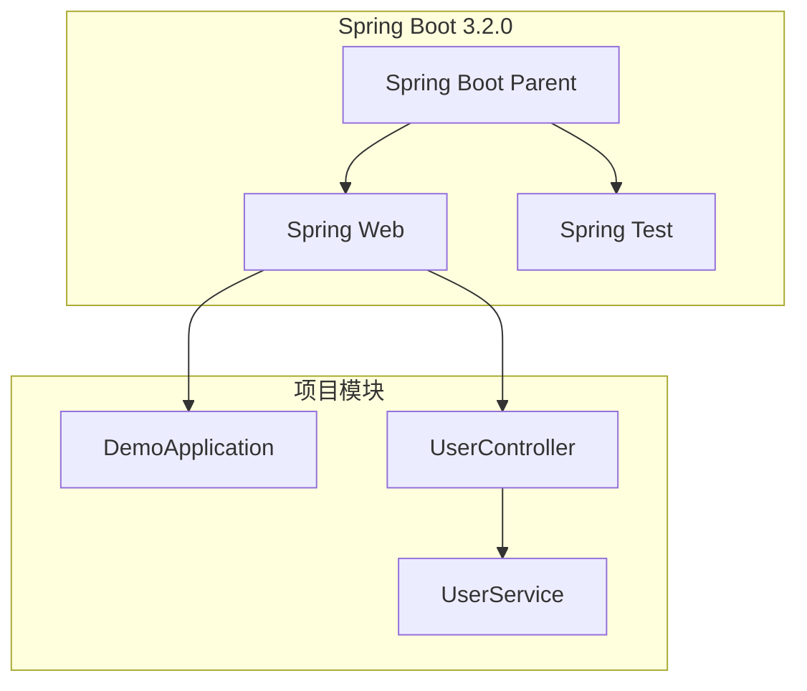
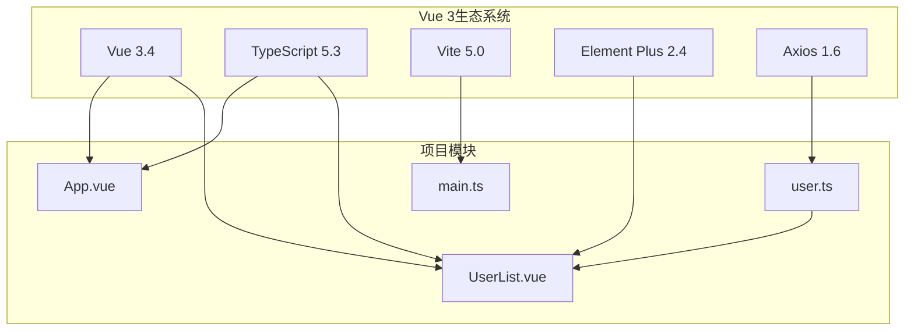
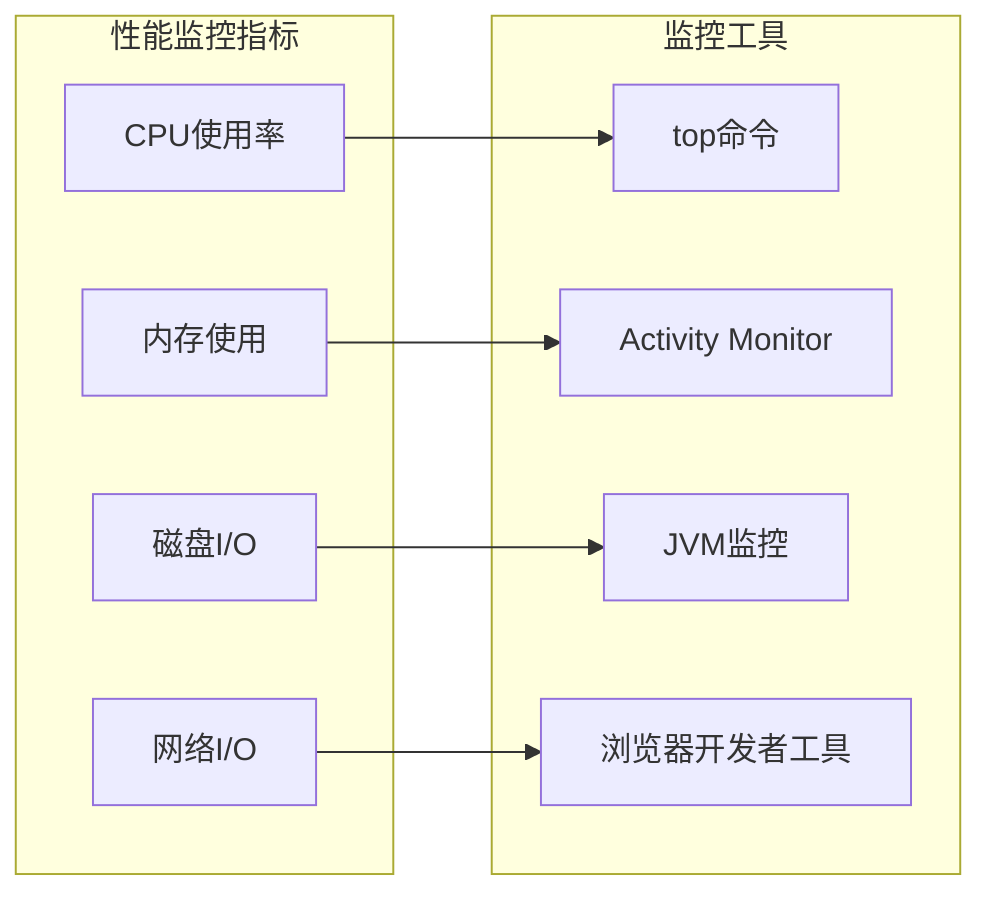

# 开发环境问题排查指南

<cite>
**本文档引用的文件**
- [README.md](file://README.md)
- [pom.xml](file://backend/pom.xml)
- [application.yml](file://backend/src/main/resources/application.yml)
- [DemoApplication.java](file://backend/src/main/java/com/example/demo/DemoApplication.java)
- [UserController.java](file://backend/src/main/java/com/example/demo/controller/UserController.java)
- [package.json](file://frontend/package.json)
- [vite.config.ts](file://frontend/vite.config.ts)
- [tsconfig.json](file://frontend/tsconfig.json)
- [tsconfig.node.json](file://frontend/tsconfig.node.json)
- [user.ts](file://frontend/src/api/user.ts)
- [UserList.vue](file://frontend/src/views/UserList.vue)
- [main.ts](file://frontend/src/main.ts)
</cite>

## 目录
1. [简介](#简介)
2. [项目结构](#项目结构)
3. [核心组件](#核心组件)
4. [架构概览](#架构概览)
5. [详细组件分析](#详细组件分析)
6. [依赖分析](#依赖分析)
7. [性能考虑](#性能考虑)
8. [故障排除指南](#故障排除指南)
9. [结论](#结论)
10. [附录](#附录)

## 简介

本指南专注于解决全栈项目的开发环境问题，特别是端口冲突、依赖安装失败、跨域访问错误等常见问题。该项目采用Vue 3 + Spring Boot技术栈，前端使用Vite开发服务器，后端使用Spring Boot应用，两者通过CORS和代理机制实现跨域通信。

## 项目结构

项目采用前后端分离架构，包含独立的后端和前端模块：



**图表来源**
- [DemoApplication.java:1-13](file://backend/src/main/java/com/example/demo/DemoApplication.java#L1-L13)
- [UserController.java:1-30](file://backend/src/main/java/com/example/demo/controller/UserController.java#L1-L30)
- [application.yml:1-13](file://backend/src/main/resources/application.yml#L1-L13)
- [vite.config.ts:1-23](file://frontend/vite.config.ts#L1-L23)

**章节来源**
- [README.md:5-30](file://README.md#L5-L30)
- [pom.xml:1-48](file://backend/pom.xml#L1-L48)
- [package.json:1-24](file://frontend/package.json#L1-L24)

## 核心组件

### 后端服务配置

后端Spring Boot应用配置了标准的8080端口，使用Java 21和Spring Boot 3.2.0框架。应用包含REST控制器和基础的CORS配置。

### 前端开发配置

前端使用Vite作为开发服务器，默认监听5173端口，并配置了API代理到后端服务器。TypeScript配置确保类型安全，Element Plus提供UI组件支持。

### 代理和跨域配置

前端通过Vite代理将`/api`请求转发到后端，后端控制器使用`@CrossOrigin`注解允许特定源访问。

**章节来源**
- [application.yml:1-13](file://backend/src/main/resources/application.yml#L1-L13)
- [vite.config.ts:13-21](file://frontend/vite.config.ts#L13-L21)
- [UserController.java:11](file://backend/src/main/java/com/example/demo/controller/UserController.java#L11)

## 架构概览



**图表来源**
- [vite.config.ts:15-20](file://frontend/vite.config.ts#L15-L20)
- [UserController.java:11](file://backend/src/main/java/com/example/demo/controller/UserController.java#L11)
- [user.ts:3-9](file://frontend/src/api/user.ts#L3-L9)

## 详细组件分析

### 端口配置分析

#### 后端端口配置
后端应用在application.yml中明确配置了8080端口：
- 端口号：8080
- 应用名称：demo-backend
- 日志级别：调试模式

#### 前端开发端口配置
前端Vite配置了5173端口，并设置了API代理：
- 开发服务器端口：5173
- API代理目标：http://localhost:8080
- 代理启用：changeOrigin: true

#### 端口冲突检测流程



**图表来源**
- [application.yml:2](file://backend/src/main/resources/application.yml#L2)
- [vite.config.ts:14](file://frontend/vite.config.ts#L14)

**章节来源**
- [application.yml:1-13](file://backend/src/main/resources/application.yml#L1-L13)
- [vite.config.ts:13-21](file://frontend/vite.config.ts#L13-L21)

### 依赖管理系统

#### 后端依赖管理
使用Maven管理Java依赖，核心依赖包括：
- Spring Boot Starter Web (Web服务)
- Spring Boot Starter Test (测试框架)
- Java 21 (JDK版本)

#### 前端依赖管理
使用npm管理JavaScript依赖，核心依赖包括：
- Vue 3.4 (前端框架)
- TypeScript 5.3 (类型系统)
- Vite 5.0 (构建工具)
- Element Plus 2.4 (UI组件库)
- Axios 1.6 (HTTP客户端)

#### 依赖安装失败常见原因



**图表来源**
- [package.json:16-22](file://frontend/package.json#L16-L22)
- [pom.xml:24-37](file://backend/pom.xml#L24-L37)

**章节来源**
- [package.json:1-24](file://frontend/package.json#L1-L24)
- [pom.xml:1-48](file://backend/pom.xml#L1-L48)

### 跨域访问配置

#### 后端CORS配置
后端控制器使用`@CrossOrigin`注解允许特定源访问：
- 允许源：http://localhost:5173
- 自动处理预检请求
- 支持复杂请求

#### 前端代理配置
Vite代理配置确保API请求正确转发：
- 代理路径：/api
- 目标地址：http://localhost:8080
- 改变源：true
- 自动转发所有/api开头的请求

#### 跨域错误诊断流程



**图表来源**
- [UserController.java:11](file://backend/src/main/java/com/example/demo/controller/UserController.java#L11)
- [vite.config.ts:15-20](file://frontend/vite.config.ts#L15-L20)

**章节来源**
- [UserController.java:11](file://backend/src/main/java/com/example/demo/controller/UserController.java#L11)
- [vite.config.ts:15-20](file://frontend/vite.config.ts#L15-L20)

### IDE配置建议

#### 推荐IDE配置
- **Visual Studio Code**: 安装Vue、TypeScript、Spring Boot相关扩展
- **IntelliJ IDEA**: 配置Vue.js和Spring Boot插件
- **WebStorm**: 专为前端开发优化的IDE

#### 热重载配置
前端Vite默认支持热重载：
- 文件变更自动刷新
- CSS热更新
- 错误边界处理

#### 开发工具链配置
- **Node.js**: 推荐版本18+
- **Java**: Java 21
- **Maven**: 最新稳定版本
- **Git**: 版本控制

**章节来源**
- [README.md:107-112](file://README.md#L107-L112)

## 依赖分析

### 后端依赖关系



**图表来源**
- [pom.xml:7-37](file://backend/pom.xml#L7-L37)
- [DemoApplication.java:6](file://backend/src/main/java/com/example/demo/DemoApplication.java#L6)

### 前端依赖关系



**图表来源**
- [package.json:11-22](file://frontend/package.json#L11-L22)
- [main.ts:1-10](file://frontend/src/main.ts#L1-L10)

**章节来源**
- [pom.xml:24-37](file://backend/pom.xml#L24-L37)
- [package.json:11-22](file://frontend/package.json#L11-L22)

## 性能考虑

### 开发服务器性能优化

#### 前端开发性能
- 使用Vite的快速冷启动
- 模块热替换(HMR)减少页面刷新
- 预构建优化第三方依赖
- 缓存策略提升二次启动速度

#### 后端开发性能
- Spring Boot DevTools自动重启
- 热部署类文件变更
- 开发环境日志级别优化
- 数据库连接池配置

### 端口性能监控



## 故障排除指南

### 端口冲突解决方案

#### 5173端口冲突处理

**症状表现**：
- Vite开发服务器启动失败
- 端口已被占用错误
- 浏览器无法访问开发服务器

**诊断步骤**：
1. 检查端口占用情况
   ```bash
   netstat -ano | findstr :5173
   ```
2. 查找占用进程PID
   ```bash
   tasklist | findstr PID
   ```
3. 终止占用进程
   ```bash
   taskkill /PID PID /F
   ```

**替代方案**：
修改Vite配置使用其他端口：
```typescript
// 在vite.config.ts中
export default defineConfig({
  server: {
    port: 5174, // 更改端口号
    // ... 其他配置
  }
})
```

#### 8080端口冲突处理

**症状表现**：
- Spring Boot应用启动失败
- 端口绑定错误
- 控制台显示端口占用

**诊断步骤**：
1. 检查端口占用
   ```bash
   netstat -ano | findstr :8080
   ```
2. 终止占用进程
   ```bash
   taskkill /PID PID /F
   ```

**替代方案**：
修改Spring Boot端口配置：
```yaml
# 在application.yml中
server:
  port: 8081 # 更改端口号
```

### 依赖安装失败排查

#### Node.js版本兼容性问题

**常见问题**：
- Node.js版本过低或过高
- npm缓存问题
- 权限不足

**解决方案**：
1. 检查Node.js版本
   ```bash
   node --version
   npm --version
   ```

2. 清理npm缓存
   ```bash
   npm cache clean --force
   ```

3. 使用nvm管理Node.js版本
   ```bash
   nvm install 18
   nvm use 18
   ```

#### 包管理器问题

**npm问题诊断**：
1. 检查npm配置
   ```bash
   npm config list
   ```

2. 切换到yarn（可选）
   ```bash
   yarn install
   ```

**yarn问题诊断**：
1. 清理yarn缓存
   ```bash
   yarn cache clean
   ```

2. 重新安装依赖
   ```bash
   rm -rf node_modules package-lock.json
   yarn install
   ```

#### Maven依赖下载失败

**常见原因**：
- 网络连接不稳定
- Maven仓库配置问题
- 代理设置错误

**解决方案**：
1. 检查网络连接
2. 配置Maven镜像源
3. 清理本地仓库缓存
   ```bash
   mvn dependency:purge-local-repository
   ```

### 跨域访问错误解决

#### CORS配置检查

**后端CORS配置验证**：
1. 检查控制器注解
   ```java
   @CrossOrigin(origins = "http://localhost:5173")
   ```

2. 检查全局CORS配置
   ```java
   @Configuration
   public class CorsConfig {
       @Bean
       public CorsConfigurationSource corsConfigurationSource() {
           CorsConfiguration configuration = new CorsConfiguration();
           configuration.setAllowedOrigins(Arrays.asList("http://localhost:5173"));
           configuration.setAllowedMethods(Arrays.asList("*"));
           configuration.setAllowedHeaders(Arrays.asList("*"));
           return new CorsFilter(configuration);
       }
   }
   ```

**前端代理配置验证**：
1. 检查Vite代理设置
   ```typescript
   proxy: {
     '/api': {
       target: 'http://localhost:8080',
       changeOrigin: true,
       secure: false
     }
   }
   ```

2. 确认API请求路径
   ```typescript
   const api = axios.create({
     baseURL: 'http://localhost:8080/api'
   })
   ```

#### 代理服务器设置验证

**代理配置验证流程**：
1. 检查代理是否启用
2. 验证目标URL可达性
3. 确认请求头正确转发

**调试方法**：
```typescript
// 在vite.config.ts中添加代理日志
proxy: {
  '/api': {
    target: 'http://localhost:8080',
    changeOrigin: true,
    logLevel: 'debug' // 添加调试日志
  }
}
```

### IDE配置和开发工具

#### 环境变量配置

**推荐的环境变量设置**：
- NODE_ENV: development
- PORT: 5173 (前端)
- SERVER_PORT: 8080 (后端)

**IDE集成设置**：
1. VS Code扩展推荐：
   - Vue Language Features (Volar)
   - TypeScript Importer
   - Spring Boot Extension Pack

2. IntelliJ IDEA配置：
   - Enable Type Script compilation
   - Configure Spring Boot run configuration

#### 热重载设置

**Vite热重载配置**：
```typescript
export default defineConfig({
  server: {
    hmr: true,
    watch: {
      usePolling: true,
      interval: 100
    }
  }
})
```

**Spring Boot热重载**：
```yaml
# 在application.yml中
spring:
  devtools:
    restart:
      enabled: true
    livereload:
      enabled: true
```

### 开发工具推荐

#### 必备开发工具
- **版本控制**: Git + GitHub Desktop
- **API测试**: Postman或Insomnia
- **数据库工具**: DBeaver或DataGrip
- **日志查看**: LogViewer或Kibana

#### 性能分析工具
- **前端性能**: Chrome DevTools
- **后端性能**: VisualVM或JProfiler
- **网络分析**: Wireshark或Charles

**章节来源**
- [README.md:114-119](file://README.md#L114-L119)
- [vite.config.ts:13-21](file://frontend/vite.config.ts#L13-L21)
- [UserController.java:11](file://backend/src/main/java/com/example/demo/controller/UserController.java#L11)

## 结论

本开发环境问题排查指南涵盖了全栈项目开发中的主要问题和解决方案。通过理解项目的端口配置、依赖管理和跨域机制，开发者可以快速识别和解决常见的开发环境问题。

关键要点包括：
- 端口冲突需要系统性的检测和解决流程
- 依赖安装失败通常与Node.js版本和网络环境有关
- 跨域问题需要前后端协同配置
- IDE配置和开发工具对开发效率至关重要

建议开发者建立标准化的开发环境配置流程，定期检查和维护开发工具，以确保开发工作的顺利进行。

## 附录

### 常用命令参考

**前端开发命令**：
```bash
# 启动开发服务器
npm run dev

# 构建生产版本
npm run build

# 预览构建结果
npm run preview
```

**后端开发命令**：
```bash
# 启动Spring Boot应用
mvn spring-boot:run

# 构建JAR文件
mvn clean package

# 运行测试
mvn test
```

**环境检查命令**：
```bash
# 检查Node.js版本
node --version

# 检查Java版本
java -version

# 检查端口占用
netstat -ano | findstr :5173
```

### 最佳实践建议

1. **开发环境隔离**：为不同项目使用独立的Node.js版本
2. **依赖锁定**：使用package-lock.json或yarn.lock锁定依赖版本
3. **代码规范**：建立统一的代码风格和提交规范
4. **文档维护**：保持开发文档的及时更新
5. **备份策略**：定期备份重要配置和数据