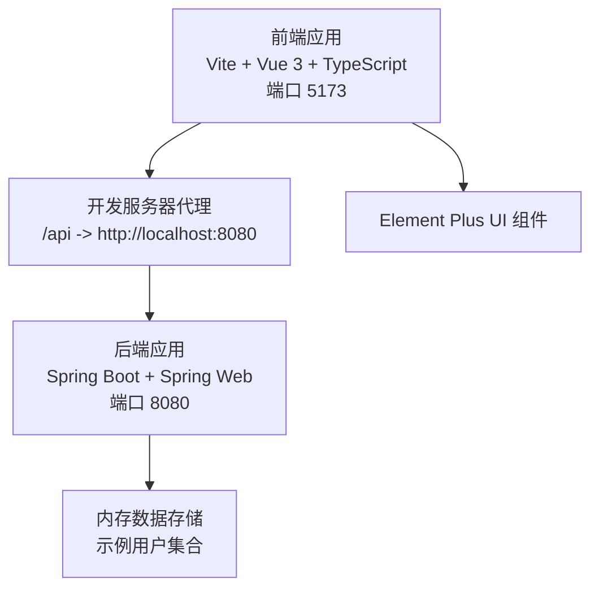
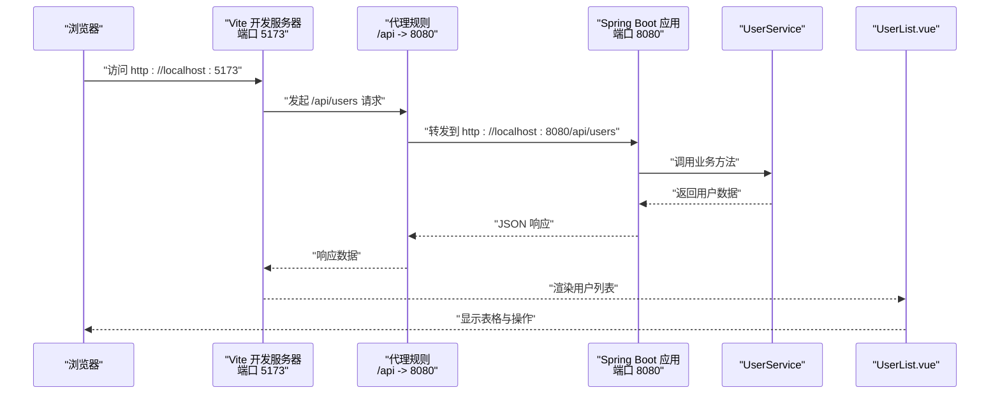
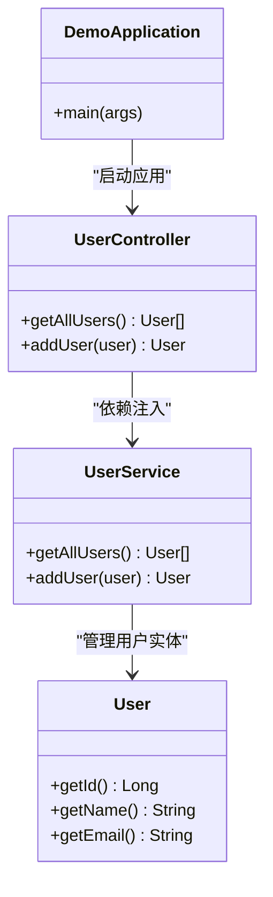
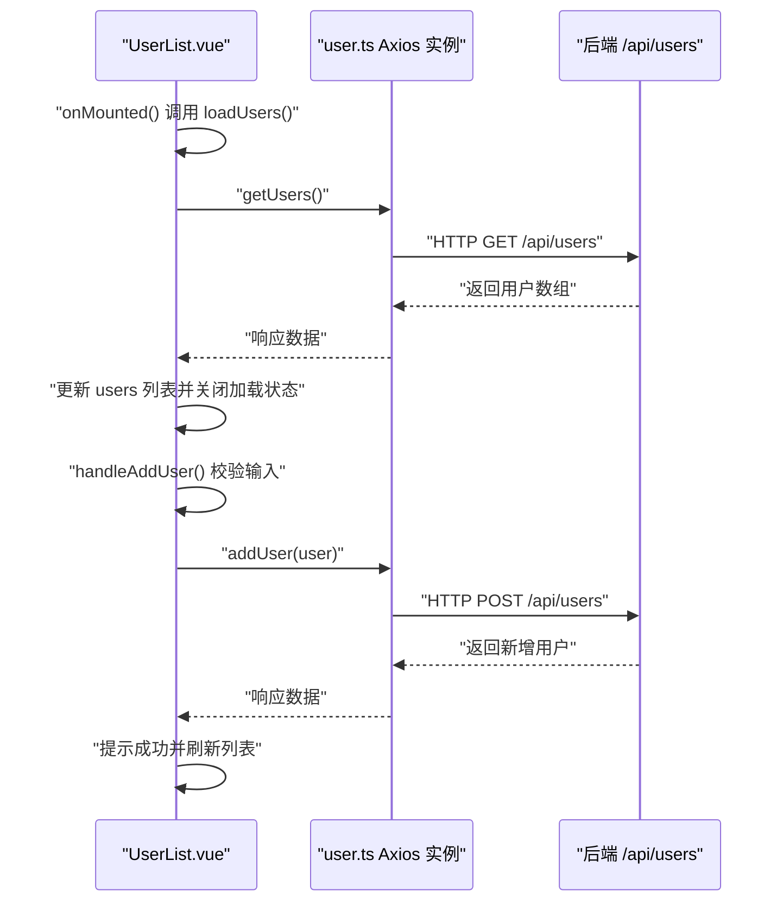
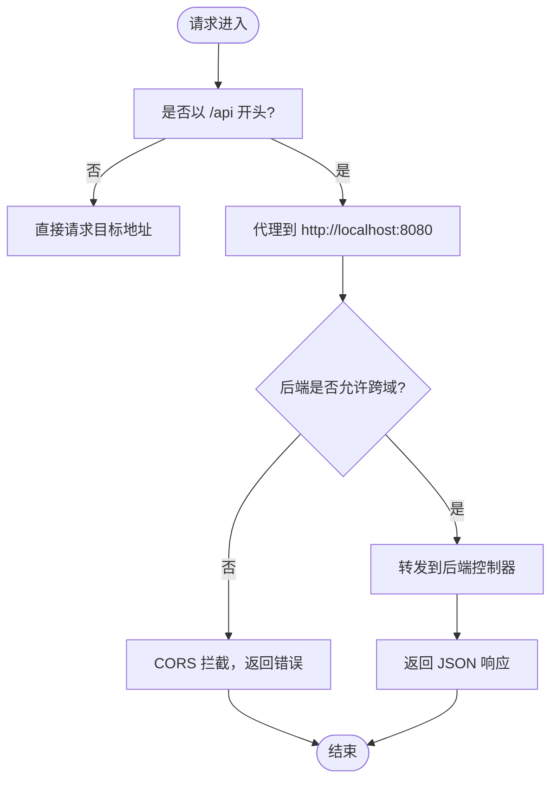
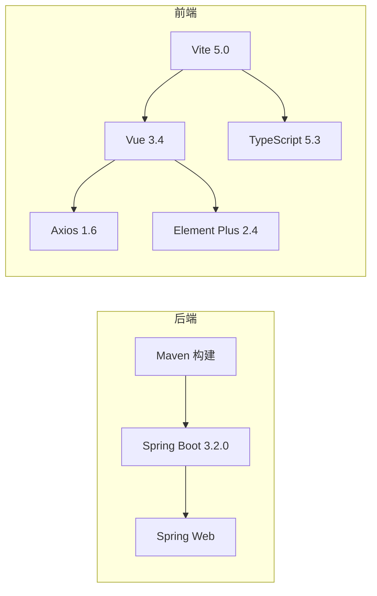

# 故障排除与常见问题

<cite>
**本文引用的文件**
- [README.md](file://README.md)
- [application.yml](file://backend/src/main/resources/application.yml)
- [pom.xml](file://backend/pom.xml)
- [DemoApplication.java](file://backend/src/main/java/com/example/demo/DemoApplication.java)
- [UserController.java](file://backend/src/main/java/com/example/demo/controller/UserController.java)
- [UserService.java](file://backend/src/main/java/com/example/demo/service/UserService.java)
- [User.java](file://backend/src/main/java/com/example/demo/model/User.java)
- [vite.config.ts](file://frontend/vite.config.ts)
- [package.json](file://frontend/package.json)
- [user.ts](file://frontend/src/api/user.ts)
- [UserList.vue](file://frontend/src/views/UserList.vue)
- [main.ts](file://frontend/src/main.ts)
- [tsconfig.json](file://frontend/tsconfig.json)
</cite>

## 目录
1. [简介](#简介)
2. [项目结构](#项目结构)
3. [核心组件](#核心组件)
4. [架构总览](#架构总览)
5. [详细组件分析](#详细组件分析)
6. [依赖关系分析](#依赖关系分析)
7. [性能考虑](#性能考虑)
8. [故障排除指南](#故障排除指南)
9. [结论](#结论)
10. [附录](#附录)

## 简介
本指南面向开发者与技术支持人员，围绕该前后端分离的全栈项目（后端 Spring Boot 3 + Java 21，前端 Vue 3 + TypeScript + Element Plus）提供系统化的故障排除流程。内容覆盖开发环境常见问题（端口冲突、依赖安装失败、跨域访问错误）、运行时问题（API 调用失败、数据显示异常、组件渲染问题）、调试技巧与日志分析、性能排查、版本兼容性与网络配置问题，以及标准化的问题反馈流程。

## 项目结构
该项目采用前后端分离架构：
- 后端：Spring Boot 应用，提供 REST API；默认端口 8080；CORS 已在控制器层面配置允许前端访问。
- 前端：Vite + Vue 3 + TypeScript，开发服务器默认端口 5173；通过代理将 /api 请求转发至后端。
- 核心交互：前端通过 Axios 发起请求到后端 /api/users 接口，后端返回 JSON 数据，前端使用 Element Plus 渲染用户列表。

**图表来源**
- [vite.config.ts:13-21](file://frontend/vite.config.ts#L13-L21)
- [application.yml:1-2](file://backend/src/main/resources/application.yml#L1-L2)
- [UserController.java:11](file://backend/src/main/java/com/example/demo/controller/UserController.java#L11)
- [UserList.vue:36-86](file://frontend/src/views/UserList.vue#L36-L86)

**章节来源**
- [README.md:5-30](file://README.md#L5-L30)
- [vite.config.ts:13-21](file://frontend/vite.config.ts#L13-L21)
- [application.yml:1-2](file://backend/src/main/resources/application.yml#L1-L2)
- [UserController.java:11](file://backend/src/main/java/com/example/demo/controller/UserController.java#L11)

## 核心组件
- 后端应用入口与配置
  - 应用入口类负责启动 Spring Boot 应用。
  - 服务端口与日志级别在配置文件中定义。
- 控制器与服务层
  - 控制器提供 /api/users 的 GET/POST 接口，并声明允许跨域访问。
  - 服务层维护内存中的用户列表，提供查询与新增能力。
- 前端应用与 API 封装
  - Axios 实例统一设置基础路径、超时与请求头。
  - 视图组件负责加载数据、表单校验与消息提示。
- 构建与脚本
  - 后端基于 Maven，使用 Spring Boot 插件打包。
  - 前端基于 Vite，提供开发、构建与预览脚本。

**章节来源**
- [DemoApplication.java:6-11](file://backend/src/main/java/com/example/demo/DemoApplication.java#L6-L11)
- [application.yml:1-12](file://backend/src/main/resources/application.yml#L1-L12)
- [UserController.java:9-28](file://backend/src/main/java/com/example/demo/controller/UserController.java#L9-L28)
- [UserService.java:10-31](file://backend/src/main/java/com/example/demo/service/UserService.java#L10-L31)
- [user.ts:3-9](file://frontend/src/api/user.ts#L3-L9)
- [UserList.vue:36-86](file://frontend/src/views/UserList.vue#L36-L86)
- [pom.xml:39-46](file://backend/pom.xml#L39-L46)
- [package.json:6-9](file://frontend/package.json#L6-L9)

## 架构总览
下图展示了从浏览器到后端的数据流与错误传播路径，便于定位问题环节。

**图表来源**
- [vite.config.ts:15-19](file://frontend/vite.config.ts#L15-L19)
- [UserController.java:20-28](file://backend/src/main/java/com/example/demo/controller/UserController.java#L20-L28)
- [UserService.java:23-31](file://backend/src/main/java/com/example/demo/service/UserService.java#L23-L31)
- [UserList.vue:47-58](file://frontend/src/views/UserList.vue#L47-L58)

## 详细组件分析

### 后端组件分析
- 应用启动与端口
  - 应用入口负责启动 Spring Boot。
  - 服务端口在配置文件中固定为 8080。
- 控制器与跨域
  - 控制器对 /api/users 提供接口，并声明允许来自前端地址的跨域访问。
- 服务层与数据
  - 服务层维护内存中的用户集合，初始化示例数据，提供查询与新增方法。

**图表来源**
- [DemoApplication.java:6-11](file://backend/src/main/java/com/example/demo/DemoApplication.java#L6-L11)
- [UserController.java:14-28](file://backend/src/main/java/com/example/demo/controller/UserController.java#L14-L28)
- [UserService.java:11-31](file://backend/src/main/java/com/example/demo/service/UserService.java#L11-L31)
- [User.java:3-40](file://backend/src/main/java/com/example/demo/model/User.java#L3-L40)

**章节来源**
- [DemoApplication.java:6-11](file://backend/src/main/java/com/example/demo/DemoApplication.java#L6-L11)
- [application.yml:1-2](file://backend/src/main/resources/application.yml#L1-L2)
- [UserController.java:9-28](file://backend/src/main/java/com/example/demo/controller/UserController.java#L9-L28)
- [UserService.java:10-31](file://backend/src/main/java/com/example/demo/service/UserService.java#L10-L31)
- [User.java:3-40](file://backend/src/main/java/com/example/demo/model/User.java#L3-L40)

### 前端组件分析
- 应用入口与 UI 注册
  - 应用入口注册 Element Plus 并挂载根组件。
- API 封装与超时
  - Axios 实例设置基础路径、超时与 Content-Type 头。
- 视图组件与交互
  - 在挂载时加载用户列表。
  - 表单校验不为空后提交新增请求，捕获错误并提示。
  - 使用加载状态与消息提示优化用户体验。

**图表来源**
- [UserList.vue:36-86](file://frontend/src/views/UserList.vue#L36-L86)
- [user.ts:17-23](file://frontend/src/api/user.ts#L17-L23)
- [UserController.java:20-28](file://backend/src/main/java/com/example/demo/controller/UserController.java#L20-L28)

**章节来源**
- [main.ts:1-9](file://frontend/src/main.ts#L1-L9)
- [user.ts:3-9](file://frontend/src/api/user.ts#L3-L9)
- [UserList.vue:36-86](file://frontend/src/views/UserList.vue#L36-L86)

### 代理与跨域流程
- 前端代理
  - Vite 开发服务器将 /api 前缀请求转发到后端 8080 端口。
- 后端跨域
  - 控制器声明允许来自前端地址的跨域访问。
- 常见问题定位
  - 若代理或跨域配置缺失，会出现 403/404 或 CORS 错误。

**图表来源**
- [vite.config.ts:15-19](file://frontend/vite.config.ts#L15-L19)
- [UserController.java:11](file://backend/src/main/java/com/example/demo/controller/UserController.java#L11)

**章节来源**
- [vite.config.ts:13-21](file://frontend/vite.config.ts#L13-L21)
- [UserController.java:11](file://backend/src/main/java/com/example/demo/controller/UserController.java#L11)

## 依赖关系分析
- 后端依赖
  - Spring Web 提供 Web MVC 能力；测试依赖用于单元测试。
- 前端依赖
  - Vue 3、Axios、Element Plus 为主；Vite 提供开发与构建工具链。
- 版本与兼容性
  - 后端 Java 21 + Spring Boot 3.2.0；前端 Vue 3.4 + TypeScript 5.3 + Vite 5.0。
  - 需确保 Node.js 版本满足要求（推荐 v18+），并避免与系统端口冲突。

**图表来源**
- [pom.xml:24-36](file://backend/pom.xml#L24-L36)
- [package.json:11-22](file://frontend/package.json#L11-L22)
- [README.md:94-105](file://README.md#L94-L105)

**章节来源**
- [pom.xml:20-46](file://backend/pom.xml#L20-L46)
- [package.json:6-22](file://frontend/package.json#L6-L22)
- [README.md:94-112](file://README.md#L94-L112)

## 性能考虑
- 启动与热重载
  - 前端开发服务器具备热重载能力，建议在修改组件或 API 后观察变更生效速度。
- 请求超时与并发
  - Axios 设置了超时时间，若后端处理耗时较长，可适当调整以避免前端过早报错。
- 内存数据与分页
  - 示例服务层使用内存存储，适合演示场景；生产环境需引入数据库与分页策略。

[本节为通用指导，无需列出章节来源]

## 故障排除指南

### 一、开发环境问题

1. 端口冲突
   - 现象：启动后端或前端时报端口占用错误。
   - 排查步骤：
     - 检查后端端口 8080 是否被占用。
     - 检查前端端口 5173 是否被占用。
   - 解决方案：
     - 修改后端端口配置或释放占用进程。
     - 修改前端开发服务器端口或释放占用进程。
   - 参考配置：
     - 后端端口：[application.yml:1-2](file://backend/src/main/resources/application.yml#L1-L2)
     - 前端端口：[vite.config.ts:14](file://frontend/vite.config.ts#L14)

2. 依赖安装失败
   - 现象：执行安装命令后出现网络错误或包解析失败。
   - 排查步骤：
     - 确认 Node.js 版本满足要求（推荐 v18+）。
     - 检查网络连通性与代理设置。
     - 清理缓存并重新安装依赖。
   - 解决方案：
     - 使用稳定网络或配置合适的镜像源。
     - 删除 node_modules 与锁定文件后重新安装。
   - 参考配置：
     - 前端脚本与依赖：[package.json:6-22](file://frontend/package.json#L6-L22)
     - 后端构建插件：[pom.xml:39-46](file://backend/pom.xml#L39-L46)

3. 跨域访问错误（CORS）
   - 现象：浏览器控制台出现跨域错误，请求被阻止。
   - 排查步骤：
     - 确认后端控制器已声明允许前端地址访问。
     - 确认前端代理已正确配置并将 /api 转发到后端。
   - 解决方案：
     - 保持后端跨域配置与前端代理一致。
     - 如需支持多域名，请在后端统一配置允许的来源。
   - 参考配置：
     - 后端跨域：[UserController.java:11](file://backend/src/main/java/com/example/demo/controller/UserController.java#L11)
     - 前端代理：[vite.config.ts:15-19](file://frontend/vite.config.ts#L15-L19)

4. 路径别名与模块解析问题
   - 现象：导入模块报错或路径别名无效。
   - 排查步骤：
     - 检查 TypeScript 配置中的路径别名与解析策略。
   - 解决方案：
     - 确保 baseUrl 与 paths 配置正确，且与实际目录结构匹配。
   - 参考配置：
     - 路径别名与解析：[tsconfig.json:23-27](file://frontend/tsconfig.json#L23-L27)

**章节来源**
- [application.yml:1-2](file://backend/src/main/resources/application.yml#L1-L2)
- [vite.config.ts:14-19](file://frontend/vite.config.ts#L14-L19)
- [package.json:6-22](file://frontend/package.json#L6-L22)
- [pom.xml:39-46](file://backend/pom.xml#L39-L46)
- [UserController.java:11](file://backend/src/main/java/com/example/demo/controller/UserController.java#L11)
- [tsconfig.json:23-27](file://frontend/tsconfig.json#L23-L27)

### 二、运行时问题

1. API 调用失败
   - 现象：前端无法获取或提交用户数据。
   - 排查步骤：
     - 检查后端是否正常启动且监听 8080 端口。
     - 检查前端代理是否生效，确认 /api 请求被转发。
     - 查看浏览器网络面板与后端日志。
   - 解决方案：
     - 确保先启动后端再启动前端。
     - 检查控制器映射与服务层实现。
   - 参考配置：
     - 后端控制器映射：[UserController.java:10](file://backend/src/main/java/com/example/demo/controller/UserController.java#L10)
     - 前端 Axios 基础路径：[user.ts:4](file://frontend/src/api/user.ts#L4)

2. 数据显示异常
   - 现象：页面空白或数据格式不正确。
   - 排查步骤：
     - 检查响应数据结构与前端类型定义是否一致。
     - 确认加载状态与错误分支的处理逻辑。
   - 解决方案：
     - 对齐接口返回字段与前端类型定义。
     - 在异常分支中记录错误并提示用户。
   - 参考实现：
     - 数据加载与错误处理：[UserList.vue:47-58](file://frontend/src/views/UserList.vue#L47-L58)
     - 类型定义与 API 方法：[user.ts:11-23](file://frontend/src/api/user.ts#L11-L23)

3. 组件渲染问题
   - 现象：表格不显示或按钮无响应。
   - 排查步骤：
     - 检查组件生命周期钩子是否正确触发。
     - 确认 Element Plus 组件的属性与事件绑定。
   - 解决方案：
     - 确保在挂载完成后发起数据请求。
     - 检查 v-loading、v-model 等指令的使用。
   - 参考实现：
     - 生命周期与事件绑定：[UserList.vue:36-86](file://frontend/src/views/UserList.vue#L36-L86)
     - UI 注册与挂载：[main.ts:1-9](file://frontend/src/main.ts#L1-L9)

**章节来源**
- [UserController.java:10](file://backend/src/main/java/com/example/demo/controller/UserController.java#L10)
- [user.ts:4](file://frontend/src/api/user.ts#L4)
- [UserList.vue:47-58](file://frontend/src/views/UserList.vue#L47-L58)
- [user.ts:11-23](file://frontend/src/api/user.ts#L11-L23)
- [main.ts:1-9](file://frontend/src/main.ts#L1-L9)

### 三、调试技巧与日志分析

- 后端日志
  - 启用更详细的日志级别以便定位问题。
  - 参考配置：[application.yml:9-12](file://backend/src/main/resources/application.yml#L9-L12)
- 前端调试
  - 使用浏览器开发者工具查看网络请求与响应。
  - 在组件中添加必要的日志输出与错误提示。
- 代理调试
  - 确认 /api 前缀是否被正确转发到后端。
  - 参考配置：[vite.config.ts:15-19](file://frontend/vite.config.ts#L15-L19)

**章节来源**
- [application.yml:9-12](file://backend/src/main/resources/application.yml#L9-L12)
- [vite.config.ts:15-19](file://frontend/vite.config.ts#L15-L19)

### 四、性能问题排查流程

- 启动时间
  - 检查后端启动日志，关注慢依赖与初始化耗时。
  - 参考配置：[DemoApplication.java:6-11](file://backend/src/main/java/com/example/demo/DemoApplication.java#L6-L11)
- 请求延迟
  - 使用浏览器网络面板分析请求耗时，检查代理与后端处理时间。
  - 参考实现：[user.ts:5](file://frontend/src/api/user.ts#L5)
- 内存与数据量
  - 示例服务层使用内存存储，建议在大数据场景引入分页与持久化。

**章节来源**
- [DemoApplication.java:6-11](file://backend/src/main/java/com/example/demo/DemoApplication.java#L6-L11)
- [user.ts:5](file://frontend/src/api/user.ts#L5)
- [UserService.java:13-21](file://backend/src/main/java/com/example/demo/service/UserService.java#L13-L21)

### 五、版本兼容性与网络配置

- 版本兼容性
  - 后端：Java 21 + Spring Boot 3.2.0。
  - 前端：Vue 3.4 + TypeScript 5.3 + Vite 5.0。
  - 参考说明：[README.md:94-112](file://README.md#L94-L112)
- 网络配置
  - 代理与跨域配置需保持一致，避免请求被拦截。
  - 参考配置：
    - 代理：[vite.config.ts:15-19](file://frontend/vite.config.ts#L15-L19)
    - 跨域：[UserController.java:11](file://backend/src/main/java/com/example/demo/controller/UserController.java#L11)

**章节来源**
- [README.md:94-112](file://README.md#L94-L112)
- [vite.config.ts:15-19](file://frontend/vite.config.ts#L15-L19)
- [UserController.java:11](file://backend/src/main/java/com/example/demo/controller/UserController.java#L11)

### 六、标准化问题反馈流程

- 收集信息
  - 系统版本、技术栈版本、操作系统与浏览器版本。
  - 重现步骤、期望结果与实际结果。
  - 相关日志片段与截图。
- 分析定位
  - 按照“端口/依赖/代理/CORS/API/渲染”顺序逐项排查。
  - 记录每一步验证结果与结论。
- 修复与验证
  - 提供最小可复现示例与修复方案。
  - 在本地与 CI 环境验证修复效果。
- 文档归档
  - 将问题与解决方案写入知识库，便于后续检索。

[本节为流程性指导，无需列出章节来源]

## 结论
本指南提供了从开发环境到运行时的系统化故障排除方法。遵循端口与依赖检查、代理与跨域验证、API 与渲染调试、日志与性能分析的流程，可高效定位并解决问题。同时，标准化的问题反馈流程有助于团队协作与知识沉淀。

## 附录

### A. 快速检查清单
- 端口：8080 与 5173 未被占用。
- 依赖：Node.js 版本满足要求，依赖安装成功。
- 代理：/api 请求已转发至后端。
- 跨域：后端允许前端来源访问。
- 启动顺序：先启动后端，再启动前端。
- 日志：后端日志级别已启用必要级别。

**章节来源**
- [README.md:114-118](file://README.md#L114-L118)
- [application.yml:1-2](file://backend/src/main/resources/application.yml#L1-L2)
- [vite.config.ts:14-19](file://frontend/vite.config.ts#L14-L19)
- [UserController.java:11](file://backend/src/main/java/com/example/demo/controller/UserController.java#L11)