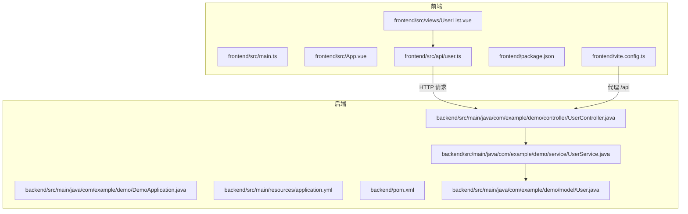
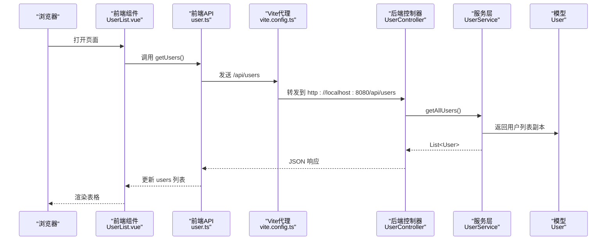
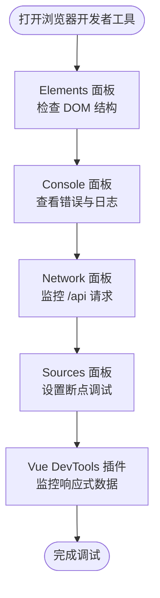
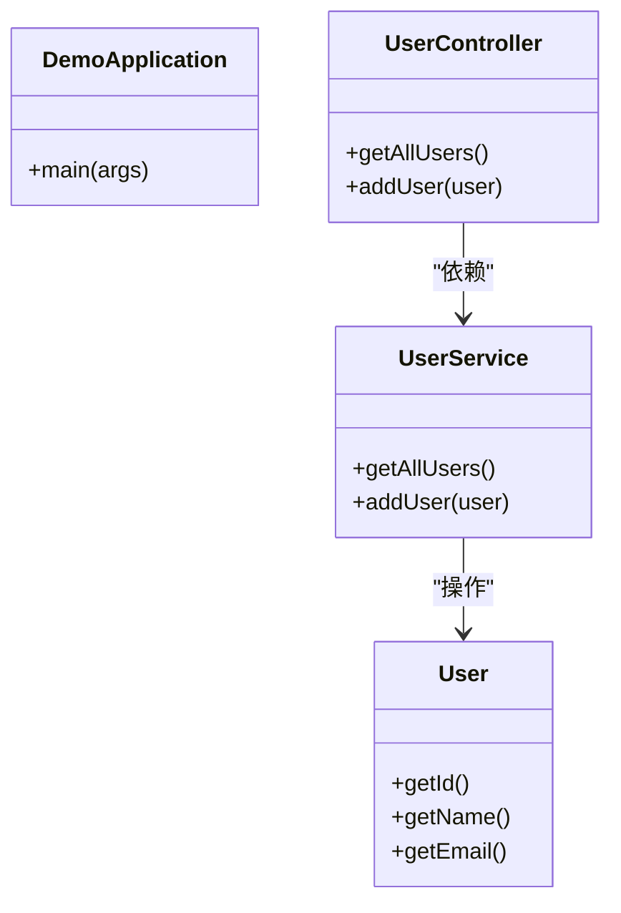
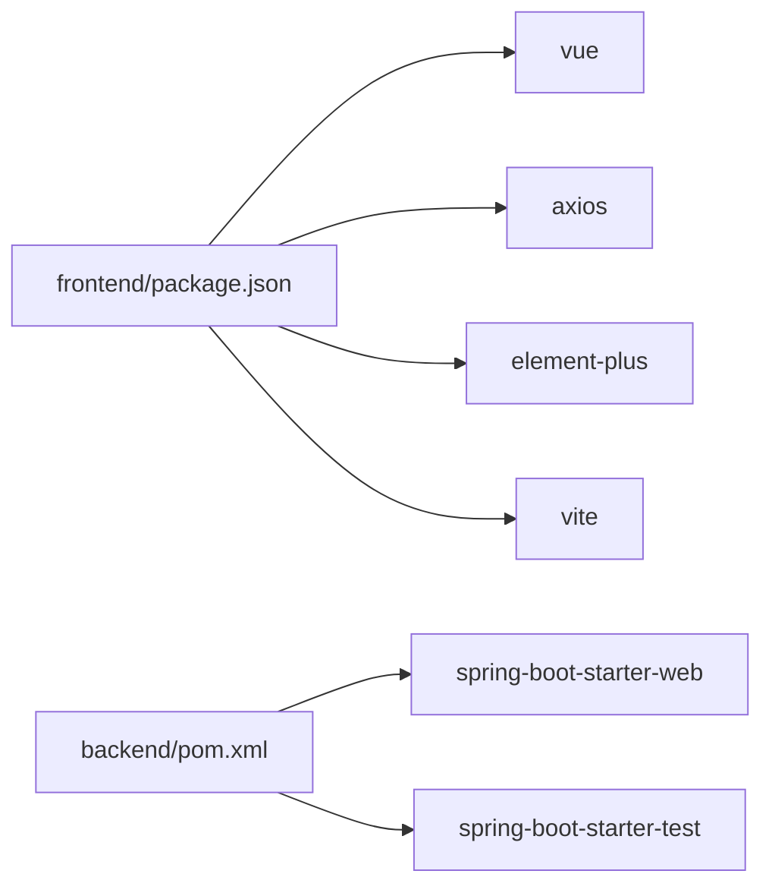

# 调试技巧与工具

<cite>
**本文引用的文件**
- [README.md](file://README.md)
- [DemoApplication.java](file://backend/src/main/java/com/example/demo/DemoApplication.java)
- [UserController.java](file://backend/src/main/java/com/example/demo/controller/UserController.java)
- [UserService.java](file://backend/src/main/java/com/example/demo/service/UserService.java)
- [User.java](file://backend/src/main/java/com/example/demo/model/User.java)
- [application.yml](file://backend/src/main/resources/application.yml)
- [pom.xml](file://backend/pom.xml)
- [main.ts](file://frontend/src/main.ts)
- [App.vue](file://frontend/src/App.vue)
- [UserList.vue](file://frontend/src/views/UserList.vue)
- [user.ts](file://frontend/src/api/user.ts)
- [package.json](file://frontend/package.json)
- [vite.config.ts](file://frontend/vite.config.ts)
</cite>

## 目录
1. [简介](#简介)
2. [项目结构](#项目结构)
3. [核心组件](#核心组件)
4. [架构总览](#架构总览)
5. [详细组件分析](#详细组件分析)
6. [依赖分析](#依赖分析)
7. [性能考虑](#性能考虑)
8. [故障排查指南](#故障排查指南)
9. [结论](#结论)
10. [附录](#附录)

## 简介
本指南面向全栈开发者，围绕浏览器开发者工具、后端调试（Spring Boot）、Vue DevTools、API 测试工具（Postman/curl）以及常见调试场景的最佳实践展开。结合仓库中的实际代码，提供可操作的调试流程与技巧，帮助快速定位问题、提升开发效率。

## 项目结构
该项目为前后端分离的全栈示例：
- 后端：Spring Boot 应用，提供 REST 接口，支持跨域访问前端地址。
- 前端：Vue 3 + TypeScript + Element Plus，通过 Vite 开发服务器运行，并配置了代理转发至后端。

图表来源
- [main.ts:1-10](file://frontend/src/main.ts#L1-L10)
- [App.vue:1-45](file://frontend/src/App.vue#L1-L45)
- [UserList.vue:1-101](file://frontend/src/views/UserList.vue#L1-L101)
- [user.ts:1-26](file://frontend/src/api/user.ts#L1-L26)
- [vite.config.ts:1-23](file://frontend/vite.config.ts#L1-L23)
- [DemoApplication.java:1-13](file://backend/src/main/java/com/example/demo/DemoApplication.java#L1-L13)
- [application.yml:1-13](file://backend/src/main/resources/application.yml#L1-L13)
- [pom.xml:1-48](file://backend/pom.xml#L1-L48)
- [UserController.java:1-30](file://backend/src/main/java/com/example/demo/controller/UserController.java#L1-L30)
- [UserService.java:1-33](file://backend/src/main/java/com/example/demo/service/UserService.java#L1-L33)
- [User.java:1-41](file://backend/src/main/java/com/example/demo/model/User.java#L1-L41)

章节来源
- [README.md:1-119](file://README.md#L1-L119)
- [vite.config.ts:1-23](file://frontend/vite.config.ts#L1-L23)
- [application.yml:1-13](file://backend/src/main/resources/application.yml#L1-L13)

## 核心组件
- 前端应用入口与挂载：创建 Vue 应用并挂载根组件。
- 视图组件：负责用户列表展示、表单输入与消息提示。
- API 封装：基于 axios 的基础配置（baseURL、超时、Content-Type），统一暴露 GET/POST 方法。
- 控制器：提供 /api/users 的 GET/POST 接口，开启跨域允许前端访问。
- 服务层：内存中维护用户列表，提供查询与新增能力。
- 模型：用户实体，包含 id/name/email 字段。
- 后端配置：日志级别配置，便于调试输出；Maven 构建脚本定义依赖与插件。

章节来源
- [main.ts:1-10](file://frontend/src/main.ts#L1-L10)
- [UserList.vue:1-101](file://frontend/src/views/UserList.vue#L1-L101)
- [user.ts:1-26](file://frontend/src/api/user.ts#L1-L26)
- [UserController.java:1-30](file://backend/src/main/java/com/example/demo/controller/UserController.java#L1-L30)
- [UserService.java:1-33](file://backend/src/main/java/com/example/demo/service/UserService.java#L1-L33)
- [User.java:1-41](file://backend/src/main/java/com/example/demo/model/User.java#L1-L41)
- [application.yml:1-13](file://backend/src/main/resources/application.yml#L1-L13)
- [pom.xml:1-48](file://backend/pom.xml#L1-L48)

## 架构总览
前端通过 Vite 代理将 /api 请求转发到后端，后端控制器接收请求并委派给服务层处理，服务层操作内存中的用户集合，最终返回 JSON 响应。

图表来源
- [UserList.vue:47-58](file://frontend/src/views/UserList.vue#L47-L58)
- [user.ts:18-22](file://frontend/src/api/user.ts#L18-L22)
- [vite.config.ts:15-20](file://frontend/vite.config.ts#L15-L20)
- [UserController.java:20-23](file://backend/src/main/java/com/example/demo/controller/UserController.java#L20-L23)
- [UserService.java:23-25](file://backend/src/main/java/com/example/demo/service/UserService.java#L23-L25)
- [User.java:1-41](file://backend/src/main/java/com/example/demo/model/User.java#L1-L41)

## 详细组件分析

### 前端调试要点
- 组件树检查：在浏览器开发者工具中打开 Elements 面板，定位 UserList.vue 渲染出的 DOM 结构，确认 el-table、el-dialog 等元素是否正确渲染。
- 响应式数据监控：在 Console 面板中使用 Vue DevTools 插件查看组件状态（如 users、loading、dialogVisible），观察数据变化与更新时机。
- 网络请求监控：在 Network 面板观察 /api/users 的请求与响应，确认请求头、状态码、响应体是否符合预期。
- 断点调试：在 Sources 面板设置断点于 UserList.vue 的生命周期钩子与事件处理器（如 loadUsers、handleAddUser），逐步执行以定位逻辑问题。

图表来源
- [UserList.vue:47-86](file://frontend/src/views/UserList.vue#L47-L86)
- [user.ts:3-9](file://frontend/src/api/user.ts#L3-L9)

章节来源
- [UserList.vue:1-101](file://frontend/src/views/UserList.vue#L1-L101)
- [user.ts:1-26](file://frontend/src/api/user.ts#L1-L26)

### 后端调试要点
- 日志配置：通过 application.yml 设置 com.example.demo 包与 Spring Web 层的日志级别，便于在控制台查看请求处理链路与业务日志。
- 远程调试：在 IDE 中为 DemoApplication.java 设置远程调试参数（如 JVM 参数），连接本地调试器进行断点调试。
- 断点调试：在 UserController 的映射方法与 UserService 的业务方法中设置断点，观察请求参数、返回值与异常情况。
- 性能与并发：关注内存中的用户列表与原子计数器的线程安全，避免在高并发下出现竞态条件。

图表来源
- [DemoApplication.java:1-13](file://backend/src/main/java/com/example/demo/DemoApplication.java#L1-L13)
- [UserController.java:1-30](file://backend/src/main/java/com/example/demo/controller/UserController.java#L1-L30)
- [UserService.java:1-33](file://backend/src/main/java/com/example/demo/service/UserService.java#L1-L33)
- [User.java:1-41](file://backend/src/main/java/com/example/demo/model/User.java#L1-L41)

章节来源
- [application.yml:8-13](file://backend/src/main/resources/application.yml#L8-L13)
- [UserController.java:1-30](file://backend/src/main/java/com/example/demo/controller/UserController.java#L1-L30)
- [UserService.java:1-33](file://backend/src/main/java/com/example/demo/service/UserService.java#L1-L33)
- [DemoApplication.java:1-13](file://backend/src/main/java/com/example/demo/DemoApplication.java#L1-L13)

### Vue DevTools 使用教程
- 安装与启用：在浏览器扩展商店安装 Vue DevTools，打开目标页面后在开发者工具中切换到 Vue 标签页。
- 组件树检查：查看 App.vue -> UserList.vue 的层级关系，确认 props 传递与插槽使用。
- 响应式数据监控：选中 UserList.vue 实例，观察 users、loading、dialogVisible 等响应式属性的变化。
- 组件性能分析：利用 Profiler 面板记录组件渲染与更新，识别不必要的重渲染路径。

章节来源
- [App.vue:1-45](file://frontend/src/App.vue#L1-L45)
- [UserList.vue:1-101](file://frontend/src/views/UserList.vue#L1-L101)

### API 测试方法（Postman/curl）
- Postman：新建请求，选择 GET/POST，设置 URL 为 http://localhost:8080/api/users，Headers 中设置 Content-Type: application/json，Body 选择 raw 并粘贴 JSON 示例，发送请求并观察响应。
- curl：使用 GET 获取用户列表，使用 POST 提交用户对象，结合 -v 输出详细请求/响应信息，便于排查网络与协议问题。

章节来源
- [README.md:74-90](file://README.md#L74-L90)
- [user.ts:3-9](file://frontend/src/api/user.ts#L3-L9)

## 依赖分析
- 前端依赖：Vue 3、Element Plus、Axios、Vite、TypeScript。
- 后端依赖：Spring Boot Starter Web、测试 Starter。
- 开发服务器：Vite 代理将 /api 转发到后端 8080 端口，避免跨域问题。

图表来源
- [package.json:1-24](file://frontend/package.json#L1-L24)
- [pom.xml:24-36](file://backend/pom.xml#L24-L36)
- [vite.config.ts:13-22](file://frontend/vite.config.ts#L13-L22)

章节来源
- [package.json:1-24](file://frontend/package.json#L1-L24)
- [pom.xml:1-48](file://backend/pom.xml#L1-L48)
- [vite.config.ts:1-23](file://frontend/vite.config.ts#L1-L23)

## 性能考虑
- 前端：合理使用 v-loading 控制加载状态，避免频繁触发不必要的重新渲染；在组件中缓存静态资源与计算结果。
- 后端：内存存储适合演示场景，生产环境建议接入数据库；注意线程安全与并发访问控制。
- 网络：设置合理的超时时间与重试策略；在 Network 面板观察请求耗时与响应大小，优化接口设计。

## 故障排查指南
- 跨域问题：确认后端已配置允许前端地址访问，前端代理是否正确转发 /api 请求。
- 端口冲突：确保 8080（后端）与 5173（前端）未被占用。
- 日志定位：通过 application.yml 提升日志级别，查看请求进入与处理过程的关键节点。
- 错误处理：前端在 try/catch 中捕获异常并显示消息提示，同时在 Console 中记录错误堆栈。
- 断点调试：在关键函数入口与返回处设置断点，逐步执行以验证数据流与控制流。

章节来源
- [UserController.java:11-11](file://backend/src/main/java/com/example/demo/controller/UserController.java#L11-L11)
- [vite.config.ts:15-20](file://frontend/vite.config.ts#L15-L20)
- [application.yml:8-13](file://backend/src/main/resources/application.yml#L8-L13)
- [UserList.vue:47-86](file://frontend/src/views/UserList.vue#L47-L86)

## 结论
通过结合浏览器开发者工具、Vue DevTools、后端日志与断点调试，以及 Postman/curl 的 API 测试，可以系统性地定位与解决全栈开发中的问题。建议在日常开发中养成“先看日志、再查网络、最后断点”的调试顺序，配合组件与数据流的可视化工具，显著提升调试效率。

## 附录
- 快速启动顺序：先启动后端（8080），再启动前端（5173），确保代理生效。
- 常用调试命令参考：后端使用 Maven 启动，前端使用 Vite 开发服务器。

章节来源
- [README.md:34-62](file://README.md#L34-L62)