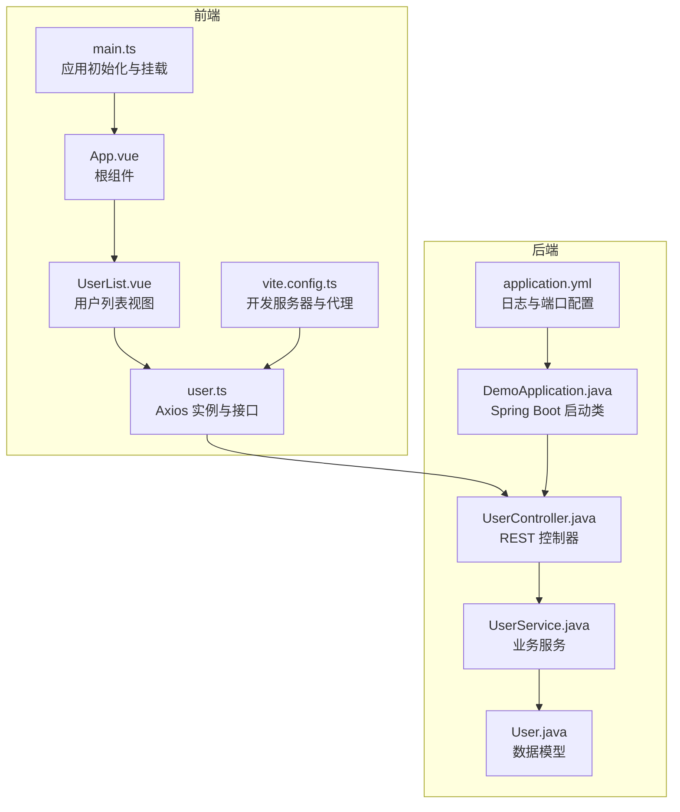
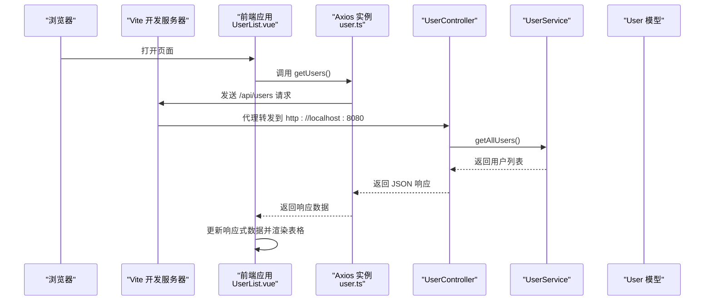
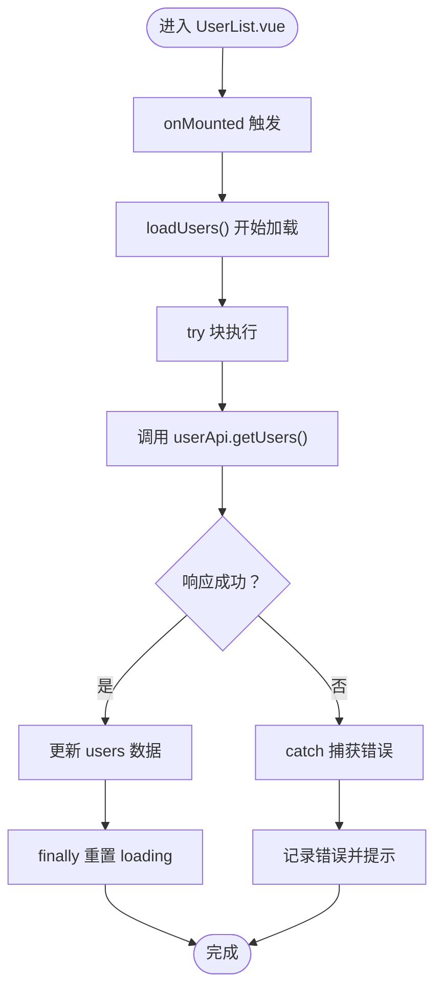
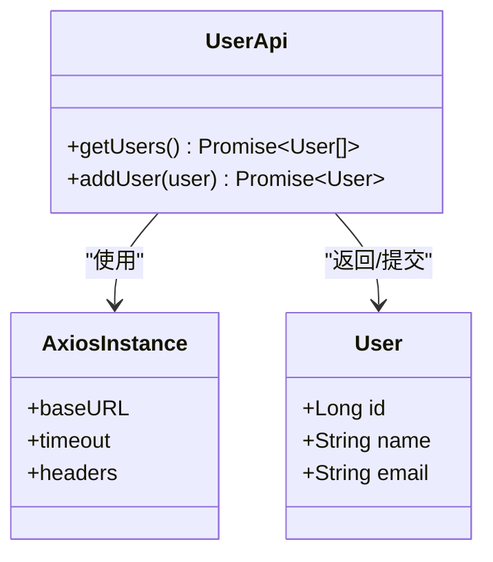
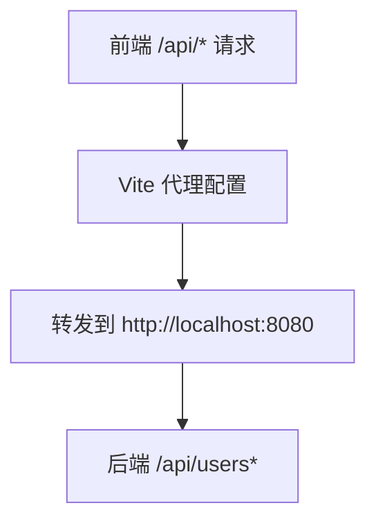
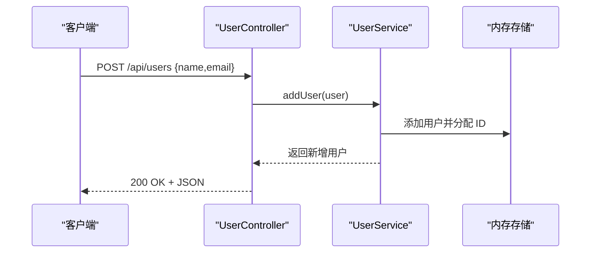
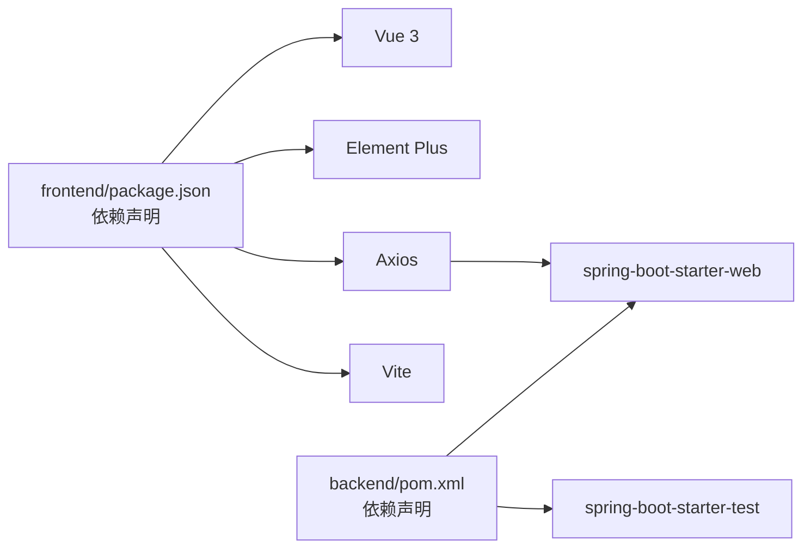

# 运行时问题

<cite>
**本文引用的文件**
- [README.md](file://README.md)
- [frontend/src/main.ts](file://frontend/src/main.ts)
- [frontend/src/App.vue](file://frontend/src/App.vue)
- [frontend/src/api/user.ts](file://frontend/src/api/user.ts)
- [frontend/src/views/UserList.vue](file://frontend/src/views/UserList.vue)
- [frontend/vite.config.ts](file://frontend/vite.config.ts)
- [frontend/package.json](file://frontend/package.json)
- [backend/src/main/java/com/example/demo/DemoApplication.java](file://backend/src/main/java/com/example/demo/DemoApplication.java)
- [backend/src/main/java/com/example/demo/controller/UserController.java](file://backend/src/main/java/com/example/demo/controller/UserController.java)
- [backend/src/main/java/com/example/demo/service/UserService.java](file://backend/src/main/java/com/example/demo/service/UserService.java)
- [backend/src/main/java/com/example/demo/model/User.java](file://backend/src/main/java/com/example/demo/model/User.java)
- [backend/src/main/resources/application.yml](file://backend/src/main/resources/application.yml)
- [backend/pom.xml](file://backend/pom.xml)
</cite>

## 目录
1. [简介](#简介)
2. [项目结构](#项目结构)
3. [核心组件](#核心组件)
4. [架构总览](#架构总览)
5. [详细组件分析](#详细组件分析)
6. [依赖关系分析](#依赖关系分析)
7. [性能考量](#性能考量)
8. [故障排查指南](#故障排查指南)
9. [结论](#结论)
10. [附录](#附录)

## 简介
本指南面向全栈开发者与运维人员，围绕“运行时问题”提供系统化的诊断与解决流程，覆盖以下关键领域：
- API 调用失败排查：网络连通性、请求 URL 校验、响应状态码分析
- 数据显示异常：数据格式不匹配、空值处理、异步加载时机问题
- 组件渲染问题：Vue 生命周期、响应式数据更新、事件绑定
- HTTP 请求拦截器与错误处理：Axios 配置、统一错误处理与异常捕获
- 浏览器开发者工具：网络面板分析、控制台错误排查

本项目为 Vue 3 + Spring Boot 的前后端分离示例，前端通过 Axios 发起请求，Vite 开发服务器配置了代理，将 /api 请求转发至后端；后端提供用户列表与新增接口，并启用跨域支持。

## 项目结构
项目采用前后端分离架构，前端使用 Vue 3 + TypeScript + Element Plus，后端使用 Spring Boot 3.x + Java 21。关键配置与入口如下：
- 前端入口与插件：应用挂载于 main.ts，Element Plus 在 main.ts 中注册；页面由 App.vue 渲染，UserList.vue 展示用户列表与表单交互
- API 封装：user.ts 中定义 axios 实例与用户相关接口
- 开发服务器：vite.config.ts 配置了 /api 代理到后端 8080 端口
- 后端入口：DemoApplication.java 启动 Spring Boot 应用
- 控制器与服务：UserController 暴露 /api/users GET/POST；UserService 提供内存数据与增删改查逻辑
- 配置文件：application.yml 设置日志级别与端口

**图表来源**
- [frontend/src/main.ts:1-10](file://frontend/src/main.ts#L1-L10)
- [frontend/src/App.vue:1-45](file://frontend/src/App.vue#L1-L45)
- [frontend/src/views/UserList.vue:1-101](file://frontend/src/views/UserList.vue#L1-L101)
- [frontend/src/api/user.ts:1-26](file://frontend/src/api/user.ts#L1-L26)
- [frontend/vite.config.ts:1-23](file://frontend/vite.config.ts#L1-L23)
- [backend/src/main/java/com/example/demo/DemoApplication.java:1-13](file://backend/src/main/java/com/example/demo/DemoApplication.java#L1-L13)
- [backend/src/main/java/com/example/demo/controller/UserController.java:1-30](file://backend/src/main/java/com/example/demo/controller/UserController.java#L1-L30)
- [backend/src/main/java/com/example/demo/service/UserService.java:1-33](file://backend/src/main/java/com/example/demo/service/UserService.java#L1-L33)
- [backend/src/main/java/com/example/demo/model/User.java:1-41](file://backend/src/main/java/com/example/demo/model/User.java#L1-L41)
- [backend/src/main/resources/application.yml:1-13](file://backend/src/main/resources/application.yml#L1-L13)

**章节来源**
- [README.md:1-119](file://README.md#L1-L119)
- [frontend/src/main.ts:1-10](file://frontend/src/main.ts#L1-L10)
- [frontend/src/App.vue:1-45](file://frontend/src/App.vue#L1-L45)
- [frontend/src/views/UserList.vue:1-101](file://frontend/src/views/UserList.vue#L1-L101)
- [frontend/src/api/user.ts:1-26](file://frontend/src/api/user.ts#L1-L26)
- [frontend/vite.config.ts:1-23](file://frontend/vite.config.ts#L1-L23)
- [backend/src/main/java/com/example/demo/DemoApplication.java:1-13](file://backend/src/main/java/com/example/demo/DemoApplication.java#L1-L13)
- [backend/src/main/java/com/example/demo/controller/UserController.java:1-30](file://backend/src/main/java/com/example/demo/controller/UserController.java#L1-L30)
- [backend/src/main/java/com/example/demo/service/UserService.java:1-33](file://backend/src/main/java/com/example/demo/service/UserService.java#L1-L33)
- [backend/src/main/java/com/example/demo/model/User.java:1-41](file://backend/src/main/java/com/example/demo/model/User.java#L1-L41)
- [backend/src/main/resources/application.yml:1-13](file://backend/src/main/resources/application.yml#L1-L13)

## 核心组件
- 前端应用初始化与挂载：在 main.ts 中创建应用实例、注册 Element Plus 并挂载到 DOM
- 根组件与路由：App.vue 作为根容器，内部引入 UserList 视图组件
- 用户列表视图：UserList.vue 负责加载用户数据、展示表格、弹窗添加用户、调用 API
- API 封装：user.ts 定义 axios 实例（baseURL、超时、Content-Type），导出 getUsers 与 addUser 方法
- 开发服务器代理：vite.config.ts 将 /api 前缀请求代理到后端 8080 端口
- 后端启动类：DemoApplication.java 启动 Spring Boot 应用
- 控制器与服务：UserController 提供 /api/users GET/POST；UserService 提供内存数据与新增逻辑
- 配置文件：application.yml 设置日志级别与端口

**章节来源**
- [frontend/src/main.ts:1-10](file://frontend/src/main.ts#L1-L10)
- [frontend/src/App.vue:1-45](file://frontend/src/App.vue#L1-L45)
- [frontend/src/views/UserList.vue:1-101](file://frontend/src/views/UserList.vue#L1-L101)
- [frontend/src/api/user.ts:1-26](file://frontend/src/api/user.ts#L1-L26)
- [frontend/vite.config.ts:1-23](file://frontend/vite.config.ts#L1-L23)
- [backend/src/main/java/com/example/demo/DemoApplication.java:1-13](file://backend/src/main/java/com/example/demo/DemoApplication.java#L1-L13)
- [backend/src/main/java/com/example/demo/controller/UserController.java:1-30](file://backend/src/main/java/com/example/demo/controller/UserController.java#L1-L30)
- [backend/src/main/java/com/example/demo/service/UserService.java:1-33](file://backend/src/main/java/com/example/demo/service/UserService.java#L1-L33)
- [backend/src/main/resources/application.yml:1-13](file://backend/src/main/resources/application.yml#L1-L13)

## 架构总览
下图展示了从浏览器发起请求到后端返回数据的整体链路，以及前端组件如何消费数据并渲染 UI。

**图表来源**
- [frontend/src/views/UserList.vue:47-58](file://frontend/src/views/UserList.vue#L47-L58)
- [frontend/src/api/user.ts:17-23](file://frontend/src/api/user.ts#L17-L23)
- [frontend/vite.config.ts:15-20](file://frontend/vite.config.ts#L15-L20)
- [backend/src/main/java/com/example/demo/controller/UserController.java:20-23](file://backend/src/main/java/com/example/demo/controller/UserController.java#L20-L23)
- [backend/src/main/java/com/example/demo/service/UserService.java:23-25](file://backend/src/main/java/com/example/demo/service/UserService.java#L23-L25)
- [backend/src/main/java/com/example/demo/model/User.java:1-41](file://backend/src/main/java/com/example/demo/model/User.java#L1-L41)

## 详细组件分析

### 前端组件：UserList.vue
- 职责：加载用户列表、展示表格、弹窗添加用户、调用 API
- 关键点：
  - 响应式数据：users、loading、dialogVisible、newUser
  - 生命周期：onMounted 钩子中触发 loadUsers
  - 异步处理：loadUsers 使用 try/catch 处理错误，finally 重置 loading
  - 表单校验：handleAddUser 对必填字段进行校验
  - 错误提示：使用 Element Plus 的消息提示组件
- 可能的运行时问题：
  - 网络错误：Axios 超时或跨域失败
  - 数据格式不匹配：后端返回结构与前端类型不一致
  - 异步时机：未等待 loadUsers 导致 UI 未刷新
  - 事件绑定：按钮点击未正确绑定导致无响应

**图表来源**
- [frontend/src/views/UserList.vue:47-58](file://frontend/src/views/UserList.vue#L47-L58)
- [frontend/src/views/UserList.vue:67-82](file://frontend/src/views/UserList.vue#L67-L82)

**章节来源**
- [frontend/src/views/UserList.vue:1-101](file://frontend/src/views/UserList.vue#L1-L101)

### API 封装：user.ts
- 职责：创建 axios 实例，设置 baseURL、超时、默认 Content-Type，并导出用户相关接口
- 关键点：
  - baseURL 设为 http://localhost:8080/api，确保与后端一致
  - 超时时间 5000ms，避免长时间阻塞
  - 接口类型：getUsers 返回数组，addUser 接收 User 参数
- 可能的运行时问题：
  - baseURL 不正确导致 404 或 403
  - 缺少 Content-Type 导致后端无法解析 JSON
  - 未处理网络异常与超时

**图表来源**
- [frontend/src/api/user.ts:11-23](file://frontend/src/api/user.ts#L11-L23)
- [frontend/src/api/user.ts:1-26](file://frontend/src/api/user.ts#L1-L26)
- [backend/src/main/java/com/example/demo/model/User.java:1-41](file://backend/src/main/java/com/example/demo/model/User.java#L1-L41)

**章节来源**
- [frontend/src/api/user.ts:1-26](file://frontend/src/api/user.ts#L1-L26)

### 开发服务器与代理：vite.config.ts
- 职责：配置开发服务器端口与 /api 代理规则，将前端请求转发到后端
- 关键点：
  - 代理目标：http://localhost:8080
  - changeOrigin：解决跨域与 Host 头问题
- 可能的运行时问题：
  - 代理未生效导致 404
  - 端口冲突导致代理失败
  - 路径前缀不匹配导致请求被拒绝

**图表来源**
- [frontend/vite.config.ts:15-20](file://frontend/vite.config.ts#L15-L20)

**章节来源**
- [frontend/vite.config.ts:1-23](file://frontend/vite.config.ts#L1-L23)

### 后端控制器与服务：UserController、UserService
- 职责：提供 REST 接口与业务逻辑
- 关键点：
  - 控制器：/api/users GET 返回用户列表；POST 接收 JSON 并新增用户
  - 服务：内存存储用户列表，自增 ID
  - 跨域：允许前端 http://localhost:5173 访问
- 可能的运行时问题：
  - 跨域未配置导致浏览器阻止请求
  - 请求体未正确映射导致参数为空
  - 内存数据未持久化，重启后丢失

**图表来源**
- [backend/src/main/java/com/example/demo/controller/UserController.java:25-28](file://backend/src/main/java/com/example/demo/controller/UserController.java#L25-L28)
- [backend/src/main/java/com/example/demo/service/UserService.java:27-31](file://backend/src/main/java/com/example/demo/service/UserService.java#L27-L31)

**章节来源**
- [backend/src/main/java/com/example/demo/controller/UserController.java:1-30](file://backend/src/main/java/com/example/demo/controller/UserController.java#L1-L30)
- [backend/src/main/java/com/example/demo/service/UserService.java:1-33](file://backend/src/main/java/com/example/demo/service/UserService.java#L1-L33)

### 应用启动与配置：DemoApplication、application.yml
- 职责：启动后端应用并配置日志级别
- 关键点：
  - DemoApplication：标准 Spring Boot 启动类
  - application.yml：设置端口与日志级别
- 可能的运行时问题：
  - 端口被占用导致启动失败
  - 日志级别过低导致难以定位问题

**章节来源**
- [backend/src/main/java/com/example/demo/DemoApplication.java:1-13](file://backend/src/main/java/com/example/demo/DemoApplication.java#L1-L13)
- [backend/src/main/resources/application.yml:1-13](file://backend/src/main/resources/application.yml#L1-L13)

## 依赖关系分析
- 前端依赖：Vue 3、Element Plus、Axios、Vite
- 后端依赖：Spring Boot Web、测试 Starter
- 前端与后端通过 /api 代理通信，避免跨域问题

**图表来源**
- [frontend/package.json:11-22](file://frontend/package.json#L11-L22)
- [backend/pom.xml:24-36](file://backend/pom.xml#L24-L36)

**章节来源**
- [frontend/package.json:1-24](file://frontend/package.json#L1-L24)
- [backend/pom.xml:1-48](file://backend/pom.xml#L1-L48)

## 性能考量
- 前端：
  - Axios 超时设置合理，避免长时间阻塞
  - 使用 v-loading 展示加载状态，提升用户体验
- 后端：
  - 内存存储适合演示场景，生产环境建议持久化
  - 日志级别适中，便于调试但不影响性能

[本节为通用指导，无需特定文件来源]

## 故障排查指南

### 一、API 调用失败排查
- 网络连接检查
  - 确认后端是否启动且监听 8080 端口
  - 确认前端代理是否生效，/api 请求是否被转发到 8080
  - 检查浏览器控制台是否存在跨域错误
- 请求 URL 验证
  - 前端 baseURL 与后端路径需一致（/api/users）
  - 确认请求方法与路径匹配（GET /users、POST /users）
- 响应状态码分析
  - 2xx：成功，检查响应体结构与类型
  - 4xx：客户端错误（参数缺失、格式错误），查看响应体与后端日志
  - 5xx：服务端错误，检查后端异常堆栈与日志
- 常见问题定位
  - 跨域：确认后端已配置允许前端源
  - Content-Type：确保请求头为 application/json
  - 超时：调整 axios timeout 或优化后端响应速度

**章节来源**
- [frontend/src/api/user.ts:3-9](file://frontend/src/api/user.ts#L3-L9)
- [frontend/vite.config.ts:15-20](file://frontend/vite.config.ts#L15-L20)
- [backend/src/main/java/com/example/demo/controller/UserController.java:11-11](file://backend/src/main/java/com/example/demo/controller/UserController.java#L11-L11)
- [backend/src/main/resources/application.yml:9-13](file://backend/src/main/resources/application.yml#L9-L13)

### 二、数据显示异常排查
- 数据格式不匹配
  - 检查后端返回的 User 字段与前端类型定义是否一致（如 id 类型）
  - 若后端返回 Long，前端需兼容 number/string
- 空值处理
  - 表格列若可能为空，需在模板中提供兜底显示
  - 表单提交前进行必填校验
- 异步加载时机问题
  - 确保在 finally 中重置 loading
  - 新增成功后再次调用 loadUsers 刷新列表
  - 避免在请求未完成时重复提交

**章节来源**
- [frontend/src/views/UserList.vue:47-58](file://frontend/src/views/UserList.vue#L47-L58)
- [frontend/src/views/UserList.vue:67-82](file://frontend/src/views/UserList.vue#L67-L82)
- [backend/src/main/java/com/example/demo/model/User.java:3-6](file://backend/src/main/java/com/example/demo/model/User.java#L3-L6)

### 三、组件渲染问题排查
- Vue 组件生命周期
  - onMounted 中仅做一次初始加载，避免重复请求
  - 确保响应式数据在异步完成后更新
- 响应式数据更新
  - 使用 ref/响应式对象包裹数据，保证模板可追踪
  - 在 try/catch 外层统一处理错误与提示
- 事件绑定问题
  - 检查按钮点击事件是否正确绑定
  - 对话框显隐使用 v-model 双向绑定

**章节来源**
- [frontend/src/views/UserList.vue:84-86](file://frontend/src/views/UserList.vue#L84-L86)
- [frontend/src/views/UserList.vue:61-64](file://frontend/src/views/UserList.vue#L61-L64)

### 四、HTTP 请求拦截器与错误处理
- Axios 配置
  - baseURL、timeout、headers 已在 user.ts 中设置
  - 可扩展：添加请求拦截器统一注入 token、traceId；添加响应拦截器统一处理 4xx/5xx
- 错误处理器
  - 当前在组件中使用 try/catch 并提示错误，建议统一错误处理函数
- 异常捕获机制
  - 在 Vue 应用层面注册全局错误处理器，捕获未处理的 Promise 拒绝与组件错误

[本节为通用指导，无需特定文件来源]

### 五、浏览器开发者工具使用技巧
- 网络面板分析
  - 查看请求 URL、方法、状态码、响应体
  - 检查请求头与响应头，确认 Content-Type 与 CORS
  - 分析请求耗时，定位慢请求
- 控制台错误排查
  - 查看 JS 错误与警告，定位组件渲染与事件绑定问题
  - 结合后端日志，定位服务端异常

[本节为通用指导，无需特定文件来源]

## 结论
本指南基于实际代码结构提供了系统性的运行时问题诊断流程。通过明确前后端职责边界、代理配置、API 接口与组件行为，可以快速定位并解决问题。建议在生产环境中进一步完善：
- 统一的 HTTP 拦截器与错误处理
- 更完善的日志与监控
- 前端更健壮的类型约束与表单校验
- 后端持久化与缓存策略

[本节为总结性内容，无需特定文件来源]

## 附录
- 快速启动顺序：先启动后端（8080），再启动前端（5173）
- API 示例：GET /api/users、POST /api/users（JSON）

**章节来源**
- [README.md:34-62](file://README.md#L34-L62)
- [README.md:74-90](file://README.md#L74-L90)