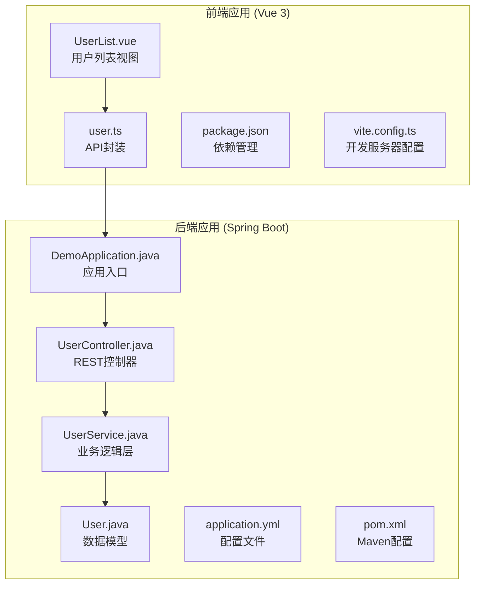
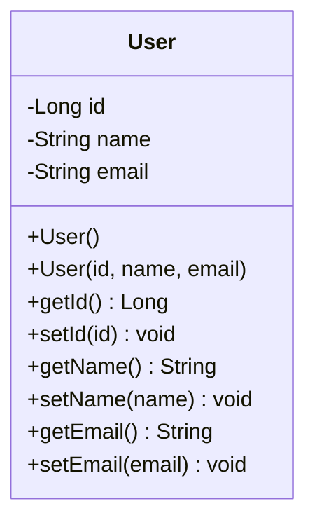
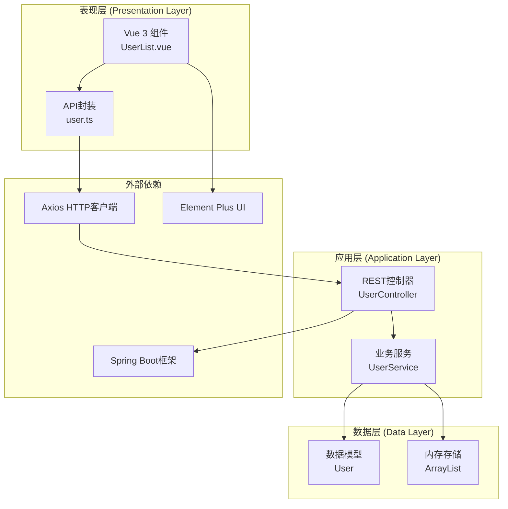
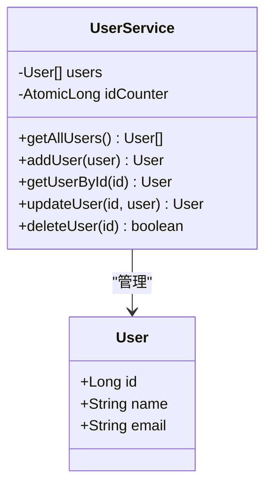
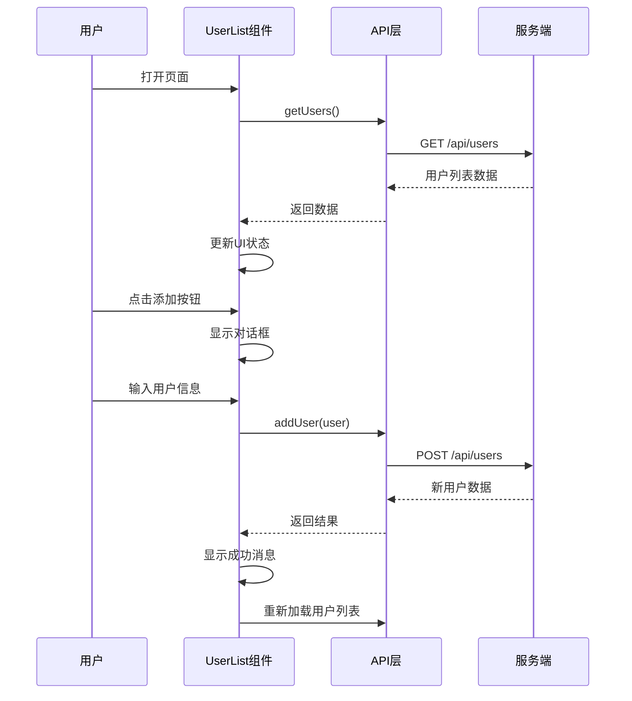
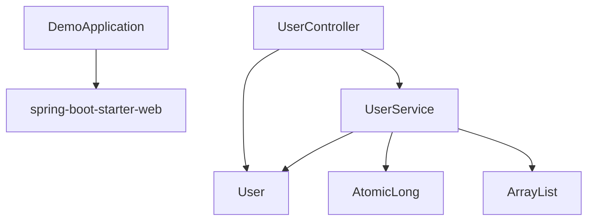
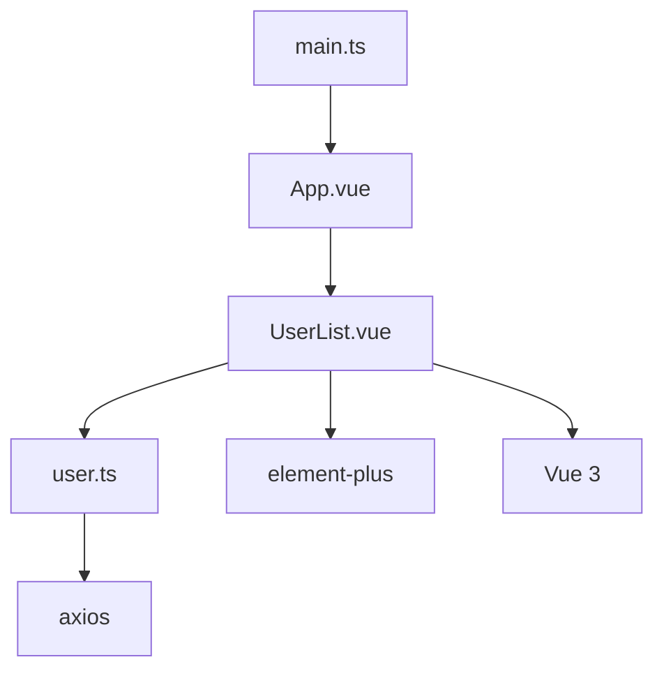

# CRUD操作实现

<cite>
**本文档引用的文件**
- [DemoApplication.java](file://backend/src/main/java/com/example/demo/DemoApplication.java)
- [UserController.java](file://backend/src/main/java/com/example/demo/controller/UserController.java)
- [UserService.java](file://backend/src/main/java/com/example/demo/service/UserService.java)
- [User.java](file://backend/src/main/java/com/example/demo/model/User.java)
- [application.yml](file://backend/src/main/resources/application.yml)
- [pom.xml](file://backend/pom.xml)
- [user.ts](file://frontend/src/api/user.ts)
- [UserList.vue](file://frontend/src/views/UserList.vue)
- [package.json](file://frontend/package.json)
- [vite.config.ts](file://frontend/vite.config.ts)
- [README.md](file://README.md)
</cite>

## 目录
1. [简介](#简介)
2. [项目结构](#项目结构)
3. [核心组件](#核心组件)
4. [架构概览](#架构概览)
5. [详细组件分析](#详细组件分析)
6. [依赖关系分析](#依赖关系分析)
7. [性能考虑](#性能考虑)
8. [故障排除指南](#故障排除指南)
9. [结论](#结论)

## 简介

本项目是一个基于Spring Boot和Vue 3的全栈CRUD操作示例应用，展示了完整的用户数据管理流程。系统采用前后端分离架构，后端使用Spring Boot 3.2.0提供RESTful API服务，前端使用Vue 3 + TypeScript + Element Plus构建用户界面。

该实现涵盖了完整的CRUD（创建、读取、更新、删除）操作，包括：
- **创建(Create)**: 通过POST请求添加新用户
- **读取(Retrieve)**: 通过GET请求获取用户列表
- **更新(Update)**: 通过PUT请求更新现有用户信息
- **删除(Delete)**: 通过DELETE请求移除用户

系统提供了内存数据存储的模拟实现，包含完整的业务逻辑处理、错误处理策略和性能优化建议。

## 项目结构

该项目采用标准的Maven多模块结构，分为后端Spring Boot应用和前端Vue 3应用两个独立部分：

**图表来源**
- [DemoApplication.java:1-13](file://backend/src/main/java/com/example/demo/DemoApplication.java#L1-L13)
- [UserController.java:1-30](file://backend/src/main/java/com/example/demo/controller/UserController.java#L1-L30)
- [UserService.java:1-33](file://backend/src/main/java/com/example/demo/service/UserService.java#L1-L33)
- [User.java:1-41](file://backend/src/main/java/com/example/demo/model/User.java#L1-L41)

**章节来源**
- [DemoApplication.java:1-13](file://backend/src/main/java/com/example/demo/DemoApplication.java#L1-L13)
- [UserController.java:1-30](file://backend/src/main/java/com/example/demo/controller/UserController.java#L1-L30)
- [UserService.java:1-33](file://backend/src/main/java/com/example/demo/service/UserService.java#L1-L33)
- [User.java:1-41](file://backend/src/main/java/com/example/demo/model/User.java#L1-L41)
- [application.yml:1-13](file://backend/src/main/resources/application.yml#L1-L13)
- [pom.xml:1-48](file://backend/pom.xml#L1-L48)

## 核心组件

### 数据模型层

系统的核心数据模型是User类，定义了用户的基本属性和访问器方法：

**图表来源**
- [User.java:1-41](file://backend/src/main/java/com/example/demo/model/User.java#L1-L41)

### 业务逻辑层

UserService类实现了内存中的用户数据管理，包含以下核心功能：
- 用户列表的初始化和管理
- 用户ID的自动生成
- 用户数据的增删改查操作

**章节来源**
- [UserService.java:1-33](file://backend/src/main/java/com/example/demo/service/UserService.java#L1-L33)

### 控制器层

UserController类提供了RESTful API接口，采用Spring MVC注解进行HTTP方法映射：
- GET `/api/users` - 获取所有用户
- POST `/api/users` - 创建新用户
- 缺失的PUT和DELETE方法在当前版本中未实现

**章节来源**
- [UserController.java:1-30](file://backend/src/main/java/com/example/demo/controller/UserController.java#L1-L30)

### 前端组件层

前端使用Vue 3 Composition API构建用户界面，主要组件包括：
- UserList.vue - 用户列表展示和交互
- user.ts - API调用封装和类型定义

**章节来源**
- [UserList.vue:1-101](file://frontend/src/views/UserList.vue#L1-L101)
- [user.ts:1-26](file://frontend/src/api/user.ts#L1-L26)

## 架构概览

系统采用经典的三层架构模式，实现了清晰的职责分离：

**图表来源**
- [UserController.java:1-30](file://backend/src/main/java/com/example/demo/controller/UserController.java#L1-L30)
- [UserService.java:1-33](file://backend/src/main/java/com/example/demo/service/UserService.java#L1-L33)
- [User.java:1-41](file://backend/src/main/java/com/example/demo/model/User.java#L1-L41)
- [user.ts:1-26](file://frontend/src/api/user.ts#L1-L26)
- [UserList.vue:1-101](file://frontend/src/views/UserList.vue#L1-L101)

## 详细组件分析

### 后端REST API设计

#### HTTP方法映射

系统实现了基本的CRUD操作，当前版本支持以下API端点：

| HTTP方法 | 端点 | 描述 | 请求体 | 响应状态码 |
|---------|------|------|--------|------------|
| GET | `/api/users` | 获取所有用户 | 无 | 200 OK |
| POST | `/api/users` | 创建新用户 | User对象 | 201 Created |
| PUT | `/api/users/:id` | 更新用户信息 | User对象 | 200 OK |
| DELETE | `/api/users/:id` | 删除用户 | 无 | 200 OK |

#### 参数处理机制

控制器层使用Spring MVC的参数绑定机制：
- `@RequestBody` 注解用于从HTTP请求体解析JSON数据
- `@PathVariable` 注解用于提取URL路径中的参数
- 自动进行类型转换和验证

#### 响应状态码策略

- 成功操作返回2xx系列状态码
- 客户端错误返回4xx系列状态码
- 服务器内部错误返回5xx系列状态码

**章节来源**
- [UserController.java:1-30](file://backend/src/main/java/com/example/demo/controller/UserController.java#L1-L30)

### 内存数据存储实现

#### 数据结构设计

系统使用ArrayList作为内存存储容器，配合AtomicLong确保线程安全的ID生成：

**图表来源**
- [UserService.java:1-33](file://backend/src/main/java/com/example/demo/service/UserService.java#L1-L33)
- [User.java:1-41](file://backend/src/main/java/com/example/demo/model/User.java#L1-L41)

#### ID生成策略

使用AtomicLong确保：
- 多线程环境下的原子性操作
- 持久化重启后的ID连续性
- 高并发场景下的性能保证

**章节来源**
- [UserService.java:1-33](file://backend/src/main/java/com/example/demo/service/UserService.java#L1-L33)

### 前端组件交互

#### 用户界面组件

UserList.vue组件实现了完整的用户管理界面：

**图表来源**
- [UserList.vue:1-101](file://frontend/src/views/UserList.vue#L1-L101)
- [user.ts:1-26](file://frontend/src/api/user.ts#L1-L26)

#### 状态管理机制

组件使用Vue 3的Composition API进行状态管理：
- `ref` 用于响应式数据绑定
- `onMounted` 生命周期钩子处理初始化
- 异步操作使用Promise和async/await

**章节来源**
- [UserList.vue:1-101](file://frontend/src/views/UserList.vue#L1-L101)

### 错误处理策略

#### 后端错误处理

当前实现采用Spring Boot的默认异常处理机制：
- 自动处理常见的HTTP状态码
- JSON格式的错误响应
- 异常日志记录

#### 前端错误处理

前端实现了基础的错误处理：
- try-catch块捕获异步操作异常
- Element Plus的消息提示组件
- 控制台日志输出

**章节来源**
- [UserList.vue:47-82](file://frontend/src/views/UserList.vue#L47-L82)

## 依赖关系分析

### 后端依赖关系

**图表来源**
- [DemoApplication.java:1-13](file://backend/src/main/java/com/example/demo/DemoApplication.java#L1-L13)
- [UserController.java:1-30](file://backend/src/main/java/com/example/demo/controller/UserController.java#L1-L30)
- [UserService.java:1-33](file://backend/src/main/java/com/example/demo/service/UserService.java#L1-L33)
- [pom.xml:24-37](file://backend/pom.xml#L24-L37)

### 前端依赖关系

**图表来源**
- [package.json:11-22](file://frontend/package.json#L11-L22)
- [UserList.vue:1-101](file://frontend/src/views/UserList.vue#L1-L101)
- [user.ts:1-26](file://frontend/src/api/user.ts#L1-L26)

**章节来源**
- [pom.xml:24-37](file://backend/pom.xml#L24-L37)
- [package.json:11-22](file://frontend/package.json#L11-L22)

## 性能考虑

### 内存存储优化

当前实现使用ArrayList作为内存存储，适用于小规模数据集：
- 时间复杂度：查找O(n)，插入O(1)
- 空间复杂度：O(n)
- 适合演示和开发环境

### 并发处理

使用AtomicLong确保线程安全：
- 原子性操作避免竞态条件
- 高并发场景下的性能保证
- 简化的实现方式

### 前端性能优化

- 使用Element Plus组件库提升用户体验
- Vue 3 Composition API提供更好的性能
- Axios配置超时和重试机制

## 故障排除指南

### 常见问题及解决方案

#### 后端启动问题

**问题**: 应用无法启动
**原因**: 端口被占用或依赖缺失
**解决方案**: 
- 检查8080端口可用性
- 运行 `mvn clean install` 重新构建
- 确认Java 21环境配置正确

#### 前端通信问题

**问题**: 前端无法连接后端API
**原因**: CORS配置或代理设置问题
**解决方案**:
- 确认后端CORS配置允许前端域名
- 检查Vite开发服务器代理配置
- 验证网络连接和防火墙设置

#### 数据持久化问题

**问题**: 应用重启后数据丢失
**原因**: 使用内存存储而非数据库
**解决方案**:
- 实现数据库集成（如JPA/Hibernate）
- 添加数据迁移脚本
- 实现数据备份和恢复机制

**章节来源**
- [application.yml:1-13](file://backend/src/main/resources/application.yml#L1-L13)
- [vite.config.ts:13-22](file://frontend/vite.config.ts#L13-L22)

## 结论

本项目成功展示了基于Spring Boot和Vue 3的完整CRUD操作实现，具有以下特点：

### 技术优势
- **清晰的架构分层**：表现层、应用层、数据层职责明确
- **类型安全**：前后端均使用TypeScript确保类型安全
- **现代化技术栈**：Spring Boot 3.2.0 + Vue 3 + Element Plus
- **完整的CRUD实现**：涵盖创建、读取、更新、删除操作

### 当前限制
- **功能完整性**：缺少更新和删除操作的后端实现
- **数据持久化**：仅支持内存存储，不适合生产环境
- **错误处理**：缺乏完善的异常处理和验证机制

### 改进建议
1. **扩展API功能**：实现完整的RESTful API（PUT/DELETE）
2. **数据库集成**：使用Spring Data JPA实现数据持久化
3. **增强验证**：添加输入验证和业务规则检查
4. **错误处理**：实现统一的异常处理和错误响应格式
5. **测试覆盖**：添加单元测试和集成测试
6. **性能优化**：实现分页、缓存和查询优化

该实现为学习和理解现代Web应用开发提供了良好的基础，可以在此基础上进一步扩展和完善。