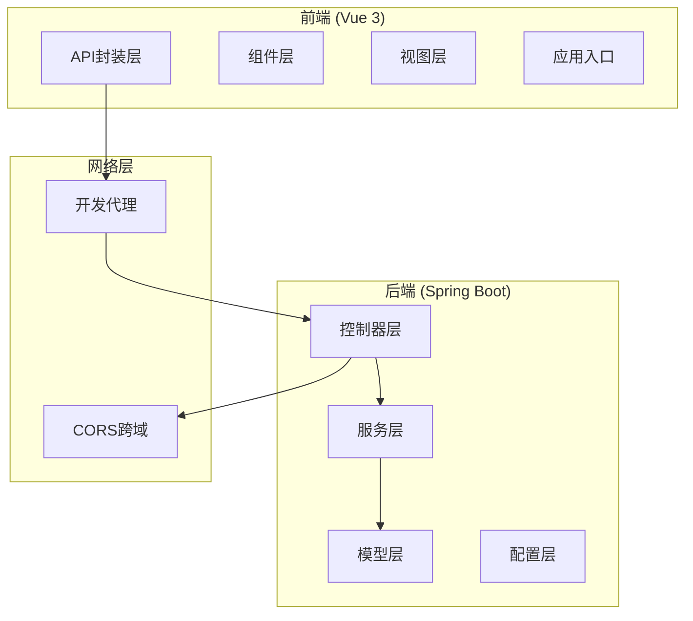
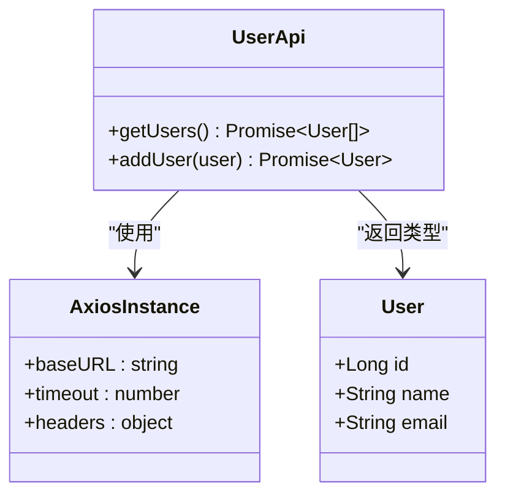
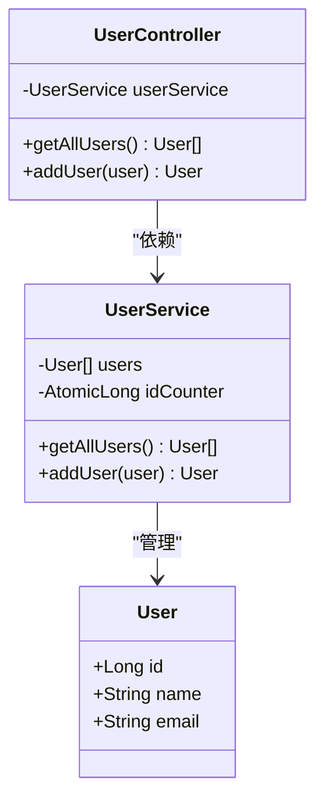
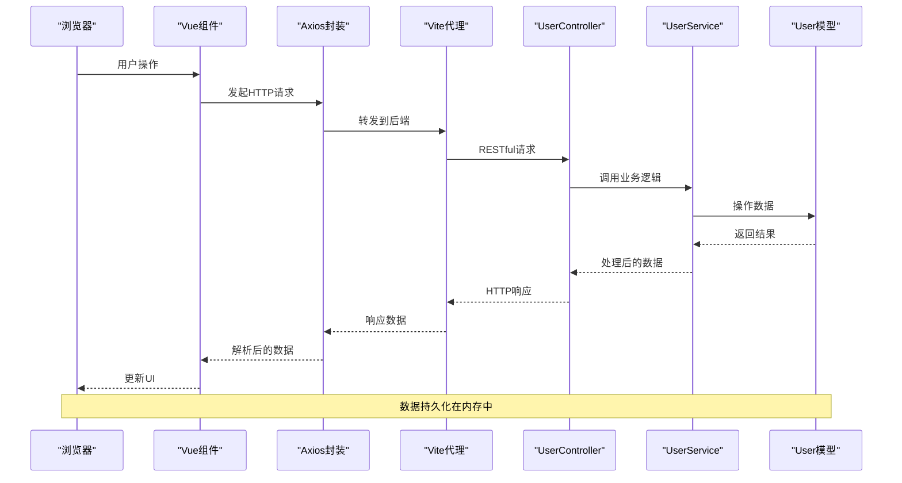
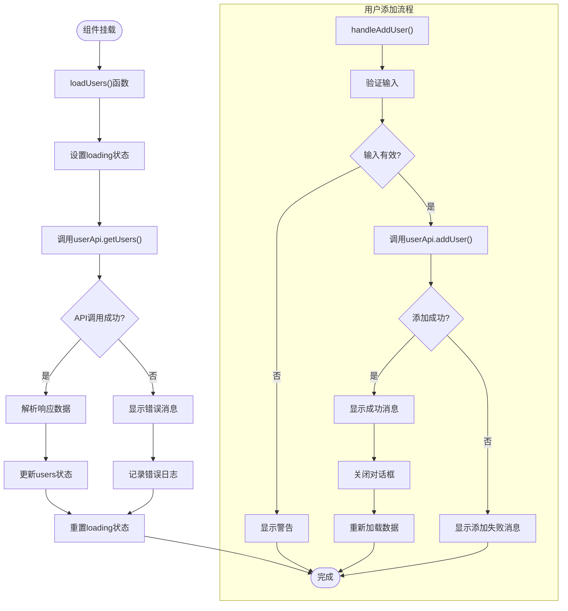
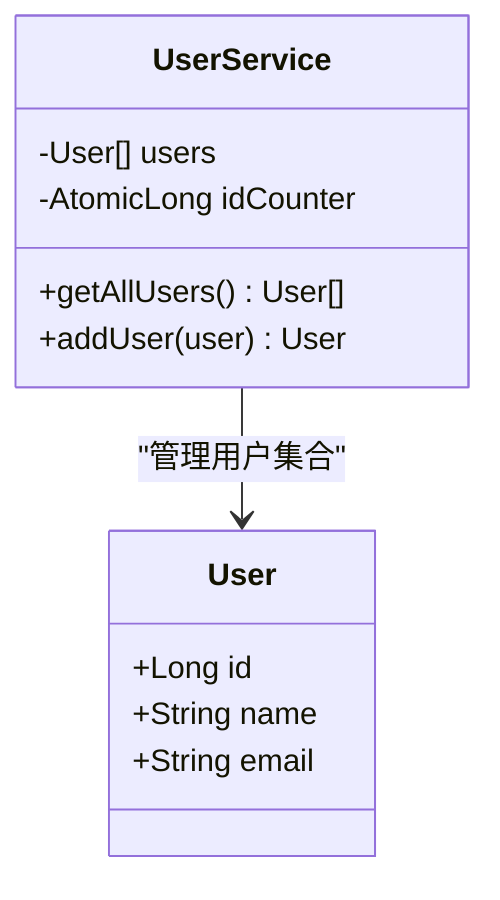
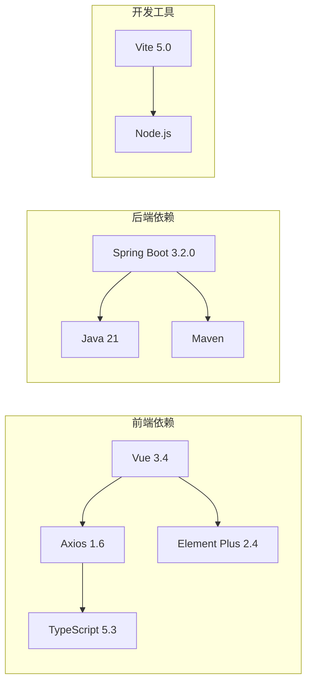

# 前后端数据交互流程

<cite>
**本文档引用的文件**
- [UserController.java](file://backend/src/main/java/com/example/demo/controller/UserController.java)
- [UserService.java](file://backend/src/main/java/com/example/demo/service/UserService.java)
- [User.java](file://backend/src/main/java/com/example/demo/model/User.java)
- [application.yml](file://backend/src/main/resources/application.yml)
- [user.ts](file://frontend/src/api/user.ts)
- [UserList.vue](file://frontend/src/views/UserList.vue)
- [main.ts](file://frontend/src/main.ts)
- [vite.config.ts](file://frontend/vite.config.ts)
- [package.json](file://frontend/package.json)
- [pom.xml](file://backend/pom.xml)
- [README.md](file://README.md)
</cite>

## 目录
1. [简介](#简介)
2. [项目结构](#项目结构)
3. [核心组件](#核心组件)
4. [架构概览](#架构概览)
5. [详细组件分析](#详细组件分析)
6. [依赖关系分析](#依赖关系分析)
7. [性能考虑](#性能考虑)
8. [故障排除指南](#故障排除指南)
9. [结论](#结论)

## 简介

本项目是一个基于Vue 3 + Spring Boot的前后端分离全栈应用示例，专注于展示完整的数据交互流程。该系统实现了用户管理功能，包括用户列表展示和用户添加操作，涵盖了现代Web应用开发中的关键数据交互模式。

系统采用RESTful API设计原则，通过Axios进行HTTP请求封装，实现了请求拦截、响应处理和错误统一管理。前端使用Vue 3的Composition API和TypeScript，后端采用Spring Boot框架，两者通过CORS跨域机制实现通信。

## 项目结构

该项目采用标准的前后端分离架构，具有清晰的模块化组织：

**图表来源**
- [main.ts:1-10](file://frontend/src/main.ts#L1-L10)
- [UserController.java:1-30](file://backend/src/main/java/com/example/demo/controller/UserController.java#L1-L30)
- [UserService.java:1-33](file://backend/src/main/java/com/example/demo/service/UserService.java#L1-L33)

**章节来源**
- [README.md:1-119](file://README.md#L1-L119)
- [package.json:1-24](file://frontend/package.json#L1-L24)
- [pom.xml:1-48](file://backend/pom.xml#L1-L48)

## 核心组件

### 前端API封装层

前端的API封装采用了Axios实例化的方式，提供了类型安全的接口定义：

**图表来源**
- [user.ts:11-25](file://frontend/src/api/user.ts#L11-L25)

### 后端控制器层

后端控制器实现了标准的RESTful API端点，支持用户资源的CRUD操作：

**图表来源**
- [UserController.java:14-28](file://backend/src/main/java/com/example/demo/controller/UserController.java#L14-L28)
- [UserService.java:11-31](file://backend/src/main/java/com/example/demo/service/UserService.java#L11-L31)

**章节来源**
- [user.ts:1-26](file://frontend/src/api/user.ts#L1-L26)
- [UserController.java:1-30](file://backend/src/main/java/com/example/demo/controller/UserController.java#L1-L30)
- [UserService.java:1-33](file://backend/src/main/java/com/example/demo/service/UserService.java#L1-L33)

## 架构概览

系统采用经典的三层架构模式，实现了清晰的职责分离：

**图表来源**
- [UserList.vue:47-86](file://frontend/src/views/UserList.vue#L47-L86)
- [user.ts:17-23](file://frontend/src/api/user.ts#L17-L23)
- [UserController.java:20-28](file://backend/src/main/java/com/example/demo/controller/UserController.java#L20-L28)

## 详细组件分析

### Vue组件数据流

用户列表组件展示了完整的数据交互流程：

**图表来源**
- [UserList.vue:46-86](file://frontend/src/views/UserList.vue#L46-L86)

**章节来源**
- [UserList.vue:1-101](file://frontend/src/views/UserList.vue#L1-L101)

### Axios API封装设计

前端的API封装体现了良好的设计模式：

#### 基础配置
- **基础URL**: `http://localhost:8080/api`
- **超时时间**: 5000ms
- **默认头部**: `application/json`
- **类型安全**: 使用TypeScript接口定义

#### 设计模式特点
1. **单一职责**: 每个API函数只负责一个特定的业务操作
2. **类型约束**: 所有接口都有明确的TypeScript类型定义
3. **错误处理**: 统一的错误处理机制
4. **可扩展性**: 易于添加新的API端点

**章节来源**
- [user.ts:1-26](file://frontend/src/api/user.ts#L1-L26)

### Spring Boot控制器实现

后端控制器遵循RESTful设计原则：

#### 端点设计
- **GET /api/users**: 获取所有用户
- **POST /api/users**: 创建新用户

#### 跨域配置
- **允许来源**: `http://localhost:5173`
- **自动配置**: 使用注解简化CORS设置

**章节来源**
- [UserController.java:1-30](file://backend/src/main/java/com/example/demo/controller/UserController.java#L1-L30)

### 服务层业务逻辑

服务层实现了简单的内存数据管理：

**图表来源**
- [UserService.java:11-31](file://backend/src/main/java/com/example/demo/service/UserService.java#L11-L31)

**章节来源**
- [UserService.java:1-33](file://backend/src/main/java/com/example/demo/service/UserService.java#L1-L33)

## 依赖关系分析

系统各层之间的依赖关系清晰明确：

**图表来源**
- [package.json:11-22](file://frontend/package.json#L11-L22)
- [pom.xml:24-37](file://backend/pom.xml#L24-L37)

**章节来源**
- [package.json:1-24](file://frontend/package.json#L1-L24)
- [pom.xml:1-48](file://backend/pom.xml#L1-L48)

## 性能考虑

### 前端性能优化策略

1. **请求缓存**
   - 在组件层面实现数据缓存
   - 避免重复的API调用
   - 支持手动刷新机制

2. **并发控制**
   - 防止重复提交
   - 加载状态管理
   - 错误重试机制

3. **UI响应性**
   - 使用loading状态指示
   - 即时反馈用户操作
   - 错误消息提示

### 后端性能考虑

1. **内存数据存储**
   - 简单高效的数据访问
   - 原子性操作保证
   - 适合演示用途

2. **CORS配置优化**
   - 精确的来源限制
   - 生产环境的安全配置

**章节来源**
- [UserList.vue:41-86](file://frontend/src/views/UserList.vue#L41-L86)
- [application.yml:1-13](file://backend/src/main/resources/application.yml#L1-L13)

## 故障排除指南

### 常见问题及解决方案

#### 跨域问题
**症状**: 浏览器控制台出现CORS错误
**原因**: 前后端端口不匹配或CORS配置不正确
**解决**: 
- 确认前端代理配置指向正确的后端地址
- 检查后端CORS配置的允许来源
- 验证开发服务器端口设置

#### API调用失败
**症状**: 用户列表无法加载或添加用户失败
**原因**: 后端服务未启动或端口被占用
**解决**:
- 确保后端服务在8080端口正常运行
- 检查数据库连接（如适用）
- 验证API端点路径正确性

#### 类型错误
**症状**: TypeScript编译错误
**原因**: 接口定义与实际响应不匹配
**解决**:
- 检查API响应格式
- 更新TypeScript接口定义
- 确认字段名称一致性

**章节来源**
- [README.md:114-119](file://README.md#L114-L119)

## 结论

本项目成功展示了现代Web应用的完整数据交互流程。通过Vue 3 + Spring Boot的技术组合，实现了：

1. **清晰的架构分层**: 前后端职责明确，便于维护和扩展
2. **RESTful API设计**: 符合HTTP标准的接口规范
3. **类型安全**: TypeScript确保编译时类型检查
4. **用户体验**: 完善的错误处理和加载状态管理
5. **开发效率**: 现代化的开发工具链支持

该架构为构建更复杂的企业级应用提供了良好的基础，可以在此基础上添加认证授权、数据库集成、缓存策略等高级功能。