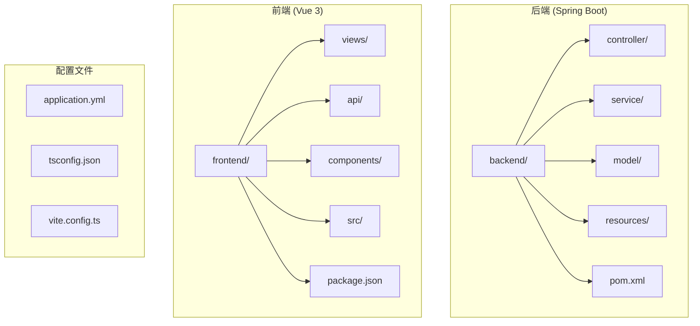
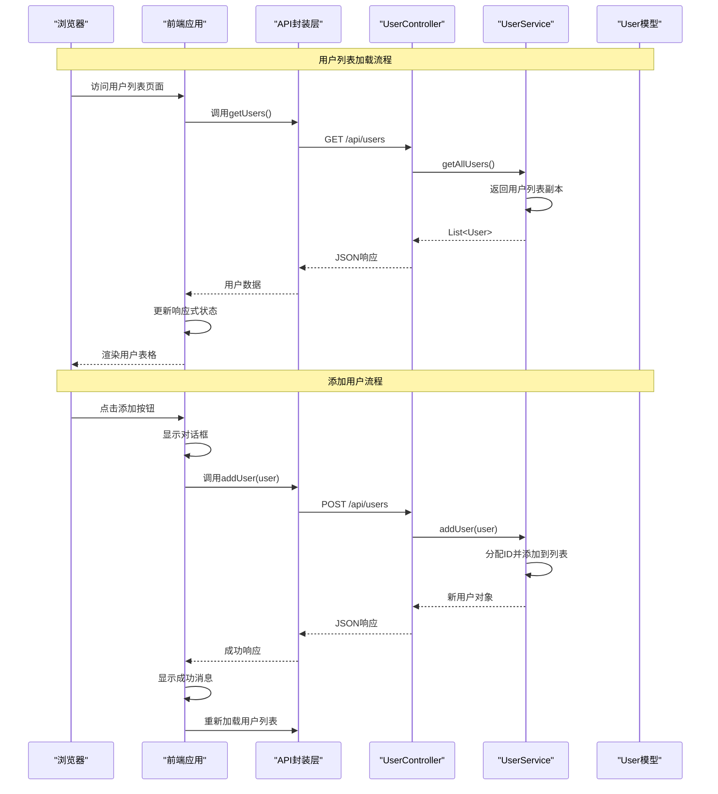
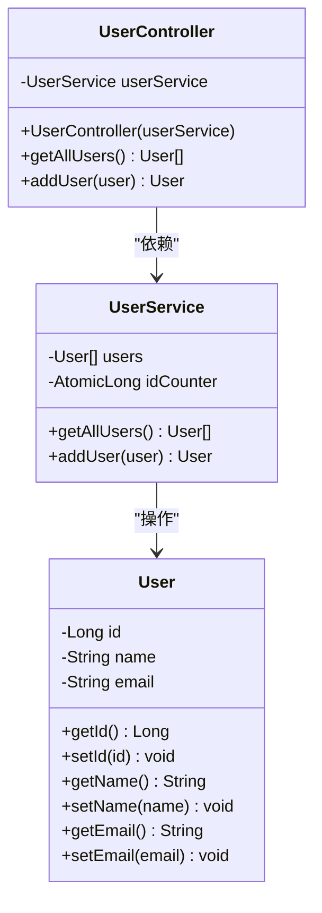
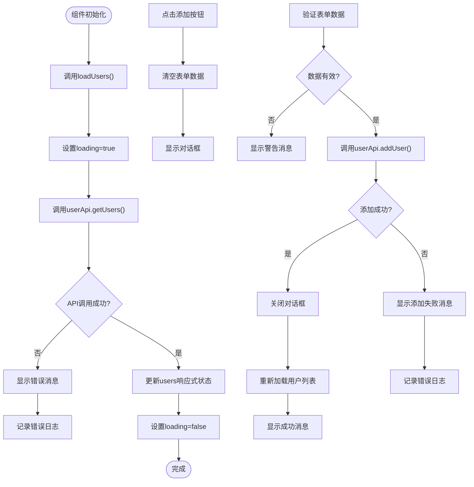
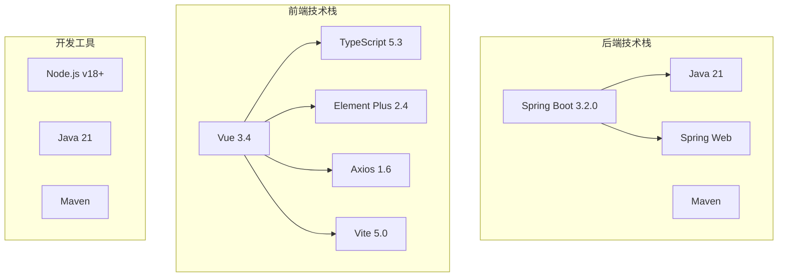

# 核心功能实现

<cite>
**本文档引用的文件**
- [UserController.java](file://backend/src/main/java/com/example/demo/controller/UserController.java)
- [UserService.java](file://backend/src/main/java/com/example/demo/service/UserService.java)
- [User.java](file://backend/src/main/java/com/example/demo/model/User.java)
- [UserList.vue](file://frontend/src/views/UserList.vue)
- [user.ts](file://frontend/src/api/user.ts)
- [application.yml](file://backend/src/main/resources/application.yml)
- [App.vue](file://frontend/src/App.vue)
- [package.json](file://frontend/package.json)
- [pom.xml](file://backend/pom.xml)
- [README.md](file://README.md)
</cite>

## 目录
1. [简介](#简介)
2. [项目结构](#项目结构)
3. [核心组件](#核心组件)
4. [架构概览](#架构概览)
5. [详细组件分析](#详细组件分析)
6. [依赖关系分析](#依赖关系分析)
7. [性能考虑](#性能考虑)
8. [故障排除指南](#故障排除指南)
9. [结论](#结论)

## 简介

Quder项目是一个基于Vue 3 + Spring Boot的全栈用户管理系统示例。该项目展示了现代Web应用的典型架构模式，包括前后端分离的设计理念、RESTful API设计原则以及响应式状态管理的最佳实践。系统提供了完整的用户管理功能，包括用户列表展示、用户添加、数据验证和基础的CRUD操作。

## 项目结构

项目采用标准的前后端分离架构，后端使用Spring Boot作为服务端框架，前端使用Vue 3配合TypeScript构建用户界面。

**图表来源**
- [pom.xml:1-48](file://backend/pom.xml#L1-L48)
- [package.json:1-24](file://frontend/package.json#L1-L24)

**章节来源**
- [README.md:5-30](file://README.md#L5-L30)
- [pom.xml:1-48](file://backend/pom.xml#L1-L48)
- [package.json:1-24](file://frontend/package.json#L1-L24)

## 核心组件

### 后端核心组件

后端采用经典的三层架构模式，包括控制器层、服务层和数据模型层。

#### 数据模型层
用户实体类定义了用户的基本属性和访问器方法，支持标准的Java Bean模式。

#### 服务层
业务逻辑层实现了用户数据的内存存储和基本操作，包括用户列表管理和新增用户功能。

#### 控制器层
REST控制器提供了标准的HTTP接口，支持用户列表查询和用户添加操作。

### 前端核心组件

前端使用Vue 3 Composition API构建响应式用户界面，集成了Element Plus组件库和Axios进行HTTP通信。

#### 视图组件
用户列表页面实现了完整的用户管理界面，包括表格展示、表单输入和对话框交互。

#### API封装
统一的API模块封装了HTTP请求，提供了类型安全的接口定义和错误处理机制。

**章节来源**
- [User.java:1-41](file://backend/src/main/java/com/example/demo/model/User.java#L1-L41)
- [UserService.java:1-33](file://backend/src/main/java/com/example/demo/service/UserService.java#L1-L33)
- [UserController.java:1-30](file://backend/src/main/java/com/example/demo/controller/UserController.java#L1-L30)
- [UserList.vue:1-101](file://frontend/src/views/UserList.vue#L1-L101)
- [user.ts:1-26](file://frontend/src/api/user.ts#L1-L26)

## 架构概览

系统采用典型的MVC架构模式，通过RESTful API实现前后端通信。

**图表来源**
- [UserList.vue:46-86](file://frontend/src/views/UserList.vue#L46-L86)
- [user.ts:17-23](file://frontend/src/api/user.ts#L17-L23)
- [UserController.java:20-28](file://backend/src/main/java/com/example/demo/controller/UserController.java#L20-L28)
- [UserService.java:23-31](file://backend/src/main/java/com/example/demo/service/UserService.java#L23-L31)

## 详细组件分析

### 用户控制器 (UserController)

用户控制器是REST API的入口点，负责处理HTTP请求并协调业务逻辑。

**图表来源**
- [UserController.java:14-18](file://backend/src/main/java/com/example/demo/controller/UserController.java#L14-L18)
- [UserService.java:13-14](file://backend/src/main/java/com/example/demo/service/UserService.java#L13-L14)
- [User.java:3-39](file://backend/src/main/java/com/example/demo/model/User.java#L3-L39)

#### HTTP端点设计

控制器提供了两个核心端点：
- `GET /api/users` - 获取所有用户列表
- `POST /api/users` - 添加新用户

#### CORS配置

控制器启用了跨域资源共享，允许来自前端开发服务器的请求。

**章节来源**
- [UserController.java:9-28](file://backend/src/main/java/com/example/demo/controller/UserController.java#L9-L28)

### 用户服务 (UserService)

用户服务层实现了业务逻辑，当前版本使用内存数据结构存储用户数据。

#### 数据存储策略

服务层使用ArrayList存储用户数据，并通过AtomicLong确保线程安全的ID分配。

#### 初始化数据

构造函数中预置了三个示例用户，便于演示系统功能。

**章节来源**
- [UserService.java:10-31](file://backend/src/main/java/com/example/demo/service/UserService.java#L10-L31)

### 用户模型 (User)

用户模型遵循Java Bean规范，提供了完整的属性访问器方法。

#### 属性设计

- `id`: 用户唯一标识符（Long类型）
- `name`: 用户姓名（String类型）
- `email`: 用户邮箱（String类型）

#### 构造函数重载

提供了无参构造函数和带参数的构造函数，支持灵活的对象创建方式。

**章节来源**
- [User.java:3-39](file://backend/src/main/java/com/example/demo/model/User.java#L3-L39)

### 前端用户列表组件 (UserList.vue)

前端组件使用Vue 3 Composition API构建响应式用户界面。

**图表来源**
- [UserList.vue:46-86](file://frontend/src/views/UserList.vue#L46-L86)

#### 响应式状态管理

组件使用Vue 3的ref和reactive API管理状态：
- `users`: 存储用户列表的响应式数组
- `loading`: 控制加载状态的布尔值
- `dialogVisible`: 控制对话框显示状态
- `newUser`: 新用户表单数据

#### 表单验证机制

前端实现了基础的数据验证：
- 检查姓名和邮箱字段是否为空
- 使用Element Plus的消息提示组件提供用户反馈

**章节来源**
- [UserList.vue:36-86](file://frontend/src/views/UserList.vue#L36-L86)

### API封装层 (user.ts)

API模块封装了HTTP请求，提供了类型安全的接口定义。

#### Axios配置

API客户端配置了基础URL、超时时间和默认请求头：
- `baseURL`: 'http://localhost:8080/api'
- `timeout`: 5000毫秒
- `headers`: Content-Type: application/json

#### 类型定义

定义了User接口，确保TypeScript编译时的类型安全。

#### 方法封装

提供了两个核心方法：
- `getUsers()`: 获取用户列表
- `addUser(user)`: 添加新用户

**章节来源**
- [user.ts:1-26](file://frontend/src/api/user.ts#L1-L26)

### 应用入口 (App.vue)

主应用组件负责页面布局和全局样式设置。

#### 布局结构

使用Element Plus的容器组件构建响应式布局：
- `el-container`: 主容器
- `el-header`: 应用标题栏
- `el-main`: 主要内容区域

#### 组件集成

将UserList组件作为主要页面内容集成到应用中。

**章节来源**
- [App.vue:1-45](file://frontend/src/App.vue#L1-L45)

## 依赖关系分析

系统的技术栈选择体现了现代Web开发的最佳实践。

**图表来源**
- [pom.xml:24-37](file://backend/pom.xml#L24-L37)
- [package.json:11-22](file://frontend/package.json#L11-L22)

### 后端依赖分析

后端项目主要依赖Spring Boot Web Starter，提供了RESTful API开发所需的核心功能。

### 前端依赖分析

前端项目集成了多个现代化开发工具：
- Vue 3提供响应式数据绑定和组合式API
- TypeScript确保类型安全
- Element Plus提供丰富的UI组件
- Axios处理HTTP请求
- Vite提供快速的开发服务器和构建工具

**章节来源**
- [pom.xml:24-37](file://backend/pom.xml#L24-L37)
- [package.json:11-22](file://frontend/package.json#L11-L22)

## 性能考虑

### 前端性能优化

#### 响应式状态管理
- 使用Vue 3的Composition API优化响应式更新
- 合理使用`ref`和`reactive`避免不必要的重渲染

#### 组件懒加载
- 对于大型组件可以考虑使用动态导入实现懒加载

#### 图标和资源优化
- Element Plus按需引入减少打包体积
- 图片等静态资源使用合适的格式和压缩

### 后端性能优化

#### 内存数据存储
- 当前实现使用内存存储，适合演示环境
- 生产环境中建议使用数据库持久化

#### 并发处理
- 使用AtomicLong确保ID分配的线程安全
- 可以考虑使用更高级的并发集合

### 网络性能

#### 请求缓存
- 可以在前端实现简单的请求缓存机制
- 对于频繁访问的用户列表可以考虑缓存策略

#### 错误重试
- 实现指数退避算法处理网络异常
- 提供用户友好的错误恢复机制

## 故障排除指南

### 常见问题及解决方案

#### CORS跨域问题
**症状**: 前端请求被浏览器阻止
**解决方案**: 
- 确认后端CORS配置正确
- 检查前端请求的域名和端口匹配

#### 端口冲突
**症状**: 应用启动失败，提示端口已被占用
**解决方案**:
- 修改application.yml中的server.port
- 关闭占用端口的其他进程

#### 依赖安装失败
**症状**: npm install或mvn clean install执行失败
**解决方案**:
- 检查网络连接和代理设置
- 清理缓存后重新安装依赖

#### 类型错误
**症状**: TypeScript编译报错
**解决方案**:
- 确保接口定义与API响应保持一致
- 检查可选属性的使用

**章节来源**
- [application.yml:1-13](file://backend/src/main/resources/application.yml#L1-L13)
- [README.md:114-119](file://README.md#L114-L119)

## 结论

Quder项目成功展示了现代全栈Web应用的实现模式。通过Vue 3 + Spring Boot的技术组合，项目实现了完整的用户管理功能，包括：

### 技术亮点

1. **清晰的架构分层**: 后端采用MVC模式，前端使用组件化设计
2. **响应式状态管理**: Vue 3的Composition API提供了优秀的状态管理能力
3. **类型安全**: TypeScript确保了编译时的类型检查
4. **现代化工具链**: Vite、Element Plus等工具提升了开发体验

### 功能完整性

- **用户列表展示**: 支持表格形式的用户数据展示
- **用户添加功能**: 提供表单验证和错误处理
- **RESTful API设计**: 符合HTTP标准的接口设计
- **跨域支持**: 解决了前后端分离的通信问题

### 扩展性建议

1. **数据库集成**: 将内存存储替换为持久化数据库
2. **认证授权**: 添加用户登录和权限控制
3. **分页功能**: 实现大数据量的分页加载
4. **搜索过滤**: 添加用户搜索和筛选功能
5. **批量操作**: 支持批量删除和编辑操作

该项目为学习现代Web开发提供了良好的参考模板，开发者可以根据具体需求进行功能扩展和定制。