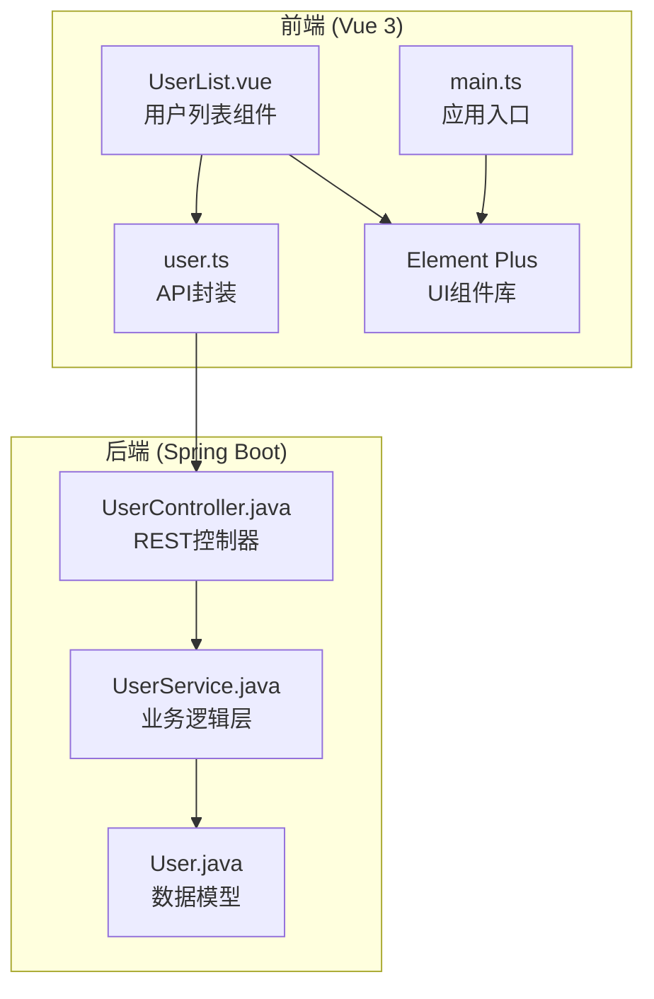
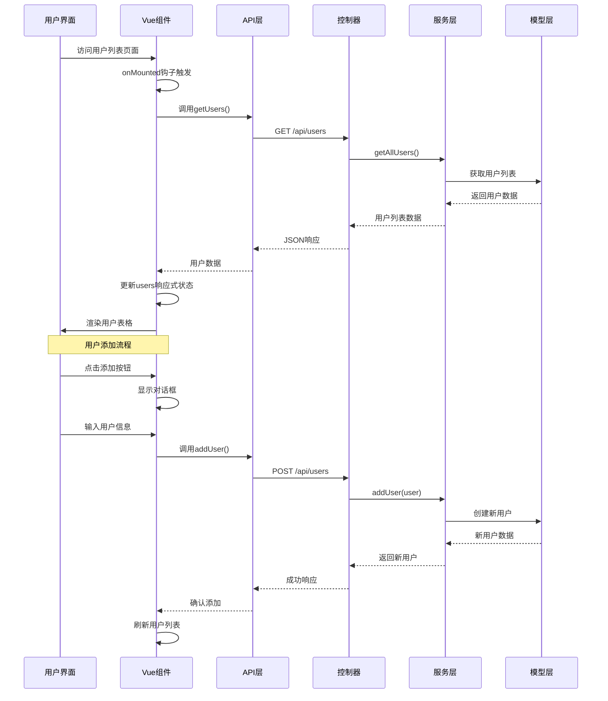
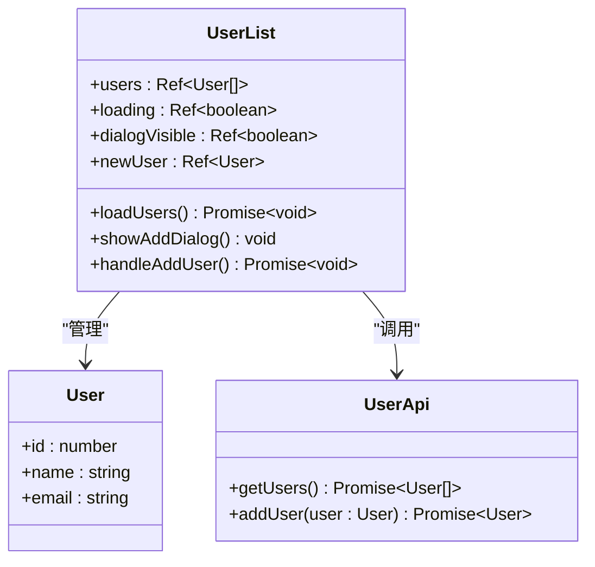
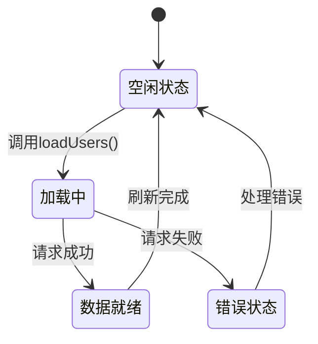
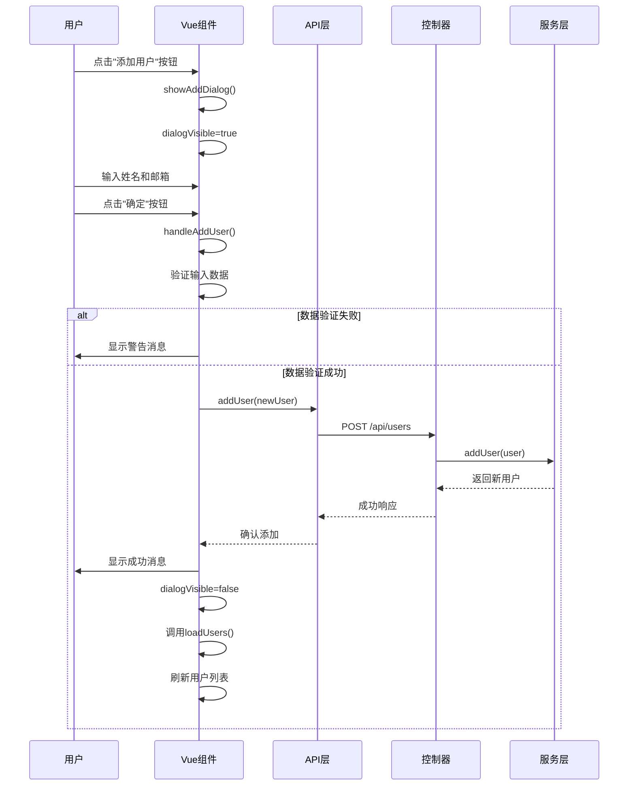
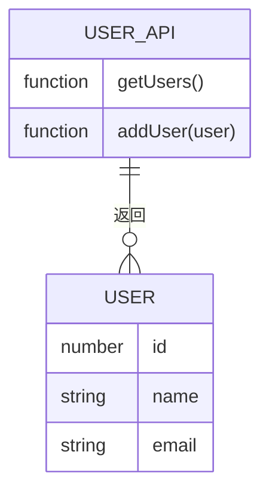
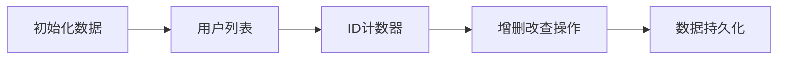
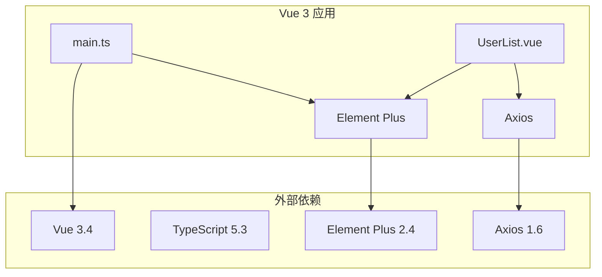
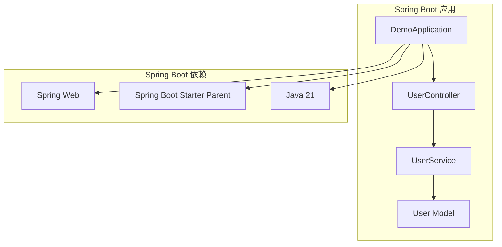

# 用户列表展示功能

<cite>
**本文档引用的文件**
- [UserList.vue](file://frontend/src/views/UserList.vue)
- [user.ts](file://frontend/src/api/user.ts)
- [UserController.java](file://backend/src/main/java/com/example/demo/controller/UserController.java)
- [User.java](file://backend/src/main/java/com/example/demo/model/User.java)
- [UserService.java](file://backend/src/main/java/com/example/demo/service/UserService.java)
- [main.ts](file://frontend/src/main.ts)
- [package.json](file://frontend/package.json)
- [pom.xml](file://backend/pom.xml)
- [README.md](file://README.md)
</cite>

## 目录
1. [简介](#简介)
2. [项目结构](#项目结构)
3. [核心组件](#核心组件)
4. [架构概览](#架构概览)
5. [详细组件分析](#详细组件分析)
6. [依赖分析](#依赖分析)
7. [性能考虑](#性能考虑)
8. [故障排除指南](#故障排除指南)
9. [结论](#结论)

## 简介

本项目是一个基于Vue 3 + Spring Boot的全栈应用示例，专注于用户列表展示功能的实现。该功能展示了现代Web应用中常见的数据获取、状态管理和UI渲染模式，包括响应式数据绑定、加载状态管理、错误处理机制以及用户体验优化。

## 项目结构

该项目采用前后端分离架构，前端使用Vue 3 + TypeScript + Element Plus，后端使用Spring Boot 3.x + Java 21。用户列表功能主要集中在前端的UserList组件中，通过API接口与后端进行数据交互。



**图表来源**
- [UserList.vue:1-101](file://frontend/src/views/UserList.vue#L1-L101)
- [user.ts:1-26](file://frontend/src/api/user.ts#L1-L26)
- [UserController.java:1-30](file://backend/src/main/java/com/example/demo/controller/UserController.java#L1-L30)
- [UserService.java:1-33](file://backend/src/main/java/com/example/demo/service/UserService.java#L1-L33)

**章节来源**
- [README.md:1-119](file://README.md#L1-L119)
- [package.json:1-24](file://frontend/package.json#L1-L24)
- [pom.xml:1-48](file://backend/pom.xml#L1-L48)

## 核心组件

用户列表展示功能的核心由以下组件构成：

### 响应式数据系统
- **users**: ref数组，存储用户数据
- **loading**: ref布尔值，控制加载状态
- **dialogVisible**: ref布尔值，控制对话框显示
- **newUser**: ref对象，用于新用户表单数据

### Element Plus集成
- **el-card**: 卡片容器组件
- **el-table**: 表格组件，用于展示用户列表
- **el-table-column**: 表格列定义
- **el-dialog**: 对话框组件
- **el-form**: 表单组件
- **el-button**: 按钮组件
- **el-input**: 输入框组件

### API通信层
- **axios实例**: 配置基础URL、超时和请求头
- **userApi对象**: 封装用户相关的API调用

**章节来源**
- [UserList.vue:36-87](file://frontend/src/views/UserList.vue#L36-L87)
- [user.ts:17-23](file://frontend/src/api/user.ts#L17-L23)

## 架构概览

用户列表功能遵循标准的MVC架构模式，通过RESTful API实现前后端分离的数据交互。



**图表来源**
- [UserList.vue:46-86](file://frontend/src/views/UserList.vue#L46-L86)
- [user.ts:17-23](file://frontend/src/api/user.ts#L17-L23)
- [UserController.java:20-28](file://backend/src/main/java/com/example/demo/controller/UserController.java#L20-L28)
- [UserService.java:23-31](file://backend/src/main/java/com/example/demo/service/UserService.java#L23-L31)

## 详细组件分析

### UserList.vue组件分析

#### 数据结构设计
组件使用Vue 3的Composition API和响应式系统来管理状态：



**图表来源**
- [UserList.vue:41-44](file://frontend/src/views/UserList.vue#L41-L44)
- [user.ts:11-15](file://frontend/src/api/user.ts#L11-L15)

#### Element Plus表格组件使用

表格组件实现了基本的用户数据显示功能：

| 属性 | 值 | 说明 |
|------|-----|------|
| :data | users | 绑定用户数据源 |
| v-loading | loading | 绑定加载状态 |
| style | width: 100% | 设置表格宽度 |

表格列定义：
- ID列：固定宽度80px，显示用户标识符
- 姓名列：固定宽度180px，显示用户名称
- 邮箱列：自适应宽度，显示用户邮箱地址

#### 响应式数据绑定机制

组件使用Vue 3的ref系统实现响应式数据绑定：

```mermaid
flowchart TD
A[组件初始化] --> B[创建响应式状态]
B --> C[users: ref([])]
B --> D[loading: ref(false)]
B --> E[dialogVisible: ref(false)]
B --> F[newUser: ref({name:'', email:''})]
C --> G[onMounted触发]
G --> H[调用loadUsers函数]
H --> I[设置loading=true]
I --> J[发起API请求]
J --> K[接收响应数据]
K --> L[更新users状态]
L --> M[设置loading=false]
M --> N[重新渲染表格]
```

**图表来源**
- [UserList.vue:46-58](file://frontend/src/views/UserList.vue#L46-L58)

#### 加载状态管理

加载状态通过Element Plus的v-loading指令实现：



**图表来源**
- [UserList.vue:47-58](file://frontend/src/views/UserList.vue#L47-L58)

#### 错误处理机制

组件实现了多层次的错误处理：

1. **API请求错误处理**: 使用try-catch捕获网络异常
2. **用户反馈**: 通过Element Plus的消息组件提供用户友好的错误提示
3. **日志记录**: 在控制台输出详细的错误信息
4. **状态恢复**: 确保加载状态在finally块中正确重置

#### 用户交互流程

添加用户的完整交互流程：



**图表来源**
- [UserList.vue:60-82](file://frontend/src/views/UserList.vue#L60-L82)

**章节来源**
- [UserList.vue:1-101](file://frontend/src/views/UserList.vue#L1-L101)

### API封装层分析

#### axios配置

API层使用axios创建配置化的HTTP客户端：

| 配置项 | 值 | 说明 |
|--------|-----|------|
| baseURL | http://localhost:8080/api | 后端API基础URL |
| timeout | 5000ms | 请求超时时间 |
| Content-Type | application/json | 请求内容类型 |

#### 类型安全设计

TypeScript接口确保了数据类型的完整性：



**图表来源**
- [user.ts:11-15](file://frontend/src/api/user.ts#L11-L15)
- [user.ts:17-23](file://frontend/src/api/user.ts#L17-L23)

**章节来源**
- [user.ts:1-26](file://frontend/src/api/user.ts#L1-L26)

### 后端服务层分析

#### REST控制器设计

后端控制器提供了标准的CRUD操作接口：

| 方法 | HTTP方法 | 端点 | 功能 |
|------|----------|------|------|
| getAllUsers | GET | /api/users | 获取所有用户 |
| addUser | POST | /api/users | 创建新用户 |

#### 业务逻辑层

服务层实现了简单的内存数据管理：



**图表来源**
- [UserService.java:16-21](file://backend/src/main/java/com/example/demo/service/UserService.java#L16-L21)
- [UserService.java:23-31](file://backend/src/main/java/com/example/demo/service/UserService.java#L23-L31)

**章节来源**
- [UserController.java:1-30](file://backend/src/main/java/com/example/demo/controller/UserController.java#L1-L30)
- [UserService.java:1-33](file://backend/src/main/java/com/example/demo/service/UserService.java#L1-L33)
- [User.java:1-41](file://backend/src/main/java/com/example/demo/model/User.java#L1-L41)

## 依赖分析

### 前端依赖关系



**图表来源**
- [package.json:11-14](file://frontend/package.json#L11-L14)
- [main.ts:1-10](file://frontend/src/main.ts#L1-L10)

### 后端依赖关系



**图表来源**
- [pom.xml:24-36](file://backend/pom.xml#L24-L36)

**章节来源**
- [package.json:1-24](file://frontend/package.json#L1-L24)
- [pom.xml:1-48](file://backend/pom.xml#L1-L48)

## 性能考虑

### 前端性能优化

1. **响应式更新优化**: 使用ref替代reactive，减少不必要的响应式开销
2. **条件渲染**: 仅在有数据时渲染表格内容
3. **懒加载**: 可以考虑实现虚拟滚动处理大量数据
4. **缓存策略**: 可以添加本地缓存避免重复请求

### 后端性能优化

1. **内存管理**: 当前实现使用ArrayList，适合小规模数据
2. **并发安全**: 使用AtomicLong确保ID生成的线程安全
3. **数据复制**: 查询时返回新列表避免外部修改

### 网络性能

1. **请求超时**: 5秒超时设置平衡了用户体验和资源占用
2. **CORS配置**: 正确的跨域配置避免了额外的网络往返
3. **JSON序列化**: Spring Boot自动处理JSON转换

## 故障排除指南

### 常见问题及解决方案

#### API请求失败
**症状**: 控制台出现网络错误，表格为空白
**原因**: 后端服务未启动或端口被占用
**解决**: 
1. 确认后端服务在http://localhost:8080运行
2. 检查防火墙设置
3. 验证CORS配置

#### 类型错误
**症状**: TypeScript编译错误
**原因**: User接口定义不匹配
**解决**:
1. 确保User接口字段与后端一致
2. 检查可选字段定义

#### UI组件不显示
**症状**: 表格组件不渲染
**原因**: Element Plus未正确导入
**解决**:
1. 确认main.ts中Element Plus已注册
2. 检查CSS文件是否正确引入

#### 数据不更新
**症状**: 添加用户后列表不刷新
**原因**: API调用失败或状态未更新
**解决**:
1. 检查console中的错误信息
2. 确认loadUsers()在添加成功后被调用

**章节来源**
- [UserList.vue:52-57](file://frontend/src/views/UserList.vue#L52-L57)
- [UserList.vue:78-81](file://frontend/src/views/UserList.vue#L78-L81)

## 结论

用户列表展示功能展现了现代Web应用开发的最佳实践，包括：

1. **清晰的架构分层**: 前后端职责明确，接口规范统一
2. **响应式数据管理**: Vue 3的Composition API提供了简洁的状态管理
3. **完整的错误处理**: 多层次的错误处理确保了良好的用户体验
4. **TypeScript类型安全**: 编译时类型检查提高了代码质量
5. **现代化UI组件**: Element Plus提供了丰富的交互体验

该实现为类似的数据展示场景提供了优秀的参考模板，涵盖了从数据获取到UI渲染的完整流程。通过合理的架构设计和最佳实践的应用，该功能具有良好的可扩展性和维护性。