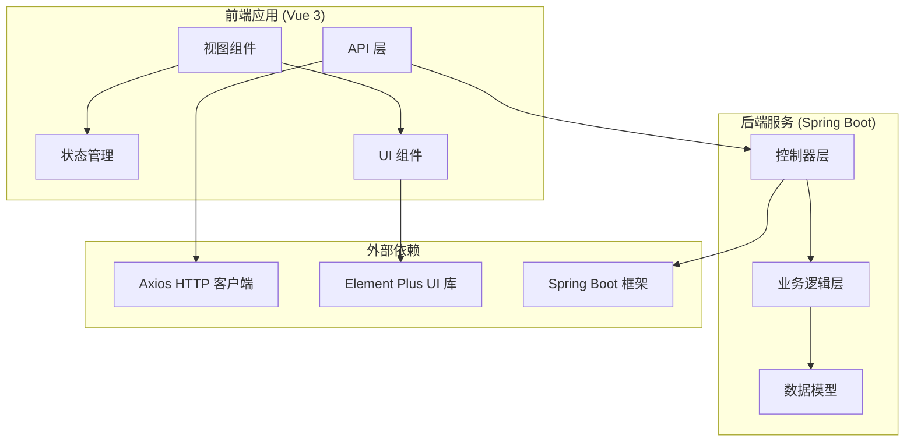
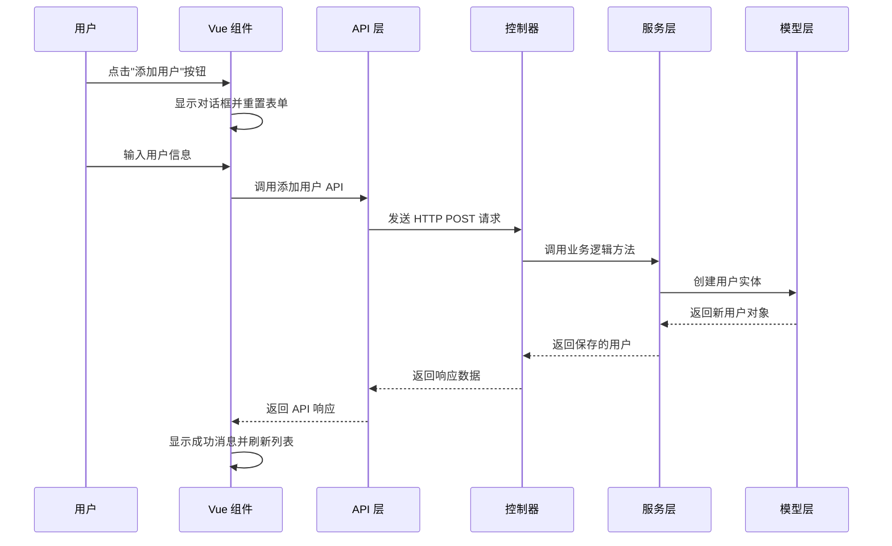
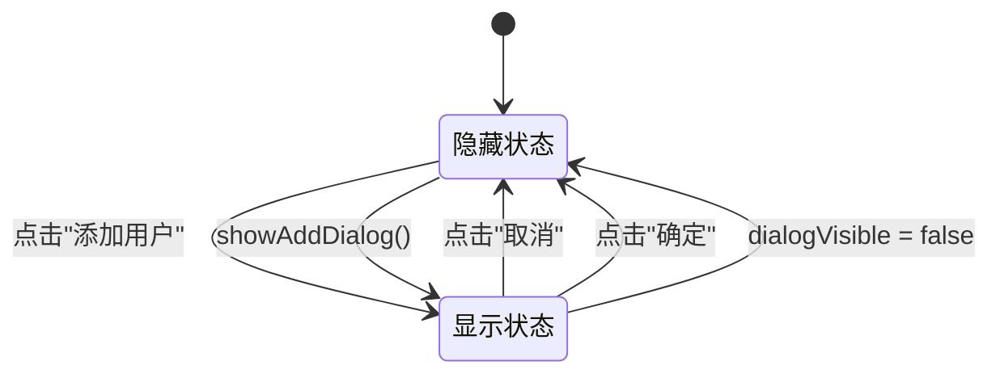
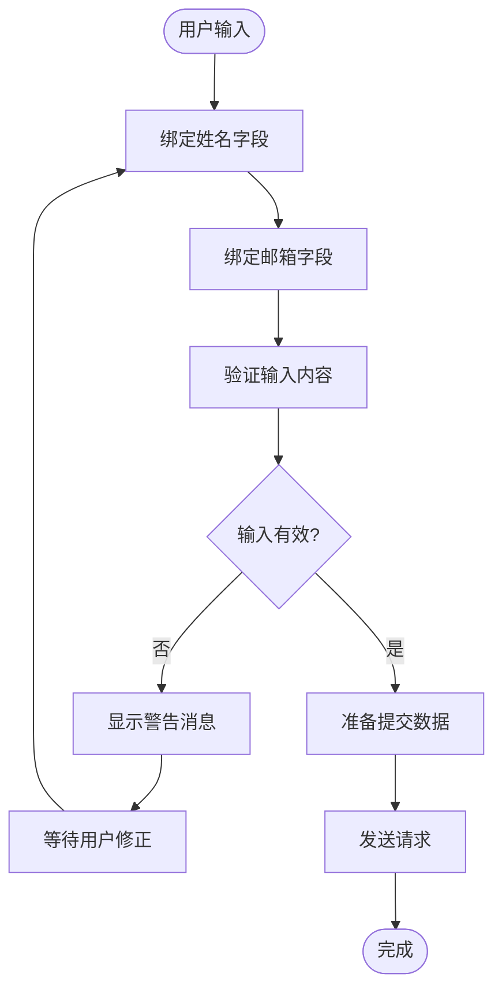
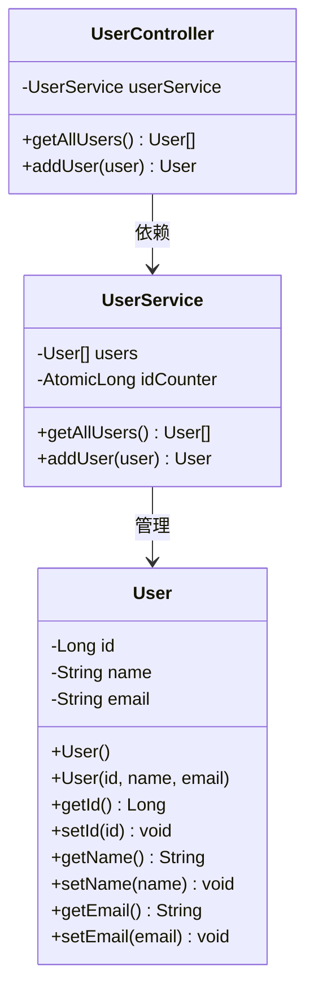
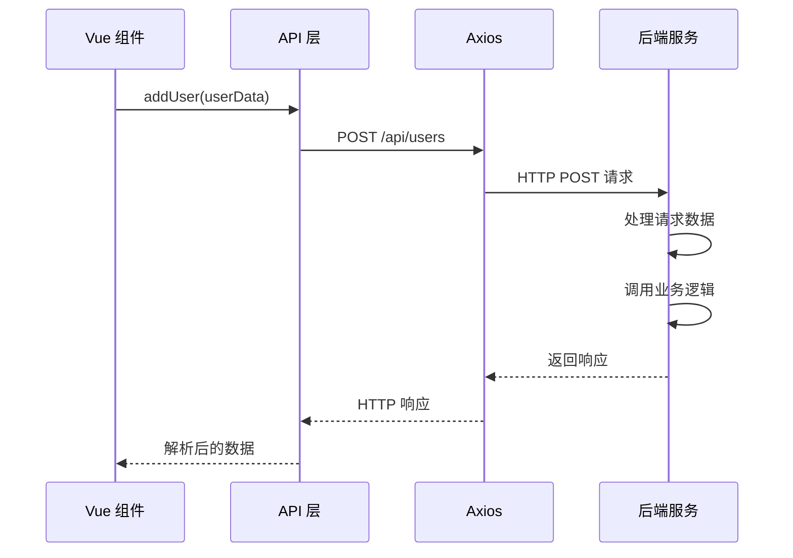
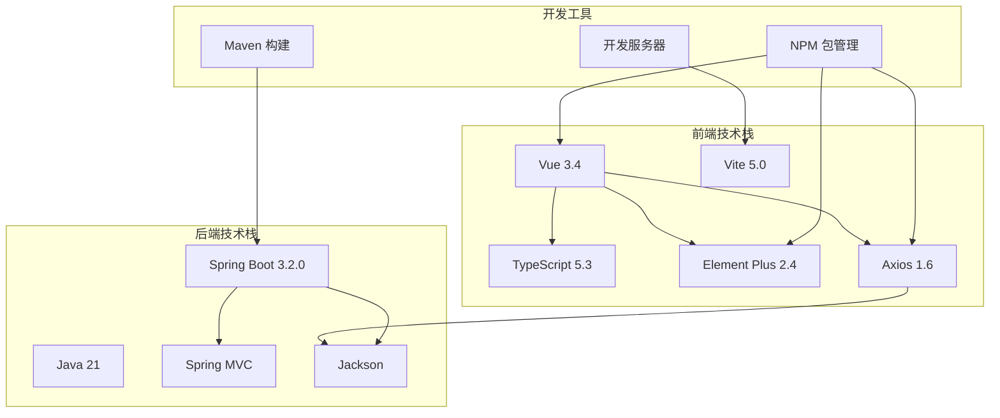
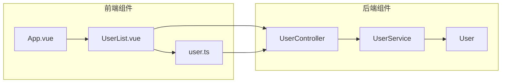

# 用户添加功能

<cite>
**本文档引用的文件**
- [UserList.vue](file://frontend/src/views/UserList.vue)
- [user.ts](file://frontend/src/api/user.ts)
- [UserController.java](file://backend/src/main/java/com/example/demo/controller/UserController.java)
- [UserService.java](file://backend/src/main/java/com/example/demo/service/UserService.java)
- [User.java](file://backend/src/main/java/com/example/demo/model/User.java)
- [App.vue](file://frontend/src/App.vue)
- [package.json](file://frontend/package.json)
- [pom.xml](file://backend/pom.xml)
- [README.md](file://README.md)
</cite>

## 目录
1. [简介](#简介)
2. [项目结构](#项目结构)
3. [核心组件](#核心组件)
4. [架构概览](#架构概览)
5. [详细组件分析](#详细组件分析)
6. [依赖分析](#依赖分析)
7. [性能考虑](#性能考虑)
8. [故障排除指南](#故障排除指南)
9. [结论](#结论)

## 简介

本项目是一个基于 Vue 3 + Spring Boot 的全栈用户管理系统，专注于演示用户添加功能的完整实现。该功能通过 Element Plus 表单组件提供直观的用户界面，结合前后端分离的架构模式，实现了从表单输入到数据持久化的完整流程。

用户添加功能的核心目标是：
- 提供直观的用户输入界面
- 实现数据验证和错误处理
- 支持异步数据提交和响应
- 优化用户体验和交互反馈

## 项目结构

该项目采用前后端分离的架构设计，具有清晰的模块划分：

**图表来源**
- [UserList.vue:1-101](file://frontend/src/views/UserList.vue#L1-L101)
- [user.ts:1-26](file://frontend/src/api/user.ts#L1-L26)
- [UserController.java:1-30](file://backend/src/main/java/com/example/demo/controller/UserController.java#L1-L30)

**章节来源**
- [README.md:1-119](file://README.md#L1-L119)
- [package.json:1-24](file://frontend/package.json#L1-L24)
- [pom.xml:1-48](file://backend/pom.xml#L1-L48)

## 核心组件

### 前端核心组件

用户添加功能主要由以下核心组件构成：

#### 用户列表视图组件
- **位置**: `frontend/src/views/UserList.vue`
- **职责**: 管理用户界面的显示和交互逻辑
- **状态管理**: 包含用户列表、对话框状态、加载状态等
- **事件处理**: 处理用户添加对话框的显示和隐藏

#### API 服务层
- **位置**: `frontend/src/api/user.ts`
- **职责**: 封装 HTTP 请求，提供类型安全的 API 调用
- **功能**: 用户列表获取、用户添加等操作

#### 后端控制器
- **位置**: `backend/src/main/java/com/example/demo/controller/UserController.java`
- **职责**: 处理 REST API 请求，协调业务逻辑
- **端点**: `/api/users` 的 GET 和 POST 方法

**章节来源**
- [UserList.vue:36-87](file://frontend/src/views/UserList.vue#L36-L87)
- [user.ts:17-23](file://frontend/src/api/user.ts#L17-L23)
- [UserController.java:9-29](file://backend/src/main/java/com/example/demo/controller/UserController.java#L9-L29)

## 架构概览

系统采用经典的三层架构模式，实现了清晰的职责分离：

**图表来源**
- [UserList.vue:60-82](file://frontend/src/views/UserList.vue#L60-L82)
- [user.ts:17-23](file://frontend/src/api/user.ts#L17-L23)
- [UserController.java:25-28](file://backend/src/main/java/com/example/demo/controller/UserController.java#L25-L28)

## 详细组件分析

### 用户添加对话框实现

#### 对话框状态管理

用户添加对话框的状态管理采用了 Vue 3 的响应式系统：

**图表来源**
- [UserList.vue:43-64](file://frontend/src/views/UserList.vue#L43-L64)

#### 表单输入处理机制

表单采用 Element Plus 的双向绑定机制，实现了实时的数据同步：

**图表来源**
- [UserList.vue:67-82](file://frontend/src/views/UserList.vue#L67-L82)

#### 数据验证逻辑

当前实现采用基础的客户端验证，确保必要的字段不为空：

**章节来源**
- [UserList.vue:67-71](file://frontend/src/views/UserList.vue#L67-L71)

### 用户对象数据模型

#### 后端数据模型设计

用户实体类提供了标准的 Java Bean 结构：

**图表来源**
- [User.java:3-40](file://backend/src/main/java/com/example/demo/model/User.java#L3-L40)
- [UserService.java:11-31](file://backend/src/main/java/com/example/demo/service/UserService.java#L11-L31)
- [UserController.java:14-18](file://backend/src/main/java/com/example/demo/controller/UserController.java#L14-L18)

**章节来源**
- [User.java:1-41](file://backend/src/main/java/com/example/demo/model/User.java#L1-L41)
- [UserService.java:10-32](file://backend/src/main/java/com/example/demo/service/UserService.java#L10-L32)

### API 通信机制

#### 前端 API 层设计

API 层封装了与后端的通信逻辑，提供了类型安全的接口：

**图表来源**
- [user.ts:17-23](file://frontend/src/api/user.ts#L17-L23)

**章节来源**
- [user.ts:1-26](file://frontend/src/api/user.ts#L1-L26)

## 依赖分析

### 技术栈依赖关系

项目采用了现代化的技术栈组合，各组件之间存在明确的依赖关系：

**图表来源**
- [package.json:11-22](file://frontend/package.json#L11-L22)
- [pom.xml:24-37](file://backend/pom.xml#L24-L37)

### 组件间依赖关系

**图表来源**
- [UserList.vue:39-39](file://frontend/src/views/UserList.vue#L39-L39)
- [UserController.java:3-4](file://backend/src/main/java/com/example/demo/controller/UserController.java#L3-L4)

**章节来源**
- [package.json:1-24](file://frontend/package.json#L1-L24)
- [pom.xml:1-48](file://backend/pom.xml#L1-L48)

## 性能考虑

### 前端性能优化

1. **懒加载策略**: 使用 Vue 3 的组合式 API 减少不必要的重新渲染
2. **状态管理**: 采用响应式 ref 和 computed 属性优化数据流
3. **组件复用**: 将通用功能抽象为可复用的组件

### 后端性能优化

1. **内存存储**: 使用 ArrayList 和 AtomicLong 提供高效的内存操作
2. **线程安全**: 通过原子操作保证并发安全性
3. **简单架构**: 最小化依赖减少系统复杂度

### 网络性能优化

1. **HTTP 缓存**: 合理设置缓存策略避免重复请求
2. **错误处理**: 实现重试机制和超时控制
3. **连接池**: 使用 Axios 默认的连接池管理

## 故障排除指南

### 常见问题及解决方案

#### CORS 跨域问题
- **症状**: 前端请求被浏览器阻止
- **原因**: 后端未正确配置跨域支持
- **解决方案**: 检查控制器上的 `@CrossOrigin` 注解配置

#### 端口冲突问题
- **症状**: 应用启动失败或端口被占用
- **解决方案**: 修改 `application.yml` 中的端口号配置

#### 类型不匹配问题
- **症状**: API 响应解析失败
- **解决方案**: 确保 TypeScript 接口定义与后端模型保持一致

#### 状态不同步问题
- **症状**: 表单状态与实际数据不一致
- **解决方案**: 在对话框显示时重置用户状态

**章节来源**
- [UserController.java:11-11](file://backend/src/main/java/com/example/demo/controller/UserController.java#L11-L11)
- [UserList.vue:62-62](file://frontend/src/views/UserList.vue#L62-L62)

## 结论

用户添加功能展示了现代全栈应用的最佳实践，通过以下关键特性实现了高质量的用户体验：

### 核心优势

1. **简洁的架构设计**: 清晰的分层结构便于维护和扩展
2. **类型安全**: TypeScript 和 Spring Boot 的强类型特性确保代码质量
3. **响应式用户体验**: Element Plus 提供流畅的交互体验
4. **完善的错误处理**: 全面的异常处理机制提升系统稳定性

### 技术亮点

- **前后端分离**: 独立开发和部署能力
- **RESTful API**: 标准化的接口设计
- **现代化工具链**: Vue 3 + Spring Boot 的技术组合
- **组件化开发**: 可复用的组件架构

### 扩展建议

1. **增强表单验证**: 添加更严格的客户端和服务器端验证
2. **国际化支持**: 实现多语言界面
3. **权限控制**: 添加用户认证和授权机制
4. **测试覆盖**: 增加单元测试和集成测试
5. **监控告警**: 实现应用性能监控

该实现为开发者提供了一个完整、可扩展的用户管理功能模板，可以作为更复杂业务系统的起点。