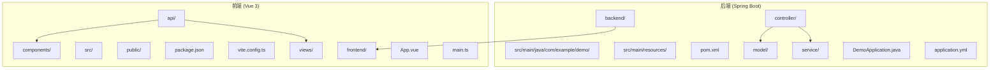
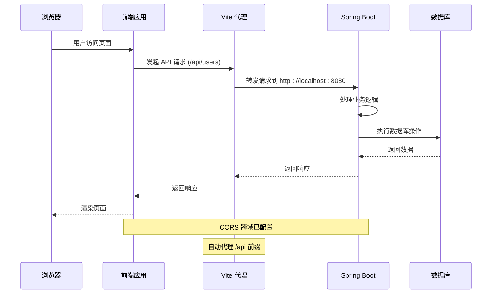
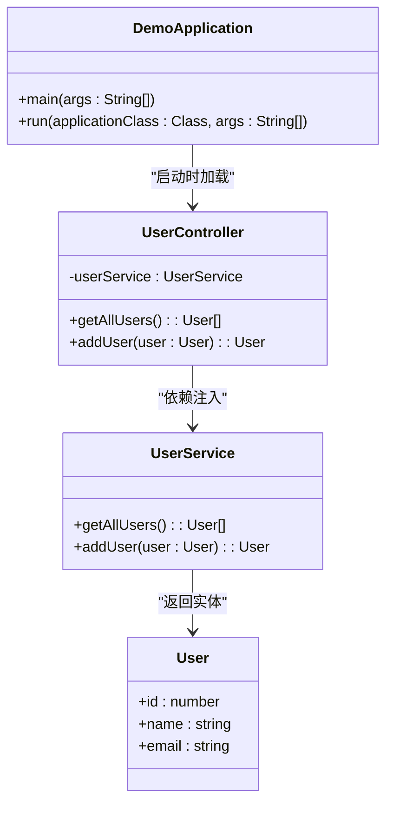
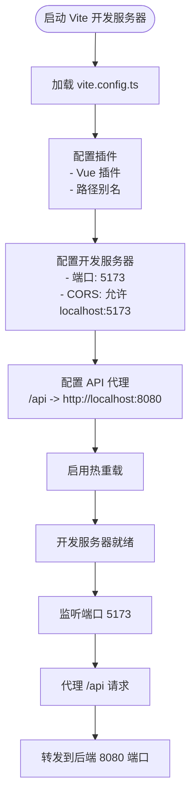
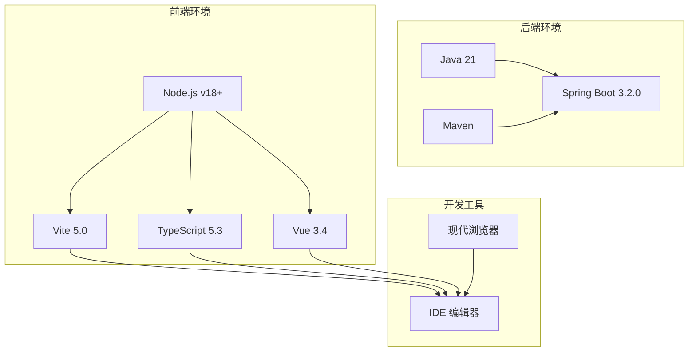

# 本地开发部署

<cite>
**本文档引用的文件**
- [README.md](file://README.md)
- [pom.xml](file://backend/pom.xml)
- [application.yml](file://backend/src/main/resources/application.yml)
- [DemoApplication.java](file://backend/src/main/java/com/example/demo/DemoApplication.java)
- [UserController.java](file://backend/src/main/java/com/example/demo/controller/UserController.java)
- [package.json](file://frontend/package.json)
- [vite.config.ts](file://frontend/vite.config.ts)
- [tsconfig.json](file://frontend/tsconfig.json)
- [env.d.ts](file://frontend/src/env.d.ts)
- [user.ts](file://frontend/src/api/user.ts)
- [main.ts](file://frontend/src/main.ts)
</cite>

## 目录
1. [简介](#简介)
2. [项目结构](#项目结构)
3. [核心组件](#核心组件)
4. [架构概览](#架构概览)
5. [详细组件分析](#详细组件分析)
6. [依赖分析](#依赖分析)
7. [性能考虑](#性能考虑)
8. [故障排除指南](#故障排除指南)
9. [结论](#结论)

## 简介

本项目是一个基于 Vue 3 + Spring Boot 的全栈开发示例，采用前后端分离架构。后端使用 Spring Boot 3.x 和 Java 21，前端使用 Vue 3、TypeScript 和 Element Plus。项目提供了完整的本地开发环境配置，包括热重载、CORS 跨域支持和 API 代理功能。

## 项目结构

项目采用标准的前后端分离架构，具有清晰的模块划分：



**图表来源**
- [README.md: 5-30:5-30](file://README.md#L5-L30)
- [pom.xml: 1-48:1-48](file://backend/pom.xml#L1-L48)
- [package.json: 1-24:1-24](file://frontend/package.json#L1-L24)

**章节来源**
- [README.md: 5-30:5-30](file://README.md#L5-L30)
- [pom.xml: 1-48:1-48](file://backend/pom.xml#L1-L48)
- [package.json: 1-24:1-24](file://frontend/package.json#L1-L24)

## 核心组件

### 后端技术栈

后端采用现代化的 Spring Boot 3.2.0 框架，使用 Java 21 作为运行时环境：

- **Spring Web**: 提供 RESTful API 支持
- **Spring Boot Maven Plugin**: 支持直接运行和打包
- **端口配置**: 默认监听 8080 端口
- **CORS 配置**: 已在控制器级别配置跨域支持

### 前端技术栈

前端使用 Vue 3.4 和现代开发工具链：

- **Vue 3.4**: 组合式 API 和响应式系统
- **TypeScript 5.3**: 类型安全保障
- **Vite 5.0**: 快速构建和热重载
- **Element Plus 2.4**: UI 组件库
- **Axios 1.6**: HTTP 客户端

**章节来源**
- [README.md: 92-106:92-106](file://README.md#L92-L106)
- [pom.xml: 20-37:20-37](file://backend/pom.xml#L20-L37)
- [package.json: 11-22:11-22](file://frontend/package.json#L11-L22)

## 架构概览

系统采用典型的前后端分离架构，通过 HTTP 协议进行通信：



**图表来源**
- [vite.config.ts: 13-21:13-21](file://frontend/vite.config.ts#L13-L21)
- [UserController.java: 11](file://backend/src/main/java/com/example/demo/controller/UserController.java#L11)
- [user.ts: 3-9:3-9](file://frontend/src/api/user.ts#L3-L9)

## 详细组件分析

### 后端配置分析

#### 应用程序入口点

应用程序通过标准的 Spring Boot 启动类运行：



**图表来源**
- [DemoApplication.java: 6-12:6-12](file://backend/src/main/java/com/example/demo/DemoApplication.java#L6-L12)
- [UserController.java: 14-18:14-18](file://backend/src/main/java/com/example/demo/controller/UserController.java#L14-L18)

#### 端口配置和启动流程

后端服务配置如下：

| 配置项 | 值 | 说明 |
|--------|----|-----|
| 服务器端口 | 8080 | Spring Boot 默认端口 |
| 应用名称 | demo-backend | 应用标识符 |
| 日志级别 | DEBUG | 开发模式下的详细日志 |

启动命令：
```bash
cd backend
mvn spring-boot:run
```

**章节来源**
- [application.yml: 1-13:1-13](file://backend/src/main/resources/application.yml#L1-L13)
- [DemoApplication.java: 9-11:9-11](file://backend/src/main/java/com/example/demo/DemoApplication.java#L9-L11)

### 前端配置分析

#### Vite 开发服务器配置

前端开发服务器采用 Vite 5.0，配置了完整的开发环境：



**图表来源**
- [vite.config.ts: 6-22:6-22](file://frontend/vite.config.ts#L6-L22)

#### 依赖管理和版本要求

前端项目的关键依赖关系：

| 依赖类型 | 包名 | 版本要求 | 用途 |
|----------|------|----------|------|
| 运行时依赖 | vue | ^3.4.0 | Vue 3 框架 |
| 运行时依赖 | element-plus | ^2.4.0 | UI 组件库 |
| 运行时依赖 | axios | ^1.6.0 | HTTP 客户端 |
| 开发依赖 | vite | ^5.0.0 | 构建工具 |
| 开发依赖 | typescript | ^5.3.0 | 类型检查 |
| 开发依赖 | @vitejs/plugin-vue | ^5.0.0 | Vue 支持 |

**章节来源**
- [package.json: 6-22:6-22](file://frontend/package.json#L6-L22)
- [vite.config.ts: 13-21:13-21](file://frontend/vite.config.ts#L13-L21)

### CORS 跨域配置

项目实现了多层次的 CORS 配置以确保前后端通信正常：

```mermaid
graph LR
subgraph "浏览器安全策略"
A[CORS 预检请求]
B[同源策略]
end
subgraph "后端配置"
C[@CrossOrigin 注解]
D[application.yml CORS 配置]
end
subgraph "前端配置"
E[Vite 代理]
F[Axios 基础配置]
end
A --> C
B --> D
C --> E
D --> F
E --> F
```

**图表来源**
- [UserController.java: 11](file://backend/src/main/java/com/example/demo/controller/UserController.java#L11)
- [vite.config.ts: 15-20:15-20](file://frontend/vite.config.ts#L15-L20)

**章节来源**
- [UserController.java: 11](file://backend/src/main/java/com/example/demo/controller/UserController.java#L11)
- [README.md: 109-110:109-110](file://README.md#L109-L110)

## 依赖分析

### 系统要求和版本兼容性

项目对运行环境有明确的要求：



**图表来源**
- [README.md: 36-50:36-50](file://README.md#L36-L50)
- [pom.xml: 20-22:20-22](file://backend/pom.xml#L20-L22)

### 依赖安装流程

#### 后端依赖安装

1. **Java 21 安装**
   - 确保系统已安装 Java 21
   - 验证安装：`java -version`

2. **Maven 安装**
   - 确保系统已安装 Maven
   - 验证安装：`mvn -version`

3. **项目构建**
   ```bash
   cd backend
   mvn clean install
   ```

#### 前端依赖安装

1. **Node.js 安装**
   - 推荐使用 Node.js v18+
   - 验证安装：`node --version`

2. **依赖安装**
   ```bash
   cd frontend
   npm install
   ```

**章节来源**
- [README.md: 36-62:36-62](file://README.md#L36-L62)
- [pom.xml: 20-22:20-22](file://backend/pom.xml#L20-L22)

## 性能考虑

### 开发服务器优化

项目配置了多项性能优化措施：

1. **热重载机制**
   - Vite 提供快速的模块热替换
   - 减少页面刷新时间
   - 实时更新样式和脚本

2. **构建优化**
   - TypeScript 编译器配置为 bundler 模式
   - 严格类型检查提升开发体验
   - 模块解析优化

3. **网络请求优化**
   - Axios 超时设置 5 秒
   - API 基础路径统一管理
   - 错误处理机制

### 生产环境准备

虽然当前是开发配置，但项目已为生产环境做好准备：

- Spring Boot 自动配置
- Maven 构建系统
- Vite 生产构建支持
- TypeScript 类型检查

## 故障排除指南

### 常见端口冲突解决方案

#### 端口占用检测

```bash
# Windows
netstat -ano | findstr :8080
netstat -ano | findstr :5173

# Linux/Mac
lsof -i :8080
lsof -i :5173
```

#### 端口修改方案

1. **修改后端端口**
   ```yaml
   # 在 application.yml 中
   server:
     port: 8081  # 修改为其他可用端口
   ```

2. **修改前端端口**
   ```typescript
   // 在 vite.config.ts 中
   export default defineConfig({
     server: {
       port: 5174,  // 修改为其他可用端口
       // ...
     }
   })
   ```

### 依赖安装问题排查

#### Java 环境问题

1. **版本不匹配**
   ```bash
   # 检查 Java 版本
   java -version
   
   # 检查 Maven 版本
   mvn -version
   ```

2. **环境变量配置**
   - 确保 JAVA_HOME 指向 Java 21 安装目录
   - 将 Maven 添加到 PATH 环境变量

#### Node.js 环境问题

1. **npm 安装失败**
   ```bash
   # 清理缓存
   npm cache clean --force
   
   # 删除 node_modules 和 package-lock.json
   rm -rf node_modules package-lock.json
   
   # 重新安装
   npm install
   ```

2. **权限问题**
   ```bash
   # 使用管理员权限运行
   sudo npm install
   
   # 或者配置 npm 全局目录
   npm config set prefix "C:\Program Files\npm-global"
   ```

### CORS 跨域问题

#### 后端 CORS 配置

1. **控制器级配置**
   ```java
   @CrossOrigin(origins = "http://localhost:5173")
   @RestController
   @RequestMapping("/api/users")
   public class UserController {
       // ...
   }
   ```

2. **全局 CORS 配置**
   ```java
   @Configuration
   public class CorsConfig {
       @Bean
       public CorsConfigurationSource corsConfigurationSource() {
           CorsConfiguration configuration = new CorsConfiguration();
           configuration.setAllowedOrigins(Arrays.asList("http://localhost:5173"));
           configuration.setAllowedMethods(Arrays.asList("*"));
           configuration.setAllowedHeaders(Arrays.asList("*"));
           return new UrlBasedCorsConfigurationSource().registerCorsConfiguration("/**", configuration);
       }
   }
   ```

#### 前端代理配置

1. **Vite 代理设置**
   ```typescript
   export default defineConfig({
     server: {
       proxy: {
         '/api': {
           target: 'http://localhost:8080',
           changeOrigin: true,
           rewrite: (path) => path.replace(/^\/api/, '/api')
         }
       }
     }
   })
   ```

2. **Axios 基础配置**
   ```typescript
   const api = axios.create({
     baseURL: 'http://localhost:8080/api',
     timeout: 5000,
     headers: {
       'Content-Type': 'application/json'
     }
   })
   ```

### 热重载问题

#### Vite 热重载配置

1. **开发服务器配置**
   ```typescript
   export default defineConfig({
     server: {
       hmr: true,  // 启用热重载
       host: 'localhost',
       port: 5173,
       strictPort: false
     }
   })
   ```

2. **浏览器缓存问题**
   - 清除浏览器缓存
   - 禁用浏览器开发者工具中的缓存选项
   - 强制刷新页面 (Ctrl+F5)

### API 代理问题

#### 代理配置验证

1. **检查代理规则**
   ```typescript
   // 确保 /api 前缀正确
   proxy: {
     '/api': {
       target: 'http://localhost:8080',
       changeOrigin: true,
       secure: false
     }
   }
   ```

2. **网络连接测试**
   ```bash
   # 测试后端 API 可达性
   curl http://localhost:8080/api/users
   
   # 测试代理功能
   curl http://localhost:5173/api/users
   ```

**章节来源**
- [README.md: 114-119:114-119](file://README.md#L114-L119)
- [vite.config.ts: 13-21:13-21](file://frontend/vite.config.ts#L13-L21)
- [UserController.java: 11](file://backend/src/main/java/com/example/demo/controller/UserController.java#L11)

## 结论

本项目提供了完整的本地开发环境配置，具有以下特点：

1. **标准化配置**: 明确的端口分配和环境要求
2. **自动化工具**: Vite 提供快速热重载和开发体验
3. **跨域支持**: 多层次的 CORS 配置确保前后端通信
4. **错误处理**: 完善的故障排除指南和常见问题解决方案

### 最佳实践建议

1. **开发顺序**: 先启动后端，再启动前端
2. **端口管理**: 使用默认端口避免冲突
3. **依赖管理**: 定期更新依赖包保持安全性
4. **代码规范**: 遵循 TypeScript 和 Vue 3 的最佳实践

### 启动验证清单

- [ ] Java 21 和 Maven 正常工作
- [ ] Node.js v18+ 和 npm 正常工作  
- [ ] 后端服务在 8080 端口运行
- [ ] 前端服务在 5173 端口运行
- [ ] API 代理功能正常
- [ ] CORS 跨域配置生效
- [ ] 热重载功能正常

通过遵循本指南，开发者可以快速搭建并运行完整的本地开发环境，为后续的功能开发和调试提供稳定的基础。