# 生产环境部署

<cite>
**本文档引用的文件**
- [pom.xml](file://backend/pom.xml)
- [application.yml](file://backend/src/main/resources/application.yml)
- [DemoApplication.java](file://backend/src/main/java/com/example/demo/DemoApplication.java)
- [UserController.java](file://backend/src/main/java/com/example/demo/controller/UserController.java)
- [UserService.java](file://backend/src/main/java/com/example/demo/service/UserService.java)
- [package.json](file://frontend/package.json)
- [vite.config.ts](file://frontend/vite.config.ts)
- [user.ts](file://frontend/src/api/user.ts)
- [tsconfig.json](file://frontend/tsconfig.json)
- [tsconfig.node.json](file://frontend/tsconfig.node.json)
- [README.md](file://README.md)
</cite>

## 目录
1. [简介](#简介)
2. [项目结构](#项目结构)
3. [核心组件](#核心组件)
4. [架构概览](#架构概览)
5. [详细组件分析](#详细组件分析)
6. [生产环境配置优化](#生产环境配置优化)
7. [Docker容器化部署](#docker容器化部署)
8. [云平台部署策略](#云平台部署策略)
9. [负载均衡与SSL配置](#负载均衡与ssl配置)
10. [监控告警实施](#监控告警实施)
11. [性能优化建议](#性能优化建议)
12. [故障排除指南](#故障排除指南)
13. [结论](#结论)

## 简介

本指南面向生产环境部署，针对基于Spring Boot 3.2.0 + Vue 3的全栈项目提供完整的部署解决方案。项目采用前后端分离架构，后端使用Java 21和Spring Boot 3.x，前端使用Vue 3 + TypeScript + Vite构建工具链。

项目的核心功能包括RESTful API接口、CORS跨域支持、用户管理功能等。本文档将详细说明从代码构建到生产部署的完整流程，包括容器化、云平台部署、负载均衡、SSL证书配置和监控告警等企业级部署实践。

## 项目结构

该项目采用标准的前后端分离架构，具有清晰的模块划分和职责分离：

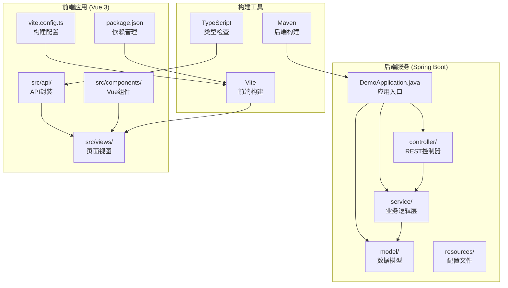

**图表来源**
- [DemoApplication.java:1-13](file://backend/src/main/java/com/example/demo/DemoApplication.java#L1-L13)
- [UserController.java:1-30](file://backend/src/main/java/com/example/demo/controller/UserController.java#L1-L30)
- [UserService.java:1-33](file://backend/src/main/java/com/example/demo/service/UserService.java#L1-L33)
- [vite.config.ts:1-23](file://frontend/vite.config.ts#L1-L23)

**章节来源**
- [README.md:5-30](file://README.md#L5-L30)
- [pom.xml:1-48](file://backend/pom.xml#L1-L48)
- [package.json:1-24](file://frontend/package.json#L1-L24)

## 核心组件

### 后端核心组件

后端采用Spring Boot框架，主要组件包括应用入口、REST控制器和业务服务层：

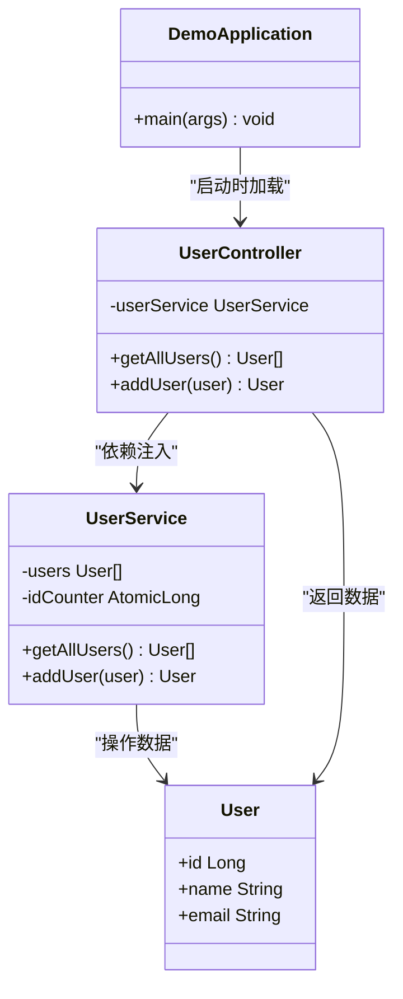

**图表来源**
- [DemoApplication.java:1-13](file://backend/src/main/java/com/example/demo/DemoApplication.java#L1-L13)
- [UserController.java:1-30](file://backend/src/main/java/com/example/demo/controller/UserController.java#L1-L30)
- [UserService.java:1-33](file://backend/src/main/java/com/example/demo/service/UserService.java#L1-L33)

### 前端核心组件

前端采用Vue 3 Composition API，主要组件包括API封装、组件系统和构建配置：

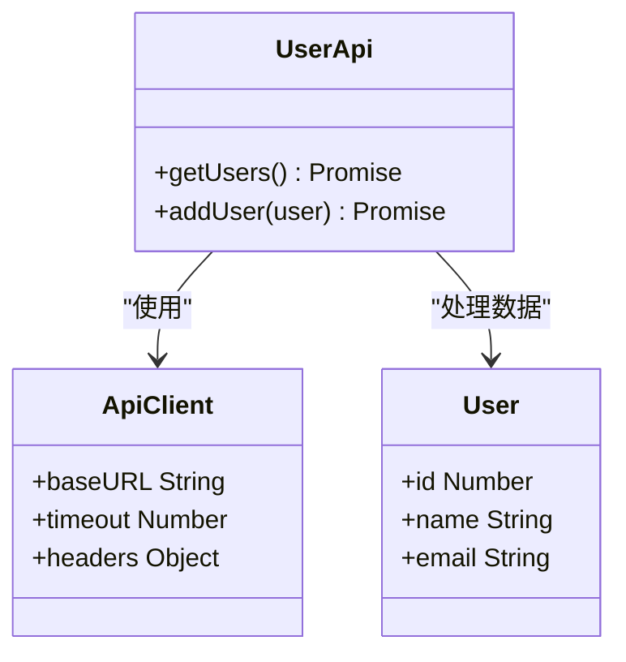

**图表来源**
- [user.ts:1-26](file://frontend/src/api/user.ts#L1-L26)

**章节来源**
- [DemoApplication.java:1-13](file://backend/src/main/java/com/example/demo/DemoApplication.java#L1-L13)
- [UserController.java:1-30](file://backend/src/main/java/com/example/demo/controller/UserController.java#L1-L30)
- [UserService.java:1-33](file://backend/src/main/java/com/example/demo/service/UserService.java#L1-L33)
- [user.ts:1-26](file://frontend/src/api/user.ts#L1-L26)

## 架构概览

项目采用经典的三层架构模式，前后端完全分离：

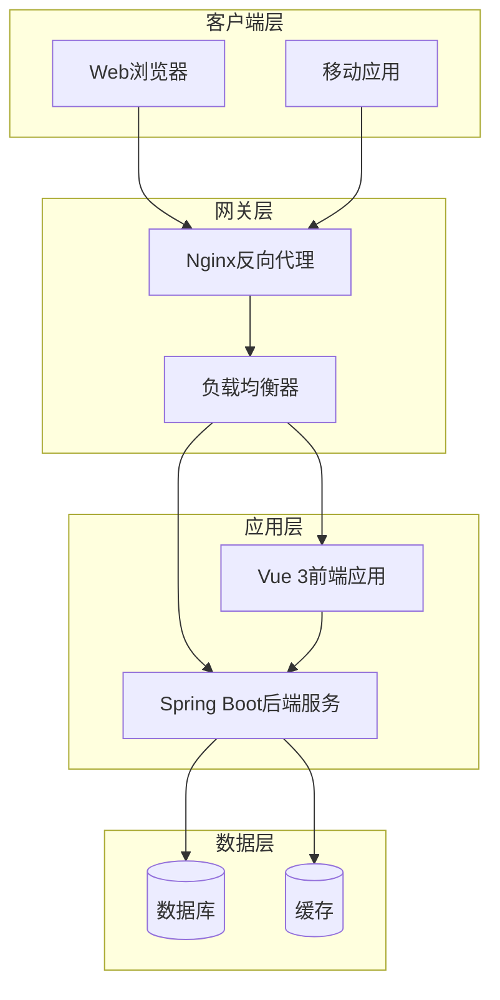

**图表来源**
- [application.yml:1-13](file://backend/src/main/resources/application.yml#L1-L13)
- [vite.config.ts:13-21](file://frontend/vite.config.ts#L13-L21)

## 详细组件分析

### 后端应用配置分析

后端应用配置相对简洁，主要包含服务器端口、应用名称和日志级别设置：

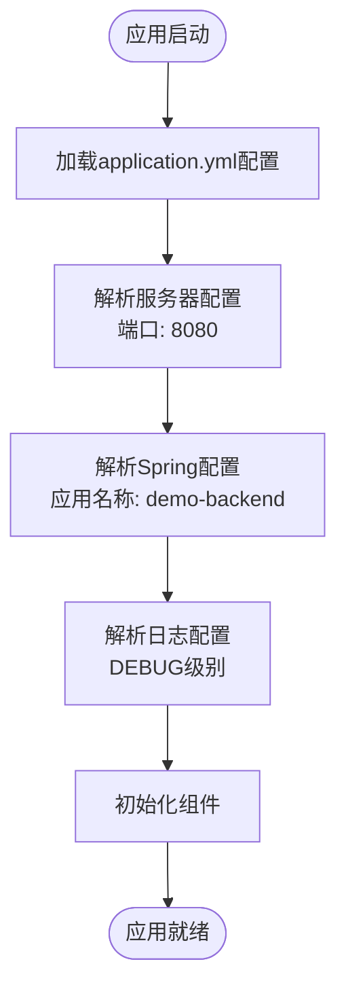

**图表来源**
- [application.yml:1-13](file://backend/src/main/resources/application.yml#L1-L13)

**章节来源**
- [application.yml:1-13](file://backend/src/main/resources/application.yml#L1-L13)

### 前端构建流程分析

前端采用Vite作为构建工具，支持热重载和快速构建：

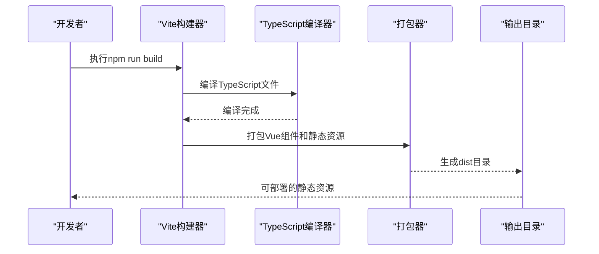

**图表来源**
- [package.json:6-10](file://frontend/package.json#L6-L10)
- [vite.config.ts:1-23](file://frontend/vite.config.ts#L1-L23)

**章节来源**
- [package.json:1-24](file://frontend/package.json#L1-L24)
- [vite.config.ts:1-23](file://frontend/vite.config.ts#L1-L23)

## 生产环境配置优化

### 数据库连接配置

生产环境建议使用连接池和SSL加密：

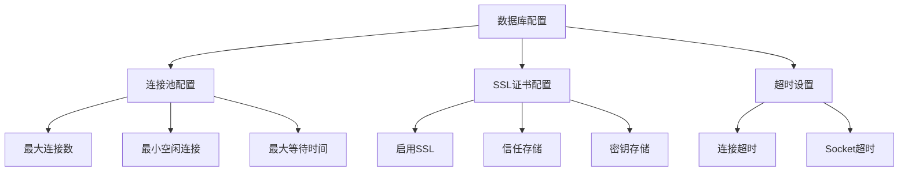

**图表来源**
- [application.yml:4-13](file://backend/src/main/resources/application.yml#L4-L13)

### 日志配置优化

生产环境建议调整日志级别和输出格式：

| 日志级别 | 适用场景 | 建议配置 |
|---------|---------|---------|
| ERROR | 错误信息 | 生产默认级别 |
| WARN | 警告信息 | 关键警告 |
| INFO | 一般信息 | 应用状态 |
| DEBUG | 调试信息 | 仅开发环境 |

### 安全配置建议

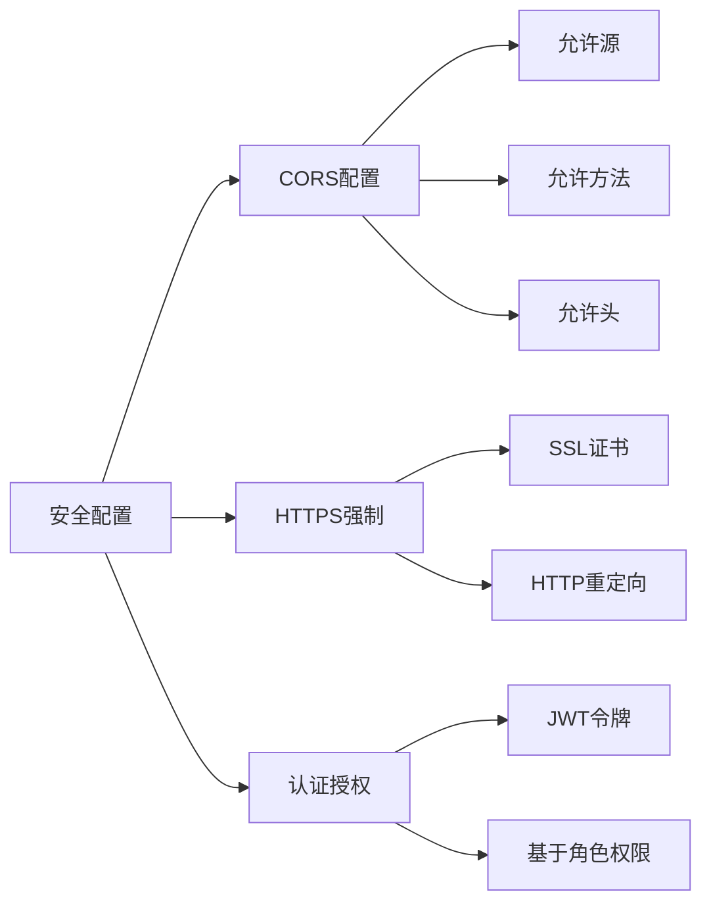

**章节来源**
- [UserController.java:11](file://backend/src/main/java/com/example/demo/controller/UserController.java#L11)
- [application.yml:8-13](file://backend/src/main/resources/application.yml#L8-L13)

## Docker容器化部署

### Dockerfile编写

为Spring Boot应用创建Dockerfile：

```dockerfile
FROM openjdk:21-jre-slim

# 设置工作目录
WORKDIR /app

# 复制JAR文件
COPY target/demo-0.0.1-SNAPSHOT.jar app.jar

# 暴露端口
EXPOSE 8080

# 健康检查
HEALTHCHECK --interval=30s --timeout=3s --start-period=5s --retries=3 \
    CMD curl -f http://localhost:8080/actuator/health || exit 1

# 启动应用
ENTRYPOINT ["java", "-jar", "app.jar"]
```

为Vue前端创建Dockerfile：

```dockerfile
FROM node:20-alpine

# 设置工作目录
WORKDIR /app

# 复制依赖文件
COPY package*.json ./

# 安装依赖
RUN npm ci --only=production

# 复制源码
COPY . .

# 构建静态资源
RUN npm run build

# 使用Nginx运行
FROM nginx:alpine
COPY --from=0 /app/dist /usr/share/nginx/html
COPY nginx.conf /etc/nginx/nginx.conf
EXPOSE 80
CMD ["nginx", "-g", "daemon off;"]
```

### Docker Compose配置

```yaml
version: '3.8'

services:
  backend:
    build: ./backend
    ports:
      - "8080:8080"
    environment:
      - SPRING_PROFILES_ACTIVE=prod
      - SPRING_DATASOURCE_URL=jdbc:mysql://mysql:3306/mydb
      - SPRING_DATASOURCE_USERNAME=user
      - SPRING_DATASOURCE_PASSWORD=pass
    depends_on:
      - mysql
    healthcheck:
      test: ["CMD", "curl", "-f", "http://localhost:8080/actuator/health"]
      interval: 30s
      timeout: 10s
      retries: 3

  frontend:
    build: ./frontend
    ports:
      - "80:80"
    depends_on:
      - backend
    environment:
      - VITE_API_BASE_URL=http://localhost/api

  mysql:
    image: mysql:8.0
    environment:
      - MYSQL_ROOT_PASSWORD=rootpass
      - MYSQL_DATABASE=mydb
      - MYSQL_USER=user
      - MYSQL_PASSWORD=pass
    volumes:
      - db_data:/var/lib/mysql
    healthcheck:
      test: ["CMD", "mysqladmin", "ping", "-h", "localhost"]

volumes:
  db_data:
```

**章节来源**
- [pom.xml:39-46](file://backend/pom.xml#L39-L46)
- [package.json:6-10](file://frontend/package.json#L6-L10)

## 云平台部署策略

### AWS部署流程

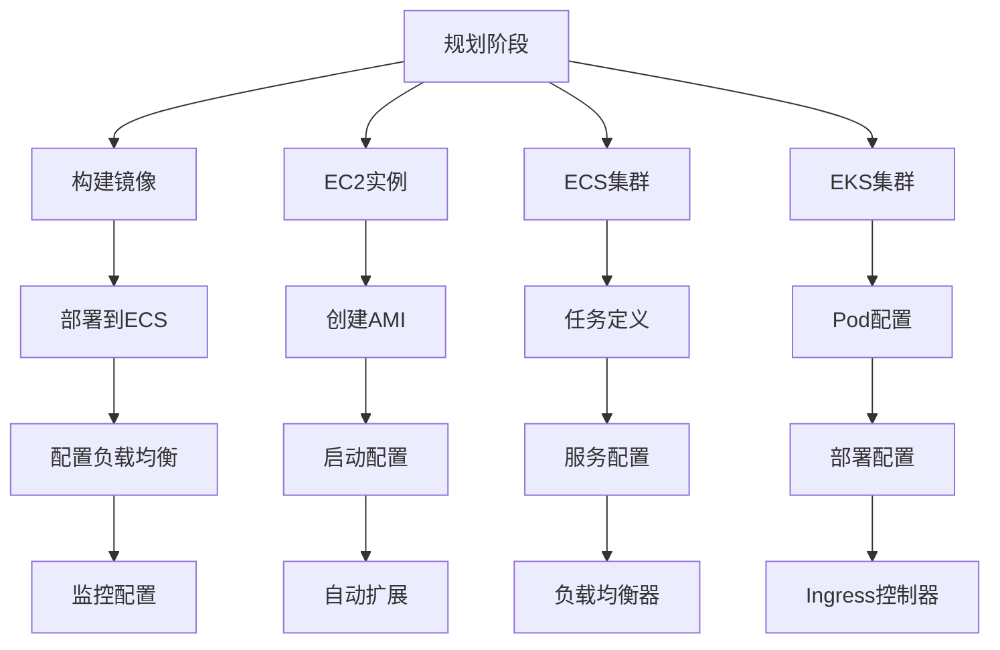

### Azure部署流程

Azure平台推荐使用Azure Container Instances或Azure Kubernetes Service：

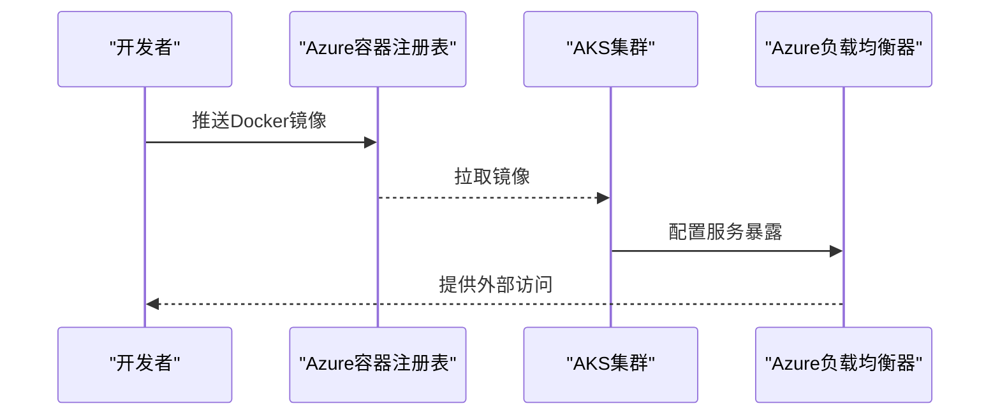

### 阿里云部署流程

阿里云推荐使用容器服务Kubernetes版（ACK）：

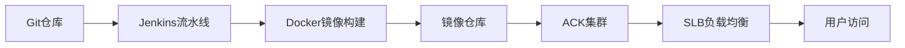

## 负载均衡与SSL配置

### Nginx负载均衡配置

```nginx
upstream backend {
    server backend-1:8080;
    server backend-2:8080;
    server backend-3:8080;
}

upstream frontend {
    server frontend-1:80;
    server frontend-2:80;
    server frontend-3:80;
}

server {
    listen 80;
    server_name example.com;
    return 301 https://$server_name$request_uri;
}

server {
    listen 443 ssl http2;
    server_name example.com;
    
    ssl_certificate /path/to/certificate.crt;
    ssl_certificate_key /path/to/private.key;
    
    location / {
        proxy_pass http://frontend;
        proxy_set_header Host $host;
        proxy_set_header X-Real-IP $remote_addr;
    }
    
    location /api/ {
        proxy_pass http://backend;
        proxy_set_header Host $host;
        proxy_set_header X-Real-IP $remote_addr;
        proxy_set_header X-Forwarded-For $proxy_add_x_forwarded_for;
    }
}
```

### SSL证书配置

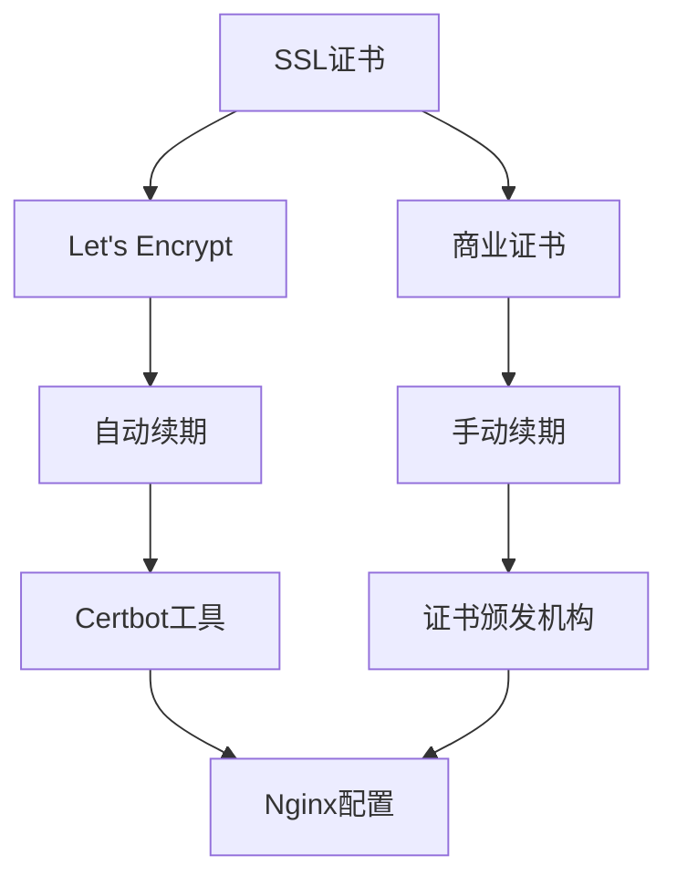

**章节来源**
- [vite.config.ts:15-20](file://frontend/vite.config.ts#L15-L20)

## 监控告警实施

### 应用监控指标

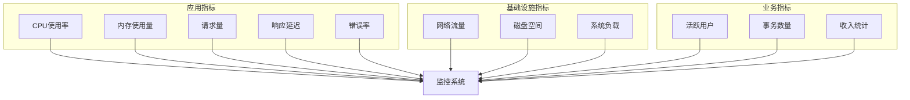

### 告警配置策略

| 指标类型 | 告警阈值 | 告警级别 | 告警方式 |
|---------|---------|---------|---------|
| CPU使用率 | >90% | 危险 | 邮件/SMS |
| 内存使用率 | >85% | 危险 | 邮件/SMS |
| 响应延迟 | >2秒 | 警告 | 钉钉/微信 |
| 错误率 | >5% | 危险 | 邮件/SMS |
| 请求量 | 异常波动 | 警告 | 钉钉/微信 |

## 性能优化建议

### Spring Boot性能优化

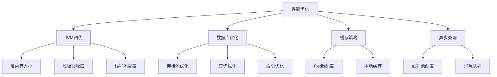

### 前端性能优化

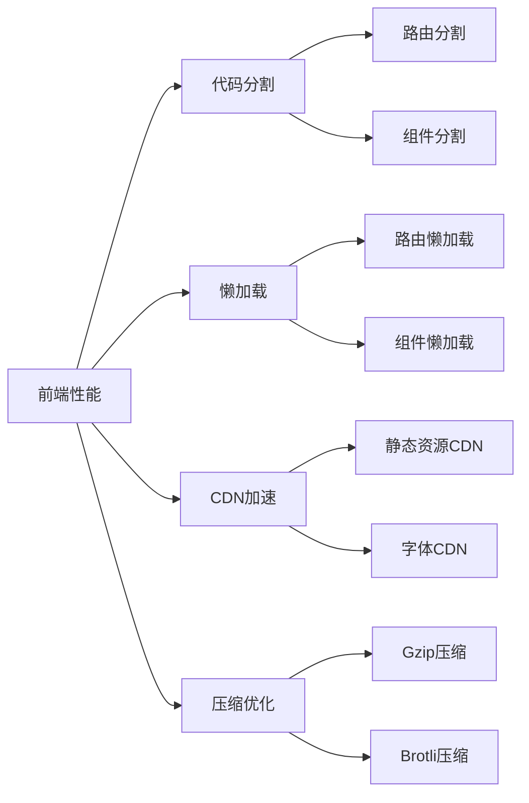

### 资源调优参数

| 参数类别 | 参数名称 | 建议值 | 说明 |
|---------|---------|--------|------|
| JVM | Xms | 512m | 初始堆大小 |
| JVM | Xmx | 2g | 最大堆大小 |
| JVM | XX:MaxRAMPercentage | 75.0 | 最大内存百分比 |
| 数据库 | maxPoolSize | 20 | 连接池大小 |
| 数据库 | connectionTimeout | 30000 | 连接超时(ms) |
| 数据库 | idleTimeout | 600000 | 空闲超时(ms) |
| 缓存 | redis.maxTotal | 100 | 连接池大小 |
| 缓存 | redis.maxWaitMillis | 1000 | 等待超时(ms) |

## 故障排除指南

### 常见问题诊断

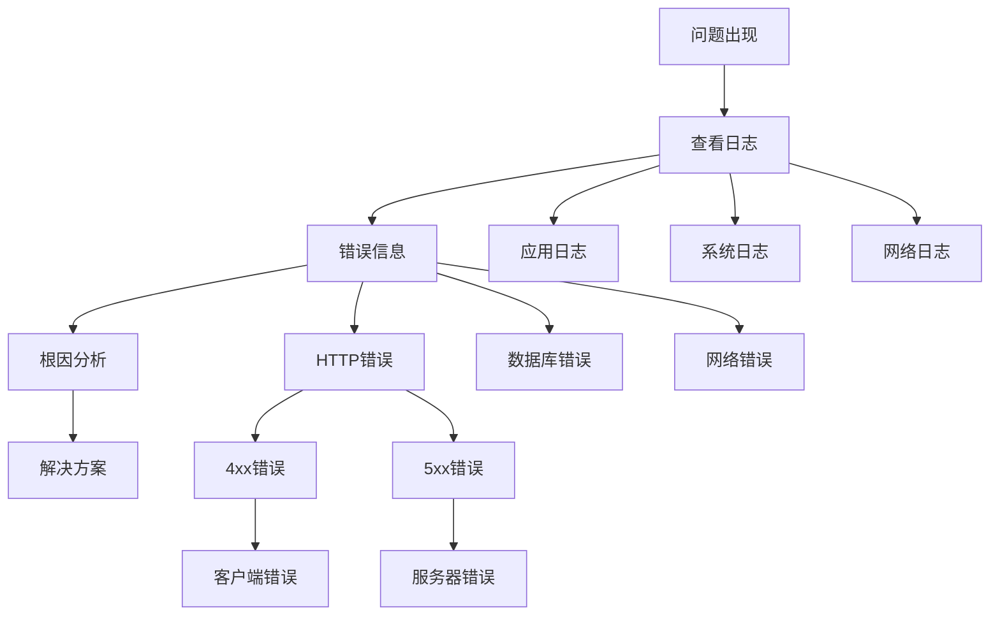

### 排查步骤

1. **日志分析**
   - 检查应用启动日志
   - 分析错误堆栈信息
   - 查看数据库连接日志

2. **网络诊断**
   - 测试端口连通性
   - 检查防火墙规则
   - 验证DNS解析

3. **资源监控**
   - 监控CPU使用率
   - 检查内存泄漏
   - 分析磁盘空间

### 性能问题定位

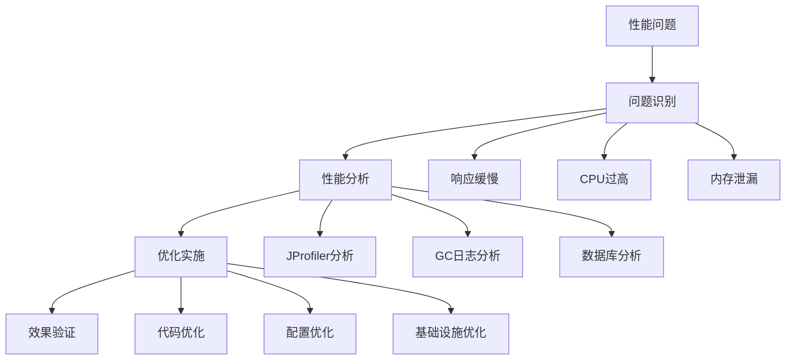

**章节来源**
- [application.yml:8-13](file://backend/src/main/resources/application.yml#L8-L13)
- [UserController.java:11](file://backend/src/main/java/com/example/demo/controller/UserController.java#L11)

## 结论

本指南提供了从开发到生产的完整部署路径，涵盖了现代Web应用的各个方面。通过采用容器化、微服务架构和云原生技术，可以实现高可用、高性能的应用部署。

关键要点包括：
- 使用Docker进行容器化部署，确保环境一致性
- 实施CI/CD流水线，自动化测试和部署
- 配置负载均衡和SSL证书，确保高可用性和安全性
- 建立完善的监控告警体系，及时发现和解决问题
- 持续优化性能参数，提升用户体验

建议在实际部署前进行充分的测试和验证，确保生产环境的稳定性和可靠性。