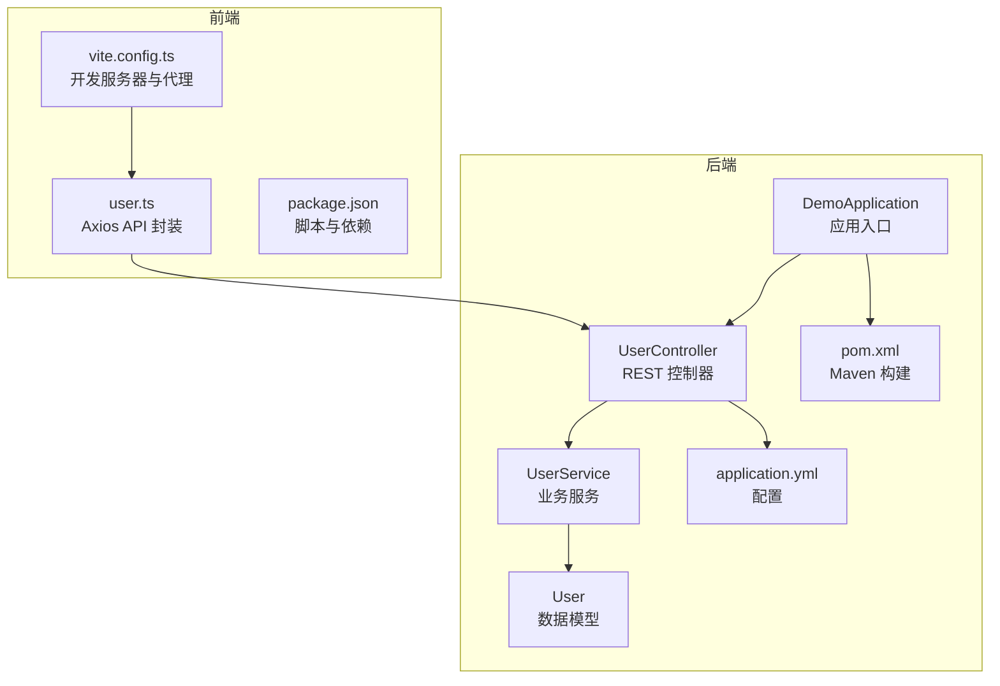
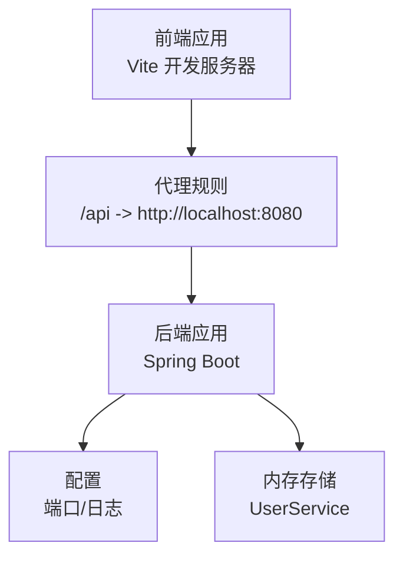
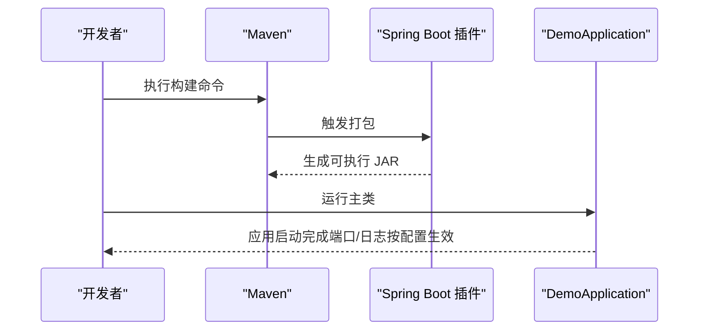
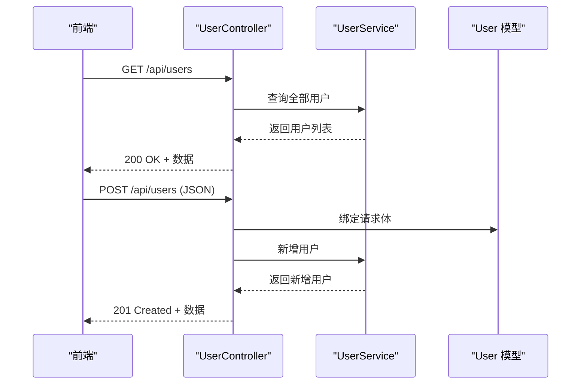
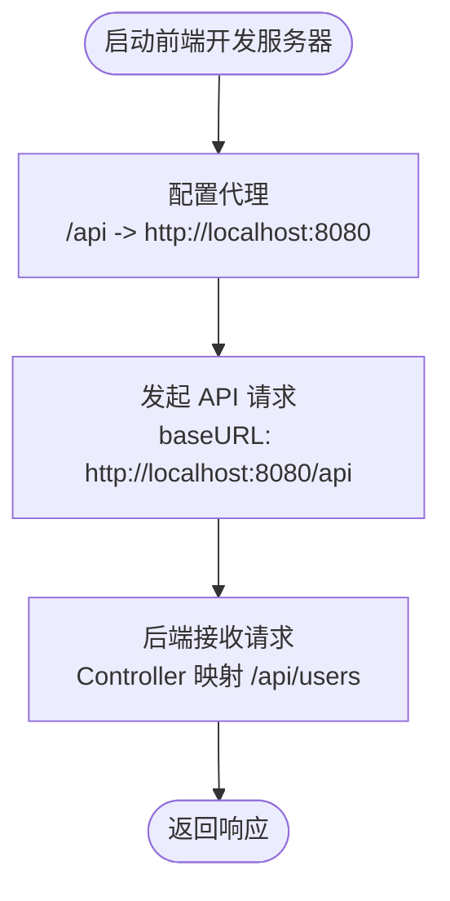
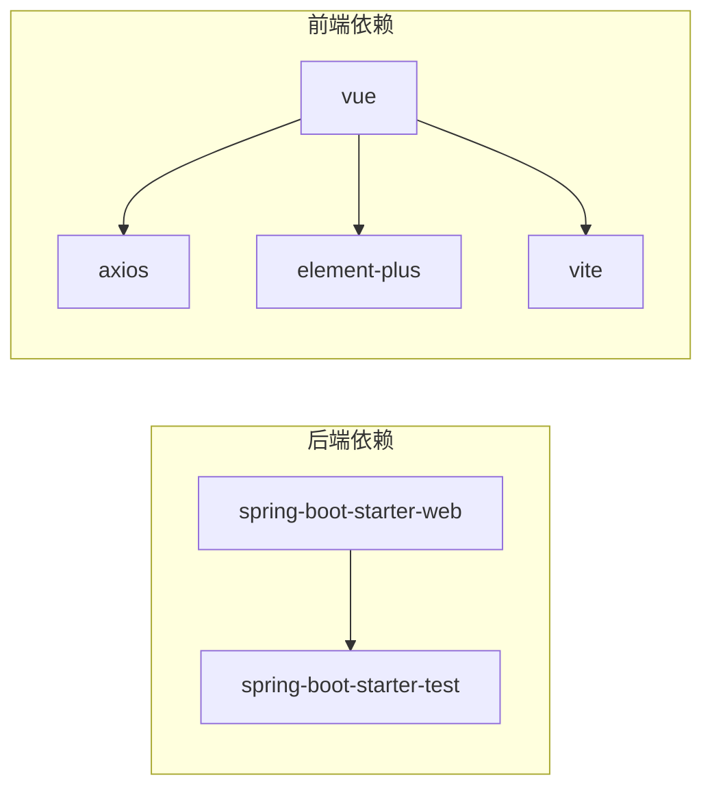

# 部署与运维

<cite>
**本文引用的文件**
- [DemoApplication.java](file://backend/src/main/java/com/example/demo/DemoApplication.java)
- [UserController.java](file://backend/src/main/java/com/example/demo/controller/UserController.java)
- [UserService.java](file://backend/src/main/java/com/example/demo/service/UserService.java)
- [User.java](file://backend/src/main/java/com/example/demo/model/User.java)
- [application.yml](file://backend/src/main/resources/application.yml)
- [pom.xml](file://backend/pom.xml)
- [README.md](file://README.md)
- [vite.config.ts](file://frontend/vite.config.ts)
- [user.ts](file://frontend/src/api/user.ts)
- [package.json](file://frontend/package.json)
</cite>

## 目录
1. [简介](#简介)
2. [项目结构](#项目结构)
3. [核心组件](#核心组件)
4. [架构总览](#架构总览)
5. [详细组件分析](#详细组件分析)
6. [依赖分析](#依赖分析)
7. [性能考虑](#性能考虑)
8. [故障排除指南](#故障排除指南)
9. [结论](#结论)
10. [附录](#附录)

## 简介
本指南面向运维团队，提供从本地开发到生产部署的完整流程，涵盖 JAR 包构建、Docker 容器化、云平台部署、环境变量与数据库连接、外部服务集成、性能监控与日志管理、负载均衡与缓存策略、安全加固以及应急响应流程。项目采用前后端分离架构：后端基于 Spring Boot 3.x（Java 21），前端基于 Vue 3 + TypeScript + Vite。

## 项目结构
- 后端（Spring Boot）
  - 应用入口类负责启动应用
  - 控制器层提供 REST 接口
  - 服务层处理业务逻辑
  - 模型层定义数据结构
  - 配置文件定义端口、应用名与日志级别
  - 构建脚本使用 Maven 并启用 Spring Boot 插件
- 前端（Vue 3）
  - 开发服务器默认端口与代理规则
  - API 封装使用 Axios，默认指向后端接口
  - 构建脚本通过 Vite 打包

**图表来源**
- [DemoApplication.java:1-13](file://backend/src/main/java/com/example/demo/DemoApplication.java#L1-L13)
- [UserController.java:1-30](file://backend/src/main/java/com/example/demo/controller/UserController.java#L1-L30)
- [UserService.java:1-33](file://backend/src/main/java/com/example/demo/service/UserService.java#L1-L33)
- [User.java:1-41](file://backend/src/main/java/com/example/demo/model/User.java#L1-L41)
- [application.yml:1-13](file://backend/src/main/resources/application.yml#L1-L13)
- [pom.xml:1-48](file://backend/pom.xml#L1-L48)
- [vite.config.ts:1-23](file://frontend/vite.config.ts#L1-L23)
- [user.ts:1-26](file://frontend/src/api/user.ts#L1-L26)
- [package.json:1-24](file://frontend/package.json#L1-L24)

**章节来源**
- [README.md:1-119](file://README.md#L1-L119)
- [application.yml:1-13](file://backend/src/main/resources/application.yml#L1-L13)
- [pom.xml:1-48](file://backend/pom.xml#L1-L48)
- [vite.config.ts:1-23](file://frontend/vite.config.ts#L1-L23)
- [user.ts:1-26](file://frontend/src/api/user.ts#L1-L26)
- [package.json:1-24](file://frontend/package.json#L1-L24)

## 核心组件
- 应用入口类：负责启动 Spring Boot 应用
- 控制器：提供 /api/users 的 GET/POST 接口，并开启跨域支持
- 服务层：维护内存中的用户列表，提供查询与新增能力
- 模型：定义用户实体字段
- 配置：定义服务端口、应用名与日志级别
- 构建：Maven + Spring Boot 插件生成可执行 JAR
- 前端：Vite 开发服务器，代理转发 /api 到后端；Axios 默认基地址指向后端

**章节来源**
- [DemoApplication.java:1-13](file://backend/src/main/java/com/example/demo/DemoApplication.java#L1-L13)
- [UserController.java:1-30](file://backend/src/main/java/com/example/demo/controller/UserController.java#L1-L30)
- [UserService.java:1-33](file://backend/src/main/java/com/example/demo/service/UserService.java#L1-L33)
- [User.java:1-41](file://backend/src/main/java/com/example/demo/model/User.java#L1-L41)
- [application.yml:1-13](file://backend/src/main/resources/application.yml#L1-L13)
- [pom.xml:1-48](file://backend/pom.xml#L1-L48)
- [vite.config.ts:1-23](file://frontend/vite.config.ts#L1-L23)
- [user.ts:1-26](file://frontend/src/api/user.ts#L1-L26)

## 架构总览
系统采用前后端分离架构，前端通过代理将 /api 请求转发至后端，后端以 Spring MVC 提供 REST 接口。当前实现为单实例应用，适合本地开发与演示。

**图表来源**
- [vite.config.ts:13-21](file://frontend/vite.config.ts#L13-L21)
- [user.ts:3-9](file://frontend/src/api/user.ts#L3-L9)
- [application.yml:1-13](file://backend/src/main/resources/application.yml#L1-L13)
- [UserService.java:13-21](file://backend/src/main/java/com/example/demo/service/UserService.java#L13-L21)

## 详细组件分析

### 后端应用启动与配置
- 应用入口类负责启动 Spring Boot 应用
- 配置文件定义服务端口、应用名与日志级别
- Maven 构建启用 Spring Boot 插件，便于打包与运行

**图表来源**
- [DemoApplication.java:9-11](file://backend/src/main/java/com/example/demo/DemoApplication.java#L9-L11)
- [pom.xml:40-46](file://backend/pom.xml#L40-L46)
- [application.yml:1-13](file://backend/src/main/resources/application.yml#L1-L13)

**章节来源**
- [DemoApplication.java:1-13](file://backend/src/main/java/com/example/demo/DemoApplication.java#L1-L13)
- [application.yml:1-13](file://backend/src/main/resources/application.yml#L1-L13)
- [pom.xml:1-48](file://backend/pom.xml#L1-L48)

### 控制器与服务层交互
- 控制器暴露 /api/users 接口，开启跨域支持
- 服务层在内存中维护用户集合，提供查询与新增
- 模型定义用户字段，用于请求体与响应体

**图表来源**
- [UserController.java:20-28](file://backend/src/main/java/com/example/demo/controller/UserController.java#L20-L28)
- [UserService.java:23-31](file://backend/src/main/java/com/example/demo/service/UserService.java#L23-L31)
- [User.java:3-39](file://backend/src/main/java/com/example/demo/model/User.java#L3-L39)

**章节来源**
- [UserController.java:1-30](file://backend/src/main/java/com/example/demo/controller/UserController.java#L1-L30)
- [UserService.java:1-33](file://backend/src/main/java/com/example/demo/service/UserService.java#L1-L33)
- [User.java:1-41](file://backend/src/main/java/com/example/demo/model/User.java#L1-L41)

### 前端开发与代理
- Vite 开发服务器默认端口为 5173
- 代理将 /api 请求转发至后端 8080 端口
- Axios 默认基地址指向后端 /api，超时与内容类型已配置

**图表来源**
- [vite.config.ts:13-21](file://frontend/vite.config.ts#L13-L21)
- [user.ts:3-9](file://frontend/src/api/user.ts#L3-L9)

**章节来源**
- [vite.config.ts:1-23](file://frontend/vite.config.ts#L1-L23)
- [user.ts:1-26](file://frontend/src/api/user.ts#L1-L26)
- [package.json:1-24](file://frontend/package.json#L1-L24)

## 依赖分析
- 后端依赖 Spring Web 与测试 Starter，构建由 Spring Boot Maven 插件驱动
- 前端依赖 Vue、Axios、Element Plus 与 Vite，构建脚本通过 Vite 执行

**图表来源**
- [pom.xml:24-36](file://backend/pom.xml#L24-L36)
- [package.json:11-22](file://frontend/package.json#L11-L22)

**章节来源**
- [pom.xml:1-48](file://backend/pom.xml#L1-L48)
- [package.json:1-24](file://frontend/package.json#L1-L24)

## 性能考虑
- 单实例部署：当前实现为单实例，适合本地开发与小规模演示
- 内存存储：用户数据保存在内存中，重启即丢失，生产需替换为持久化存储
- 日志级别：开发阶段可开启更详细的日志，生产建议调整为 INFO 或 WARN
- 前端代理：开发环境使用代理，生产环境建议通过反向代理统一路由

[本节为通用指导，不直接分析具体文件，故无“章节来源”]

## 故障排除指南
- 端口冲突
  - 后端默认端口 8080，前端默认端口 5173，若冲突请修改相应配置
- 跨域问题
  - 控制器已开启跨域，生产环境建议明确指定来源域名
- 代理失效
  - 确认前端代理目标与后端实际端口一致
- 数据丢失
  - 当前内存存储仅用于演示，生产需接入数据库并配置连接参数
- 日志异常
  - 检查配置文件中的日志级别与输出路径设置

**章节来源**
- [application.yml:1-13](file://backend/src/main/resources/application.yml#L1-L13)
- [UserController.java:11-11](file://backend/src/main/java/com/example/demo/controller/UserController.java#L11-L11)
- [vite.config.ts:15-19](file://frontend/vite.config.ts#L15-L19)
- [UserService.java:13-21](file://backend/src/main/java/com/example/demo/service/UserService.java#L13-L21)

## 结论
本指南提供了从本地开发到生产部署的完整路径：先确保前后端均能正常启动，再进行 JAR 构建与容器化，最后结合云平台完成部署与运维。针对当前内存存储与跨域配置，建议在生产环境中替换为持久化方案与严格的 CORS 策略，并配套完善的监控、日志与安全加固措施。

[本节为总结性内容，不直接分析具体文件，故无“章节来源”]

## 附录

### 本地开发环境部署流程
- 后端
  - 环境要求：Java 21、Maven
  - 启动方式：进入后端目录，执行启动命令
  - 端口：8080
- 前端
  - 环境要求：Node.js（推荐 v18+）
  - 启动方式：进入前端目录，安装依赖后启动开发服务器
  - 端口：5173
  - 代理：/api 请求转发至后端 8080

**章节来源**
- [README.md:34-62](file://README.md#L34-L62)
- [vite.config.ts:13-21](file://frontend/vite.config.ts#L13-L21)
- [application.yml:1-13](file://backend/src/main/resources/application.yml#L1-L13)

### 生产环境部署策略
- JAR 包构建
  - 使用 Maven 构建可执行 JAR，Spring Boot 插件已配置
- Docker 容器化
  - 建议基于官方 JDK 镜像构建镜像，复制 JAR 并暴露端口
- 云平台部署
  - 可选择容器服务或虚拟机部署，结合负载均衡与健康检查
- 环境变量与数据库连接
  - 通过环境变量注入数据库连接信息与敏感配置
- 外部服务集成
  - 通过配置文件或环境变量对接第三方服务
- 性能监控与日志管理
  - 生产环境建议集中化日志与指标采集
- 负载均衡与缓存
  - 前端静态资源与后端接口均可通过反向代理与缓存提升性能
- 安全加固
  - 严格 CORS 配置、HTTPS、输入校验与权限控制

**章节来源**
- [pom.xml:40-46](file://backend/pom.xml#L40-L46)
- [application.yml:1-13](file://backend/src/main/resources/application.yml#L1-L13)
- [README.md:92-119](file://README.md#L92-L119)