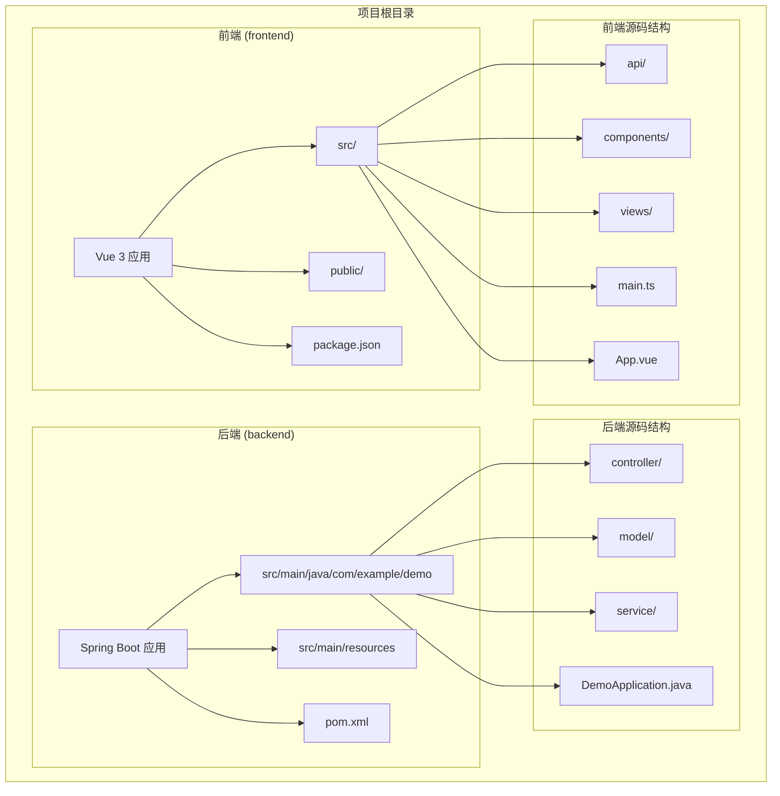
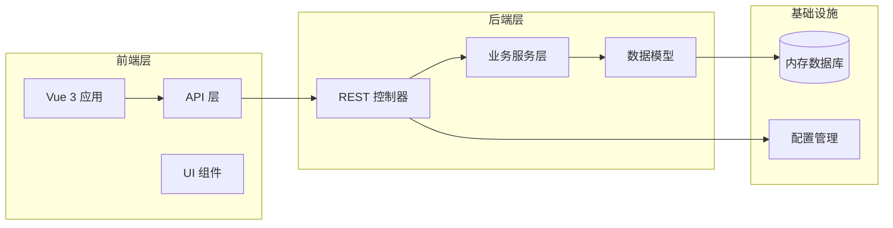
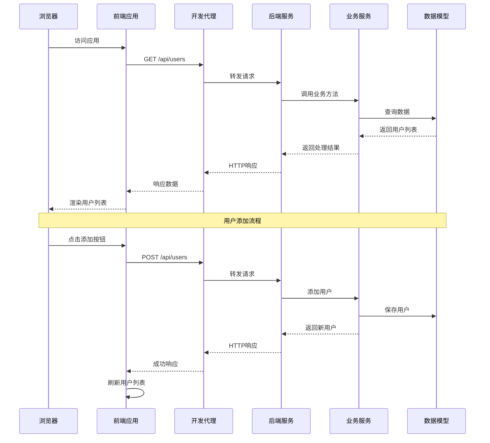
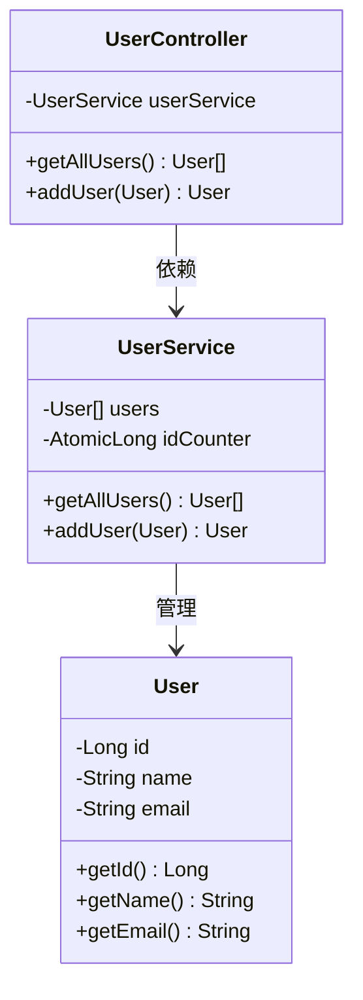
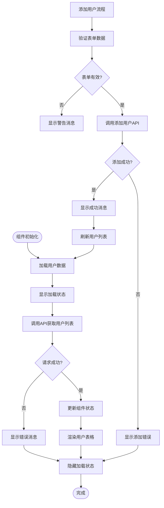
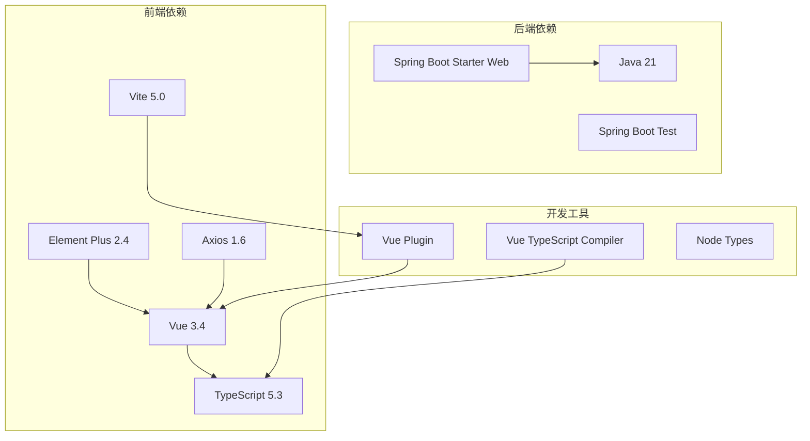

# 项目概述

<cite>
**本文档引用的文件**
- [README.md](file://README.md)
- [DemoApplication.java](file://backend/src/main/java/com/example/demo/DemoApplication.java)
- [UserController.java](file://backend/src/main/java/com/example/demo/controller/UserController.java)
- [UserService.java](file://backend/src/main/java/com/example/demo/service/UserService.java)
- [User.java](file://backend/src/main/java/com/example/demo/model/User.java)
- [application.yml](file://backend/src/main/resources/application.yml)
- [pom.xml](file://backend/pom.xml)
- [user.ts](file://frontend/src/api/user.ts)
- [UserList.vue](file://frontend/src/views/UserList.vue)
- [main.ts](file://frontend/src/main.ts)
- [App.vue](file://frontend/src/App.vue)
- [vite.config.ts](file://frontend/vite.config.ts)
- [package.json](file://frontend/package.json)
</cite>

## 目录
1. [引言](#引言)
2. [项目结构](#项目结构)
3. [核心组件](#核心组件)
4. [架构概览](#架构概览)
5. [详细组件分析](#详细组件分析)
6. [依赖分析](#依赖分析)
7. [性能考虑](#性能考虑)
8. [故障排除指南](#故障排除指南)
9. [结论](#结论)
10. [附录](#附录)

## 引言

Quder是一个基于前后端分离架构的全栈项目示例，展示了现代Web应用开发的最佳实践。该项目采用Spring Boot 3.x + Java 21作为后端技术栈，Vue 3 + TypeScript + Element Plus作为前端技术栈，为开发者提供了一个完整的全栈解决方案原型。

### 项目目标

本项目旨在演示：
- 前后端分离架构的设计理念和实现方式
- 现代Java企业级开发框架Spring Boot的使用
- Vue 3响应式开发模式和TypeScript类型安全
- RESTful API设计原则和跨域处理机制
- 开发环境配置和部署策略

### 核心功能

项目实现了基础的用户管理系统，包含以下主要功能：
- 用户列表展示（表格形式）
- 用户信息添加（表单验证）
- RESTful API接口设计
- 响应式UI界面
- 类型安全的前后端通信

## 项目结构

项目采用标准的前后端分离架构，具有清晰的模块划分和职责分离。

**图表来源**
- [README.md:5-30](file://README.md#L5-L30)
- [DemoApplication.java:1-13](file://backend/src/main/java/com/example/demo/DemoApplication.java#L1-L13)

### 模块关系

项目采用分层架构设计，各模块之间通过清晰的接口进行交互：

**图表来源**
- [UserController.java:9-29](file://backend/src/main/java/com/example/demo/controller/UserController.java#L9-L29)
- [UserService.java:10-32](file://backend/src/main/java/com/example/demo/service/UserService.java#L10-L32)
- [User.java:3-40](file://backend/src/main/java/com/example/demo/model/User.java#L3-L40)

**章节来源**
- [README.md:5-30](file://README.md#L5-L30)
- [DemoApplication.java:1-13](file://backend/src/main/java/com/example/demo/DemoApplication.java#L1-L13)

## 核心组件

### 后端核心组件

后端采用Spring Boot框架，实现了标准的MVC架构模式：

#### 应用入口类
应用入口类负责启动Spring Boot应用程序，配置应用上下文和生命周期管理。

#### 控制器层
控制器层处理HTTP请求，提供RESTful API接口，实现CORS跨域配置。

#### 服务层
服务层包含业务逻辑处理，当前实现使用内存存储模拟数据库操作。

#### 数据模型层
数据模型定义了用户实体的数据结构，支持基本的CRUD操作。

### 前端核心组件

前端采用Vue 3 Composition API，提供了现代化的组件化开发体验：

#### 应用入口
应用入口配置Element Plus UI库，设置全局样式和插件注册。

#### API封装
API封装层统一管理HTTP请求，提供类型安全的接口定义。

#### 视图组件
视图组件实现用户界面逻辑，包含数据展示和用户交互功能。

**章节来源**
- [DemoApplication.java:6-11](file://backend/src/main/java/com/example/demo/DemoApplication.java#L6-L11)
- [UserController.java:9-29](file://backend/src/main/java/com/example/demo/controller/UserController.java#L9-L29)
- [UserService.java:10-32](file://backend/src/main/java/com/example/demo/service/UserService.java#L10-L32)
- [User.java:3-40](file://backend/src/main/java/com/example/demo/model/User.java#L3-L40)

## 架构概览

项目采用经典的前后端分离架构，通过RESTful API进行通信。

**图表来源**
- [vite.config.ts:13-21](file://frontend/vite.config.ts#L13-L21)
- [UserController.java:20-28](file://backend/src/main/java/com/example/demo/controller/UserController.java#L20-L28)
- [UserService.java:23-31](file://backend/src/main/java/com/example/demo/service/UserService.java#L23-L31)

### 技术栈选择

#### 后端技术栈选择原因

**Spring Boot 3.x + Java 21**
- 提供现代化的企业级开发体验
- 支持最新的Java语言特性和性能优化
- 内置丰富的starter依赖，简化配置
- 完善的生态系统和社区支持

**Spring Web**
- 提供RESTful API开发的完整解决方案
- 内置JSON序列化和反序列化支持
- 简化的控制器注解和路由映射

#### 前端技术栈选择原因

**Vue 3 + TypeScript**
- 提供更好的类型安全和开发体验
- Composition API带来更灵活的逻辑组织
- 更好的性能和更小的包体积

**Element Plus**
- 完整的UI组件库，满足大多数业务场景
- 良好的TypeScript支持
- 主题定制和国际化能力

**Vite**
- 极快的开发服务器启动速度
- 即时热更新和模块热替换
- 更好的打包性能

**章节来源**
- [README.md:92-106](file://README.md#L92-L106)
- [pom.xml:24-37](file://backend/pom.xml#L24-L37)
- [package.json:11-22](file://frontend/package.json#L11-L22)

## 详细组件分析

### 后端组件分析

#### 用户控制器 (UserController)

用户控制器是RESTful API的核心入口，负责处理用户相关的HTTP请求。

**图表来源**
- [UserController.java:14-28](file://backend/src/main/java/com/example/demo/controller/UserController.java#L14-L28)
- [UserService.java:13-31](file://backend/src/main/java/com/example/demo/service/UserService.java#L13-L31)
- [User.java:17-39](file://backend/src/main/java/com/example/demo/model/User.java#L17-L39)

#### 业务服务层 (UserService)

业务服务层实现了用户管理的核心逻辑，当前版本使用内存数据结构模拟持久化存储。

#### 数据模型 (User)

用户数据模型定义了用户实体的基本属性和访问方法，支持基本的getter和setter操作。

**章节来源**
- [UserController.java:1-30](file://backend/src/main/java/com/example/demo/controller/UserController.java#L1-L30)
- [UserService.java:1-33](file://backend/src/main/java/com/example/demo/service/UserService.java#L1-L33)
- [User.java:1-41](file://backend/src/main/java/com/example/demo/model/User.java#L1-L41)

### 前端组件分析

#### 用户列表组件 (UserList.vue)

用户列表组件实现了完整的用户管理界面，包含数据展示、表单验证和错误处理。

**图表来源**
- [UserList.vue:46-86](file://frontend/src/views/UserList.vue#L46-L86)

#### API封装层 (user.ts)

API封装层提供了类型安全的HTTP客户端，统一管理API端点和请求配置。

#### 应用入口 (main.ts)

应用入口配置了Element Plus UI库，设置了全局样式和插件注册流程。

**章节来源**
- [UserList.vue:1-101](file://frontend/src/views/UserList.vue#L1-L101)
- [user.ts:17-23](file://frontend/src/api/user.ts#L17-L23)
- [main.ts:1-10](file://frontend/src/main.ts#L1-L10)

### 开发环境配置

#### 前端开发服务器配置

前端开发服务器配置了代理机制，将`/api`请求自动转发到后端服务，解决了开发环境下的跨域问题。

#### 后端配置

后端应用配置了端口号、应用名称和日志级别，为开发和调试提供了便利。

**章节来源**
- [vite.config.ts:13-21](file://frontend/vite.config.ts#L13-L21)
- [application.yml:1-13](file://backend/src/main/resources/application.yml#L1-L13)

## 依赖分析

项目采用了现代化的依赖管理策略，确保开发效率和运行性能。

**图表来源**
- [pom.xml:24-37](file://backend/pom.xml#L24-L37)
- [package.json:11-22](file://frontend/package.json#L11-L22)

### 依赖关系特点

**后端依赖**
- Spring Boot Starter Web提供了完整的Web开发支持
- 内置测试框架便于单元测试和集成测试
- 最新的Java版本确保性能和安全性

**前端依赖**
- Vue 3提供了现代化的响应式开发体验
- TypeScript确保类型安全和更好的开发工具支持
- Element Plus提供了丰富的UI组件库
- Vite提供了极速的开发体验

**章节来源**
- [pom.xml:1-48](file://backend/pom.xml#L1-L48)
- [package.json:1-24](file://frontend/package.json#L1-L24)

## 性能考虑

### 前后端分离架构的优势

**开发效率提升**
- 前后端可以并行开发，提高开发效率
- 技术栈专业化，发挥各自优势
- 更好的代码组织和维护性

**用户体验优化**
- 前端应用更加流畅和响应迅速
- 支持渐进式Web应用(PWA)特性
- 更好的移动端适配能力

### 性能优化建议

**后端优化**
- 使用连接池管理数据库连接
- 实现缓存策略减少重复计算
- 优化数据库查询和索引设计

**前端优化**
- 代码分割和懒加载
- 图片和资源的压缩优化
- 使用CDN加速静态资源加载

## 故障排除指南

### 常见问题及解决方案

**端口冲突**
- 后端默认端口8080，前端默认端口5173
- 如端口被占用，可在配置文件中修改端口号

**跨域问题**
- 开发环境下前端代理已配置
- 生产环境中需要正确配置CORS头

**依赖安装问题**
- 确保Node.js版本符合要求
- 使用npm install安装前端依赖
- 使用mvn clean install安装后端依赖

**启动顺序问题**
- 必须先启动后端服务，再启动前端开发服务器
- 确保后端服务正常运行后再进行前端请求

**章节来源**
- [README.md:114-119](file://README.md#L114-L119)

## 结论

Quder全栈项目成功展示了现代Web应用开发的最佳实践。通过前后端分离架构、现代化的技术栈选择和清晰的模块划分，项目为开发者提供了一个完整的学习和参考模板。

### 项目特色

**技术先进性**
- 采用最新版本的Spring Boot 3.x和Vue 3技术栈
- 完整的TypeScript类型安全支持
- 现代化的开发工具链

**架构合理性**
- 清晰的分层架构设计
- 良好的模块职责分离
- 可扩展的系统设计

**实用性**
- 完整的功能实现示例
- 详细的开发文档和配置
- 易于理解和扩展的代码结构

### 学习价值

对于初学者，项目提供了从零开始学习全栈开发的完整路径；对于有经验的开发者，项目展示了企业级应用开发的规范和最佳实践。通过学习和改进这个项目，开发者可以掌握现代Web应用开发的核心技能。

## 附录

### API接口规范

项目提供了两个核心API接口：

**获取用户列表**
- 方法：GET
- 路径：/api/users
- 功能：返回所有用户信息

**添加用户**
- 方法：POST  
- 路径：/api/users
- 请求体：包含用户姓名和邮箱字段
- 功能：创建新用户并返回用户信息

### 开发环境要求

**后端环境**
- Java 21或更高版本
- Maven构建工具
- IDE支持(如IntelliJ IDEA)

**前端环境**
- Node.js 18或更高版本
- npm包管理器
- IDE支持(如VS Code)

**章节来源**
- [README.md:74-91](file://README.md#L74-L91)
- [README.md:32-63](file://README.md#L32-L63)